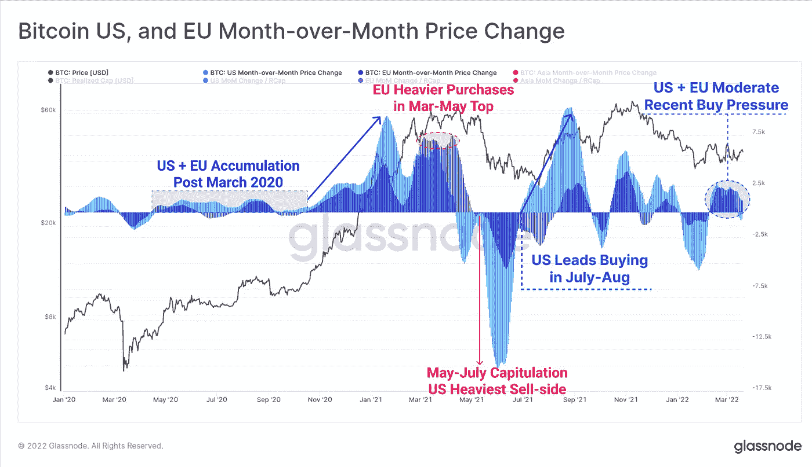
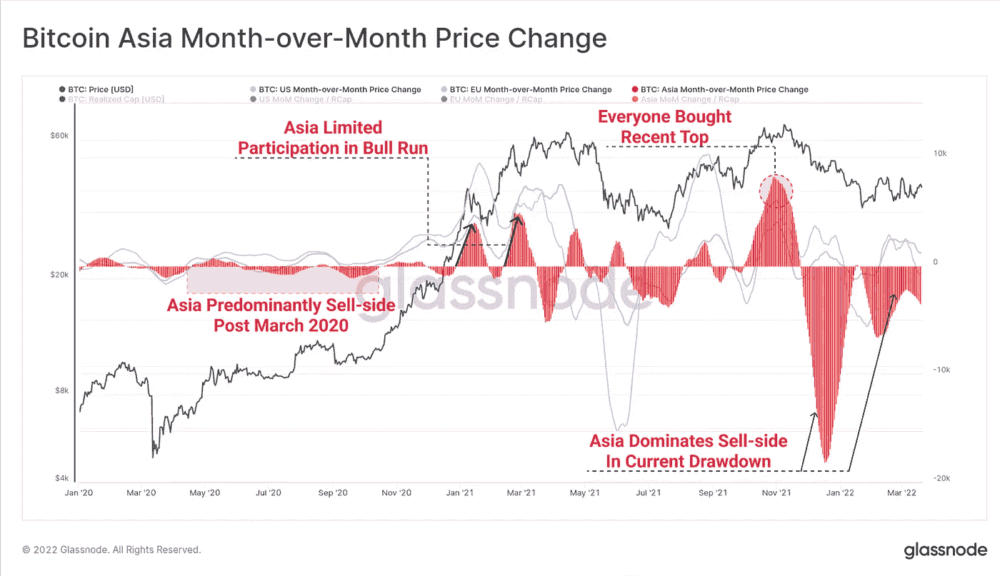

# 谁在抛售或做空比特币，看空压力从何而来？

> 原文：<https://medium.com/coinmonks/who-is-dumping-or-shorting-bitcoin-where-is-the-bearish-pressure-coming-from-e362cdc3ae86?source=collection_archive---------12----------------------->

市场显然远离风险，但顶部有结构性 BTC 卖家吗？

Photo by [Maxim Hopman](https://unsplash.com/@nampoh?utm_source=medium&utm_medium=referral) on [Unsplash](https://unsplash.com?utm_source=medium&utm_medium=referral)

比特币有 100 个理由可以达到 100 万美元。我已经在这篇文章中解释了原因。对 BTC 来说，这是一个明显且无与伦比的牛市。

 [## 比特币将达到 100 万美元的 100 个理由

### 有人问起，就发这个单子

medium.com](/coinmonks/100-reasons-why-bitcoin-will-reach-1-million-df8982b54ba8) 

然而，尽管所有的势头，采用，嗡嗡声，机构流入，比特币价格似乎处于持续的抛售压力下，压制了许多看涨价格的行动。

> 我说的是当前避险情绪之上的抛售压力。

那么是谁在抛售或做空比特币呢？

BTC 有“敌人”吗？

这篇文章将确定六种主要类别的投资者正在出售比特币，做空比特币或施加看跌压力:

*   影响 BTC 波动性的对冲基金
*   过度杠杆化交易者的连环清算
*   矿工出售他们的比特币
*   风险情绪带来的抛售压力(对收益率曲线、CPI 等的担忧)
*   从亚洲市场销售
*   BTC 的“敌人”,金融老人政权

# 影响 BTC 波动性的对冲基金

与传统的受监管金融市场不同，没有规则和法规阻止任何人做空比特币。

> 这意味着对冲基金有一个惊人的竞争环境，可以使用他们在正常市场中无法使用的先进交易策略。

对比特币感兴趣的对冲基金主要有两种:

*加密对冲基金*

只有几家大型对冲基金，在整个对冲基金市场中只占很小一部分。由于规模有限，他们对市场没有太大的影响力。

*传统对冲基金*

传统对冲基金的空间要大得多，拥有大量资金池。他们管理波动性和投资组合分配，通常使用衍生品和期权。

游戏中最大的名字是银河资本，潘迪拉，灰度…

他们一起主导了加密对冲基金市场，该市场的总价值估计约为 600 亿美元。

对冲基金可以帮助比特币价格下跌，然后在上涨的过程中获利。像[空头陷阱](https://blog.liquid.com/what-is-a-cryptocurrency-bear-trap-and-bull-trap)或空头挤压这样的策略很常见。

这就是你如何从对冲基金获得比标的资产更好的表现。这里有一篇关于对冲基金如何操纵市场的有趣文章。

对冲基金是高风险高回报的工具，通过利用比特币的波动性，它们可以成为真正的看跌驱动力。

# 过度杠杆化交易者的连环清算

许多密码交易所提供巨大的交易杠杆(按位检查，..).100 倍或更多的杠杆并不少见。

对于像 BTC 这样已经波动的资产来说，这种交易纯粹是疯狂的，更像是赌博。

但交易量是存在的，许多散户被杠杆游戏的刺激所烧伤。

当市场方向逆转时，高杠杆会产生级联效应。阅读[比特币崩盘是如何被保证金交易和杠杆交易驱动的](https://www.cnbc.com/2021/05/25/bitcoin-crashes-driven-by-big-margin-bets-new-crypto-banking.html)。

当价格开始下跌时，过度杠杆交易者的止损单很容易被击中，卖单就会被触发。

这造成了抛售压力，并在价格逐渐走低时产生加速效应。

# 矿工出售他们的比特币奖励

矿工产生比特币是他们活动的一部分，这是他们的工作。

> 如果他们想为进一步的投资提供资金，为自己的运营融资，或者向股东返还现金，他们就必须出售或借出部分比特币。

大多数矿商在资产负债表上持有并保留着他们的 BTC。但有些人会定期出售，因此**矿商是潜在卖家的固定群体。**

如果你想查看采矿储量的水平， [Cryptoquant](https://cryptoquant.com/asset/btc/chart/miner-flows/miner-reserve?miner=all_miner&window=DAY&sma=0&ema=0&priceScale=linear&metricScale=linear&chartStyle=line) 有一个报告。

F2pool 是经常被指大量抛售的大型矿池之一。这篇文章解释了 F2pool 的大量流入如何先于 BTC 价格的大幅下跌，大约 6000 枚硬币被转移到交易所。

# 风险情绪带来的抛售压力(对收益率曲线、通胀等的担忧)

比特币与整体金融市场的相关性越来越强。最近几个月的许多价格变动都证明了这一点。

看看 BTC 与标准普尔 500 的价格相关性，今年 3 月达到了 0.49。记住-1 表示它们的运动方向完全相反，1 表示它们的运动方向一致。这是近几个月来的最高读数，表明相关性正在增强。

随着市场脱离风险，由于所有当前的事件(乌克兰战争、通货膨胀、Covid……)比特币也面临巨大的抛售压力。

美国国债收益率曲线的反转也是一个重要的恐惧指数，通常被认为是衰退的高级信号。

在某种程度上，比特币价格对所有信号做出反应的事实，也是衡量 BTC 制度化程度的一个指标。这是一个长期的稳定因素。

但如果比特币是数字黄金，你可能会问自己:为什么这种规避风险的情况不会更看好比特币的价格？在规避风险的市场条件下，投资者通常会涌向美国国债、黄金、债券、现金，最有可能的是比特币。

# 从亚洲市场销售

正如 Glassnode 的这份[报告所示，抛售也往往发生在亚洲市场时段。两个图表说明:](https://insights.glassnode.com/the-week-onchain-week-12-2022/)

Source: glassnode

很明显，亚洲主导了卖方市场。

Source: glassnode

亚洲仍在从 Covid 中复苏。根据亚洲开发银行(ADB)的数据，投资者情绪仍然疲软。

这就是为什么亚洲人目前对比特币和加密相当警惕，而且没有人买账。

日本和中国目前主要购买美国国债和黄金。我们不要忘记，中国在 2021 年 9 月禁止了加密开采和交易。

这里有一篇关于[为什么中国有充分的理由害怕比特币](https://www.barrons.com/articles/chinas-bitcoin-ban-crypto-regulation-central-banks-51634242888)的有趣论文，比特币是其金融系统的潜在不稳定因素。

这对 BTC 来说都是负面消息。

# BTC 的敌人，“金融老人政权”

在迈阿密举行的比特币 2022 会议上，彼得·泰尔(著名的贝宝联合创始人)提交了一份他称之为*金融老人政权*的名单，这是比特币的敌人，一场革命性的青年运动。

这些是一些重量级人物，对比特币或整个数字资产领域持公开怀疑态度:

*   彼得·泰尔引用了“奥马哈的反社会爷爷”沃伦·巴菲特本人，他不仅将作为他那个时代最伟大的投资者之一而被载入史册，而且还将比特币称为“老鼠药”，称比特币“根本没有独特的价值”。历史可能对后一种说法很苛刻。不过，他的确向总部位于巴西的数字银行 neobank Nubank 投资了 10 亿美元。泰尔说巴菲特是头号敌人。
*   摩根大通(JP Morgan)掌门人杰米戴蒙(Jamie Dimon)从未掩饰过对比特币的蔑视，称其“一文不值”，是“一点点傻瓜的黄金”。与此同时，摩根大通购买了 Microstrategy 10%的股份，对于那些希望投资比特币的人来说，这可能是最好的股票市场代理之一。照我说的做，不要照我做……5 月底，摩根大通甚至发布报告称比特币被“严重低估”28%
*   贝莱德首席执行官拉里·芬克:泰尔表示，通过选择不将贝莱德管理的数万亿养老金或其他投资基金中的一小部分分配给比特币，芬克正在发表一份政治声明。亲区块链实际上是典型的反比特币声明

彼得·泰尔表示，这三人实际上是在利用 ESG 的“仇恨工厂”等投资实践来破坏比特币。

# 结论

这就结束了我们的推动比特币下跌的力量列表，压制了它的许多看涨价格行动。可能还有更多。

市场需要这些力量，随着时间的推移，它们会随着采用率的持续增长而减弱。波动的市场是健康的，所以没有理由担心。

通往 100 万美元比特币的道路将是漫长的，但它看起来势不可挡。

如果你喜欢这个故事，并且愿意支持我(和其他成千上万的作家)，那么考虑一个 [*中型*](/subscribe/@John_treadle) [*订阅*](/subscribe/@John_treadle) *每月只需 5 美元或每年 50 美元。*

> 加入 Coinmonks [电报频道](https://t.me/coincodecap)和 [Youtube 频道](https://www.youtube.com/c/coinmonks/videos)了解加密交易和投资

# 另外，阅读

*   [有哪些交易信号？](https://coincodecap.com/trading-signal) | [Bitstamp vs 比特币基地](https://coincodecap.com/bitstamp-coinbase) | [买索拉纳](https://coincodecap.com/buy-solana)
*   [ProfitFarmers 回顾](https://coincodecap.com/profitfarmers-review) | [如何使用 Cornix Trading Bot](https://coincodecap.com/cornix-trading-bot)
*   [西班牙 5 大最佳文案交易平台](https://coincodecap.com/copy-trading-spain)
*   [Pionex 双投](https://coincodecap.com/pionex-dual-investment) | [AdvCash 审核](https://coincodecap.com/advcash-review) | [支持审核](https://coincodecap.com/uphold-review)
*   [面向开发者的 8 个最佳加密货币 API](https://coincodecap.com/best-cryptocurrency-apis)