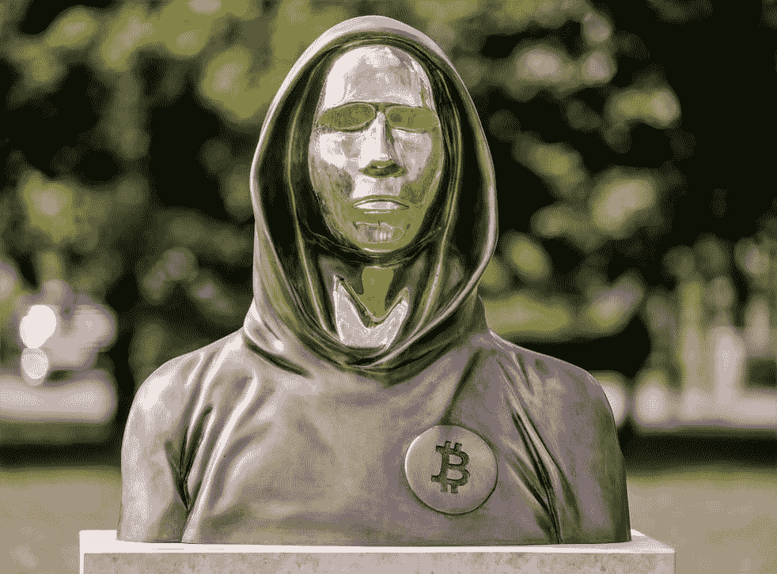
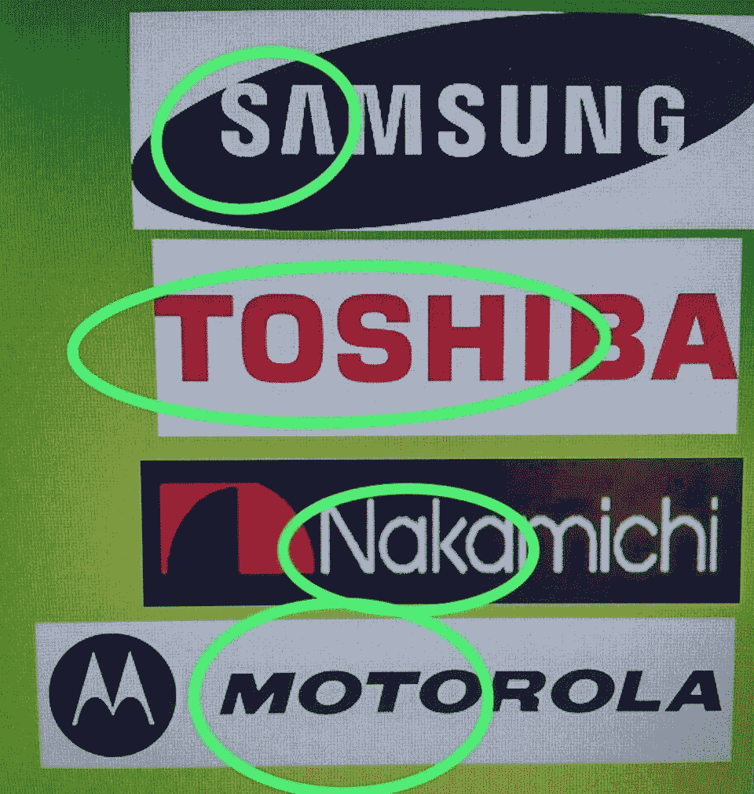

# 谁是中本聪？

> 原文：<https://medium.com/coinmonks/who-is-satoshi-nakamoto-d189348edd59?source=collection_archive---------56----------------------->

自 2008 年比特币的构想和创造以来，还没有人能够成功鉴定出比特币的真正创造者。比特币的创造者，简称“中本聪”，被认为是一群实际发明加密货币的个人的虚假掩饰的名字。

多年来，世界各地的人们都试图揭开聪的真实身份，但都以失败告终。似乎要找到聪的真正来源需要像夏洛克·福尔摩斯这样的人来解决这个案子。

特斯拉和 SpaceX 的首席执行官埃隆·马斯克(Elon Musk)再次引发了人们的兴趣，并重新开始了对中本聪起源的搜寻。Elon 最近发布了一条推文，展示了以下图片:

照片显示，中本聪是一组来自 4 tech 的字母组合。行业:三星、东芝、中道和摩托罗拉。

这四家公司可能是虚幻的中本聪背后的灵感来源吗？还是只是巧合？

这张照片已经在网上流传好几年了，这位亿万富翁又一次让它浮出水面，并获得了很多关注。尽管这张照片旨在揭示中本聪是谁，但留给我们的问题比答案还多。

谁是真正的聪？

中本聪的身份很可能是一个名叫哈尔·芬尼的人，他是工作证明系统的创造者，该系统是他在 2004 年比特币诞生之前很久开发的。芬尼还收到了来自中本聪的第一笔比特币交易，或许是为了测试将比特币发送到钱包的机制。不幸的是，随着哈尔·芬尼在 2014 年去世，我们留下了许多永远无法解决的问题。

一些证据表明，或许哈尔·芬尼并不是创造比特币的唯一一人。其他可能也参与了比特币项目的人有:克雷格 Write、维基解密的朱利安·阿塞奇和 Cypherpunks 的亚当·贝克。所有这些人都可以追溯到哈尔芬尼，并帮助他的项目。

Satoshi Nakamotos 钱包目前包含 110 万比特币，自 2010 年 5 月 17 日以来从未被动过。直到有一天，聪的钱包再次活跃起来，我们可能永远不会知道谁是中本聪的真实身份。