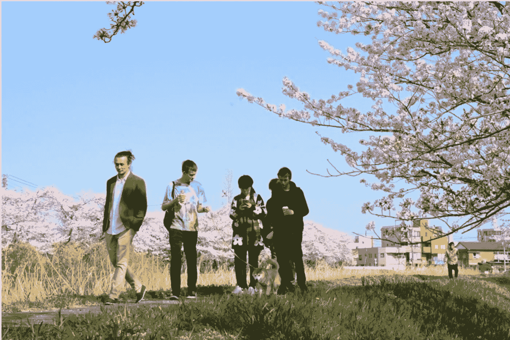
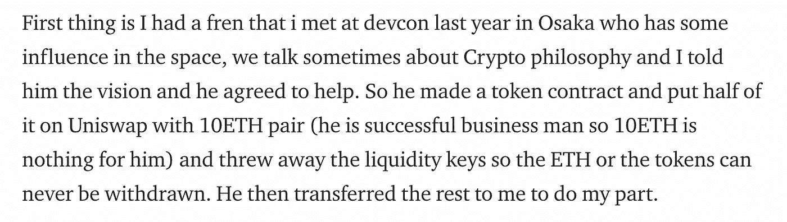
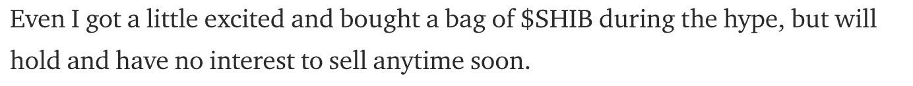
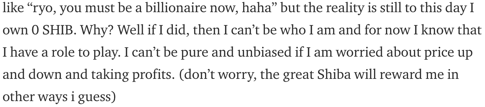
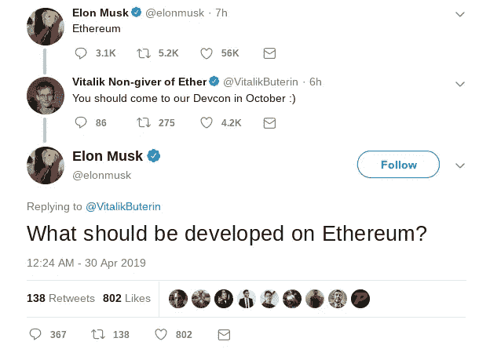
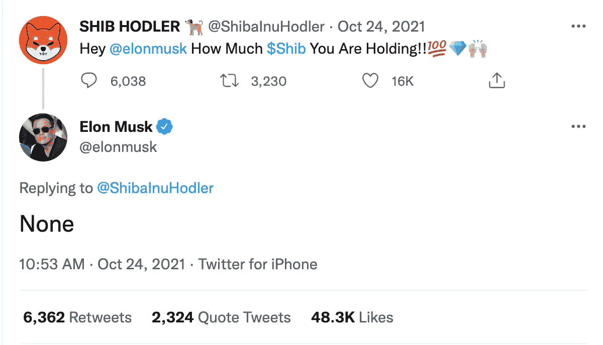
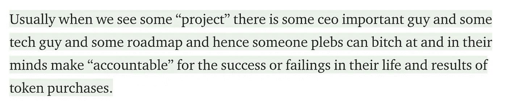
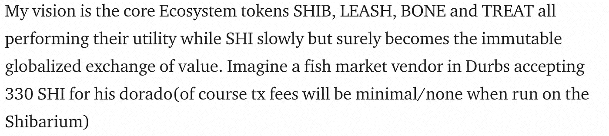
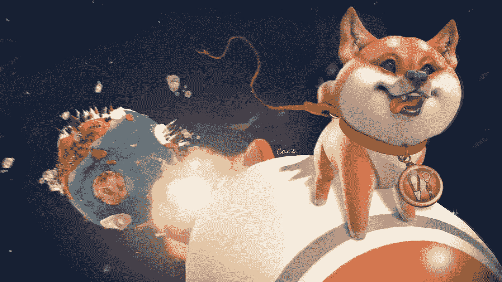

# 埃隆·马斯克和维塔利克·布特林是柴犬的创始人吗？

> 原文：<https://medium.com/coinmonks/who-is-the-founder-of-shiba-inu-ryoshi-c8a9f0b95593?source=collection_archive---------0----------------------->

Picture taken from Ryoshi Research article 1

几个月来，我一直在与自己辩论是否发布这个关于谁是良史(柴犬的创始人)的理论，因为我相信这里提供的证据足以让人回心转意。我已经决定发布我的理论，因为我相信收益会超过成本，创始人不再希望匿名，而是需要有人来拼凑这个难题。系好安全带，ShibArmy，因为我有一些非常有趣的想法供你们思考。

首先让我们从我们已经从他们的官方媒体帖子中了解到的关于良史的信息开始。我们知道，Ryoshi 和一个商人在 2019 年的以太坊开发者大会上相识。

Taken from Ryoshi Research article 1

所以我们现在可以得出结论，柴犬的创始人其实不只是一个人，至少是两个人(开发者和商人)。我们也可以验证这一点，因为在第一篇 Ryoshi 文章中，Ryoshi 说他们购买了一些 Shib 并持有令牌，但在第四篇(也是最新的)文章中，Ryoshi 声称不拥有任何 Shib，并且从未拥有过任何 Shib。如果只有一个创始人，这就说不通了，但如果有多个创始人，这就说得通了。

Taken from Ryoshi Research article 1

Taken from Ryoshi Research article 4

这就是乐趣的开始。让我们考虑一个有影响力的商人和一个以太坊开发者，他们可以一起参与一个项目。回到 2019 年 twitter 上的一段对话，你可以找到一条被删除的 Vitalik Buterin 与 Elon Musk 交谈的推文，他邀请 Elon 参加 devcon。

Deleted tweet by Vitalik Buterin

嗯，还不相信吗？我们继续吧。Ryoshi 的第一篇文章是从开发者(Vitalik Buterin)的角度写的，但我们知道 Ryoshi 的最新文章不是 Vitalik 写的，因为在那篇文章中说 Ryoshi 不拥有任何柴犬。因此，关于柴犬，埃隆·马斯克公开说过的唯一一件事就是，他没有任何柴犬。与普遍的看法相反，这是一件好事，因为这意味着他很可能是柴犬的创始人之一。

现在让我们看看最近的 Ryoshi 研究文章，其中 Ryoshi 声称拥有 zero Shib。在文章的开头，我们发现了顶部的亮点。

Top Highlight from Ryoshi Research article 4

这听起来很像埃隆·马斯克，你不觉得吗？早在 2006 年，埃隆·马斯克就为特斯拉写下了他的总体规划路线图，现在基本上实现了。然而，在公司历史的大部分时间里，许多人都与他唱反调，这也招致了激烈的批评。

然而文章的最后是最耐人寻味的一段。在讨论柴犬的宏伟愿景时，良史谈到了杜布斯的一个鱼市接受了多拉多的 shi。

Conclusion paragraph to Ryoshi Research article 4

那么什么是杜布斯呢？杜布斯是南非第三大城市德班的昵称。剑鱼盛产于南非海岸，因为它们可以在非洲大陆两侧的大西洋和印度洋中找到。你会想到哪个有影响力的南非商人？给你个提示…这又不是火箭科学。

因此，我非常确信柴犬的创始人 Ryoshi 不只是一个人，而是至少有两个人，其中包括 Elon Musk 和 Vitalik Buterin。但是等等，埃隆·马斯克不是那个狗心的家伙吗？以下是我最后的想法。Elon Musk 和 Vitalik Buterin 都作为顾问参与了“Dogecoin 基金会”,但是 Dogecoin 的开发者活动很少。Dogecoin 的令牌经济学也不允许它成为 Vitalik Buterin 和 Elon Musk 对加密货币的宏伟愿景。所以，我认为 Dogecoin 是柴犬的营销策略，而拥有大量追随者和影响力的 Elon Musk 正在利用 Dogecoin 的笑话来推广柴犬。这是一个天才的总体规划。

> 加入 Coinmonks [电报频道](https://t.me/coincodecap)和 [Youtube 频道](https://www.youtube.com/c/coinmonks/videos)了解加密交易和投资

# 另外，阅读

*   [非洲最佳密码交易所](https://coincodecap.com/crypto-exchange-africa) | [胡交易所评论](https://coincodecap.com/hoo-exchange-review)
*   [eToro vs robin hood](https://coincodecap.com/etoro-robinhood)|[MoonXBT vs Bybit vs Bityard](https://coincodecap.com/bybit-bityard-moonxbt)
*   [风暴增益评论](https://coincodecap.com/stormgain-review) | [普罗比特评论](https://coincodecap.com/probit-review) | [北海巨妖评论](/coinmonks/kraken-review-6165fc1056ac)
*   [如何在势不可挡的域名上购买域名？](https://coincodecap.com/buy-domain-on-unstoppable-domains)
*   [印度的秘密税](https://coincodecap.com/crypto-tax-india) | [altFINS 审查](https://coincodecap.com/altfins-review) | [Prokey 审查](/coinmonks/prokey-review-26611173c13c)