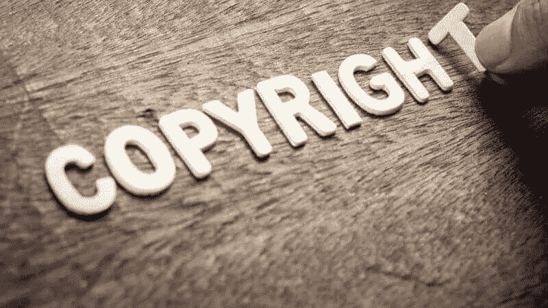

# 谁拥有 NFT 版权？

> 原文：<https://medium.com/coinmonks/who-owns-an-nft-copyright-c27ad8486ef5?source=collection_archive---------43----------------------->

不可替换的代币是区块链上的一类独特的代币。由于它们的独特性，它们最近在加密领域获得了更多的崇拜地位。NFT 出现了新的使用案例，例如作为独特俱乐部的会员卡，如 [Bored Ape 游艇俱乐部](https://www.marca.com/en/lifestyle/us-news/2022/05/07/627684ece2704eb9488b4587.html)和 [Flyfish 餐厅](https://www.flyfishclub.com/)。元宇宙的指数增长进一步增加了非森林旅游的价值。

由于它们不可复制，NFT 的股票已经上涨，在这个领域已经创下了许多销售记录。有史以来票房最高的电影包括帕克的《合并》(9180 万美元)、比尔的《最初的 5000 天》(6900 万美元)和《时钟》(5600 万美元)。本质上，非功能性测试的稀有性和独特性是它们被采用和持续需求的主要驱动力。

随着 NFT 收养数量的持续增长，一个问题随之出现——我们如何解决数字艺术品的版权问题？

# 困惑:唱片销售与知识产权

这是争论的焦点——谁能声称 NFT 的合法所有权？应该是最初的艺术创作者还是支付数百万美元收购作品的收藏家？

双方都有合法的理由提出索赔。首先，数字艺术创作者有权利，因为诞生 NFT 的想法和概念通常来自他们。从创作阶段开始，经过无数的错误和完善，直到艺术品在 NFT 市场上市出售，都是由创作者促成的。平心而论，没有造物主就不会有 NFT。

因此，创作者首先拥有艺术的知识产权。但是，艺术品卖出后会发生什么呢？这就是收藏家的困境所在。

收藏家们看到了艺术品的潜力，并根据他们认为这类资产的价值出价。估计可能高达数百万美元。在这样的资产最终被购买后，收藏家声称拥有这样的作品是很正常的。

# 你实际上买什么？

收藏家购买和拥有的东西和创作者可以声称拥有的东西之间有着明显的区别。实际上，双方都拥有所有权，即使在 NFT 出售后，然而，他们所拥有的不同。

数字艺术收藏家通过购买艺术品，直接获得了这种资产所有者的转让。因此，当这样的购买完成时，收藏家现在拥有艺术品中包含的元数据。换句话说，转让的是作品的所有权，而不是版权。

这里有另一种解释。比方说，你买了一双耐克的低扣篮鞋系列，你合法地拥有那只鞋，但你不能要求展示设计；耐克公司拥有这一荣誉。即使你出售你的鞋类，耐克仍然保留该系列的设计权。本质上，你有所有权，但没有权利。

对于数字艺术创作者来说，在这种作品的交易完成并在区块链得到验证的那一刻，他们就失去了资产的所有权。尽管如此，他们仍然保留对这些作品的知识产权，因此，他们有权作为这些艺术作品的合法创作者。

买方保留所有权，创作者保留权利。

# 有 NFT 版权这种东西吗？

NFT 资产的版权是不存在的。大多数 NFT 都是数字艺术品，由收藏者收藏并出售给收藏者。这仅仅是包含在这样的创意中的元数据的所有权的转移。

然而，也可能有例外。如果 NFT 是音乐、推文和视频等知识产权的表现形式，创作者和收藏者有可能就版权转让达成一致。

在这种情况下，创作者将在该艺术品的智能合同中明确指出，这是所有权和权利的转让，双方从一开始就同意这一点。像这样的例子清楚地表明，创作者不再拥有对 NFT 的控制权，也不再与作品相关联。

# 结论

NFT 所有权和权利是有区别的。了解这种区别将有助于你澄清什么可以被归类为创作者的权利和收藏家的权利。购买 NFT 仅仅是所有权的转移，而不是诞生艺术品的知识产权的转移。

> 加入 Coinmonks [电报频道](https://t.me/coincodecap)和 [Youtube 频道](https://www.youtube.com/c/coinmonks/videos)了解加密交易和投资

# 另外，阅读

*   [币安 vs FTX](https://coincodecap.com/binance-vs-ftx) | [最佳(SOL)索拉纳钱包](https://coincodecap.com/solana-wallets)
*   [比诺莫评论](https://coincodecap.com/binomo-review) | [斯多葛派 vs 3Commas vs TradeSanta](https://coincodecap.com/stoic-vs-3commas-vs-tradesanta)
*   [Capital.com 评论](https://coincodecap.com/capital-com-review) | [香港的加密借贷平台](https://coincodecap.com/crypto-lending-hong-kong)
*   如何在 Uniswap 上交换加密？ | [A-Ads 审查](https://coincodecap.com/a-ads-review)
*   [WazirX vs coin dcx vs bit bns](/coinmonks/wazirx-vs-coindcx-vs-bitbns-149f4f19a2f1)|[block fi vs coin loan vs Nexo](/coinmonks/blockfi-vs-coinloan-vs-nexo-cb624635230d)
*   [本地比特币评论](/coinmonks/localbitcoins-review-6cc001c6ed56) | [加密货币储蓄账户](https://coincodecap.com/cryptocurrency-savings-accounts)