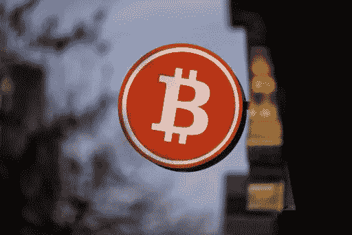
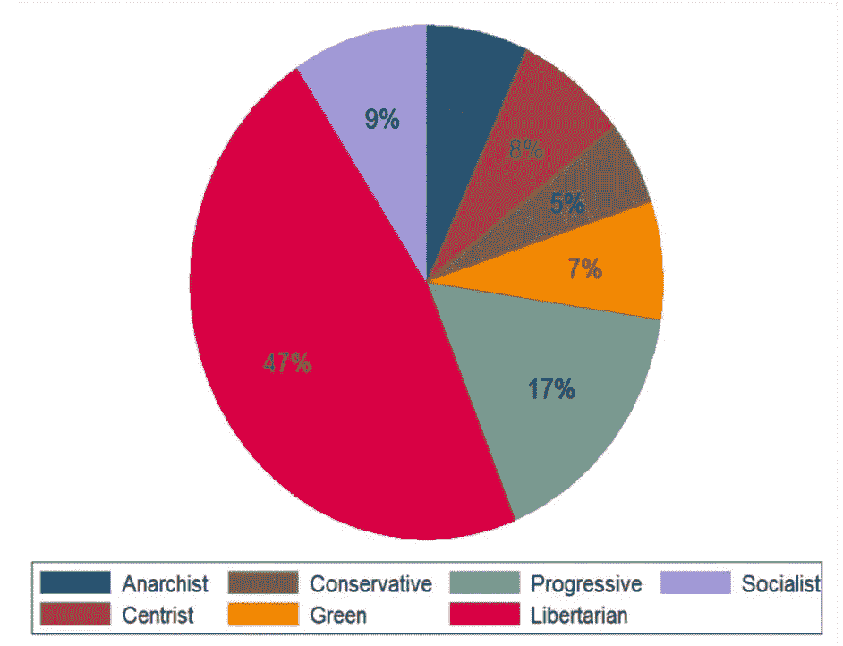

# 比特币|第一批百万用户是谁？

> 原文：<https://medium.com/coinmonks/who-used-bitcoin-809d983ab85?source=collection_archive---------63----------------------->

至少有一亿人拥有₿itcoin.他们来自各行各业，他们的动机可能从政治到纯粹的经济。

有很多研究分析了区块链和秘密社区的社会政治趋势。我将在未来探索其中的许多问题。

今天，我的主题是一篇比较老的研究论文:“ [*谁使用比特币？比特币社区的一次探索*](https://ieeexplore.ieee.org/document/6890928) *，*Jeremiah Bohr 和 Masooda Bashir 著。

它发表于 2014 年，差不多是比特币首次推出的 5 年后，也是在国会首次讨论比特币的一年后。

当时 crypto 还不是主流，但在早期采用者的小圈子之外吸引了大量追随者。

当时，比特币用户总数不到 200 万，这项研究完美地捕捉到了那个时刻的时代精神:

> *或许是因为投机者将比特币作为一种投资而非实用货币参与进来，比特币的价值在其短暂的历史中一直极其不稳定。这一点，加上安全漏洞，玷污了比特币在公众中的形象*

依靠 Lui Smyth 收集的数据集，研究人员清楚地知道应该对他们的结果保持谨慎，因为数据是有限的，还需要更多的探索。

**以下是一些重要的要点:**

*   **自由主义者**占样本的 **47%** ，占比特币用户的大多数，相比之下 **17%的进步主义者**。
*   自由主义者认为，比特币更像是法定货币的替代货币，甚至是“颠覆国家监管”的手段，而不是点对点支付系统
*   “令人惊讶的是，”政治观点并没有表明用户是否将匿名视为比特币最喜欢的方面..
*   矿工提到匿名是他们最喜欢的比特币方面的可能性不到非矿工的一半。

A breakdown of Bitcoin users according to political beliefs

然而，与其他因素相比，政治并不是用户持有比特币数量(T21)的最具指示性的因素。

*   年龄越大，比特币越多。比特币的财富集中度与传统财富没有什么不同，停留在 50 英镑以上。
*   那些用比特币进行非法赌博或购买毒品的人至少比异性恋者多了 25%的比特币(T2)。考虑到丝绸之路在早期推广“数字黄金”的作用，这并不令人惊讶。
*   那些自称为“**投资者**的人拥有的**比特币是那些不这么认为的人的**四倍。
*   2009 年，**矿工**积累的比特币是**非矿工**的两倍**。比特币矿工和用户的财富差距很早就发生了。**

考虑到这一点，8 年后的今天，人们一定会对加密领域的贫富差距感到好奇。

但这是另一天的帖子。

> 加入 coin monks[Telegram group](https://t.me/joinchat/Trz8jaxd6xEsBI4p)学习加密交易和投资