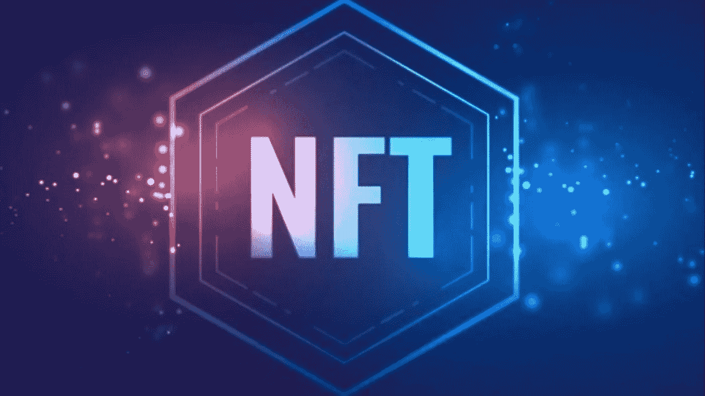
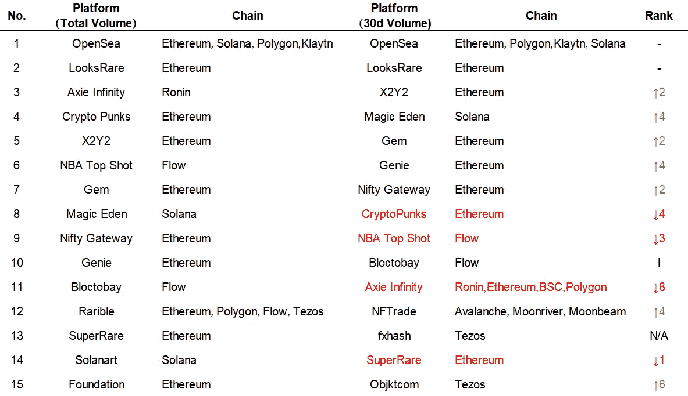
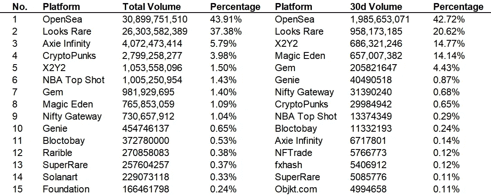
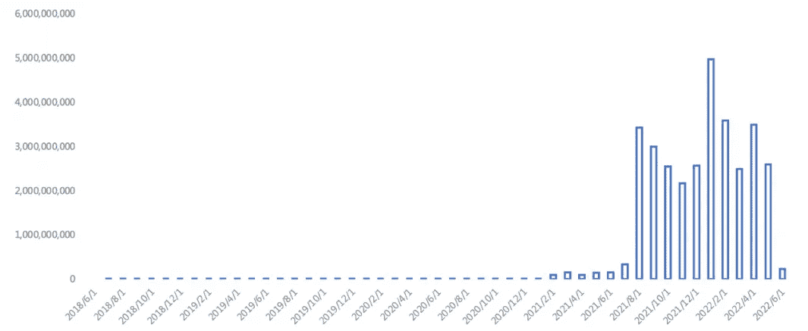
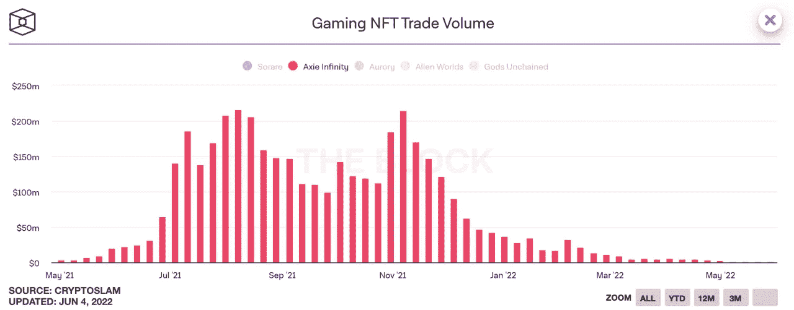

# 谁将是 NFT 市场的下一个 Opensea

> 原文：<https://medium.com/coinmonks/who-will-be-next-opensea-in-the-nft-market-e7d7873097f3?source=collection_archive---------40----------------------->

近年来，NFT 作为一种独特、稀缺和有趣的资产类别迅速席卷了各个行业。这最初只是对艺术圈技术的一个小测试，但它创造了目前“NFT 为一切”的场景。

NFT 爆炸的直接影响是，NFT 交易平台如雨后春笋般涌现。无论是综合市场还是专注于艺术、音乐、摄影、体育、游戏等细分赛道。，你可以看到新的竞争者涌入市场。

由于龙头项目对以太坊的聚集效应明显，其 NFT 贸易总额仍居首位。但由于手续费、效率、环保等问题， **Solana、Flow、Tezos 等公链迎来了发展机遇期，链上 NFT 市场蓬勃发展。**

到 2022 年，随着多链生态的日益成熟，支持多个主流公链也成为了很多 NFT 平台的发展目标。例如， **OpenSea 已经开始引进索拉纳链项目。**

基于此，本文研究整理了以太坊、Solana、Flow、Tezos、Ronin、Polygon 等 6 大区块链以及 30 个交易平台。在此期间，也发现了一些值得注意的地方。

# **NFT 15 大平台**

考虑到不同的 NFT 平台诞生的时间不同，为了更好的贴近和反映当下的热点，排名前 15 的 NFT 平台是根据**最近 30 天的总成交金额和成交金额计算出来的。**

Top 15 NFT platform rank

TOP 15 NFT platform trade volume

**NFT 市场现状:一个超级强，更强。**

## **1。在前 15 大平台中，OpenSea 仍然占据 40%以上的份额。**

说到 NFT 交易平台，对大多数人来说，首先想到的肯定是 OpenSea。作为 2017 年底诞生的 NFT 综合交易平台，差不多同时期有 MakersPlace、SuperRare、CryptoPunks、KnownOrigin、Axie Infinity、Nifty Gateway。其中 2 个是单一 NFT 交易平台，4 个是艺术品和限量版交易平台。 **OpenSea 在定位筛选和创作时间上有一定优势。**

Dune Analytics 数据显示，2021 年 11 月，OpenSea 的总贸易额超过 100 亿美元，2022 年 1 月超过 150 亿美元，然后在 5 月中下旬达到 300 亿美元。截至目前，**309 亿美元的总交易额**意味着其**总交易额半年翻了一番。**

Opensea monthly trade volume (ETH)

根据最近 30 天的数据，**OpenSea 的交易额达到 19.86 亿美元**，占前 15 大平台的 42.72%。其中贸易额占前 15 的 43.91%。

OpenSea 长期以来一直主导着市场，尽管它被批评为过于集中，并以 Web2.0 的思维运营 web 3.0。**但 OpenSea 目前仍然是当之无愧的领导者**，特别是最近它增加了对索拉纳 NFT 项目的支持，将其支持的公共链数量增加到 4 个，**另一个重大举措——启动海港**协议。

Seaport 是一个全新的 Web3 marketplace 协议,将用于安全有效地买卖 NFT。Seaport 是一个开源协议，这意味着它不仅适用于 OpenSea，还适用于所有 NFT 的建设者、创造者和收藏者，符合 Web3 的核心精神，这也是 OpenSea 向去中心化方向迈出的一步。

## **2。由象征性激励驱动的市场:去中心化不是万能钥匙，产品才是王道**

LooksRare 和 X2Y2 是分别于 2022 年 1 月和 2 月推出的综合性 NFT 交易平台。两大平台通过**列表奖励、用户挖矿奖励、更便宜的手续费等方式，自上线以来抢占了 OpenSea 的一部分市场份额。**

然而，LooksRare 从 2 月份开始就陷入了一系列争议，主要是团队套现、质押挖矿减半、交易挖矿模式带来的大量洗盘交易等一系列问题。

由于质押 NFT 挂单挖掘导致大量无效挂单，X2Y2 调整了挂单奖励的计算能力。此外，X2Y2 空投索赔出了问题，被质疑合同安全性的事件也在用户心中留下了“不够靠谱”的印象。

不过后续 L **ooksRare 相对于 OpenSea** 进行了产品优化，比如一键报价、NFT 稀缺、与宝石合成、以太坊聊天室、提供白天模式、手机浏览到双栏显示等 **X2Y2 还优化了产品**，像购物车里不同 NFTs 收藏的一键购买，0.5%的超低交易手续费。指定用户可以指定价格永久免除交易费和版权费(类似于 OTC，私下出售)。

在过去的 30 天里，LooksRare 和 X2Y2 分别以 9.58 亿美元和 6.86 亿美元的总交易额位列 NFT 前 15 大平台的第二和第三位。

目前来看， **OpenSea 仍然是大多数用户的首选**，其初步建立的用户粘性在短时间内仍然难以撼动。但其面临的监管问题、Web3.0 的不足、未发行的代币也成为了 OpenSea 挑战者的捷径。

**web 3.0 的核心是从流量思维向社群思维转变。**从 LooksRare 和 X2Y2 我们不难看出，社区是一个绝佳的切入点。另外，通过代币激励，可以在短时间内获得巨大的关注度和人气。但需要明确的是，去中心化不是万能的，优秀的产品体验是提高用户粘性和项目效果的必要条件。

## **3。NFT 聚合平台引人关注。OpenSea 收购 Gem**

2022 年 4 月 25 日，OpenSea 宣布收购 Gem。

在传统的 NFT 交易平台中，用户不能批量购买 NFT，不同平台之间的流动性相互隔离。基于此，NFT 市场聚合平台的重要性越来越突出。

**Gem 和 Genie 被誉为 NFT 聚合平台的先驱。**在近半年的发展中，Gem 和 Genie 的总交易额分别达到 9.82 亿美元和 4.55 亿美元。按照近 30 天的交易量，两者能以 2.06 亿美元和 4049.05 万美元占据 NFT 交易平台前 15 名的第 5 和第 6 的位置，可见半年来发展之快。

**按照成交笔数和 NFT 销量来看，**创业板是 31.82 万和 119.13 万，而妖孽是 11.30 万和 59.66 万。新地址数量方面，Gem 和 Genie 分别为 7.52 万和 4.08 万。

Gem 的推出略晚于 Genie，但由于其产品优化，如支持用户用多种 ERC20 资产支付、增加 Web3.0 购物车功能、稀有度排名功能、开辟专门版块供用户提出功能请求和建议等。，使得创业板在 NFT 聚合平台的初期竞争中弯道超车。然而，Genie 随后推出了许多功能，其界面风格开始类似于 Gem，两者之间的战斗仍在继续。

## **4。单 NFT 交易平台:Axie Infinity、CryptoPunks、NBA Top Shot**

在排名前 15 的 NFT 交易平台中，CryptoPunks、NBA Top Shot、Axie Infinity 是只提供单 NFT 交易的平台，分别属于 PFP、体育、游戏三大领域。

在 **CryptoPunks** 被宇迦实验室收购后，宇迦实验室现在持有 6 个顶级 IP，分别是 BAYC、MAYC、BAKC、Otherdeed、CryptoPunks 和 Meebits。在 OpenSea 提供的全职排名上，宇迦实验室在前五名项目中独占四席，可见其影响力。

像**宇迦实验室，**从 BAYC 完成对 CryptoPunks 的追逐和超越，到收购 CryptoPunks，最终到发布土地和游戏，宇迦实验室的后续举措值得我们想象随着 Web3 的普及和演进

**NBA Top Shot** 是一款基于 Flow 打造的 NBA 官方授权收卡应用。它背后的团队 Dapper Labs 是创造了拥挤以太坊的 CryptoKitties 的人。Dapper Labs 与 NBA 合作，成功地将球星卡变成了一个庞大的链上业务，也改变了原本分散、难以区分的球星卡市场。

NBA Top Shot 有史以来的总交易额为 10.05 亿美元，过去 30 天的交易额为 1337.43 万美元。虽然其目前的交易量远不如刚上线时那么红火，但 NBA Top Shot 仍然可以凭借每年开赛带来的持续人气，突破多家 NFT 交易平台的围攻。

Axie Infinity 之前已经掀起了关于 GameFi 的热潮。巨大的造富效应使其贸易总额在短时间内飙升，并在 NFT 项目中独占鳌头数月。作为“X 赚”的鼻祖，Axie Infinity 依靠持续的增长来维持运营，这意味着 Axie Infinity 将面临长期的可持续性问题。

今年年初，Axie Infinity 出现下滑趋势，而随着 Ronin 被盗的 6.25 亿美元，我们可以看到，虽然 Axie Infinity 以 40.72 亿美元的成绩排在全职排行榜的第三位，但在过去的 30 天里，它已经跌至第 11 位。贸易额仅为 671.78 万美元。可见 Axie Infinity 在其经济模式、可玩性、可持续性问题解决之前，不会有太大的提升。

Axie Infinity

## **5。多链生态繁荣:新兴 NFT 交易平台的崛起**

以太坊的头部效应依然明显，但 NFT 热潮也为竞争连锁的发展带来了机遇。比如 Solana 已经形成了 GameFi、PFP 等主导的市场。，Tezos 专注于艺术领域，Flow 在体育 IP 领域。合作是最好的。

在更早的消息中，Magic Eden 的交易量在 5 月 25 日达到了 4571 万美元，超过了 OpenSea 的 2860 万美元的实时交易量。Magic Eden 在 24 小时内迎来了大约 50，600 名用户，而 OpenSea 则有 36，900 名用户。这并不是魔法伊甸园第一次完成对 OpenSea 的反击。

虽然从总**交易量**、**交易笔数**、****用户数**来看，魔幻伊甸园与 OpenSea 相差甚远，但可以看出其正在上升，这一点从 OpenSea 对 Solana 链的接入也可以看出。**

# ****谁会是下一个 OpenSea？****

**无论是历史数据还是近期数据，从链上交易量来看以太坊的头部效应依然明显，但 Solana、Flow、Tezos 等主流公链也在持续一年多的 NFT 热潮中迎来了机遇期。**

**OpenSea 仍然是 NFT 领域的领导者，在 NFT 前 15 大交易平台中仍占 40%以上的份额。但是一些新的平台，比如 Magic Eden，并没有选择在以太坊上与 OpenSea 竞争，而是依靠竞争链 Solana chain 2019 年的发展机遇期已经实现了 OpenSea 在实时交易量上超越 OpenSea，对 OpenSea 造成了一定的压力。**

****随着 Web3.0 概念的普及和演进，打着下一代 NFT 交易平台旗号的后起之秀也在努力追赶。**在多链的背景下，OpenSea 和一群竞争对手也以接入新链为目标。市场日新月异。OpenSea 能否继续领先，一切都有待确定。**

> **加入 coin monks[Telegram group](https://t.me/joinchat/Trz8jaxd6xEsBI4p)并了解加密交易和投资**