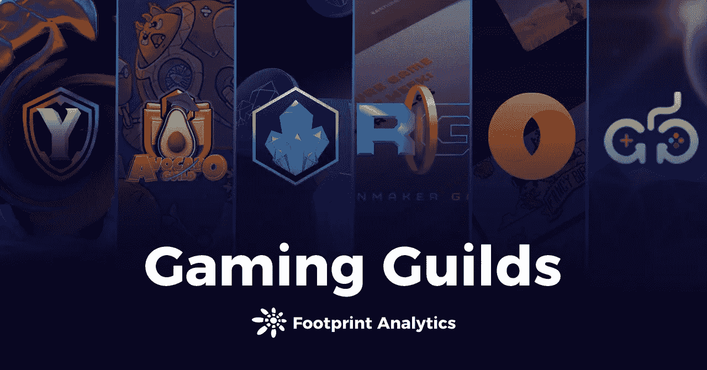
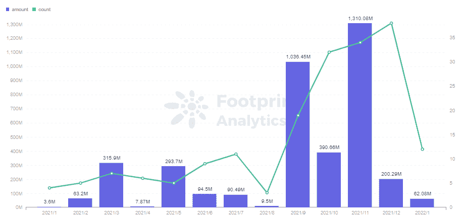
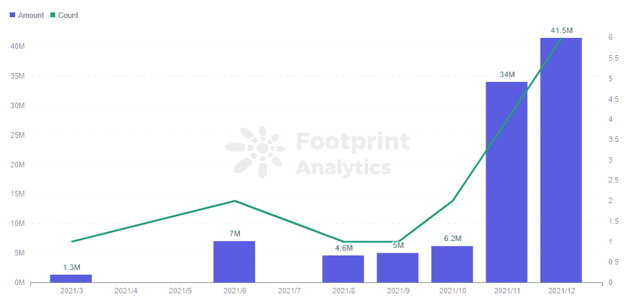
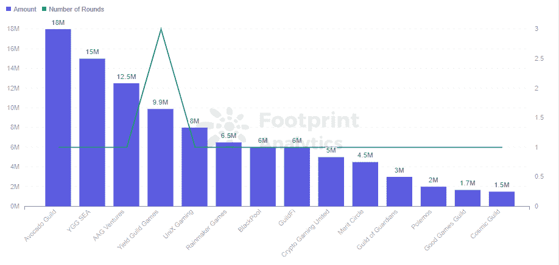
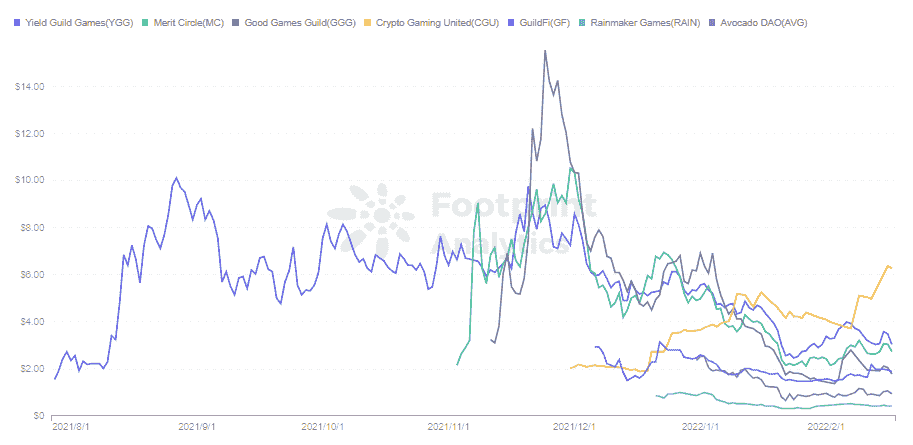

# 谁将是下一个 YGG，因为游戏公会赚取数十亿美元？

> 原文：<https://medium.com/coinmonks/who-will-be-the-next-ygg-as-gaming-guilds-earn-billions-c52cd7063b20?source=collection_archive---------69----------------------->

游戏公会在 2021 年筹集了 38.2 亿美元的资金。

2022 年 1 月

数据来源:[足迹分析](https://www.footprint.network/)

据[足迹分析](https://www.footprint.network/)称，自 9 月以来，游戏行业吸引了大量投资者，[的融资](https://www.footprint.network/)在 11 月达到 13 亿美元的峰值。GameFi 因其投资回收期短而备受关注，自去年下半年以来，市场上充斥着各种游戏项目。

*Footprint Analytics — Monthly Investment of Gaming*

在 GameFi 的爆炸式增长之后，游戏公会开始受到关注，11 月和 12 月分别筹集了 3400 万美元和 4150 万美元。投资行会的风投有 a16z、迪法恩斯资本、比特币基地风投和 Animoca Brands。

*Footprint Analytics — Monthly Investment of Guild*

公会不仅是一个交流游戏的地方，也是一个为玩家提供战略和装备等资源的地方。最著名的公会是屈服公会游戏(YGG)。

尽管每个行业协会的管理和运作各不相同，但风投们还是把赌注压在了行业协会身上，希望抓住下一个 YGG。

在本文中，足迹分析将简要介绍六个著名的公会。

# 1.屈服公会游戏(代币:YGG)

Yield Guild Game (YGG)是目前获得多轮资助最多的公会，三轮资助 992 万美元。

随着 Axie 的流行，YGG 开始了 Axie 奖学金计划，为用户提供 3 个必要的 Axie NFTs 来开始游戏。该公会建立了一个一站式的游戏中心，用于招募、培训和借贷，这要归功于玩家 70%、中层管理人员 20%和公会后期再投资 10%的利润分享模式。

YGG 降低了用户参与 GameFi 的准入要求，同时与 30 多个游戏合作，帮助他们增加曝光率。

为了解决地理边界问题，YGG 还建立了各种区域和分支子 Dao 来招募、培训和本地化游戏，并将人才融入 Dao。

最引人注目的是，YGG 专注于东南亚的子公司 YGG 海洋在去年 12 月获得了高达 1500 万美元的融资。

每个子 DAO 还可以发行令牌。例如，持有 YGGLOK 代币的用户可以在王国联盟中投票决定奖励如何分配。

# 2.鳄梨公会(代币:AVG)

鳄梨公会(AG)成立于 7 月，发展历史很短，但却是资金最高的公会(1800 万美元)。

与 YGG 类似，AG 的核心运营平台是 Axie，它通过其 Axie Infinity 奖学金计划向玩家提供免费账户，并通过与 AG 合作的教育和培训产生收入。

虽然 AG 玩家只获得 50%的收益，但是 AG 由于重视社团教育，与其他公会不同。AG 提出了 P2E 的 3 个新概念(玩出教育，玩出丰富，玩出赋能)，通过线上线下的交流，对玩家进行区块链知识的教育和培训，鼓励玩家学习游戏机制，提高技能。

AG 还与新加坡电信提供商 TPG Telecom 合作，允许用户用 AVG (AG 的令牌)换取 TPG 积分，完成了 AG 在现实世界中的首例。

# 3.吉尔菲艾斯(代币:GF)

GuildFi (GF)的目标是成为元宇宙基础设施门户，定位为玩家、公会、游戏玩家和投资者的一站式服务平台。通过提供入门、培训和增值服务，形成公会跨链聚合平台。

GF 通过设置 GuildFi ID 来建立玩家在元宇宙的身份，玩家在链上的成就都会被记录在其中。

# 4.造雨者游戏(代币:雨)

Rainmaker Games 的目标是建立最大的 P2E(游戏赚钱)游戏动态数据库，目前已经收集了数百款游戏。

Rainmaker Games 提供三个级别的游戏——入门级、中级和高级——玩家可以选择体验哪个级别。

# 5.功勋圈(代币:MC)

功德圈和 YGG 相似，都是一个道和一个子道的架构。功德圈的子 DAO 与 DAO 共享一个令牌 MC，而不是颁发一个子 DAO 令牌。

# 6.好游戏公会(代币:GGG)

Good Games Guild 正在专注于开发一个资产仪表板和 NFT 交易平台，以帮助玩家管理他们在各种游戏中的资产，并建立一个基于工具的游戏中心。

*Footprint Analytics — Guild Financing Ranking*

**总结**

玩家和游戏开发者都从公会的出现中受益。对于开发者来说，有助于游戏曝光，增加流量。对于玩家来说，它降低了入门要求，帮助他们创收。

到目前为止，行会还通过发行令牌实现了 DAO 治理模型。根据[足迹分析](https://www.footprint.network/)，代币的价格低于 10 美元。还有很大的成长空间。玩家持有 YGG 等代币，相当于持有公会投资各种 P2E 项目的指数基金，还可以参与社区的运营。

*Footprint Analytics — Guild Token Price*

游戏的选择对公会至关重要。本质上是庞氏骗局的游戏对玩家和公会来说是非常有害的。即使是 Axie 这样的游戏，也会受到收入持续下滑的负面影响。

从 2021 年下半年开始，我们看到了公会形式的多样化，下一个像 YGG 这样成功的公会必然会有不同的模式。

**什么是足迹分析**

足迹分析是一个一体化的分析平台，用于可视化区块链数据和发现见解。它清理和整合链上数据，因此任何经验水平的用户都可以快速开始研究令牌，项目和协议。凭借一千多个仪表板模板和一个拖放界面，任何人都可以在几分钟内构建自己的定制图表。发掘区块链数据，利用足迹进行更明智的投资。

*足迹网址:*[*https://www . Footprint . network*](https://www.footprint.network/)

*不和:*[*https://discord.gg/3HYaR6USM7*](https://discord.gg/3HYaR6USM7)

*推特:*[*https://twitter.com/Footprint_DeFi*](https://twitter.com/Footprint_DeFi)

*电报:*[*https://t.me/joinchat/4-ocuURAr2thODFh*](https://t.me/joinchat/4-ocuURAr2thODFh)

*Youtube:*[*https://www.youtube.com/channel/UCKwZbKyuhWveetGhZcNtSTg*](https://www.youtube.com/channel/UCKwZbKyuhWveetGhZcNtSTg)

> 加入 Coinmonks [电报频道](https://t.me/coincodecap)和 [Youtube 频道](https://www.youtube.com/c/coinmonks/videos)了解加密交易和投资

# 另外，阅读

*   [3 商业评论](/coinmonks/3commas-review-an-excellent-crypto-trading-bot-2020-1313a58bec92) | [Pionex 评论](https://coincodecap.com/pionex-review-exchange-with-crypto-trading-bot) | [Coinrule 评论](/coinmonks/coinrule-review-2021-a-beginner-friendly-crypto-trading-bot-daf0504848ba)
*   [莱杰 vs n 格拉夫](/coinmonks/ledger-vs-ngrave-zero-7e40f0c1d694) | [莱杰纳诺 s vs x](/coinmonks/ledger-nano-s-vs-x-battery-hardware-price-storage-59a6663fe3b0) | [币安评论](/coinmonks/binance-review-ee10d3bf3b6e)
*   [Bybit Exchange 审查](/coinmonks/bybit-exchange-review-dbd570019b71) | [Bityard 审查](https://coincodecap.com/bityard-reivew) | [Jet-Bot 审查](https://coincodecap.com/jet-bot-review)
*   [3 commas vs Cryptohopper](/coinmonks/3commas-vs-pionex-vs-cryptohopper-best-crypto-bot-6a98d2baa203)|[赚取加密利息](/coinmonks/earn-crypto-interest-b10b810fdda3)
*   最好的比特币[硬件钱包](/coinmonks/hardware-wallets-dfa1211730c6) | [BitBox02 回顾](/coinmonks/bitbox02-review-your-swiss-bitcoin-hardware-wallet-c36c88fff29)
*   [block fi vs Celsius](/coinmonks/blockfi-vs-celsius-vs-hodlnaut-8a1cc8c26630)|[Hodlnaut 审核](/coinmonks/hodlnaut-review-best-way-to-hodl-is-to-earn-interest-on-your-bitcoin-6658a8c19edf) | [KuCoin 审核](https://coincodecap.com/kucoin-review)
*   [Bitsgap 审查](/coinmonks/bitsgap-review-a-crypto-trading-bot-that-makes-easy-money-a5d88a336df2) | [Quadency 审查](/coinmonks/quadency-review-a-crypto-trading-automation-platform-3068eaa374e1) | [Bitbns 审查](/coinmonks/bitbns-review-38256a07e161)
*   [加密复制交易平台](/coinmonks/top-10-crypto-copy-trading-platforms-for-beginners-d0c37c7d698c) | [Coinmama 评论](/coinmonks/coinmama-review-ace5641bde6e)