# 为什么 2022 年可能是 AVAX 之年🔺

> 原文：<https://medium.com/coinmonks/why-2022-could-be-the-year-for-avalanche-f59559803c9f?source=collection_archive---------39----------------------->

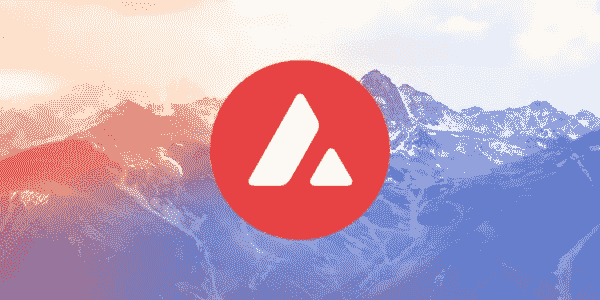

过去 5 天，$AVAX 上涨了 30%!

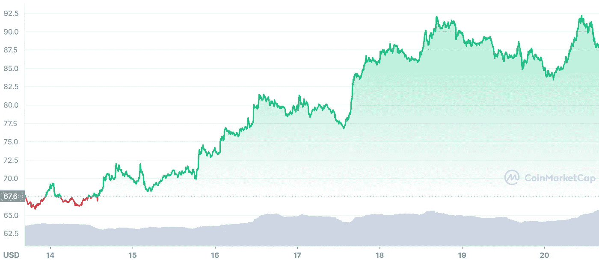

AVAX chart on [coinmarketcap](https://coinmarketcap.com/currencies/avalanche/)

$AVAX 是第 1 层区块链，作为分散应用和定制区块链网络的平台。按结束时间衡量，它是最快的智能合约平台，并拥有最多的验证器来保护其 POS(利益证明)协议的活动。

尽管市场波动很大，但就 TVL(锁定的总价值)而言，AVAX 已经偷偷溜进了前 3 名！

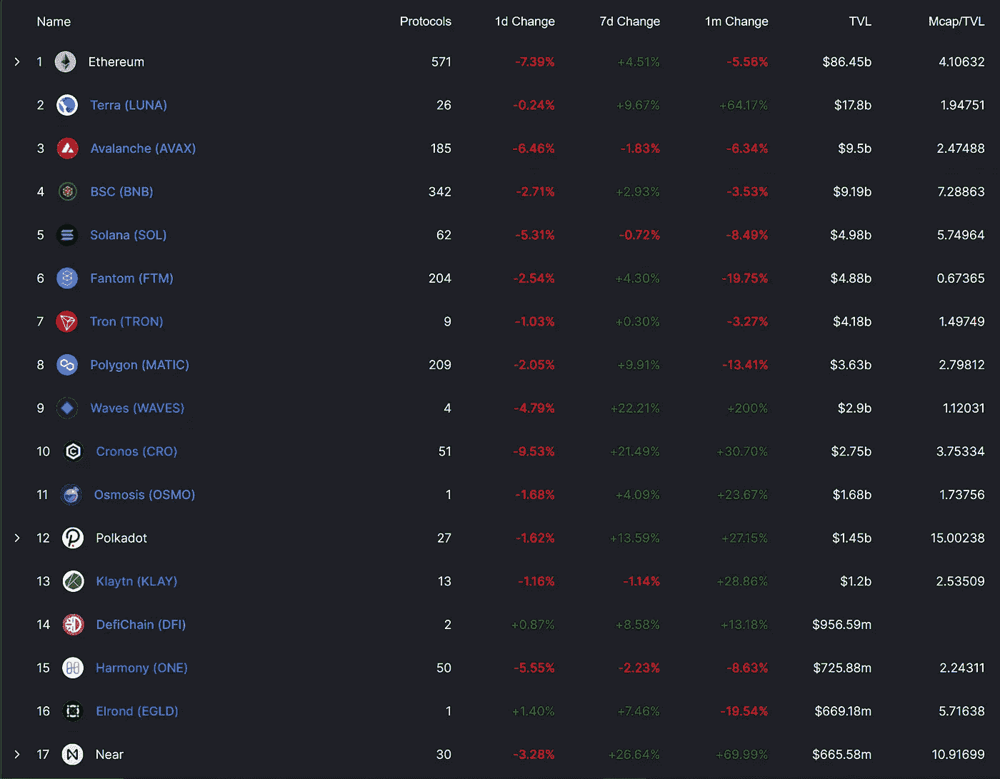

Top DeFi chains in [DefiLama](https://defillama.com/chains)

Avalanche C 链上的唯一地址和每日交易一直呈稳步上升趋势。

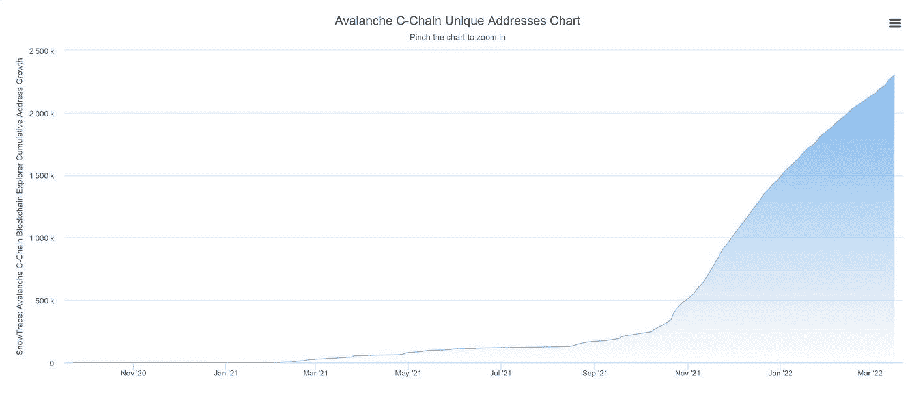

Chart of unique addresses

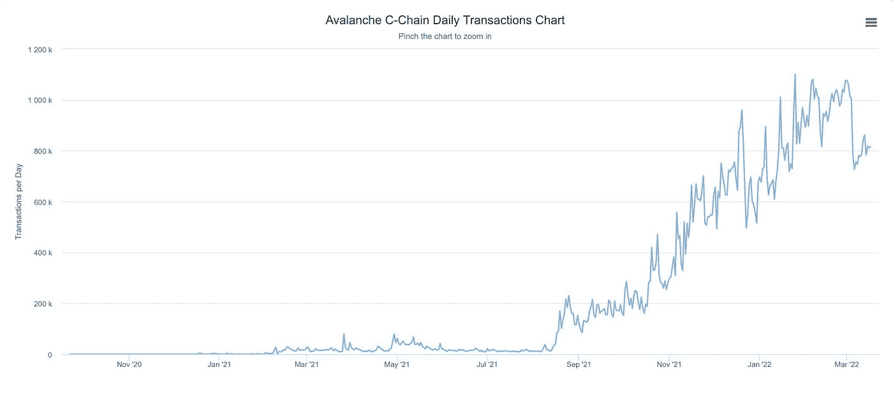

Chart of daily transactions

**那么，$AVAX 是怎么回事？**

[雪崩](https://medium.com/u/f7c9f4ea738f?source=post_page-----f59559803c9f--------------------------------)最近宣布了一项 2.9 亿美元的大规模多元宇宙激励计划！这侧重于加速子网的增长和采用，并支持新的生态系统(区块链、DeFi、NFTs 和机构用例)。

该计划旨在加速其子网的采用和增长，从而实现一个丰富的可扩展应用特定区块链生态系统，并有可能将 Avalanche 转变为一个框架，有点像 Cosmos。

*关于 Cosmos 的更多信息，请查看下面的深入主题:*

本质上，子网雪崩的扩展解决方案，以促进自定义区块链的发展。

*下面是一个很棒的主题，深入探讨了 AVAX 上的子网。*

像 DeFi 王国和 Cradaba 这样的游戏叙事已经有了自己的子网。

最近[锚协议](https://medium.com/u/f25c4bc72765?source=post_page-----f59559803c9f--------------------------------)已经向链间迈出了第一步，将 AVAX 集成到他们的协议中。多亏了[虫洞](https://medium.com/u/9fe6000ba84b?source=post_page-----f59559803c9f--------------------------------)，用户现在可以从雪崩生态系统中获得 20%的利润。

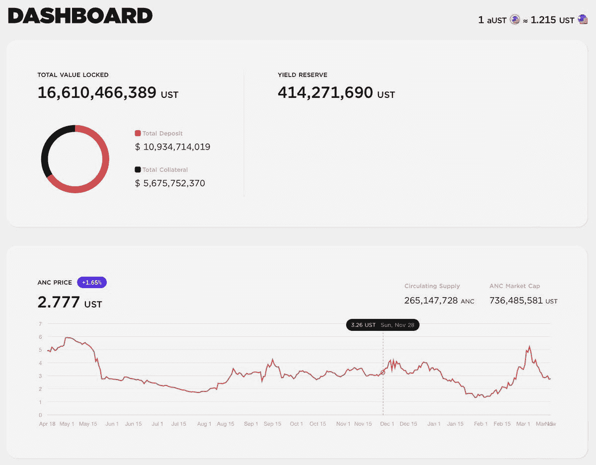

[Anchor Protocol](https://www.anchorprotocol.com/)

**这样做:**

1.  互换/购买(虫洞)$UST，上[乔](https://medium.com/u/222ff4fe74b2?source=post_page-----f59559803c9f--------------------------------)

2.在[锚协议](https://medium.com/u/f25c4bc72765?source=post_page-----f59559803c9f--------------------------------)上存入并下注 20%收益的$UST

*这减少了不同链条之间交换和桥接的滑动和不便。*

随着 AVAX 的巨大增长，Avalanche 上的最佳 DEX 将有许多使用案例， [Trader Joe](https://medium.com/u/222ff4fe74b2?source=post_page-----f59559803c9f--------------------------------) 。

随着交易的增加=收入的增加，最终导致代币价格的增加。

**这对于 HODL 和股份$JOE 来说是有意义的，但我该怎么做呢？**

头转向[乔氏德克斯](https://traderjoexyz.com/#/)

1.  把$换成$乔
2.  在“Stake”下将$JOE 标为$sJOE
3.  在 USDC 赚取 27%的年利率
4.  复合$USDC 到$乔每月高达 30%的 APY

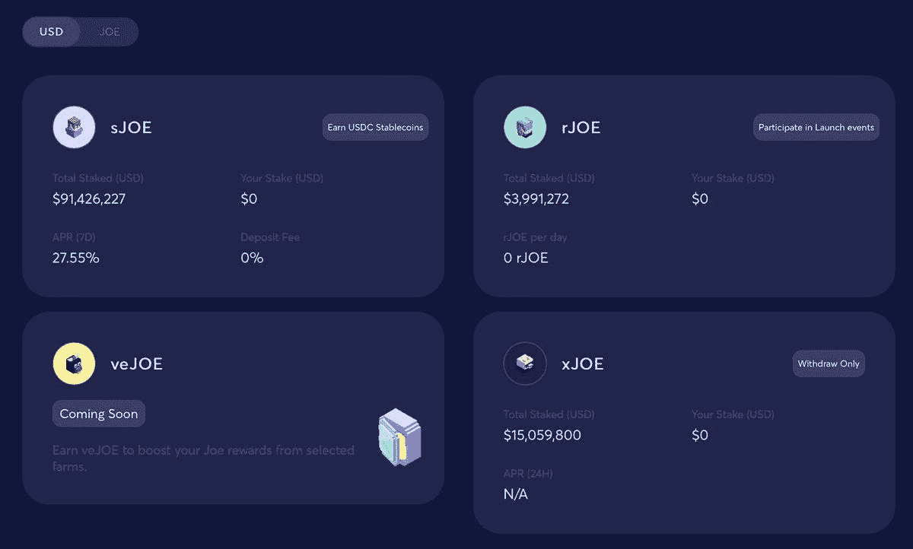

Stake sJOE for USDC on [TraderJoe](https://traderjoexyz.com/home#/)

**乔说够了，我想知道如何使 AVAX 的产量最大化？！**

你可以把你 8%的 APY 股份押在强健的金融上

无聊，让我告诉你一个更好的方法来赚取 16%的$AVAX！

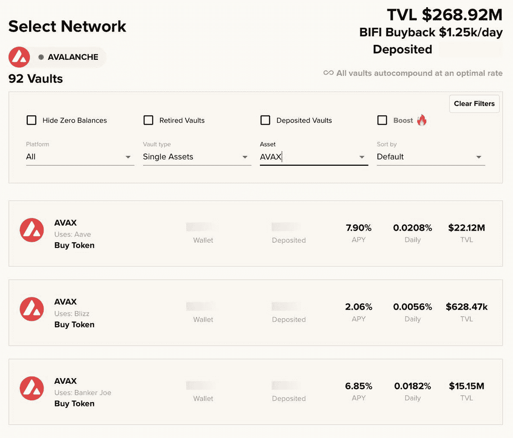

Staking AVAX on [Beefy Finance](https://beefy.finance/)

头转向[本起](https://medium.com/u/742a4284a7c9?source=post_page-----f59559803c9f--------------------------------):

1.  点击“液态铆接”
2.  以$AVAX 的股份换取$ sAVAX 的股份

*别急，1 AVAX ~ 1 sAVAX*

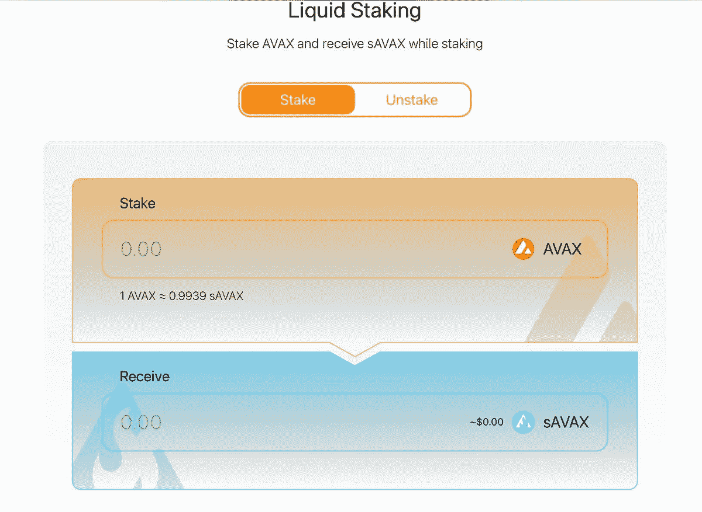

Staking AVAX on [Benqi Finance](https://benqi.fi/)

不管有没有 [$sAVAX](https://twitter.com/search?q=%24sAVAX&src=cashtag_click) 奖励，去[穿山甲交易所](https://medium.com/u/ec973316530c?source=post_page-----f59559803c9f--------------------------------)把$AVAX 的 50%换成$sAVAX。这将创建一个流动性对，我喜欢这个 Lp 的原因是，由于两个对都挂钩在一起，因此非永久性损失的风险很低。

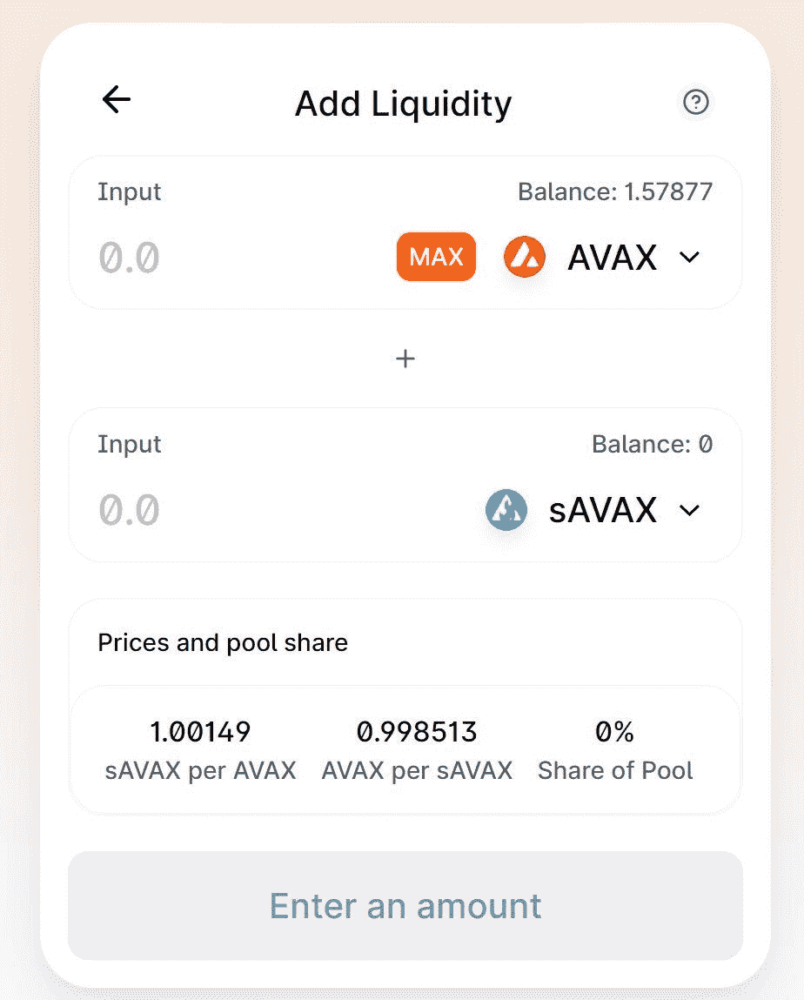

Creating a liquidity pair on [Pangolin Finance](https://pangolin.exchange/)

将它们配对后，单击“Farm”版本 2。

多张 Lp 将呈现，选择并下注 sAVAX-AVAX 9%！

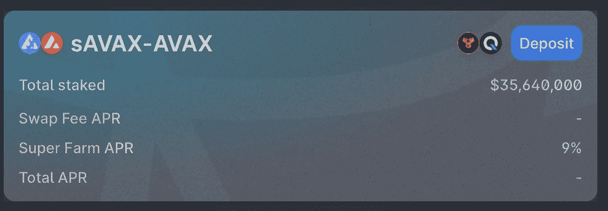

Lp on [Pangolin Finance](https://pangolin.exchange/)

**基础数学显示 7%+9%= 16%。这是 beefy finance 提供的收益率的两倍！！！**

以下是如何通过[本奇](https://medium.com/u/742a4284a7c9?source=post_page-----f59559803c9f--------------------------------)和[穿山甲交易所](https://medium.com/u/ec973316530c?source=post_page-----f59559803c9f--------------------------------)将你的 [$AVAX](https://twitter.com/search?q=%24AVAX&src=cashtag_click) 赌注高达 16%的直观总结。

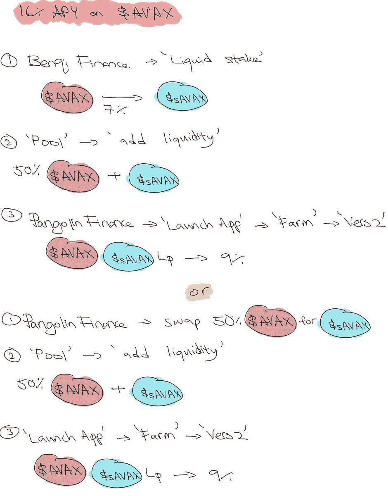

> 加入 Coinmonks [电报频道](https://t.me/coincodecap)和 [Youtube 频道](https://www.youtube.com/c/coinmonks/videos)了解加密交易和投资

# 另外，阅读

*   [比斯勒评论](https://coincodecap.com/bitsler-review)|[WazirX vs coin switch vs coin dcx](https://coincodecap.com/wazirx-vs-coinswitch-vs-coindcx)
*   [赢取注册奖金——10 大最佳加密平台](https://coincodecap.com/earn-sign-up-bonus)
*   [最佳加密交易信号电报](/coinmonks/best-crypto-signals-telegram-5785cdbc4b2b) | [MoonXBT 评论](/coinmonks/moonxbt-review-6e4ab26d037)
*   [Coinswitch 俱吠罗评论](/coinmonks/coinswitch-kuber-review-1a8dc5c7a739) | [电网交易机器人](https://coincodecap.com/grid-trading) | [比特币基地收费](/coinmonks/coinbase-fees-831e77d4f2c5)
*   [Bitget 评论](https://coincodecap.com/bitget-review) | [双子星 vs BlockFi](https://coincodecap.com/gemini-vs-blockfi) | [OKEx 期货交易](https://coincodecap.com/okex-futures-trading)