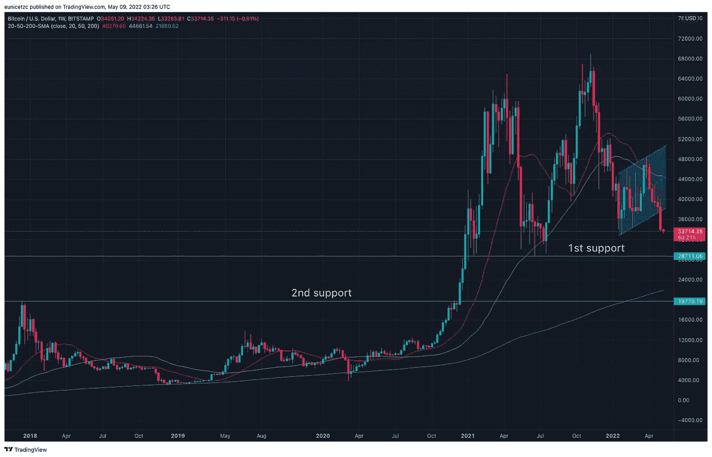

# 为什么 2022 年比特币要 20k

> 原文：<https://medium.com/coinmonks/why-20k-for-bitcoin-in-2022-1b93c8077094?source=collection_archive---------48----------------------->

在我之前的文章 [20k 比特币 2022 年价格预测](/coinmonks/20k-price-prediction-for-bitcoin-in-2022-fa7093832c4c)中，我写了关于比特币未来的看涨和看跌论点。在这篇文章中，我将使用比特币价格行动历史来分解我的 20k 价格目标。

Bitcoin / U.S. dollar weekly chart

目前，比特币的交易价格为 34K，比上周低了 12%，比历史高点低了 50%。如果比特币继续其轨迹，它将很快触及其第一条支撑线 **29K** ，这是 2021 年交易的一系列低点。

比特币的第二条支撑线似乎位于 **20k** ，这是 2018 年的最后一次反弹高点。此外，比特币突破 20k 附近的第一道防线和交易的概率在过去一年中是不可想象的。然而，**考虑到 2022 年上半年发生的重大事件，最近的比特币价格走势向我们证明，它确实更像一只成长股，而不是实物黄金等避险资产，以限制我们在动荡时期的敞口**:

1.俄罗斯入侵乌克兰，而且看不到尽头。

2.由于零 covid 政策，中国仍处于封锁状态。

3.供应链受到多重冲击导致高通胀。

4.美联储收紧货币政策以对抗通货膨胀。

我们都知道滚下山坡比爬上山容易，在我看来，在这个不确定的时期，宁可失守也不要自由落体。

**免责声明:本文包含的信息不是法律或投资建议。这代表我个人观点，一如既往的做你的研究。**

如果您有任何问题，或者您希望我写些什么，请告诉我；下面留个 ***评论*** *。感谢阅读，我希望你喜欢这篇文章。*

> 加入 Coinmonks [电报频道](https://t.me/coincodecap)和 [Youtube 频道](https://www.youtube.com/c/coinmonks/videos)了解加密交易和投资

# 另外，阅读

*   [AscendEx Staking](https://coincodecap.com/ascendex-staking)|[Bot Ocean Review](https://coincodecap.com/bot-ocean-review)|[最佳比特币钱包](https://coincodecap.com/bitcoin-wallets-india)
*   [霍比评论](https://coincodecap.com/huobi-review) | [OKEx 保证金交易](https://coincodecap.com/okex-margin-trading) | [期货交易](https://coincodecap.com/futures-trading)
*   [网格交易机器人](https://coincodecap.com/grid-trading) | [Cryptohopper 审查](/coinmonks/cryptohopper-review-a388ff5bae88) | [Bexplus 审查](https://coincodecap.com/bexplus-review)
*   [7 个最佳零费用加密交易平台](https://coincodecap.com/zero-fee-crypto-exchanges)
*   [氹欞侊贸易评论](https://coincodecap.com/anny-trade-review) | [霍比保证金交易](/coinmonks/huobi-margin-trading-b3b06cdc1519)
*   [分散交易所](https://coincodecap.com/what-are-decentralized-exchanges) | [比特 FIP](https://coincodecap.com/bitbns-fip) | [Pionex 评论](https://coincodecap.com/pionex-review-exchange-with-crypto-trading-bot)