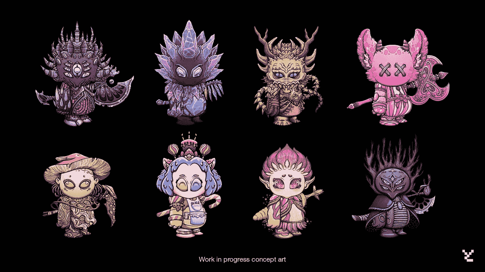
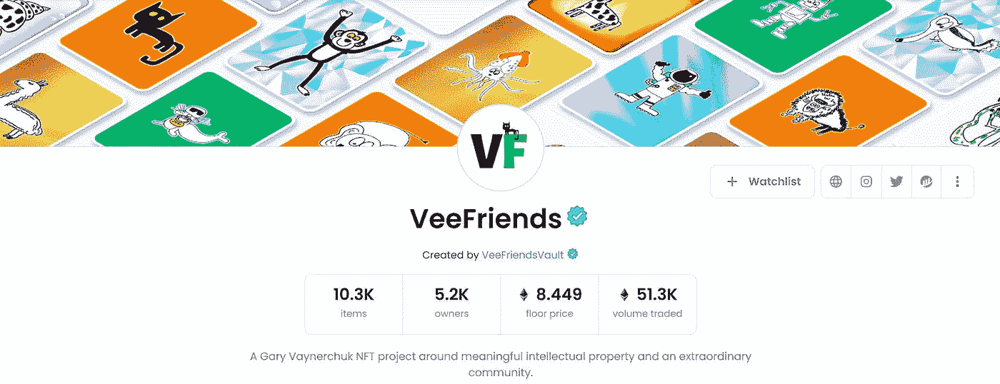
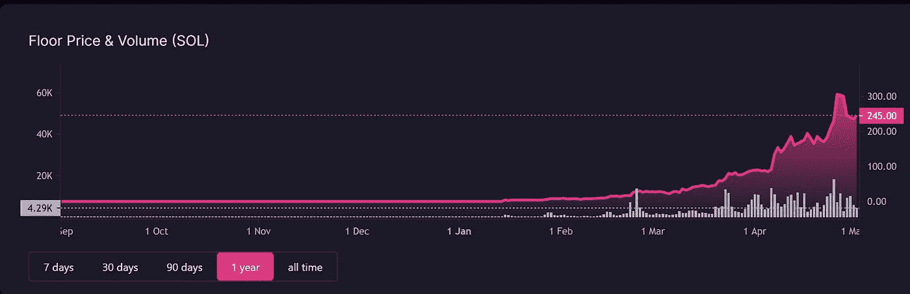

# 为什么 99%的人永远不会通过交易非功能性交易成功

> 原文：<https://medium.com/coinmonks/why-99-of-you-will-never-make-it-by-trading-nfts-222a9bc18d6d?source=collection_archive---------29----------------------->

Koda *@LeonidasNFT*

我听了卢克·马丁的播客，内容是关于他如何在非金融资产上投资赚了数百万，所以你不必听。

我们将深入探讨如何成功抓住新兴蓝筹股的技巧和诀窍，以及寻找新项目的策略。

## 一个人如何开始下注？

关键是自我意识，不仅仅是关于你自己，还有你周围的社区。

我个人也错过了 VeeFriends 等蓝筹项目，当时是 Gary Vee 和我身边的人第一次谈到它。

因为我的无知和没有采取行动，我错过了好的金钱和一个伟大的社区。

VeeFriends on OpenSea

## 这些提示和技巧将帮助所有的 Web3 投资者！

归根结底，这一切都是为了理解元。

*“在 crypto 发生的所有混乱中保持内心的平静，感觉良好，相信自己的投资会取得好成绩，即使你不知道为什么。”*

## 但是我们怎样才能做到呢？

*   研究，花时间在 CT 和不和谐上

这将有助于你决定何时跟进。

*   通过了解风险来进行有计划的下注

要知道你可以下 100 次注，其中 96 次都失败了，但只有 4 次打出了(10x-200 x)的本垒打。

回到 2021 年 12 月和 2022 年 1 月，人们说 SOL NFTs 已经死了。

DeGods 的底价是 3-5 索尔，看看他们现在…

*“在别人注意之前注意。”*

DeGods Floor Price

## 每个人都睡在索拉纳 NFTs 上…

以下是 SOL 链优于 ETH 链的几个原因。

*   更容易过度
*   更快的
*   比较便宜的

*“在 SOL 上铸造很有趣。”*

最近 OpenSea 将 SOL 集成到他们的平台中，让每个人都可以接触到 SOL NFTs，这才是有趣的开始。

总结一下，以下是关键要点:

*   注意，要有自我意识
*   信念，通过投入工作
*   采取行动，不要让机会溜走
*   不要放弃，你只需要 1/10 的本垒打

如果你想看完整的采访，这里有播客的链接。

WAGMI podcast

如果你喜欢在 Twitter 上阅读，请查看下面我的帖子:

> 加入 Coinmonks [电报频道](https://t.me/coincodecap)和 [Youtube 频道](https://www.youtube.com/c/coinmonks/videos)了解加密交易和投资

# 另外，阅读

*   [如何在 FTX 交易所交易期货](https://coincodecap.com/ftx-futures-trading) | [OKEx vs 币安](https://coincodecap.com/okex-vs-binance)
*   [CoinLoan 评论](https://coincodecap.com/coinloan-review) | [YouHodler 评论](/coinmonks/youhodler-4-easy-ways-to-make-money-98969b9689f2) | [BlockFi 评论](https://coincodecap.com/blockfi-review)
*   [XT.COM 评论](https://coincodecap.com/profittradingapp-for-binance) | [币安评论](https://coincodecap.com/xt-com-review)
*   [SmithBot 评论](https://coincodecap.com/smithbot-review) | [4 款最佳免费开源交易机器人](https://coincodecap.com/free-open-source-trading-bots)
*   [比特币基地僵尸工具](/coinmonks/coinbase-bots-ac6359e897f3) | [AscendEX 审查](/coinmonks/ascendex-review-53e829cf75fa) | [OKEx 交易僵尸工具](/coinmonks/okex-trading-bots-234920f61e60)