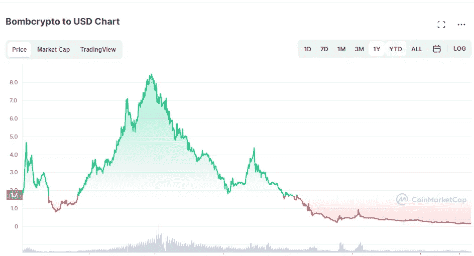

# 为什么所有的游戏都死了

> 原文：<https://medium.com/coinmonks/why-all-play-to-earn-games-are-dead-and-dying-29c88d0e42bd?source=collection_archive---------0----------------------->

玩到赚本来应该是革命性的。我们花在游戏上的时间是以金钱来衡量的，现在玩家对他们游戏中的资产有直接的所有权。在过去的一年里，所有的资金都涌入了这个领域，现在看到它处于如此糟糕的状态是相当出乎意料的。

我将要谈到的内容并没有减损通过去中心化带来的所有权。然而，这将质疑游戏的生存能力，这些游戏侧重于从金钱上奖励玩家。

市场上几乎所有主要的即玩即赚游戏都跌到了谷底。

Pegaxy 指数下跌 99.2%，收于 0.002 美分，低于其 ATH 的 0.251 美元。

**Axie 的 SLP 下跌了 96.15%，交易价格为 0.014 美分，低于其 ATH 的 0.3642 美元。**

**Bombcrypto 的比特币价格下跌 96.22%，交易价格为 0.31593 美分，低于其 ATH 的 8.3669 美元。**

《被解放的众神》(Gods Unchained)的股价下跌了 88.14%，收于 0.9529 美分，低于其 8.0372 美元的 ATH。

# **为什么会这样，我们是怎么走到这一步的？**

# **出现的问题**

1.  *钱总是离开游戏*

一个游戏获得了牵引力，它稳步获得人气，金钱开始流入游戏。在游戏的早期阶段，资金流入超过流出。最终，资金流入达到顶峰，资金流出(玩家套现)开始超过资金流入。代币价格下跌，导致投资回报率下降，导致越来越少的玩家认为游戏是一个有吸引力的投资机会。

死亡螺旋出现了。

The Death Spiral

当资金流出的总和大于资金流入的总和时，我们知道一个游戏的生态系统内的资金总和在减少。随着生态系统中货币的减少，代币和 NFT 价格不可避免地会因需求不足而下跌。令牌和 NFT 的无限供应带来的永无止境的通胀压力加剧了这种情况，你能开始看到问题所在吗？

*2。重点是*

*问题出在题目上。玩赚，真的时候，应该是**玩赚**。这是一个弗洛伊德式的说法，它支撑了这个社区的精神和方法，这里的焦点主要集中在挣钱的方面，而不是玩耍的方面。*

*照目前的情况来看，玩赚游戏被广泛视为快速致富的赚钱计划。因此，这个空间充斥着鲸鱼、公会和挥霍无度的秘密百万富翁，他们涌入游戏，一旦达到他们想要的利润目标就抛售。最糟糕的是，有很多游戏可供选择，一旦一个游戏变得不赚钱，他们就可以从一个游戏跳到另一个游戏。*

*只要关注的是收入方面，我们就不能指望有一款游戏能持续这么多年。虽然游戏很重要，但一个不断发展和可持续的社区在任何游戏的寿命中都起着至关重要的作用。当游戏如此受经济驱动时，不太可能产生一个繁荣的社区。*

*3.*奖学金**

**

*这将会招致很多人的憎恨，仅仅因为它是投资者和玩家最大的赚钱功能。尽管如此，我们该谈谈这个问题了。*

***奖学金正在不必要地加速已经脆弱的游戏经济的毁灭。***

*虽然学者们帮助那些没有足够资本的人进入游戏，并允许那些有资本的人利用他们的资本，而不必在游戏上花费太多时间，但奖学金的概念支撑着社区中的**收入**心态。*

*学者在游戏中没有利益，因此没有理由将他们的收入或任何形式的资本重新投入到游戏中。他们的唯一目标是玩游戏，赚取代币并尽快兑现，以赚取他们的周薪或月薪。它们导致了公开市场上的代币供过于求，更高的铸造率和游戏资金的净流出。就像投资者一样，他们从一个游戏跳到另一个游戏，但比投资者更容易，因为他们没有资本锁定在任何给定的生态系统中。*

*总的来说，奖学金制度在一开始可能看起来很有吸引力，可以吸引更多的玩家加入游戏，但它也导致了游戏的提前消亡。*

*如果没有奖学金，游戏会突然变得可持续吗？不。但它的经济会平衡得多。*

**4。融资模式**

*“玩到赚”领域的游戏构建模式与传统游戏领域大相径庭。一款游戏通常需要 3-5 年的时间来开发，而我们现在看到游戏在几个月内就出现了。*

*这在一定程度上是由于大多数游戏的融资模式。首先从最初的代币或 NFT 发行中获得足够的资金，然后资金被用于开始开发游戏。然后游戏分阶段向公众发布。然而，早期投资者(在加密/区块链领域更是如此)要求很高，习惯了短时间内的高回报。*

*融资模式和参与者不可避免地决定了游戏开发的速度，并导致游戏的过早发布，这些游戏缺乏足够的游戏性和机制来监管和调节围绕游戏构建的经济。*

*这不是缺乏游戏性的问题(虽然有些人可能不同意)，而是缺乏开发团队处理围绕它建立的经济的工具。每个游戏都创造了一个对变量高度敏感的经济，如代币的总供应量、通货膨胀率、燃烧机制、流动性等。没有一个完整的游戏，开发者就没有适当的工具来有效地管理经济。*

**5。市场操纵**

**

*大多数先玩后赚的代币流动性低，市场深度浅，就像任何小型股一样，这通常会导致更高的波动性和更容易被操纵。*

*在撰写本文时:-*

*Pegaxy 的 VIS 24 小时交易量为 276，460 美元*

*Splinterland 的 SPS 24 小时交易量为 806，943 美元*

*上帝的《被解放的众神》24 小时交易量为 6，584，888 美元*

*这使得令牌容易通过协调的泵和转储事件被操纵。任何此类事件都可能导致代币价格下跌，并使代币难以恢复到与游戏的 NFT 价格和获得的奖励一致的平衡，从而形成死亡螺旋。*

*我们偶尔会看到，由于游戏的新发展或新的资金流入，一个代币进入死亡螺旋，就会出现小的波动。然而，老资金倾向于抛售这些泵，以重新获得亏损或实现盈亏平衡。*

****玩赚有前途吗？****

*我相信是的，只是不是我们想象的那样。*

*需要解决的最重要的方面是对游戏的**收益**方面的关注。正如成功的传统游戏一样，我们需要创造一种内在的动机来玩游戏，要么因为游戏很有趣，游戏很有挑战性，要么只是打发时间或交朋友的好方法。一些让人们继续玩游戏的实质性的东西，不管有没有收入。赚钱应该仅仅是玩家玩游戏时的附带活动。*

*公平地说，这个领域正在发展。像 Axie 和 Pegaxy 这样的游戏正在向基于技能的游戏转变。然而，这并不意味着与**收入**方面的分离不会发生。*

*我们玩的游戏最终不会在现实世界中创造任何价值，因此也不会自发地为玩家创造货币价值。*

> *加入 Coinmonks [电报频道](https://t.me/coincodecap)和 [Youtube 频道](https://www.youtube.com/c/coinmonks/videos)了解加密交易和投资*

# *另外，阅读*

*   *[CBET 回顾](https://coincodecap.com/cbet-casino-review) | [库科恩 vs 比特币基地](https://coincodecap.com/kucoin-vs-coinbase)*
*   *[折叠 App 审核](https://coincodecap.com/fold-app-review) | [Kucoin 交易机器人](/coinmonks/kucoin-trading-bot-automate-your-trades-8cf0ca2138e0) | [Probit 审核](https://coincodecap.com/probit-review)*
*   *[如何匿名购买比特币](https://coincodecap.com/buy-bitcoin-anonymously) | [比特币现金钱包](https://coincodecap.com/bitcoin-cash-wallets)*
*   *[币安 vs FTX](https://coincodecap.com/binance-vs-ftx) | [最佳(SOL)索拉纳钱包](https://coincodecap.com/solana-wallets)*
*   *[比诺莫评论](https://coincodecap.com/binomo-review) | [斯多葛派 vs 3Commas vs TradeSanta](https://coincodecap.com/stoic-vs-3commas-vs-tradesanta)*
*   *[Capital.com 评论](https://coincodecap.com/capital-com-review) | [香港的加密借贷平台](https://coincodecap.com/crypto-lending-hong-kong)*
*   *[如何在 Uniswap 上交换加密？](https://coincodecap.com/swap-crypto-on-uniswap) | [A-Ads 评论](https://coincodecap.com/a-ads-review)*