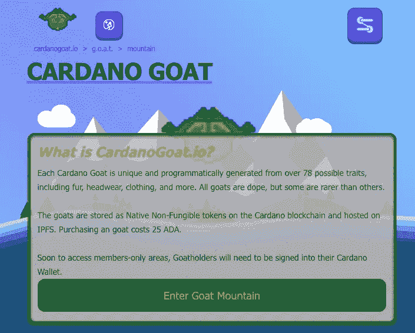

# 为什么我对 NFT 的着迷？

> 原文：<https://medium.com/coinmonks/why-am-i-fascinated-with-nfts-97d6909bd4b7?source=collection_archive---------87----------------------->

CardanoGoat.io

我们可以通过社区来控制数据，而不是依赖其他人。它将金融体系重新交到人民手中。但这实际上意味着什么呢？NFT 不是钱，也不是真正的资产，因为它只是代码。

这些代码代表的是一个由加密技术支持的 id。这样我们就可以验证那些签名了。这是一个强大的工具，有人会想这样做来保护自己。

例如，如果有人发信息试图欺骗你，说他们是别人。你可以让他们签一些东西然后比较。这就是密码学的力量。

在卡尔达诺有几种不同类型的地址[https://docs.cardano.org/core-concepts/cardano-addresses](https://docs.cardano.org/core-concepts/cardano-addresses)

在某些网络上，有一些称为智能合同的必需脚本。一些链上也有本地令牌，比如 Cardano。所以令牌只是每个人验证所有权的一种公开方式。

这不会助长洗钱，这才是重点。这可以追溯到我们所知道的政客们正在处理数十亿的浪费。

(https://CardanoGoat.io)

cardanogoat.io intro page

让我们以山羊 NFTs 为例。小到 48x48 px 的艺术品都是微小的。它到底给了你什么？目标是什么？

创造一种有个性的体验。我为那些山羊创造的一切都是为了那些山羊。单词很难完全正确，这个空间变化如此之快。为了避免监管，我们会非常适应，但没有人真正知道谁会受到骚扰。

在去中心化的金融空间中游戏，给了人们一种有趣的能力，去创造一些可以进入公开市场的东西。拿股票之类的东西来说。需要有一个注册经纪人来合法地实现这一点。从技术上讲，在监管出台之前，这从来都不是一个要求。加密空间也是如此。目前，这是地下交易所的问题，但监管将会出台。

这让我想到另一点，你可以和区块链的任何人无限制交易，这就是我们的计划。不允许政府将货币价值作为他们的权力。让我们饿死人民，因为去他妈的领导人。事情不应该是这样的，这是所有人保护自己的唯一方法。是开始创造促进自由和信息传播的系统。

即使这会让我不舒服，因为生活并不总是容易的。我希望你会喜欢类似的东西，我们都可以在我们使用的系统中有更多的发言权。这将是一个美好的一天，当投票可以用区块链式的不信任经济学来验证。我不相信政府会照顾我的最大利益。只是目前坐在权力宝座上的人的利益。

想想吧。有些人认为 crypto 是一个骗局。其他人则认为这是在我们让政府首脑重写历史之前保存历史的一种可能方式。

> *加入 Coinmonks* [*电报频道*](https://t.me/coincodecap) *和* [*Youtube 频道*](https://www.youtube.com/c/coinmonks/videos) *了解加密交易和投资*

# 另外，阅读

*   [有哪些交易信号？](https://coincodecap.com/trading-signal) | [Bitstamp vs 比特币基地](https://coincodecap.com/bitstamp-coinbase) | [买索拉纳](https://coincodecap.com/buy-solana)
*   [ProfitFarmers 点评](https://coincodecap.com/profitfarmers-review) | [如何使用 Cornix 交易机器人](https://coincodecap.com/cornix-trading-bot)
*   [十大最佳加密货币博客](https://coincodecap.com/best-cryptocurrency-blogs) | [YouHodler 评论](https://coincodecap.com/youhodler-review)
*   [my constant Review](https://coincodecap.com/myconstant-review)|[8 款最佳摇摆交易机器人](https://coincodecap.com/best-swing-trading-bots)
*   [MXC 交易所评论](/coinmonks/mxc-exchange-review-3af0ec1cba8c) | [Pionex vs 币安](https://coincodecap.com/pionex-vs-binance) | [Pionex 套利机器人](https://coincodecap.com/pionex-arbitrage-bot)