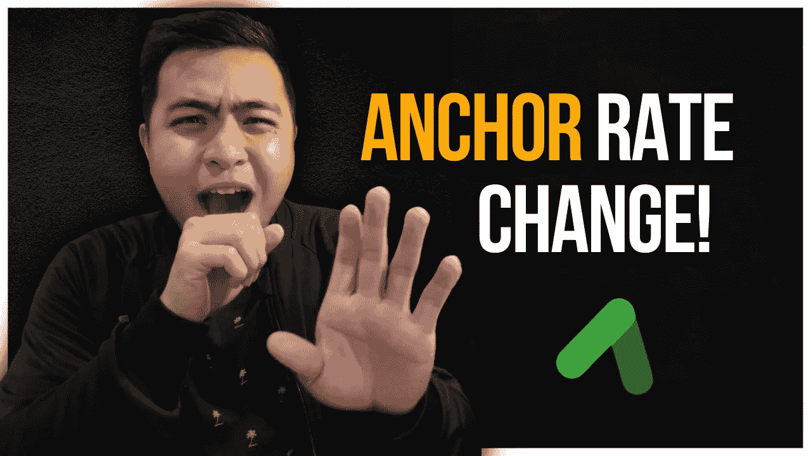
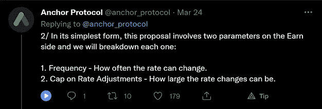
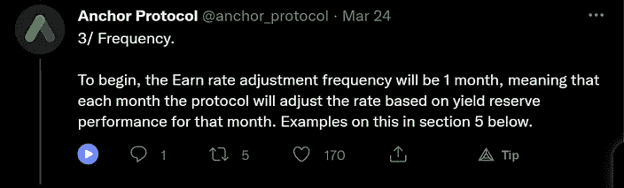
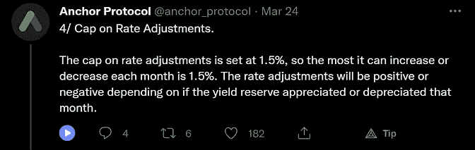
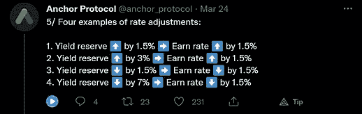
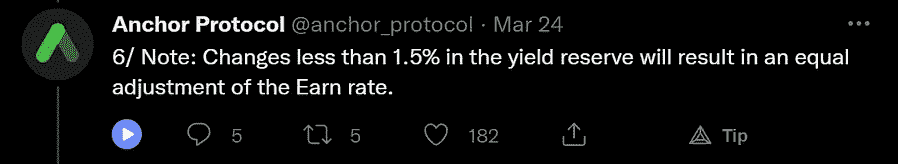
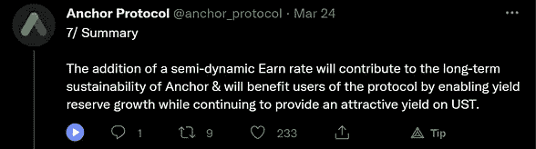
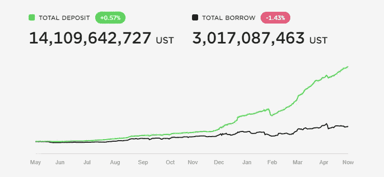

# 为什么主播的 APY 降到了 18%

> 原文：<https://medium.com/coinmonks/why-anchors-apy-dropped-to-18-3f44d3a4a2fe?source=collection_archive---------39----------------------->

[Check me out on YouTube too! :)](https://go.thehustlefiles.com/YouTube-sub)

5 月 1 日，Anchor 著名的 20% APY 变成了 18%。这可能让该平台的一些用户感到困惑，并对该平台的未来有点担忧。所以，让我来分析一下导致这种变化的原因。

这一变化是 3 月 24 日批准的提案 20 的结果。该提案建议平台采用半动态收入率，以推动《议定书》实现可持续性。我在我的锚收益文章中简要地谈到了这个提议。

# 什么是提案 20？

标题为“[动态收益率](https://forum.anchorprotocol.com/t/dynamic-anchor-earn-rate/3042/5)的提议 20 是用户 bitn8 的提议。这个提议在三月初的 Anchor 论坛上被考虑过。

以下是根据主播的推特账号对 20 号提案的细分:

[Source: Anchor Protocol Twitter](https://twitter.com/anchor_protocol/status/1507052921745256449)

这种新的半动态费率有 15%和 20%的下限和上限。无论速率变化是哪种方式，它都不会超出这些参数。

# 提案 20 的起因是什么？

最近几个月，主播粉丝一直在担心平台的未来，质疑 20%的收益率的可持续性。

存款总额的增长速度一直快于协议中 UST 的借款总额。这种差异对许多用户来说是令人震惊的，因为如果不加以控制，它可能会危及整个 Terra 生态系统。

允许 Anchor 提供其收益率的众多因素之一是通过他们从借用 UST 的用户那里获得的利息。简单地想一想，传统的银行将人们储蓄的钱贷出去。

目前，人们借入 UST 的唯一动机是获得奖励性的非国大代币。随着其价格从 3 美元跌至 2 美元，是什么在推动人们锚定借款？

我想不出任何一个。

[Source: Anchor Protocol](https://app.anchorprotocol.com/)

# 人们如何看待这种变化？

许多用户对这一变化反应不一。许多主播粉丝称赞了这一举措，而其他人则怀疑这将使主播走向大众采纳。

支持这一举措的用户认为可持续性和实用性是将 Anchor 推向新高度的因素。反对这一举措的人认为，让 ANC 变得更有用、降低 APY 会阻碍采用，以及过早实施该提案是锚定的不利因素。

# 这对主播来说意味着什么？

虽然 APY 的下降让许多用户感到失望，但 Anchor 的未来仍悬而未决。我们不知道这将如何为平台发挥作用，因为市场的反应不一。

我确实同意那些反对这一举措的人的一些观点，因为这确实让人感觉我们正在从大规模采用中倒退。然而，如果我们想让 Anchor 成为一个可持续的协议，APY 也需要改变。

老实说，很难选择哪一方，因为双方都有优点。至于我，我会继续使用这个平台，同时获得额外的收益。

虽然许多公司都在提供更高稳定性的替代方案(TRON 和 NEAR)和沟锚，为什么不把这些新方案纳入你的整体战略呢？

我认为这样做更可行，因为你只是简单地存入价格不波动的稳定存款，而不是流动性池。无论 APY 是什么，回报将永远是他们的，而不用担心失去你的存款的价值。

**我的更多信息**

 [## Kado 是什么？—去 UST 最快的方法！

### 这是最快的方式让你的菲亚特到 UST，并花在 Terra 网络！我对……非常兴奋

medium.com](/coinmonks/what-is-kado-the-fastest-way-to-get-ust-9ed5d6388358)  [## 锚协议 3 个月的被动收入

### Terra 和 Anchor 越来越受欢迎，我很高兴我能早到，充分利用…

medium.com](/coinmonks/passive-income-with-anchor-protocol-for-3-months-28bc7097bfc3) 

> 加入 Coinmonks [电报频道](https://t.me/coincodecap)和 [Youtube 频道](https://www.youtube.com/c/coinmonks/videos)了解加密交易和投资

# 另外，阅读

*   [最佳期货交易信号](https://coincodecap.com/futures-trading-signals) | [流动性交易所评论](https://coincodecap.com/liquid-exchange-review)
*   [火币加密交易信号](https://coincodecap.com/huobi-crypto-trading-signals) | [Swapzone 审查](/coinmonks/swapzone-review-crypto-exchange-data-aggregator-e0ad78e55ed7)
*   最佳[密码交易机器人](https://coincodecap.com/best-crypto-trading-bots) | [购买索拉纳](https://coincodecap.com/buy-solana) | [矩阵导出评论](https://coincodecap.com/matrixport-review)
*   [Coldcard 评论](https://coincodecap.com/coldcard-review) | [BOXtradEX 评论](https://coincodecap.com/boxtradex-review)|[uni swap 指南](https://coincodecap.com/uniswap)
*   [比特币基地评论](/coinmonks/coinbase-review-6ef4e0f56064) | [德里比特评论](/coinmonks/deribit-review-options-fees-apis-and-testnet-2ca16c4bbdb2) | [FTX 评论](/coinmonks/ftx-crypto-exchange-review-53664ac1198f)