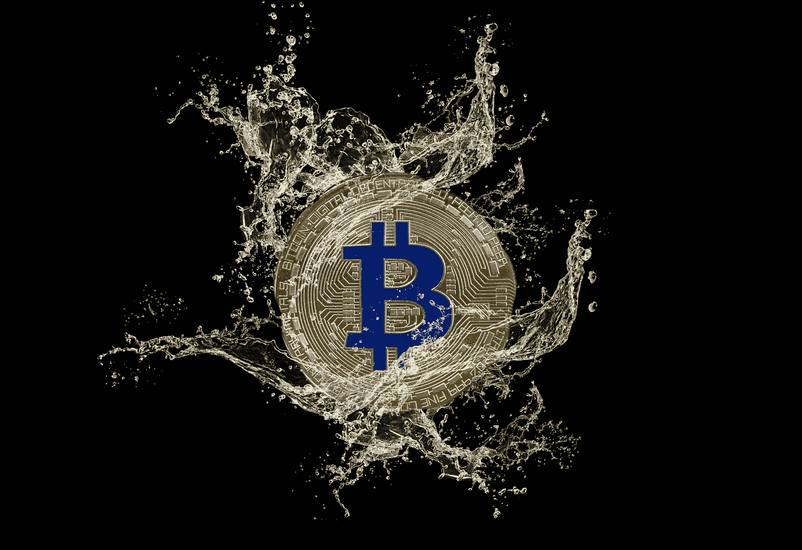

# 为什么比特币搅拌机是合法的？

> 原文：<https://medium.com/coinmonks/why-are-bitcoin-mixers-legal-9dcd73380564?source=collection_archive---------4----------------------->

Image Credit: [Marco Verch](https://www.flickr.com/photos/30478819@N08/47378121291)

[Tornado Cash](https://tornado.cash/) 是加密货币混合器的完美名称，也称为不倒翁。搅拌机是做什么的？例如，它以数字方式将客户的比特币与大量其他比特币混合在一起，有点像拖车公园里的龙卷风。在混合过程中，用户的比特币资金分散在潜在的数千名用户中。他们得到的回报是干净的。这都是合法进行的，因为在撰写本文时，加密混合器的使用仍然是合法的。

你会问，这怎么可能？在可能短暂但令人兴奋的权力下放生活中，再来一次狂野的西部时刻？行业支持者认为，数字货币混合器通过帮助加密投资者维护他们的隐私，在去中心化的世界中发挥了重要作用。[chain analysis](https://www.chainalysis.com/)的研究主管金·格劳尔在接受 [*《财富》*](https://fortune.com/2022/03/26/what-are-crypto-mixers/) 杂志采访时表示，混合器“本质上并不违法——它们可以用于合法的隐私目的。”

强调单词*可以*。这种姿态是高尚的，但同时也是一种公关方式的幼稚。它是如此的天真，以至于给了密码支持者一些可信的理由来否认发生在这些平台上的犯罪。这也为洗钱者提供了一个很好的不在场证明，不管他们是否有目的。否认是一种强大的情绪。只要考虑一下涉及以下混合器的洗钱案件的增长，然后告诉我是否有任何行业否认正在进行:

**2019 年 5 月 22 日:** [数百万欧元加密货币洗钱服务 Bestmixer.io 被拿下](https://www.coindesk.com/markets/2019/05/22/eu-authorities-shut-down-bitcoin-transaction-mixer/)

**2021 年 4 月 28 日:**

**2021 年 8 月 18 日:**

**2022 年 1 月 17 日:** [Crypto.com 被盗乙醚通过龙卷风现金混入](https://www.coindesk.com/business/2022/01/18/cryptocoms-stolen-ether-being-laundered-via-tornado-cash/)

**2022 年 4 月 5 日:** [司法部调查导致最大的在线黑市](https://www.justice.gov/opa/pr/justice-department-investigation-leads-shutdown-largest-online-darknet-marketplace)【ref。九头蛇混合服务公司]

在 Crypto.com 的案件中，价值超过 3000 万美元的密码从加密货币交易所被盗。正如你可以从上面的标题中读到的，据报道，被盗的乙醚基金正在通过加密混合器进行洗钱，我以“龙卷风现金”开始这篇报道。以下 Coindesk 视频深入解释了这种独特的公开洗钱行为。

Crypto.com 的小偷也仍然在逃。[密码警察](https://gizmodo.com/the-justice-department-has-a-new-team-of-crypto-cops-1847813325)在哪里？他们会抓住他们吗？这次盗窃影响了 483 名 Crypto.com 用户。平均每个用户损失近 63，000 美元！那一批中肯定有一些鲸鱼？所有受影响的人都奇迹般地得到了补偿。

在我看来，混合器和搅拌器是加密世界中每一项洗钱活动的支柱。如果没有这些混合器，数字洗钱者会完全重新装备吗？它们*是在加密清理过程中普遍存在的*吗？如果加密混合器在五年前被宣布为非法，这一举动会对 2017 年以来通过加密洗钱的估计 330 亿美元产生影响吗？最肯定！这会有很大的不同。使这些混合器非法的问题是支持和反对隐私的争论，一个分散人群拥有的争论。

目前，洗钱的黄金时代已经来临。在分散化的空间中，无论你走到哪里，不仅有机会增加你的加密货币基金，在某些情况下会大幅增加，而且还有机会让你快速清洗这些基金，使其免受政府检查。之后，你可以将你的比特币或以太坊全部或部分套现，然后将这些资金作为长期(例如合法)投资投入到实体房地产或其他传统的集中市场。趁你还能享受这个趋势。一旦美国决定集中目前分散的市场，每一个数字金融活动都将受到监管，直到永远。权力下放将成为一种记忆。

如果我是一名秘密警察，想要获得成功，抓住一些数字洗钱者，我可能会花一些时间变得亲密，可能会超过两周，或者在 NFT 的一个不和谐团体中，例如，在 Tornado Cash 的正确来源。他们可以帮助我理解如何阅读、检查和定位混在平台上的硬币背后的身份。必须是更高层的人，比如代码的创造者之一；有人能看到大局，明白不遵守，虽然英雄，可能是一个坏的品牌长期行动。这是一个简单的建立关系和分享信息的行为。

最近联邦政府在抓捕数字骗子方面设计了一些[创意和有效的策略，根据我上面分享的消息，他们似乎已经意识到加密货币混合器在洗钱过程中的作用，因此破获了越来越多与混合器相关的犯罪。这很好，但就联邦政府而言，调音台只是一个不断移动的数字目标的一部分，它的头在旋转。在涉及使用加密混合器的洗钱案件中，实施一次逮捕并定罪所需的时间、金钱和资源是巨大的。](/coinmonks/crypto-has-changed-the-faces-of-money-laundering-4f8ab412998c)

完全取缔搅拌机不是更容易、更便宜吗？

*   结束

> 加入 Coinmonks [电报频道](https://t.me/coincodecap)和 [Youtube 频道](https://www.youtube.com/c/coinmonks/videos)了解加密交易和投资

# 另外，阅读

*   [比特币基地僵尸程序](/coinmonks/coinbase-bots-ac6359e897f3) | [AscendEX 审查](/coinmonks/ascendex-review-53e829cf75fa) | [OKEx 交易僵尸程序](/coinmonks/okex-trading-bots-234920f61e60)
*   [如何在印度购买比特币？](/coinmonks/buy-bitcoin-in-india-feb50ddfef94) | [WazirX 审查](/coinmonks/wazirx-review-5c811b074f5b)
*   [隐翅虫替代品](/coinmonks/cryptohopper-alternatives-d67287b16d27) | [HitBTC 审查](/coinmonks/hitbtc-review-c5143c5d53c2)
*   [CBET 点评](https://coincodecap.com/cbet-casino-review) | [库币 vs 比特币基地](https://coincodecap.com/kucoin-vs-coinbase)
*   [折叠 App 审核](https://coincodecap.com/fold-app-review) | [Kucoin 交易机器人](/coinmonks/kucoin-trading-bot-automate-your-trades-8cf0ca2138e0) | [Probit 审核](https://coincodecap.com/probit-review)