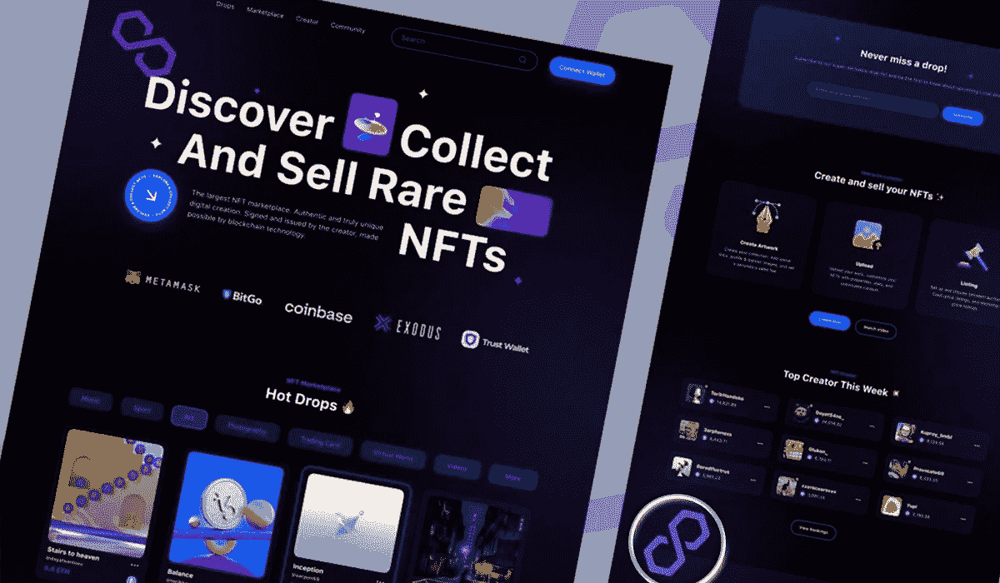
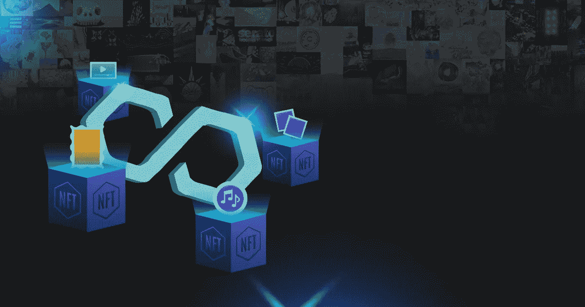

# 为什么品牌正在向多边形的 NFT 市场转移？

> 原文：<https://medium.com/coinmonks/why-are-brands-shifting-towards-the-nft-marketplace-on-polygon-bdbfa81a8754?source=collection_archive---------16----------------------->

NFT Marketplace on Polygon

由于区块链等技术的快速发展，数字化不再是我们日常生活中的重大障碍。这项技术兴起的关键原因是加密货币的繁荣。代表不可替代令牌的 NFT 就是其中之一。NFT 是一种独特的数字资产，其元数据可追溯资产的所有权详细信息。大多数艺术家已经过渡到以区块链为基地的 NFTs。

总的来说，用户可以购买、出售、交易、铸造和投标他们想要的数字资产。在进入 NFT 领域之前，你应该熟悉区块链技术及其功能，因为这些是理解 NFT 的基本标准。目前，NFT 已在几个区块链网络中发展，如币安智能链、以太坊、索拉纳、卡尔达诺和多边形。大多数 NFT 都是在这些区块链网络上创建的。据加密货币专家称，从 2017 年到 2021 年，NFT 的贸易额已超过 3600 万英镑。

在这篇博客中，让我们在多边形 上探索更多关于 [**NFT 市场的发展:**](https://www.appdupe.com/nft-marketplace-on-polygon?utm_source=medium&utm_medium=blog16jun&utm_campaign=Yasmeen)

# 【Polygon 如何支持 NFT 市场？

多边形也叫 Matic 对于以太坊区块链，它有一层两个缩放解决方案。这是一个有助于轻松开发和连接的市场，在兼容以太坊的区块链网络中不会遇到任何障碍。它们中的大多数通常用于以太坊区块链，导致该网络的流量增加。总的来说，Polygon 有效地为区块链领域工作，通过其节点分布和智能合同层提供高级别的安全性。不仅如此，这样的特性使得证明最小交易成本和异常快的交易速度显著增加。

## 在多边形上开发一个 NFT 市场

由于 NFTs 越来越受欢迎，使用以太坊和多边形构建 NFT 市场的需求也越来越大。继以太坊之后，由于多边形 NFT 市场的高需求，多边形也扮演了积极的角色。这个市场允许公司通过提供更高的可靠性、安全性和可伸缩性来从竞争中脱颖而出。

品牌选择基于 matic 的 NFT 市场开发的主要原因是它允许他们轻松地建立市场。像其他平台一样，它将使用户能够出售、购买和查看数字收藏品。用户还可以在平台上收购资产或举行拍卖。Polygon for NFT 市场开发促进了多链兼容性并增加了安全措施。

你需要一个合适的框架来开发多边形 NFT 市场的发展。聘请顶级的 NFT 市场开发公司将帮助 NFT 企业、初学者和爱好者获得一个功能丰富的平台。

Polygon NFT Marketplace

## 多边形 NFT 市场有什么好处？

以下是在 Polygon 上开发 NFTs 交易平台的一些好处，阐明了与该平台相关的一些问题。请看下面:

*   可以通过使用高级加密实现更快、更安全的交易。
*   由于分散化，用户可能期望完全透明和安全。
*   支持以太坊区块链及相关功能。
*   与其他平台相比，基于多边形的市场收取的交易费用最低。

如果它包括一个强大的、分散的、高度安全的第二层解决方案用户界面，这难道不是理想的 NFT 市场开发平台吗？现在，我们已经介绍了所有的好处，让我们看看多边形上的 NFT 市场开发的功能列表

# **多边形 NFT 市场有什么特点？**

以下是您必须了解的关于 Polygon 上 NFT 市场开发的一些功能，这些功能可以让您清楚地了解为什么应该选择该平台:

## 📌**兼容性**

Matic 让你可以连接多个区块链，它还使用了以太坊的大量功能，并减少了 ETH 的一些限制。

## 📌**可扩展性**

当涉及到同时处理多个事务时，多边形网络表现良好，可以毫无障碍地处理所有事务。

## 📌**互操作性**

它允许两个多边形链之间的通信，并与以太坊通信。

## 📌**交易费用低**

多边形 NFT 市场比其他区块链平台相对便宜；他们收取的费用更少，而且负担得起。

## 📌**模块化**

多边形网络在未来具有高度的可扩展性、可定制性和可升级性。它还通过不同程度的独立性和可靠性降低了系统故障的风险。

# **智能合约在多边形 NFT 市场中扮演什么角色？**

智能合同是一个预先编码的程序，它规定了买卖双方同意的条款。在 NFT 市场开发期间，开发人员在区块链网络上执行这些术语(比如说，Polygon Matic)。

不可替代的代币交易依赖于智能合约。每份合约都包含特定的交易信息，这些信息被加密并存储在类似 Polygon 的区块链网络上。每当买卖双方进行 NFT 交易时，智能合约都会促进交易。

# 为什么从多边形的 NFT 市场开始？

Polygon 是行业领导者，符合所有 NFT 标准。技术进步需要一种独特的解决方案来解决当前的问题，而这款区块链具有满足这种需求的功能。那么，为什么多边形上的 Matic NFT 市场如此吸引人呢？这是因为，

*   它提供了多种工具，降低了交易成本。
*   提高区块链网络的交易速度。
*   用户可以押资产，获得奖励。

## **最后的话**

许多初创企业和成熟企业将 NFT 视为他们的未来；因此，他们竭尽全力发展一个成熟的 NFT 市场。正因如此，他们青睐 [**多边形的 NFT 市场**](https://www.appdupe.com/nft-marketplace-on-polygon?utm_source=medium&utm_medium=blog16jun&utm_campaign=Yasmeen) 建筑服务，因为它被视为 NFT 交易的可靠平台。交易者可能会从这个市场中受益。一个著名的 NFT 开发公司无疑可以帮助你与他们的熟练的 NFT 开发人员多年的经验，致力于提供高质量的服务。您距离构建一个用户友好的界面，帮助他们在数字 NFT 世界中达到新的高度只有几步之遥。

> 加入 Coinmonks [电报频道](https://t.me/coincodecap)和 [Youtube 频道](https://www.youtube.com/c/coinmonks/videos)了解加密交易和投资

# 另外，阅读

*   [OKEx vs KuCoin](https://coincodecap.com/okex-kucoin) | [摄氏替代品](https://coincodecap.com/celsius-alternatives) | [如何购买 VeChain](https://coincodecap.com/buy-vechain)
*   [币安期货交易](https://coincodecap.com/binance-futures-trading)|[3 comas vs Mudrex vs eToro](https://coincodecap.com/mudrex-3commas-etoro)
*   [如何购买 Monero](https://coincodecap.com/buy-monero) | [IDEX 评论](https://coincodecap.com/idex-review) | [BitKan 交易机器人](https://coincodecap.com/bitkan-trading-bot)
*   [CoinDCX 评论](/coinmonks/coindcx-review-8444db3621a2) | [加密保证金交易交易所](https://coincodecap.com/crypto-margin-trading-exchanges)
*   [红狗赌场评论](https://coincodecap.com/red-dog-casino-review) | [Swyftx 评论](https://coincodecap.com/swyftx-review) | [CoinGate 评论](https://coincodecap.com/coingate-review)
*   [Bookmap 评论](https://coincodecap.com/bookmap-review-2021-best-trading-software) | [美国 5 大最佳加密交易所](https://coincodecap.com/crypto-exchange-usa)