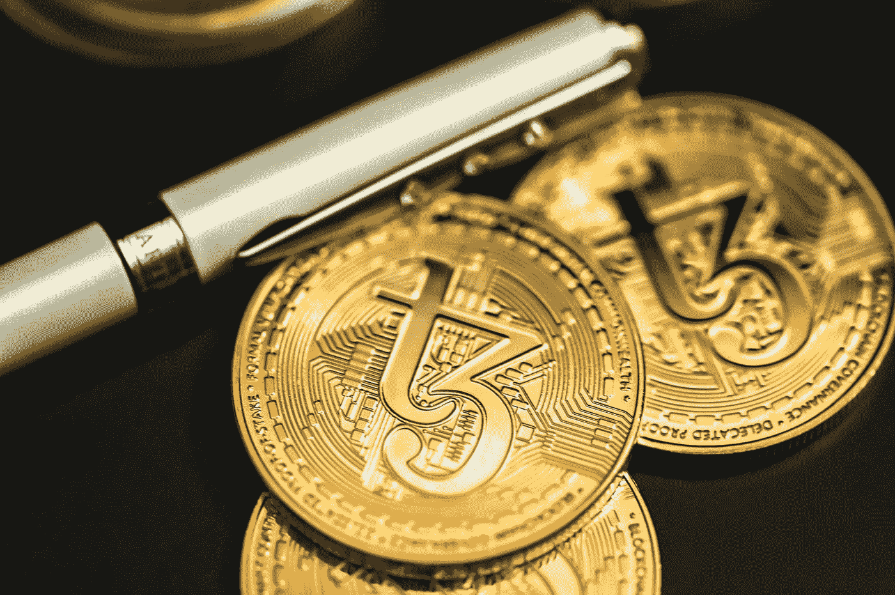

# 对冲基金为什么做空 USDT？

> 原文：<https://medium.com/coinmonks/why-are-hedge-funds-shorting-usdt-3db50a62d9d9?source=collection_archive---------5----------------------->

## 又一集露娜来了吗？我们应该卖掉 USDT，买入更多的 BUSD 和 USDC 吗？

Photo by [Quantitatives](https://unsplash.com/@quantitatives?utm_source=medium&utm_medium=referral) on [Unsplash](https://unsplash.com?utm_source=medium&utm_medium=referral)

加密货币领域的重大新闻是，许多对冲基金正在对 Tether 的稳定硬币 USDT 建立空头头寸。这是一个严肃的消息，因为许多交易者已经在 USDT 对中进行了交易。