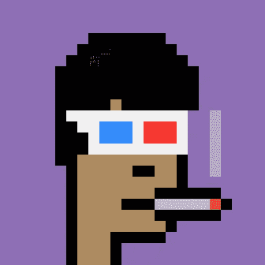
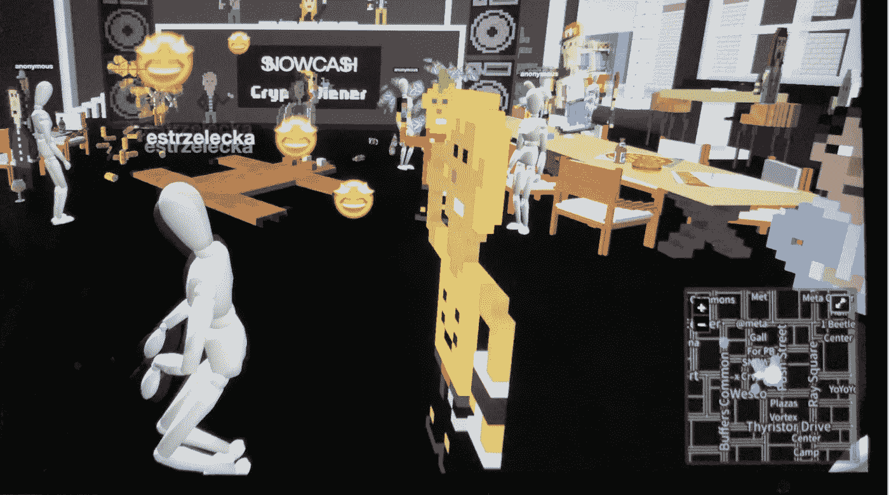

# 为什么现在 jpegs 很值钱？一个艺术专家的意见。

> 原文：<https://medium.com/coinmonks/why-are-jpegs-worth-money-now-an-art-experts-opinion-b373619bbd13?source=collection_archive---------37----------------------->

格奥尔格·贝克已经在艺术界工作了 20 多年。他在 90 年代开始关注网络艺术运动，并开始思考为什么没有数字艺术市场。

2017 年，他对艺术界感到困扰，早就应该更新了。他看到开发人员和编码人员在探索数字艺术，但无法进入当时非常封闭的艺术圈。

那时，他决定筹备一个关于区块链艺术的展览，在 2018 年，他向全球观众展示了现在著名的[秘密朋克](https://www.larvalabs.com/cryptopunks)。

秘密朋克

他想探索这样一个问题:一件数字艺术品是否可以被赋予与实物艺术品相同的价值。这完全是 T2 惯例的问题:如果足够多的人认为数字艺术有价值，那么它就有价值。越多人认同它有价值，它就越有价值。

毕竟，为什么画布会有价值？ 不是关于材料，而是艺术家的技巧，以及围绕那些技巧的约定俗成。

艺术也是一种身份的象征，因为重要的收藏家在赋予艺术家的作品价值方面发挥着作用。格奥尔格认为数字化身将是下一个身份象征:随着越来越多的事件发生在**元宇宙**上，他说，不想以裸体化身出现是很自然的，但要准备一些很棒的 **NFT 可穿戴设备**，以便能够认识更多的人，让自己与众不同。把一只无聊的猿猴作为个人资料图片意味着某人是谁，他们属于什么社区，以及他们周围的社交圈。

无聊猿游艇俱乐部

从一开始，Georg 就将数字化身视为艺术品，因为它们具有创新性，创造了艺术界前所未有的东西:形成**社区**的新方式，与艺术品互动的新方式，以及建立**数字身份**的新方式。

今天，格奥尔格正在进行一个新的雄心勃勃的项目:他在 [Crypto Voxels](https://www.cryptovoxels.com/play?coords=N@422E,278S) 上举办了一系列活动，在那里他追溯了数字艺术的历史，展示了历史作品，并解释了数字艺术的起源。还将有 **NFT 滴**向该领域的创新者致敬，让人们有能力购买可穿戴设备，以及 NFT，如 [Reeps100(哈利·耶夫)](https://twitter.com/Reeps1)和 [Trung Bao](https://twitter.com/trungbaotr) 声音宝石，这是由组合而成的视觉雕塑

元宇宙展将于 2022 年 10 月在瑞士举行的一场物理活动中达到高潮，在那里，每个人都将能够在现实生活中欣赏 NFTs，就像他们在 Georg 2018 年的活动中一样，只是这一次围绕数字艺术的会议在一个非常不同的地方举行。

由 Eli Strzelecka 于 2022 年 1 月 17 日撰写。

$NOWCASH party in December 2021 on Crypto Voxels.

> *加入 Coinmonks* [*电报频道*](https://t.me/coincodecap) *和* [*Youtube 频道*](https://www.youtube.com/c/coinmonks/videos) *了解加密交易和投资*

# 另外，阅读

*   [3 商业评论](/coinmonks/3commas-review-an-excellent-crypto-trading-bot-2020-1313a58bec92) | [Pionex 评论](https://coincodecap.com/pionex-review-exchange-with-crypto-trading-bot) | [Coinrule 评论](/coinmonks/coinrule-review-2021-a-beginner-friendly-crypto-trading-bot-daf0504848ba)
*   [莱杰 vs n rave](/coinmonks/ledger-vs-ngrave-zero-7e40f0c1d694)|[莱杰 nano s vs x](/coinmonks/ledger-nano-s-vs-x-battery-hardware-price-storage-59a6663fe3b0) | [币安评论](/coinmonks/binance-review-ee10d3bf3b6e)
*   [Bybit Exchange 评论](/coinmonks/bybit-exchange-review-dbd570019b71) | [Bityard 评论](https://coincodecap.com/bityard-reivew) | [Jet-Bot 评论](https://coincodecap.com/jet-bot-review)
*   [3 commas vs Cryptohopper](/coinmonks/3commas-vs-pionex-vs-cryptohopper-best-crypto-bot-6a98d2baa203)|[赚取加密利息](/coinmonks/earn-crypto-interest-b10b810fdda3)
*   最好的比特币[硬件钱包](/coinmonks/hardware-wallets-dfa1211730c6) | [BitBox02 回顾](/coinmonks/bitbox02-review-your-swiss-bitcoin-hardware-wallet-c36c88fff29)
*   [block fi vs Celsius](/coinmonks/blockfi-vs-celsius-vs-hodlnaut-8a1cc8c26630)|[Hodlnaut 审核](/coinmonks/hodlnaut-review-best-way-to-hodl-is-to-earn-interest-on-your-bitcoin-6658a8c19edf) | [KuCoin 审核](https://coincodecap.com/kucoin-review)
*   [Bitsgap 审查](/coinmonks/bitsgap-review-a-crypto-trading-bot-that-makes-easy-money-a5d88a336df2) | [Quadency 审查](/coinmonks/quadency-review-a-crypto-trading-automation-platform-3068eaa374e1) | [Bitbns 审查](/coinmonks/bitbns-review-38256a07e161)