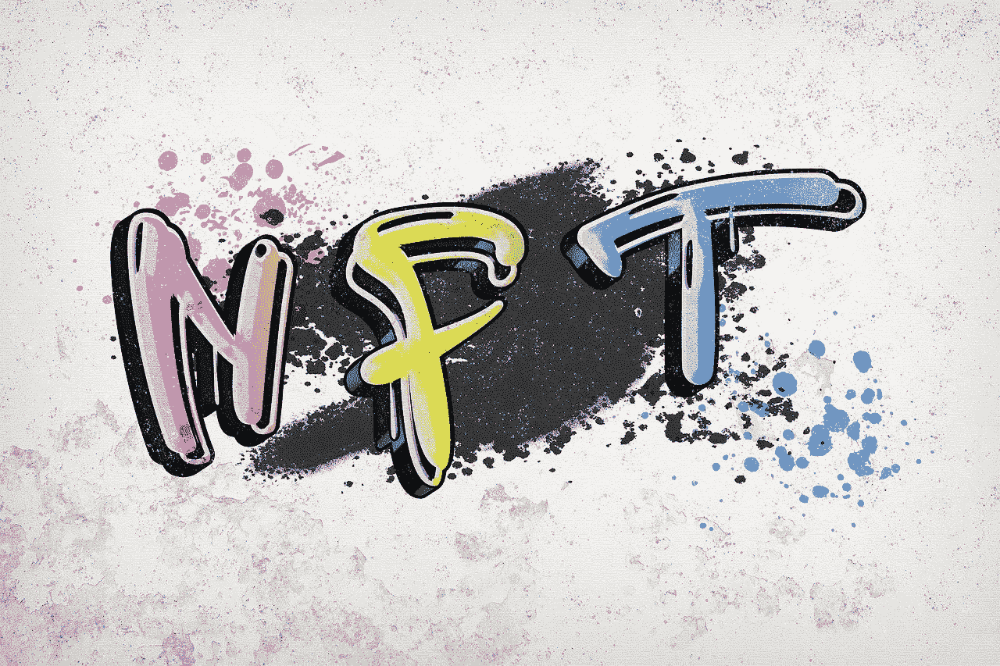
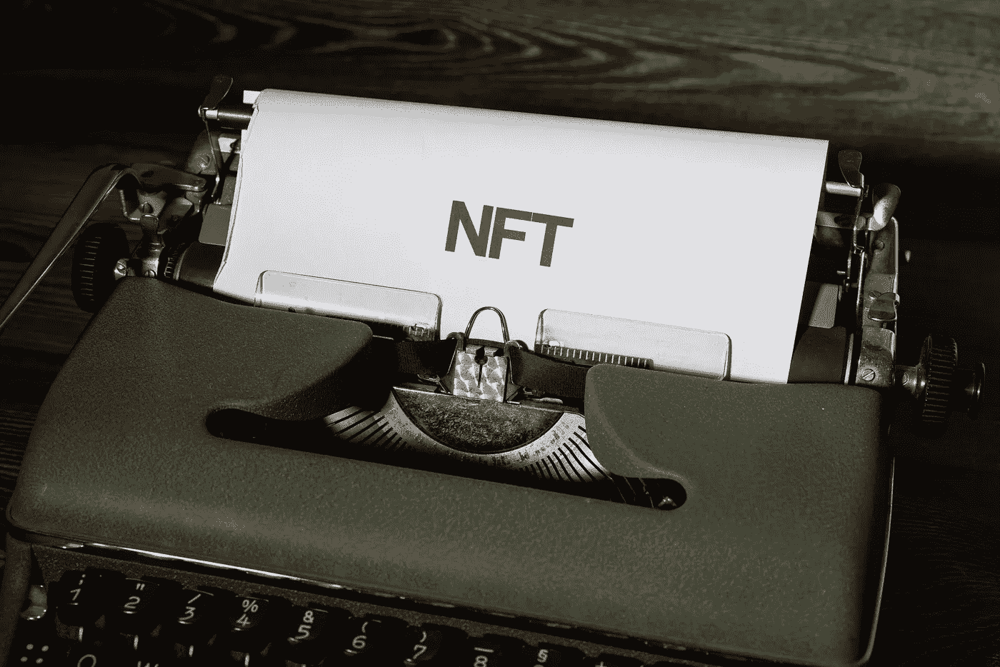

# 为什么 NFT 对环境有害？

> 原文：<https://medium.com/coinmonks/why-are-nfts-bad-for-the-environment-f8a73d9e644b?source=collection_archive---------7----------------------->

Source: Pixabay.com

什么是 NFT？

“不可替代令牌”也称为 NFT，是将所有权与独特的物理或数字资产(如艺术品、房地产、音乐和电影)联系起来的数字资产。

NFTs 可以被认为是一种新的古董。在大多数情况下，它们在互联网上交易，并作为所有权的数字记录。为了确保资产的唯一性，NFT 被记录在区块链上，这与加密货币使用的技术相同。由于新技术的出现，NFT 也很难被篡改或伪造。

对于非功能性测试，熟悉可替代性的经济概念是必不可少的。

可替代物品可以很容易地互相交换，因为不管它们的独特性如何，它们的价值是相等的。如果你把一张 1 美元的钞票换成另一张有不同序列号的 1 美元钞票，你仍然会有 1 美元。但是不可替代的项目不能被替代。有了 NFTs，每个令牌都是独一无二的，有自己的特性，与同类型的其他令牌价值不同。

> [**参见:你可能正在与加密上瘾做斗争的 10 个迹象。**](https://wire.insiderfinance.io/10-signs-you-might-be-struggling-with-crypto-addiction-d14206302936)

**为什么 NFTs 这么贵？**

Source: Pixabay.com

那么 NFTs 这么贵有什么大不了的？创作者可以通过构建 NFT 来验证任何数字事物的有效性和稀缺性。例如，有许多蒙娜丽莎的复制品在流通，但只有一个真正的存在。而在 NFT 科技的案例中，更容易确定谁拥有原始艺术品。”

**NFTs 是如何工作的？**

本质上，NFT 是数字代币，允许艺术作品(如电影、音乐或照片)的所有者通过一系列计算机交易来主张作品的所有权。比特币和其他传统加密货币可以相互交换，因为它们都是一样的。

> 加入 Coinmonks [电报频道](https://t.me/coincodecap)和 [Youtube 频道](https://www.youtube.com/c/coinmonks/videos)了解加密交易和投资

相比之下，每一个 NFT 都是独一无二的数字艺术作品

NFT 市场正以令人难以置信的速度增长。特别是因为新冠肺炎，这种流行病增加了人们花在网上的时间，使得像 NFTs 这样的数字原生企业更受欢迎，因为我们比以往任何时候都更加数字化。"

> **你可能会喜欢:**[**NFT 股市正在走向崩盘吗？**](https://wire.insiderfinance.io/is-the-nft-market-headed-for-a-crash-47b4da7ffb83)

**NFT 和加密货币有区别吗？**

即使 NFT 和加密货币是使用相同的技术构建的，也不应该弄错。因为 NFT 是不可替代的，它们不能被交换，这使得它们不同于加密货币。作为替代，加密货币可以用来代替法定货币或作为另一种加密货币的交换。他们也可以用来购买非功能性食物。

加密货币和实物货币都有一个商定的价值。说到钱的价值，1 美元等于 1 美元，1 BTC 也是如此。然而，在 NFT 的世界里，事情完全不同。因为每个 NFT 都有其独特的结构和标识符，它们是不可互换的。因此，不可能用一个 NFT 取代另一个 NFT，并期望有类似的结果。这仅仅意味着两个相同的 NFT 可能价值不同。NFTs 的价格大多是主观的。

NFT 是建立在区块链之上的。使用区块链，交易被记录在一个公开的数据库中。一旦以区块链为基地的 NFT 建立起来，它就向公众开放，并在公开市场上交易。投资者被 NFT 不断升值的价值所吸引，这可以实时看到。

以太坊是买卖 NFT 代币最受欢迎的区块链。然而，其他区块链也支持非功能性测试。

NFT 大多是音乐、艺术、运动装备、gif 等的数字表示。

> **亦见:** [**以太坊可能过渡到 8 月份的股权证明。**](/coinmonks/ethereum-may-transition-to-proof-of-stake-in-august-b1908ee99df7)

**为什么 NFT 对环境有害？**

Source: Pexel.com

NFT 对环境无害，但它们的铸造方式会对环境产生重大影响。大多数 NFT 都是在以太坊区块链上制造的，由于其工作验证共识机制，它会消耗大量能量。

通常的做法是，在 NFT 进入流通领域之前，将它们列在网上市场上。NFT 上市不需要太多的能量，但是 NFT 上市的位置决定了铸造过程需要多少能量。因为 OpenSea 托管以太坊的工作验证基础设施，使用这样的 NFT 市场意味着大多数 NFT 铸造过程暂时将是能源密集型的。

> **另见:** [**比特币当今面临的 12 大问题？**](/coinmonks/12-biggest-issues-facing-bitcoin-today-eae1e08a34a7)

当购买 NFT 完成后，它可以被储存或转让给另一个人。如果你将 NFT 转移到另一个使用工作证明进行转移的 NFT 市场，这种能源密集型的铸造过程就会重复。保存 NFT 不需要消耗任何能量。

你可能想知道采矿过程到底消耗了多少能源。复杂的算术问题只能由计算能力最强的矿工快速解决，这就需要使用大量的计算硬件和大量的电力。

尽管只选择了一家矿商来验证每笔新的交易，但一个遍布全球的矿商网络正在竞相验证包括 NFT 交易在内的多笔交易，这要求每家参与的矿商都大量消耗电力。

NFT 可以用更少的功率吗？

通常，铸造或转移 NFT 所需的能量很高；然而，情况不必如此。利益相关的区块链平台可以在不消耗过多电力和不损害环境的情况下产生 NFT。

利害关系证明方法比工作证明方法使用更少的能量，因为它不需要大量使用计算设备。由于验证者被要求同意不交易或出售他们持有的比特币，他们必须在网络中下注。

这不同于那些被激励消耗电力来成功开采一个区块的矿工。通过要求区块链验证者标记他们的令牌，可以保证区块链的安全，而不需要网络参与者消耗过多的能量。

还有许多其他的 NFT 市场得到了利益相关者共识机制的支持；索拉纳区块链、卡尔达诺、阿尔格兰德和许多其他跨链网络正在解决 NFT 社区面临的电力问题。

**有用信息**

BXMI 提供了一个独特的机会来交易加密资产和享受一个活跃的加密社区的好处，无论你是新手还是有经验的交易者。

Bitxmi 交易者享受的好处包括最低交易费用、24/7 客户支持、闪电般的快速交易，以及每天高达 1500 美元的无 KYC 取款。

Bitxmi 的长期目标是不仅提供兑换服务，还教育人们如何交易和投资加密货币。

从这里开始:【https://www.bitxmi.com/en_US/register】T4

在这里加入我们的电报社区:[https://t.me/bitxmiexchange](https://t.me/bitxmiexchange)

在这里阅读我们的白皮书:[https://drive . Google . com/file/d/1 ptwx 8 rrepkwvvwj 8 psidb 1 pnz 5 uacx/view？usp =分享](https://drive.google.com/file/d/1PTWX8rRePkWVvjwJ8pSIdb1pPnZ5uacx/view?usp=sharing)