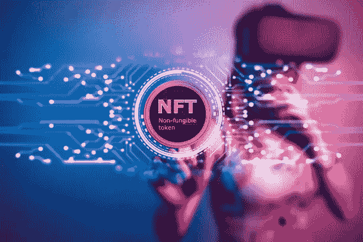
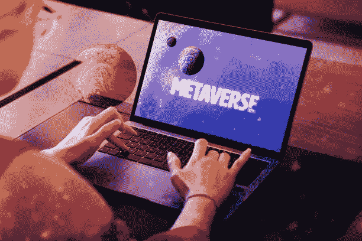
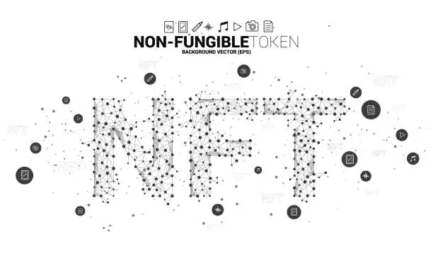
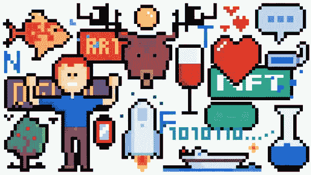
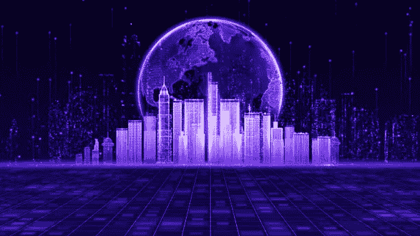
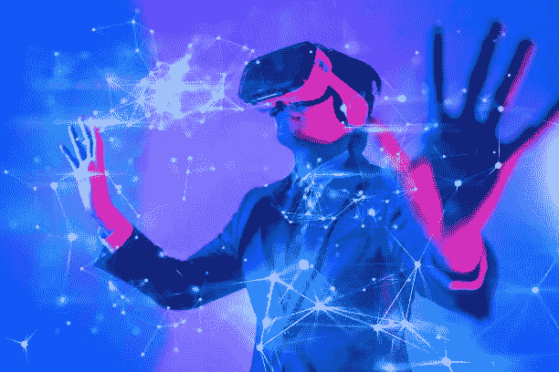

# 为什么元宇宙访问需要 NFT？

> 原文：<https://medium.com/coinmonks/why-are-nfts-required-for-metaverse-access-477472e37dcc?source=collection_archive---------58----------------------->

随着 NFT 应用数量的快速增长，这些数字资产正在迎来数字世界的新时代:元宇宙。基于 NFT 的增强体验将成为下一代社交网络的基础。metaverses 登上世界舞台的最好例证是脸书的 Meta launch，它标志着向元宇宙时代的转变。

NFT 和 metaverses 已经错综复杂地交织在一起，特别是在区块链游戏和其他可互操作游戏的背景下，它们在扩展数字社交媒体中扮演着价值载体的角色。在区块链游戏和其他可互操作的游戏中尤其如此。尽管 NFT 游戏是一个新概念，但它已经很受欢迎了，正如 NFT 的首次游戏发行(IGO)所显示的那样。IGO 的 NFT 系列在该游戏部门推出后两周内全部售罄，前两周的交易额超过 1600 万美元。

# 什么是元宇宙？

区块链供电的元宇宙是一个可以通过互联网访问的虚拟世界。去中心化的媒体为社交提供了无尽的机会，而 VR 和 AR 则充当了视觉组件的提供者。个体和组织层面上的参与者之间的互操作性和适应性是这些生态系统的标志。

metaverses 中有几个流程和元素，包括通信、金融交易等等。非功能性测试也是其中的一部分。在元宇宙，任何人都可以构建、购买和查看 NFT(非功能性对象)来获得虚拟财产、加入社交社区、构建虚拟身份等等。在元宇宙，有许多方法可以通过这种广泛的应用将实物和数字资产货币化。

# 非关税壁垒将对元宇宙产生什么影响？

由于 NFT 在标准社交网络范式之外的独特操作能力，它们可以中断元宇宙交易和用户交互。了解 NFT 如何在数字时代造成大破坏。

# 开放和公平的经济

元宇宙是一个虚拟的分散生态系统，消费者和企业可以在其中移动他们现实世界的资产和服务。可互操作的区块链游戏是通过新颖的游戏模式和游戏形式将更多真实世界的资产带入元宇宙的一种方式。

当谈到吸引和授权区块链游戏玩家时，玩赚游戏是一个很好的选择。使用 NFTs，用户可以参与并获得奖励，因为他们为元宇宙的游戏内经济提供了价值，从而在玩的同时获得回报。另一方面，传统游戏不能让玩家完全控制他们的资产，这使得“玩赚”游戏在元宇宙更加公平。

其他游戏项目中的许多游戏组件可供玩家收集并转移到各种游戏环境中，因此如果您不知道如何参与，也不必担心。自从无限游戏宇宙(IGO)首次亮相以来，所有的 NFT 甚至在向公众发布之前就已经销售一空。

从玩到赚游戏公会的增长对这种模式的未来至关重要。土地和资产等 NFT 资源由公会购买，然后借给其他玩家，这些玩家希望在他们的虚拟世界中利用这些资源来赚钱，从而为中介提供便利。然后公会从他们玩游戏赚的钱中抽取一小部分。

这样，通过允许缺乏初始资本的玩家通过公会获得优势，经济变得更加开放和公平。公会通过降低游戏门槛，让每个人都更容易参与到元宇宙经济中来。简而言之，公会是元宇宙经济的催化剂，让所有玩家都能更容易地获得 NFT 的资源。

除了游戏中的物品和数字房地产，用户还可以在 NFT 市场上用他们的 NFT 资产来换取现实世界的金钱。作为一个玩家，你可以在游戏的元宇宙中使用 NFT 来决定他们对整体经济的价值。因此，用户可以创建各种不同类型的内容，如广泛使用的公共领域资产、原始数字作品以及在视频游戏中赋予独特技能和外观的专业 NFT。

不变性和透明度是元宇宙区块链的固有特征，创造了一个开放和公平的经济。由于缺乏泵和通货膨胀的价值膨胀，基本的供求法则不再适用。相反，价格是由 NFT 的稀缺性及其连锁价值决定的。

# 扩展身份、社区和社会经验

在元经文中，非功能性语言在形成身份、社区和社会互动方面也将发挥重要作用。对一个项目的支持或对虚拟和现实世界的不同意见可以通过持有特定的 NFT 资产来传达。这使得志同道合的 NFT 持有者能够聚集在一起，分享他们的经验，创造内容。NFT 头像是这种 NFT 的一个很好的例子。

使用 NFT 头像，玩家可以用多种方式表达自己。玩家可以通过使用 NFT 头像作为访问令牌来进入元宇宙的不同区域并在它们之间跳跃。NFT 化身允许我们在元宇宙开发和策划我们的虚拟自我，作为我们现实世界身份的虚拟延伸，拥有完全的自由和所有权。

元宇宙和现实世界中的虚拟会员资格可以通过购买虚拟化身 NFT 来实现。这培养了归属感和社会互动。通过内容开发和创业公司的创立，NFT 的虚拟人物已经在塑造元宇宙的体验和环境。

Bored Ape Yacht Club 和 CryptoPunks collections 提供了独特的所有者特权，可以访问受保护内容的富人社区，甚至可以参加离线私人活动，这些都是塑造个人身份的化身的生动实例。与非物质文化遗产相关联的入场费是强调非物质文化遗产作为连接虚拟和现实世界的价值载体的重要性的一个很好的方式。

# 虚拟房地产所有权

通过 NFTs，用户可以拥有他们在元宇宙的所有虚拟土地和空间，他们可以做他们想做的事情。虚拟财产的所有权可以通过使用区块链的系统来证明。

元宇宙的土地可以有多种用途，包括营利、被动收入、建设各种结构，如网上商店或举办社交聚会。

分散之地最近与阿迪达斯合作组织了一场虚拟时装秀，其中的设计作为不可替代的标志(NFT)被拍卖。音乐家对虚拟房地产特别感兴趣，因为他们可以在网上表演，并通过互联网出售 NFT 的门票和商品。

# 元宇宙的未来

Metaverses 仍处于发展的早期阶段，但由于使用了 NFTs，它们提供了丰富的潜在社会和经济前景。

Metaverses 和 NFT·区块链游戏公司将成为 Web 3.0 的一个重要方面，在这个时期，由于虚拟现实、视频游戏、社交媒体和加密的结合，现实世界的企业将扩展到数字领域，用户将发现这些设置的适应性。