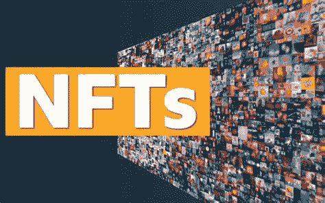
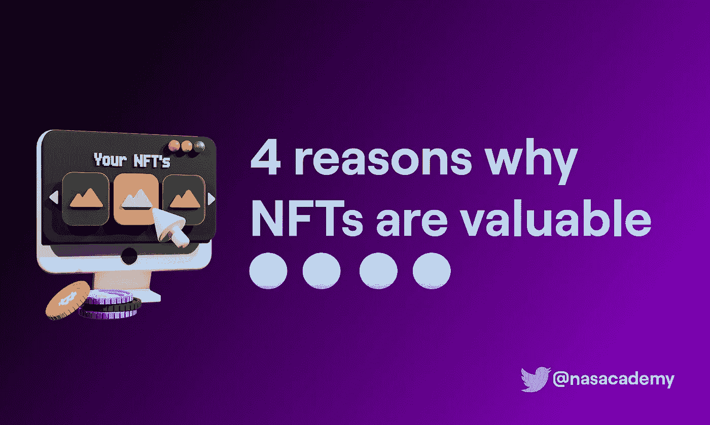

# 为什么 NFT 这么贵？！百万美元的猴子和像素化的 JPEGs

> 原文：<https://medium.com/coinmonks/why-are-nfts-so-expensive-million-dollar-monkeys-and-pixelated-jpegs-fa598b79b4f0?source=collection_archive---------22----------------------->

我们确信，2035 年的历史书将会以一种与前几年完全不同的方式谈论 2020 年。除了全球疫情，肯定会有一章是关于非功能性测试的。谁知道呢，到那时，NFTs 可能会成为主流，以至于 NFTs 的起源完全是一个不同的话题。

现在已经很难理解市场上正在发生的事情。想象一下，这一代人将会如何看待 NFT 成为他们日常生活的一部分。因此，这给我们带来了一个更大的问题:如果数字艺术用例如此节俭，为什么 NFT 如此昂贵？**价值在哪里？**

我们是正常人(不是来自隐世的人)吗？这就是我们在这篇文章中将要讨论的内容。

# 什么是 NFT？

NFT 代表不可替代的标志(我们知道你已经知道了)。可替代性是一个对象可以与其他同类对象交换的属性。想到货币，供参考。一美元钞票可以与另一美元钞票交换，净值不变。但是 NFT 不一样。这为 NFTs 提供了一组非常具体的属性，如下所示:

# A.非功能性测试具有内在的独特性

NFT 是其中的一种。有人可能会说，我们可以复制/粘贴任何猴子的图像。是的，你可以。**但那不是 NFT 是什么**。这只是前端。把它想象成糖果的外包装。里面的糖果很值钱。包装并不重要。

在这个例子中，candy 是区块链上的一个记录，上面写着这个 NFT 属于你。由于区块链是不可改变的，没有人可以随意改变它们，这个记录是完全安全的，不能被篡改。

这意味着无论谁复制了那幅 NFT，你仍然是它的合法所有者，并且可以证明这一点。对于基于数字轮廓图片的 NFTs 来说，这可能没有意义，但是对于其他用例来说，这是非常有价值的。

# B.非功能性测试不可互换

回到我们之前举的例子。如果你有一张 1 美元的钞票，把它和另一张交换，没有什么区别。另一个例子是，如果你有一张 50 美元的钞票，有人把它换成 5 张 10 美元的钞票，兑换的人的净值仍然没有差别。

**谈到这一点**，NFT 则处于光谱的另一端。想象一下，你有一件毕加索的艺术品，而你的朋友有一件达芬奇的。你能换它们吗？你可以做一笔易货交易，但是在买家的心目中，每一幅画都有一个非常具体的投机价值。

# C.NFT 是可追踪的

由于区块链技术，一旦你购买了 NFT，你就可以在区块链上刻上你的名字。因此，无论何时有人出售 NFT，**你都可以跟踪它的整个所有权历史。**

这对于确定你的购买是否合法非常有帮助。第二，当有人试图追踪他们购买的东西的来源时，它非常方便。

# D.NFT 是智能收缩的

不要害怕行话。这只是 NFT 可编程的另一种说法。当一个 NFT 被创建时，**创建者可以输入一组管理它的先决条件**。例如，一幅数码画的创作者可能会在随后的每一次购买中为自己创造 10%的版税。这在实物艺术品上是不可能的。

# 为什么 NFT 这么贵？

要理解为什么人们会花数百万美元购买猴子非功能性食物，我们需要理解 NFT 是怎么回事。

如上所述，当你购买 NFT 时，你的名字会被写在区块链的“所有者”栏中。显然，这是正在发生的事情的一个过于简化的版本，但事实就是如此。

**人们想为所有权证明付费，而不是图像本身。图像只是一个附加组件。给他们吹嘘的权利。如果有人复制它，他们可以更灵活地使用 NFTs 的功能。**

但是，为什么即使在那之后，NFT 还是那么贵？这就是我们计划在这一部分讨论的内容。这不仅有助于你理解为什么非功能性食物如此昂贵，也给你一个框架来评估你未来购买的任何 NFT。

# NFT 有价值的 4 个原因

下面列举了一些推动市场上任何 NFT 价格的原因。请继续阅读:

## A.首先它是善良的

人类一直珍视“第一次这类经历”无论是你童年的第一步，你的第一份薪水，还是你的初吻。这永远是值得记住的事情。任何第一的东西，对我们来说都很有价值。

这就是为什么非功能性测试是同类测试中最有价值的。当 NFT 还不是主流的时候，一家名为幼虫实验室的公司创造了“加密朋克”一组 10，000 个独特角色的像素化图像。每个 NFT 都有不同的特点。

这就是为什么你会经常在十大最贵的非功能性桌面游戏列表中发现加密朋克。

无聊猿游艇俱乐部(BAYC)也是如此。是的，它就是我们一直在谈论的那只猴子。因此，BAYC 是第一批旨在通过实体聚会创建一个持有人社区的 NFTs 之一。这就是为什么它会大受欢迎。

## B.效用——现实世界的好处

这可能是购买 NFT 时要考虑的最重要的因素。如果任何 NFT 被贴上现实世界的利益标签，一些有形的东西，对它们进行估值就容易得多。

为什么？因为现在你可以把它等同于它所提供的真实世界物体的价值。

最近，著名媒体影响者加里·维纳查克发起了一个名为“虚拟朋友”的项目

这些 NFT 有一些他手绘的图纸。虽然主流媒体谈论加里·维通过出售奇怪的大象和蚂蚁赚取了数百万美元，但事实是他给这些非功能性食物增加了大量的实用性。

例如，**每张 NFT 都可以作为加里·维年度会议的门票**(已经很贵了)。一些 NFT 还包括与他的独家 1:1。

在未来，我们肯定会看到带有现实世界价值的 NFT 的繁荣。

## C.独特性和稀有性

我们对独特性和稀有性的痴迷并不新鲜。如果不是这样，我们就不会有如此繁荣的钻石业。它实际上是一块丰富的岩石，通过让人们认为它的供应很少而被人为夸大了**。**

无论如何，这个原则也适用于 NFTs。让我们用一个例子来理解这一点:

想象一下莱昂内尔·梅西计划进军 NFT 世界。他决定复制 3 份他在世界杯中的制胜进球。这将立即增加价值。

为什么？不是因为该图像/视频是稀有的。还因为它是梅西自己铸造的。他甚至可能决定在图片上添加自己的签名，这将进一步增加图片的价值。

## D.所有权历史

这是另一个有趣的衡量 NFT 的标准。在现实世界中追踪所有权历史可能会相当令人生畏。有文件记录(如果有的话)可循，法律，官僚主义等等。

多亏了区块链技术和 NFTs，现在在数字空间追踪所有权变得非常容易**。**

**这意味着人们可以找到他们正在购买的 NFT 的前所有者。现在想象一下，如果你要进入的 NFT 是由一位名人持有的，它会立刻变得非常有价值。当然，这对买家来说是主观的，但这肯定会抬高价格。**

**举个例子，最近贾斯汀比伯买了一只无聊的猿。现在，如果他出售它，所有随后的购买都会产生价值，因为贾斯汀曾持有过它——所以本质上它现在是一个有影响力的 JPEG。**

# **我应该现在就开始购买 NFT 吗？**

**首先，这绝不是财务建议，但你已经具备了评估非金融资产的高级框架。然而，在进入这个领域之前最好先确定一下。**

**95%的 NFT 注定会崩溃和失败。信不信由你，这是一个保守的数字。它只能向上走。**

**也可阅读:[从币安获得自由 NFT。](https://accounts.binance.com/en/register?ref=75826706)**

**也可阅读:[玩现有游戏赢得 NFTs。](https://accounts.binance.com/en/register?ref=75826706)**

> **加入 Coinmonks [电报频道](https://t.me/coincodecap)和 [Youtube 频道](https://www.youtube.com/c/coinmonks/videos)了解加密交易和投资**

# **另外，阅读**

*   **[比诺莫评论](https://coincodecap.com/binomo-review) | [斯多葛派 vs 3Commas vs TradeSanta](https://coincodecap.com/stoic-vs-3commas-vs-tradesanta)**
*   **[Capital.com 评论](https://coincodecap.com/capital-com-review) | [香港的加密借贷平台](https://coincodecap.com/crypto-lending-hong-kong)**
*   **[如何在 Uniswap 上交换加密？](https://coincodecap.com/swap-crypto-on-uniswap) | [A-Ads 审查](https://coincodecap.com/a-ads-review)**
*   **[WazirX vs coin dcx vs bit bns](/coinmonks/wazirx-vs-coindcx-vs-bitbns-149f4f19a2f1)|[block fi vs coin loan vs Nexo](/coinmonks/blockfi-vs-coinloan-vs-nexo-cb624635230d)**
*   **[本地比特币评论](/coinmonks/localbitcoins-review-6cc001c6ed56) | [加密货币储蓄账户](https://coincodecap.com/cryptocurrency-savings-accounts)**