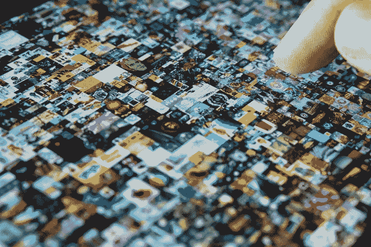

# 为什么有这么多的骗子在 NFT 空间和可以做些什么呢？

> 原文：<https://medium.com/coinmonks/why-are-there-so-many-scammers-in-the-nft-space-and-what-can-be-done-about-it-ca82c5b6784f?source=collection_archive---------16----------------------->

经验丰富的艺人和娱乐圈的全能皇室成员 WC Fields 曾经说过，“让一个笨蛋留着他的钱在道德上是错误的。”NFT 领域的许多经营者遵循他不太道德的建议，榨取投资者的血汗钱。在 NFTs 的西部总是有很多事情发生。随着投资者兴趣的升温，这种情况只会变得更加疯狂。NFT 骗局的盛行也是如此。

你听说了最近 Opensea 在推特上承认其平台上 NFT 诈骗的数量吗？事实证明，用他们懒惰的铸造工具铸造的 80%的 NFT 要么是假的，要么是直接的 NFT 骗局！

等一下。我刚刚骗了你。

嗯，算是吧。

该公司确实这么说了，但他们后来不得不澄清他们想说什么。那就是 80%因违反条款和条件而被强制删除的非功能性广告都是偷工减料。这是一个有趣的区别。因为它表明了一些事情:

1.  五分之四的懒造的 NFT 不是骗局。
2.  该公司在从其平台上消除 NFT 骗局方面表现积极。

然而，这并不能否认 NFT 行业特别容易受到诈骗的事实。但是为什么呢？我听到你问。

让我解释一下。

# 为什么 NFT 市场如此容易受到 NFT 骗局的影响？

就像蟑螂需要垃圾一样，骗子需要匿名才能茁壮成长。让我们思考一下 NFT 空间的定义特征:

1.  许多满怀希望的投资者希望发财。
2.  零规定。
3.  匿名已经成为行业标准。

NFT 骗局的温床，你同意吗？每当重大事件、趋势或突破发生时，就会有不道德的经营者通过让你放弃自己的东西来轻松赚钱。想想看:在 19 世纪下半叶，[的蛇油推销员](https://www.npr.org/sections/codeswitch/2013/08/26/215761377/a-history-of-snake-oil-salesmen#:~:text=The%20origins%20of%20snake%20oil%20as%20a%20derogatory,chronic%20pain%2C%20headaches%2C%20%22female%20complaints%22%20and%20kidney%20trouble.)通过向天真的购买者承诺神奇的治疗方法，却几乎不兑现承诺，骗取他们的钱财。

今天，历史似乎正在区块链重演。

有很多天花乱坠的男人(和女人)在宣传他们的 NFT 的价值即将飞上月球。没有任何实质内容。或者在许多情况下没有可行的产品。

让我们来看看 NFT 骗子是如何欺骗他们毫无戒心的受害者的。

# 经典的 NFT 骗局

## 地毯拉手

经典的 NFT 拉地毯骗局是这样运作的:为你的 NFT 项目制造疯狂的宣传，获得一批热情的投资者。向他们许下承诺，然后等到你的项目销售一空。一旦发生这种情况，你就要拔掉整个插头。删除一切，带着你所有投资者的现金消失。这可能是一个相当大的数目，因为这种类型的 NFT 骗局不涉及任何管理费用，而且你可以以 130 美元的价格出售 10，000 个 NFT。这相当于总额 130 万美元。对于几个月的炒作建设来说还不错。这正是最近发生在 NFT 诈骗案中的事情。

Frosties NFT 骗局涉及骗子承诺他们热切的追随者惊人的未来增长和发展，只有从他们脚下拉地毯一旦项目销售一空。两名诈骗犯 Ethan Nguyen 和 Andre Llacuna 随后据称关闭了整个项目。据称，他们随后通过几个加密钱包转移了约 110 万美元的收入，以掩盖他们的踪迹。我说据称是因为他们的案子还没有由法官审理。如果罪名成立，两人将面临长达 20 年的监禁。我敢肯定，这不是这两个 20 岁年轻人所期待的结果。但就像飞蛾扑火一样，在 NFT 自由交易大量快钱的诱惑太大了，这对夫妇无法抗拒。他们被烧伤了。

## 伪造

[艺术界的大师级伪造者花费多年时间练习他们的技艺。他们磨练和提高自己的技能，以至于可以欺骗专家，让他们认为自己的赝品是真品。或者他们被抓到，并获得了著名造假者的名声，他们的劣质艺术品变得](https://www.bbc.com/culture/article/20150601-the-secrets-of-the-master-forgers)[具有很高的价值和收藏价值。在 NFT 的世界里并非如此。](https://www.artandobject.com/news/art-talk-william-voelkle-collecting-forgeries)

NFT 伪造者所做的是超越真正的艺术家，将他们现实生活中的艺术品铸造成非艺术作品。接下来的问题就是用这些不可靠的艺术品冲击 NFT 市场，然后把它们冒充成自己的作品。这正是发生在荷兰的数字艺术家 Lois van Baarle 身上的事情。她最近在 Twitter 上报告了她发现自己的 132 件原创作品未经她允许就在 Opensea 上创作时的沮丧。另一个有趣的伪造 NFT 的案例是 NFT 的白痴文章，据称是班克斯写的，其中有一句非常讽刺的俏皮话“我不能相信你们这些白痴真的会买这个(咒骂语)”。这件作品最初以大约 68，000 美元的价格卖给了一个不走运的竞拍者。唯一的问题？作为一个神秘的街头艺术家风格的狡猾的巴布亚新几内亚，它只拥有新奇的地位。

当复制一幅稀有珍贵的 NFT 作品时，只需点击鼠标右键“另存为”，是什么阻止了今天的 NFT 伪造者将他人的作品冒充为自己的作品？简而言之，区块链。

像[加里·维](https://www.youtube.com/watch?v=-evR2A9qwD8)这样的专家喜欢 NFT 的原因是因为他们代表的技术创新。他们不仅通过他们在区块链的位置授予他们的所有者可核实的所有权。它们也是不可改变的。区块链永远不能被破解或编辑。这意味着当你拥有储存在区块链上的东西时，它将永远存在。

## 哄抬股价

泵和转储(或 P&D)骗局并非始于 NFTs。这个方案在 20 世纪 90 年代成为某些[臭名昭著的低价股交易者](https://moneyweek.com/512249/great-frauds-in-history-jordan-belfort-and-stratton-oakmont)的惯用伎俩，他们利用这个方案人为抬高自己所持股票的价值，然后将大量股票抛售给毫无戒心的买家。这些骗局允许欺诈者通过出售大量定价过高的股票迅速获得巨额利润，给他们不幸的投资者留下一文不值的股票。不幸的是，NFT 骗局在这个行业里很普遍。那是因为行业对影响者和炒作的依赖吗？还是因为系统中固有的匿名性使人们容易受到影响，因为很难#DYOR(自己做研究)？我会说这是两者的混合。

我们来讲一个最近的例子来说明这一点。

主要的嘻哈艺术家已经迅速跳上了 NFT 的现金列车。看起来有几个人一直在强迫粉丝购买毫无价值的数字代币。波斯特马龙与以太坊支持的硬币 Fyooz 合作，他的粉丝被迫购买 50 美元的加密货币 FYZNFT。这可以换来一次“NFT 事件”——一次和这个纹身累累的说唱歌手兼啤酒爱好者打啤酒乒乓的机会。唯一的警告？所谓的 NFT 名人世界乒乓球联赛总共花费了大约 1000 美元。硬币现在几乎已经过时了。《邮报》的人刚刚给了他的粉丝一个经典的 P&D·NFT 骗局吗？

# NFT 骗局是如何伤害主流收养的

YouTube 上有大量警告潜在投资者不要进行 NFT 交易的视频，标题有“NFT 骗局无处不在”、“非金融交易商的邪恶业务”、“NFT 泡沫已经破裂”。人们普遍认为，NFT 的水已经被假货、赝品和欺诈者搅得太乱了，诚实的投资者几乎不可能从假货中辨别出什么是真的，什么是有价值的。

尽管 NFT 正在获得越来越多的关注，但在门外汉中仍然有一个广泛流传的神话，即 NFT 充其量只是一个小骗子，在最坏的情况下也不过是定价过高的 jpegs。当你读到关于仅在 2021 年 NFT 的总销售额就超过 170 亿美元的报道时，你认为我们已经达到了采用这项技术的高峰是情有可原的。但是，如果我告诉你，我们仍然处于早期阶段，NFTs 的价值现在只是它的底价呢？你可能会问我这个假设的依据是什么。

当我们在虚拟世界——元宇宙——度过[醒着的大部分时间](https://www.businessinsider.com/metaverse-zuckerberg-facebook-virtual-world-leave-people-behind-2021-12)时，NFTs 将成为默认的数字世界货币。实物现金变得多余，元宇宙将转而依赖一种数字化、可信、可验证的货币，人们可以用它来解锁虚拟体验和购买数字资产。也就是说，每个人都将在任何事情上使用 NFTs。这意味着我们现在仍处于技术扩散的早期。

因此，当公众不断听到“NFT”和“骗局”这两个词出现在同一个句子中时，这就损害了广泛的采用。它也不能准确地代表技术的潜力，影响革命性的变化。这对早期用户来说是个好消息。

精明的投资者，比如 Twitch 的联合创始人贾斯汀·坎(Justin Kan ),会对[说，当谈到 NFT 产业将很快变得有多大时，相信所有的炒作](https://gamactica.com/portals/2022/03/15/justin-kan-says-gaming-nfts-will-be-bigger-than-twitch/)。这就是为什么在这个星球的其他地方变得混乱之前，在这个游戏中获得一些严肃的东西是对你最有利的。在做出精明的投资选择时，你需要明白的第一点是如何避免被骗。

# #DYOR

在购买之前，你需要尽可能地做自己的研究。还没到无所作为、错失良机的地步，但持怀疑态度是值得的。独一无二的加里·维[建议](https://twitter.com/garyvee/status/1430322818001121280?ref_src=twsrc%5Etfw%7Ctwcamp%5Etweetembed%7Ctwterm%5E1430322818001121280%7Ctwgr%5E%7Ctwcon%5Es1_&ref_url=https%3A%2F%2Fwww.one37pm.com%2Fnft%2Ffinance%2Fhow-to-properly-do-your-own-research-for-nfts-and-crypto)在扣动扳机之前，投入至少 50 个小时自己的时间研究 NFT。你需要关注的是 3 C。创造者是谁？社区里发生了什么？合同里有什么？

## **1。** **创建者**

理想情况下，你应该能够说出谁是 NFT 项目的幕后黑手。并且他们提供了一个为投资者创造价值的有信誉的、被证明的记录。如果你在做自己的研究时无法收集到这些信息，那么最好谨慎对待整个项目。查看一个项目的路线图可能会给你一个好主意，创作者想要把他们的 NFT 带到哪里，但是在一天结束的时候，它只不过是一个愿望。真正重要的是项目背后的人。本质上，你是在投资于他们和他们实现计划的能力。一个 NFT 项目最终成功与否取决于它的创造者推动它前进的能力。

## **2。** **社区**

了解已经在项目中投资的人的类型。他们愿意回答问题吗？他们看起来像深思熟虑的投资者还是投机者？查看该项目的 Discord，Twitter 或 YouTube 频道。一个好的 NFT 社区会分享对 NFT 项目、创作者以及未来发展潜力的积极看法。社区成员应该以透明的方式回答您关于 NFT 的任何问题。这样做是帮助你更好的好方法#DYOR。如果一个项目的 feed 的特点是需要来自社区的转发、投票和分享，那么最好远离它。你可能会发现，在短期内，最多只会有小小的收获。

## **3。** **合同**

如果你对 NFT 的创造者和社区感到满意，你可以更进一步，看看提供的实际智能合同赋予你什么权利。并非所有待售的 NFT 都会使用智能合约。简单地购买艺术品或可收藏的数字资产可以在没有智能合同的情况下发生。然而，一些非功能性交易可以赋予投资者实际的效用，比如参与特殊活动。在这些情况下，NFT 将附带一套特殊的条款和条件。找出 NFT 销售的实际条款和条件将有助于你决定是否有真正的价值。

# **最终想法**

NFT 骗局可能很普遍，但不是每个 NFT 都是骗局。事实上，它们比大多数其他资产更具合法性。与 NFTs 的交易不仅消除了第三方金融机构不必要的干预和监督，而且比留在银行供通胀侵蚀的资金更安全。它们不以物理形态存在，并不意味着它们具有无形的价值。此外，随着行业的发展和成熟，大量的非专利技术将会给他们的所有者带来现实世界的好处和经验。出于这些原因，我看好 NFT 及其彻底改变人类价值交换方式的能力。

这并不是说，你应该轻率地购买下一款受欢迎的 NFT，仅仅因为其他人似乎都在这么做。当你做自己的研究时，有一套你应该遵循的最佳实践，以最大限度地降低成为骗子的猎物的风险。它们如下:

1.  **永远不要投资超过你能承受的损失。将你辛苦赚来的少量现金进行长期投资。这将有助于抵消风险，但不是你的潜在投资回报率。**
2.  **耐心的蚱蜢。**在一个充斥着下一个非功能性测试大事件的市场中，学习耐心是关键。即使 NFT 的底价是向上移动的，也要慢慢来#DYOR。
3.  **持怀疑态度。**对一切都要半信半疑。分析信息，而不仅仅是来源。仅仅因为一个所谓的专家对某件事感兴趣，并告诉你去做同样的事情，并不能保证这将是一项有利可图的投资。
4.  **找到你的人。通过加入一个社区，你可以感受到围绕这个项目的讨论是积极的还是消极的。提出问题，寻求帮助，获取知识。对一个项目只有一点了解可能非常值得你花时间。**
5.  当心可怕的 FOMO 病。避免成为另一个害怕错失良机的投资者。这种苦恼可能是由几个因素造成的，如炒作、影响者、有限的可用性以及飙升的底价。如果你看到这些东西，请记住，它们都是经典的心理把戏，用来诱导人们进入一种恐惧状态，认为他们现在必须快速购买，以避免错过所有的利润！

如果做对了，非功能性测试就不是骗局。NFTs 所代表的技术突破为人类的前进创造了大量的价值。这只是一个为你找到合适的 NFT 项目的问题，它将创造价值并帮助你实现你的财务梦想。

 [## 你准备好迎接加密经济了吗？加密派

### 每次你打开新闻，阅读报纸，或者浏览你的推特，你很可能会看到一些故事…

www.thecryptopie.com](https://www.thecryptopie.com/) 

> 加入 Coinmonks [电报频道](https://t.me/coincodecap)和 [Youtube 频道](https://www.youtube.com/c/coinmonks/videos)了解加密交易和投资

# 另外，阅读

*   [Bookmap 评论](https://coincodecap.com/bookmap-review-2021-best-trading-software) | [美国 5 大最佳加密交易所](https://coincodecap.com/crypto-exchange-usa)
*   最佳加密[硬件钱包](/coinmonks/hardware-wallets-dfa1211730c6) | [Bitbns 评论](/coinmonks/bitbns-review-38256a07e161)
*   [新加坡十大最佳加密交易所](https://coincodecap.com/crypto-exchange-in-singapore) | [购买 AXS](https://coincodecap.com/buy-axs-token)
*   [红狗赌场评论](https://coincodecap.com/red-dog-casino-review) | [Swyftx 评论](https://coincodecap.com/swyftx-review) | [CoinGate 评论](https://coincodecap.com/coingate-review)
*   [投资印度的最佳密码](https://coincodecap.com/best-crypto-to-invest-in-india-in-2021)|[WazirX P2P](https://coincodecap.com/wazirx-p2p)|[Hi Dollar Review](https://coincodecap.com/hi-dollar-review)