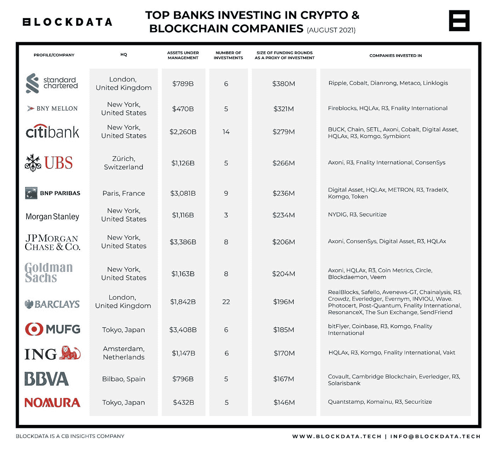

# 你为什么还袖手旁观？全世界都在投资加密技术。

> 原文：<https://medium.com/coinmonks/why-are-you-still-sitting-on-the-sideline-the-world-is-investing-in-crypto-ded7d97c98bc?source=collection_archive---------35----------------------->

投资 crypto 还来得及吗？如果你的投资组合中还没有数字资产，现在可能是时候考虑添加它们了。几年前，[加密货币](https://money.usnews.com/investing/cryptocurrency/slideshows/whats-the-best-cryptocurrency-to-buy)被主流媒体认为只不过是一种投机资产，但那个时代已经结束了。在过去两年中，该部门有了很大的发展，几个地区的项目得到了更多的利用。因此，可以有把握地认为，21 世纪 20 年代将是加密货币成为合法资产类别的第一个十年，那些不接受这一说法的人很可能会错失良机。原因如下:

# 原因 1:顶级银行正在投资加密技术

根据 Blockdata 在 2021 年的[报告，在考虑 AuM(管理的资产)时，全球最大的 100 家银行中，超过 50 家投资了加密货币和/或区块链相关的公司。直接或通过子公司。曾经严格反对比特币、其董事、董事长和首席执行官公开分享观点的银行现在被分配到了这个部门:](https://www.blockdata.tech/blog/general/banks-investing-blockchain-companies)

*   **巴克莱** : 19 项投资
*   花旗集团 : 9 项投资
*   **高盛** : 8 项投资
*   **摩根大通** : 7 项投资
*   **法国巴黎银行** : 6 项投资

# 原因 2:秘密监管正在慢慢形成

万亿美元的密码产业太大了，不能管理不当。因此，自然地，监管将开始激增，并遵循官僚政治/法律程序生效。白宫即将开始推动加密货币监管。尽管大多数国会议员反对这一破坏性行业，但这种情况发生转变只是时间问题(以及未来的选举)。今年 2 月，国会议员沃伦·戴维森(Warren Davidson)提出了[“保留你的硬币法案”](https://bitcoinmagazine.com/markets/us-congressman-warren-davidson-introduces-the-keep-your-coins-act)，该法案旨在保护投资者作为自我托管人和进行点对点交易的能力。

白宫的行政命令是朝着如何监管加密货币的正确方向迈出的重要一步。全球协调的方法，包括对加密资产监管的国际合作，将是经济上最佳的，并保护消费者免受非法活动和欺诈。

# 原因 3:这仍是一个新兴行业，有 10 倍的潜力

有不同的方法来解释为什么加密行业有上升的潜力，并且在未来十年加密资产的不对称回报是非常可行的:

*   比特币市值仍约为黄金的 1/10
*   DeFi 总市值仍然只占全球金融服务业 8 万亿美元市值的 1.6%(根据灰度 DeFi 报告)
*   90 年代的全球互联网用户采用率和 2016 年以来的加密用户增长之间有很高的相关性。Crypto 目前有 3 亿用户，互联网有 49.5 亿。随着世界年复一年地变得更加全球化和数字化，数字资产可能会引领这种变化。

传统金融将与区块链和基于密码的项目领导的数字、分散金融融合，因为它们提供了当前行业无法提供的解决方案。这是一个全天候的国际市场。它增加了资产类别的数字化和散户的参与，还有股票和零股交易。

# 你为什么还袖手旁观？

像 [Ark Investment 的](https://ark-invest.com/) Cathie Wood 这样的策略师看好加密货币，因为他们相信资产管理公司最终会将多达 5%的投资组合分配给加密货币。特斯拉、PayPal 和万事达卡等相关全球公司投资了该领域，其公司和最大的资本银行也做了同样的事情。此外，萨尔瓦多和列支敦士登等国政府正在接受和采纳这一市场。一切都表明，我们正在金融领域开始一场全球性的颠覆，那么我们为什么不置身其中呢？

*如果您是合格投资者，并想了解更多关于我们产品的信息，请* [*联系我们。*](https://robertventures.com/)

[*乔·罗伯特*](https://joerobert.com/) *现任罗伯特风险投资公司首席执行官，拥有超过 20 年的资产管理经验。自创办以来，乔已经为投资者和合伙人创造了可预见的两位数回报。Joe 已经投资了股权和代币的种子轮，以及比特币、以太坊和其他顶级加密货币的投资组合。*

> 加入 Coinmonks [电报频道](https://t.me/coincodecap)和 [Youtube 频道](https://www.youtube.com/c/coinmonks/videos)了解加密交易和投资

# 另外，阅读

*   [从 WazirX 切换到 CoinDCX 的 5 个理由](https://coincodecap.com/reasons-to-switch-from-wazirx-to-coindcx)
*   [Unocoin 评论](https://coincodecap.com/unocoin-review) | [最佳加密赌注硬币](https://coincodecap.com/best-crypto-staking-coins)
*   [如何使用 MetaMask Wallet 获得 KCC 地址？](https://coincodecap.com/kcc-address-metamask)
*   [如何获得自己的。XYZ 领域？](https://coincodecap.com/xyz-domain)
*   [最佳加密交换平台](https://coincodecap.com/best-crypto-swap-platforms) | [最佳加密交易所](https://coincodecap.com/crypto-exchange)
*   [购买比特币印度](/coinmonks/buy-bitcoin-in-india-feb50ddfef94) | [Pionex 评论](/coinmonks/pionex-review-exchange-with-crypto-trading-bot-1e459d0191ea) | [加密交易机器人](/coinmonks/crypto-trading-bot-c2ffce8acb2a)