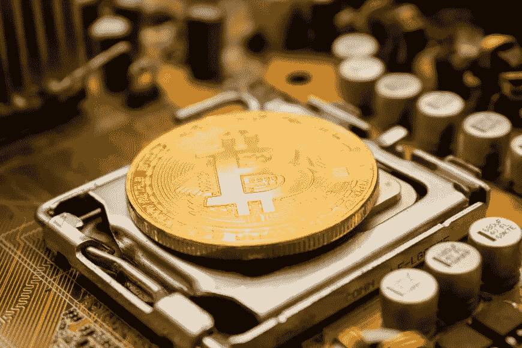

# 为什么其他亿万富翁不像迈克尔·j·塞勒(Michael J. Saylor)那样坦诚对待比特币？

> 原文：<https://medium.com/coinmonks/why-arent-other-billionaires-honest-about-bitcoin-like-michael-j-saylor-190dc7ba3b1e?source=collection_archive---------8----------------------->

对普通人的欺骗必须停止

Dmitry Demidko via unsplash

我们生活在通货膨胀的时代。

在我们最近的政治、金融和经济史上，我们的生活比以往任何时候都更受万能的美元极度膨胀的影响。