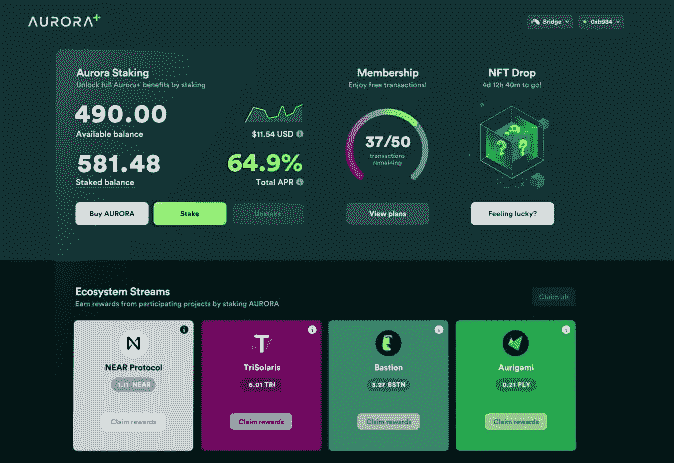

# 为什么 Aurora+即将被大规模采用

> 原文：<https://medium.com/coinmonks/why-aurora-is-primed-for-mass-adoption-fc24c5932b3b?source=collection_archive---------43----------------------->

对于那些知道去哪里寻找的人来说，密码的世界总是充满了阿尔法。我今天总结一下 Aurora+的发布，以及它对你的意义。

一、极光是什么？在其核心，[极光实验室](https://medium.com/u/7aee285e3685?source=post_page-----fc24c5932b3b--------------------------------)是在 [NEAR 团队](https://medium.com/u/1fbe737011b4?source=post_page-----fc24c5932b3b--------------------------------)上实现的 EVM，作为一个智能合同，允许以太坊以更低的费用和更快的交易扩展其经济，同时使用 NEAR 协议保证安全性。

[今天的公布视频](https://www.youtube.com/watch?v=TpWtYBdKD6s)华而不实，制作精良。让我想起了很多苹果的活动。宣布了一些功能的 Aurora 产品负责人马特·亨德森(Matt Henderson)甚至长得像蒂姆·库克(Tim Cook)。他甚至使用了史蒂夫·乔布斯的名言“哦，还有一件事”。

Matt Henderson, Head of Product at Aurora

所有这些都是有意为之的。苹果融合了最好的设计，UX/用户界面和技术。今天发布的 Aurora+的一切都是为了模仿苹果的感觉。Aurora 试图为大众设计 web3。还有什么地方比苹果这个 web2 之王更能激发灵感呢？

## 使用极光

要使用 Aurora+，你必须用你的电子邮件注册(不是一个粉丝)。不过，对于那些连接电子邮件的用户来说，前 50 笔交易对 Aurora+用户是免费的，只要他们在 Metamask 上以特定的方式添加帐户。用户界面看起来干净并且易于使用。这是我见过的最接近 web2 的东西。同样，这是苹果的感觉，但对于 Web3

Aurora+ Dashboard

将来，Aurora 团队计划为不同的用户添加具有不同特性的订阅层(非常像 web2)。因此，一个交易者可能会进行大量快速执行的交易，而其他人可能会进行少量交易，执行时间较长，但成本较低。我发现订阅模式真的很有趣；这使得大规模采用 Aurora 变得切实可行。订阅是每个人都知道的事情。不止如此，这是可以预见的。不再需要坐以待毙，等待天然气下降来做交易。

不仅如此，因为你已经预付了，你也不必担心实际的油价是多少。如果交易失败，再做一次。再一次。我要提醒一下，看看订阅层的成本和所提供的特性会很有意思。

我也很好奇，想看看他们是如何做到这一切，同时保持分散的。我的猜测是存在某种程度的集权。不过我想这也取决于你如何定义分散/集中。反正我跑题了。

## 加密中的 ETF

今天的公告还介绍了 Aurora staking(尽管对任何关注它的人来说这并不新鲜)。这个想法是，你可以通过下注 Aurora 来获得合作伙伴项目的代币，而不是下注 Aurora 并只获得 Aurora 代币。这是什么意思？如果看好 Aurora 生态系统，你可以购买 Aurora 的股份，并接触所有的合作项目。极光令牌成为一个“ETF”，提供对整个生态系统的暴露。*因此，你不再是一名“选股人”，而是成为了一名“ETF 投资者”。这对于任何希望接触 crypto 并相信 Aurora，但不相信自己能够挑选出赢家的被动投资者来说都是巨大的。这对于差异化令牌效用来说如何？*

哦，是的，他们还宣布空投极光代币给任何在第一周创建极光+账户的人(要快；根据我的计算，这将持续到 2022 年 5 月 24 日)。他们还向参与者发放免费的 NFT。

## 其他事情

最后，Aurora 团队声称他们已经解决了前端运行事务的问题；据他们称，他们的技术允许交易在执行前保持私密。如果这是真的，这将有望消除许多老练的交易者用来从使用区块链的每个人身上获利的优势。

他们还希望在极光级别引入单点 KYC，以消除对 dApps 的需求(我可能需要在这方面做一些研究——我的第一个猜测是零知识证明)。这里的想法是，一旦通过验证，用户将能够使用任何 dApp，而不需要一次又一次地 KYCing。dApps 将知道用户是他们所说的人，因为这些信息将会出现在区块链上。

总的来说，这个公告是相当拥挤的一些漂亮的改变游戏规则的发展，旨在使区块链更友好一点。不仅如此，Aurora 已经为大规模采用做好了准备。以太坊是连锁之王，奥罗拉是 EVM，以太坊的大部分价值很可能转移到奥罗拉身上。

这对阿尔法来说怎么样？

*在 Twitter 上找我*[*@ articlagoon*](https://twitter.com/articlagoon)*。请随时给我发信息，谈论加密，区块链和网络 3。如果你想要阿尔法，我会感谢订阅和关注。*

> 加入 Coinmonks [电报频道](https://t.me/coincodecap)和 [Youtube 频道](https://www.youtube.com/c/coinmonks/videos)了解加密交易和投资

# 另外，阅读

*   [3 商业评论](/coinmonks/3commas-review-an-excellent-crypto-trading-bot-2020-1313a58bec92) | [Pionex 评论](https://coincodecap.com/pionex-review-exchange-with-crypto-trading-bot) | [Coinrule 评论](/coinmonks/coinrule-review-2021-a-beginner-friendly-crypto-trading-bot-daf0504848ba)
*   [莱杰 vs n rave](/coinmonks/ledger-vs-ngrave-zero-7e40f0c1d694)|[莱杰 nano s vs x](/coinmonks/ledger-nano-s-vs-x-battery-hardware-price-storage-59a6663fe3b0) | [币安评论](/coinmonks/binance-review-ee10d3bf3b6e)
*   [Bybit Exchange 审查](/coinmonks/bybit-exchange-review-dbd570019b71) | [Bityard 审查](https://coincodecap.com/bityard-reivew) | [Jet-Bot 审查](https://coincodecap.com/jet-bot-review)
*   [3 commas vs crypto hopper](/coinmonks/3commas-vs-pionex-vs-cryptohopper-best-crypto-bot-6a98d2baa203)|[赚取加密利息](/coinmonks/earn-crypto-interest-b10b810fdda3)
*   最好的比特币[硬件钱包](/coinmonks/hardware-wallets-dfa1211730c6) | [BitBox02 回顾](/coinmonks/bitbox02-review-your-swiss-bitcoin-hardware-wallet-c36c88fff29)
*   [BlockFi vs 摄氏度](/coinmonks/blockfi-vs-celsius-vs-hodlnaut-8a1cc8c26630) | [Hodlnaut 审核](/coinmonks/hodlnaut-review-best-way-to-hodl-is-to-earn-interest-on-your-bitcoin-6658a8c19edf) | [KuCoin 审核](https://coincodecap.com/kucoin-review)