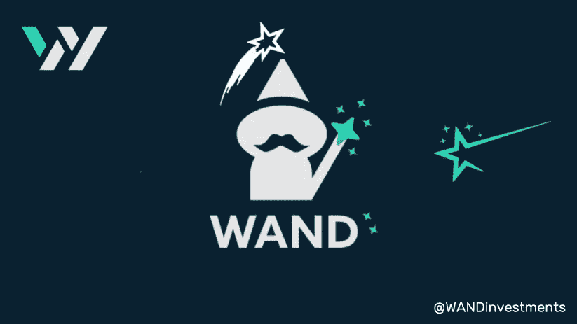

# 为什么指挥棒的回报会随着时间的推移而增加

> 原文：<https://medium.com/coinmonks/why-batons-rewards-increase-over-time-35421d17808a?source=collection_archive---------21----------------------->

朋友们好。

在我们的帖子和文章中，我们倾向于关注权杖，这是有道理的:毕竟，它是我们的门户令牌。不仅如此，随着时间的推移，这是一个不断增加的具有独特令牌组学的令牌，以支持稳定而显著的价格升值。DeFi 中的这一独特设计也将我们的权杖令牌置于权杖模型背后的令牌组学的核心。

但是我们不要忘记权杖的兄弟，指挥棒。

指挥棒是一个不太创新的象征，但我们认为它的重要性不亚于它。事实上，指挥棒也实现了真正的可持续性，尽管它是通过权杖以外的其他方式实现的，并且也受益于风险金库。

**指挥棒:通往实际被动收入的大门**

投资者需要出售手中的权杖来获利，而相比之下，仅仅持有权杖就足够了。接力棒持有者只需持有接力棒代币，就可以获得每周一次的 USDC 空投。这是如何工作的？

接力棒有自己的金库(金库有多个来源:投资者燃烧权杖获得接力棒，权杖金库的奖励，风险金库的奖励)，投入中低风险投资。一些例子:

*   使用稳定硬币和本地网络硬币的流动性配对(LP)耕作
*   蓝筹股代币 LP 农业
*   持有蓝筹股，通过自动再平衡来跑赢市场(可能会卖出顶部，战略性地买入底部)

LP 农场将提供一些奖励，以确保在牛市或熊市中，接力棒持有者每周都能享受 USDC 空投。在正常或牛市中，蓝筹股的价值有望增长，在大多数市场条件下，蓝筹股将显著推动空投。将会有一个自动平衡策略来跑赢市场。

因为 USDC 空投不会稀释或减少指挥棒财政部，他们是可持续的，我们可以预计，回报不会减少价值，除非暂时当市场是红色的。与权杖不同，指挥棒相当大程度上取决于市场状况。这使其成为中低风险而非低风险的投资选择。

**多种增长机制和不断增加的回报**

但不仅仅是减少，我们还想要更多的回报。为了实现这一目标，我们每周将从指挥棒财政部获得 45%的复合回报。这意味着最初的回报较低，但它们会随着时间的推移而增加，而不是保持稳定。这也将帮助我们更好地吸收金融冲击。

此外，我们预计，随着时间的推移，我们的风险国库(专门用于高风险、高回报投资的独立国库)的良好管理将允许更多资金转移到指挥棒国库，从而也显著增加指挥棒持有者的每周空投。

通过这两种机制，我们有效地为所有接力棒持有者提供了低风险、中等回报的被动收入来源。就像权杖一样，我们努力为我们的持有者提供一个有利的风险回报比。

SGMI！

> 加入 Coinmonks [电报频道](https://t.me/coincodecap)和 [Youtube 频道](https://www.youtube.com/c/coinmonks/videos)了解加密交易和投资

# 另外，阅读

*   [交易信号是什么？](https://coincodecap.com/trading-signal) | [Bitstamp vs 比特币基地](https://coincodecap.com/bitstamp-coinbase) | [买索拉纳](https://coincodecap.com/buy-solana)
*   [ProfitFarmers 回顾](https://coincodecap.com/profitfarmers-review) | [如何使用 Cornix Trading Bot](https://coincodecap.com/cornix-trading-bot)
*   [十大最佳加密货币博客](https://coincodecap.com/best-cryptocurrency-blogs) | [YouHodler 评论](https://coincodecap.com/youhodler-review)
*   [my constant Review](https://coincodecap.com/myconstant-review)|[8 款最佳摇摆交易机器人](https://coincodecap.com/best-swing-trading-bots)
*   [MXC 交易所评论](/coinmonks/mxc-exchange-review-3af0ec1cba8c) | [Pionex vs 币安](https://coincodecap.com/pionex-vs-binance) | [Pionex 套利机器人](https://coincodecap.com/pionex-arbitrage-bot)