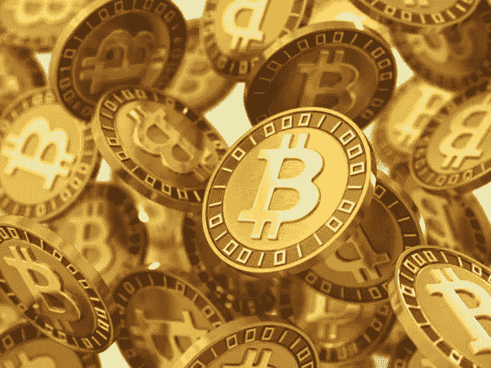
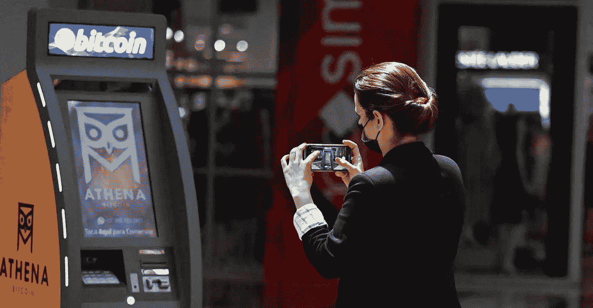
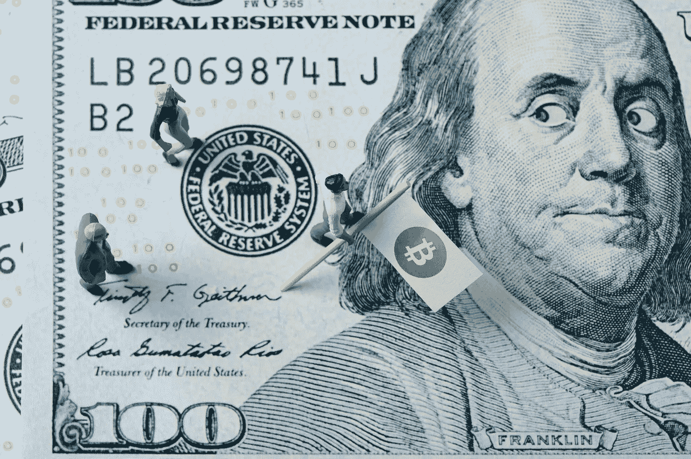

# 为什么比特币不能成为主要经济体的法定货币(2/2)

> 原文：<https://medium.com/coinmonks/why-bitcoin-cannot-be-legal-tender-for-major-economies-2-2-15e7a9565fbb?source=collection_archive---------35----------------------->

BlackJack3D | Credit: Getty Images/iStockphoto

[阅读第 1 部分](/p/9cb37b4280f)

本文是试图让比特币这样的去中心化货币成为美国、中国、德国、日本等主要经济体的法定货币的复杂性的第二部分

为了让比特币有可能成为主要经济体的法定货币，我将讨论分散货币、政府和其他国际组织需要采取的步骤/行动。

MARVIN RECINOS | Credit: AFP via Getty Images

让我们首先讨论我在第 1 部分中指出的需要解决的基本问题，以及一些试图解决问题的资产或实体的例子。

需要持续的互联网连接

*   尽管没有一种分散的货币可以脱离互联网而存在，但在这一领域最具创新性的是氦。通过让小型节能设备为氦区块链供电，氦制造并驱动了自己的去中心化互联网。

共识时代使当场购买商品变得不方便

*   索拉纳理论上是最快的区块链，可以处理“高达 50，000 TPS”。不可否认，索拉纳的交易费与以太网相比也很便宜。

必须由集中交易所提供资金，这对于一些个人来说可能是一个麻烦。

*   有弹出的比特币自动取款机，允许人们存入现金或刷借记卡/信用卡来购买货币。目前，这种购买 BTC 的方法很少，但像萨尔瓦多这样的地方遍布全国。

能源效率极其低下。

*   虽然有许多区块链和新共识方法，如股权证明，试图减少他们的碳足迹，我个人认为 Polkadot 是这一领域的领导者。其市值、公用事业、子网和 70，237 千瓦时的总能效使其极具吸引力。顺便说一下，70，237 千瓦时大约是 7 个美国家庭每年的总耗电量。

缺乏中央权威是政府和银行的问题

*   在央行和政府同意承担一些他们无法直接控制的事情之前，这个问题不可能真正得到 100%的解决。这可能是本节列出的所有问题中最难解决的问题。

有太多的货币可供选择，这使得企业和大公司很难接受支付。

*   Stripe 等支付处理器与许多不同的信用卡公司集成，如 Visa、Mastercard、Discover 等。一些其他类型的支付处理器可以承担相同的角色，只专注于集成加密支付。

hamzaturkkol | Credit: Getty Images/iStockphoto

现在让我们谈谈政府和国际组织的问题，以及让 BTC 成为主要经济体法定货币的一些行动。

世界银行给成员国发放硬贷款，比如美国，以及其他信誉良好的国家。

*   简而言之，世界银行需要承认比特币像美元或欧元一样是可靠的资本。然而，它不会。比特币被视为一种资产类别，而非货币。就个人而言，我同意比特币和其他分散资产是资产类别而不是货币，然而，它们对普通人来说比典型的资产类别有更多的效用。

如果一个国家真的让 BTC 或另一种分散资产成为法定货币，当他们将资产从一种资产转换为另一种资产时，他们将需要雇佣人员来对冲他们的资产。

*   公司、银行和政府要么需要雇佣更多的人来对冲汇率风险，要么需要建立一个全新的部门来分散货币风险。

如果一个国家真的让 BTC 或其他分散资产成为法定货币，那么整个市场将因数十亿美元的清算而崩溃。

*   对此合乎逻辑的反驳是，如果像中国这样的主要经济体真的卷入 BTC，那么市场容量和资本总额将会爆炸式增长，市场因清算而崩溃的风险也会降低。但是，如果政府可以像人们一样在同一个市场上玩，那么这将是一场灾难。我们不是在谈论政客，而是整个政府的清算。

我将以我对未来某个时刻会发生什么的看法来结束这些帖子，尽管我希望不会发生。

主要经济体出于税收目的，或者为了大公司可以购买的广告，将会想要监控其公民的消费习惯。他们可以很容易地做到这一点，通过制作一个集中的区块链，并将他们的本地资产(如美元)的供应与数字版本联系起来。很像 USDT 或 USDC，它们有 1:1 的储备资产支持(理论上)。他们最有可能通过从以太坊基金会、索拉纳基金会、Ripple Labs 等机构挖人来实现这一目标。

感谢阅读我的第一个真正的系列文章，我计划在未来做更多！

创