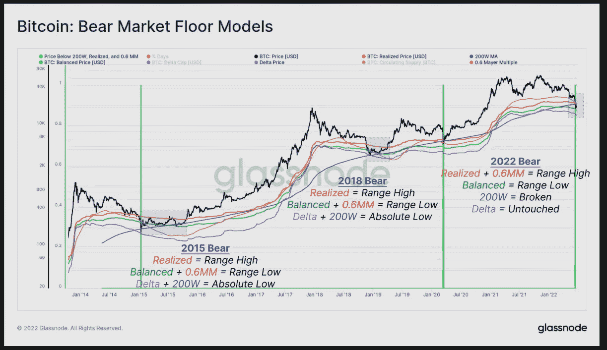

# 密码分析师解释了为什么比特币“现在非常便宜”

> 原文：<https://medium.com/coinmonks/why-bitcoin-is-incredibly-cheap-right-now-explains-by-crypto-analyst-91f7676dcb35?source=collection_archive---------25----------------------->

本周早些时候，Blockware Solutions 首席洞察分析师威尔·克莱门特(Will Clemente)仔细研究了比特币的价格。

Clemente 使用了区块链数据和情报平台 Glassnode 的数据，他的说法是基于 Mayer 倍数目前约为 0.6 的事实。迈耶倍数是由 Trace Mayer 创建的，“作为一种在历史背景下分析比特币价格的方法”，是“当前比特币价格与 200 天移动平均线的倍数。”换句话说，比特币目前的交易价格比其 200 天简单移动平均线(SMA)低 40%。

几乎所有比特币的宏观指标都处于历史低点，表明可能形成底部，“许多”比特币的交易水平甚至与之前历史水平的个位数百分点相当。"

关于上图所示的五件事:

*   “梅耶尔市盈率为 0.6 倍(23，380 美元)，相对于 200 天移动平均线有 40%的折扣，只有 3.4%的交易日收于或低于这一水平。”
*   “实际价格(22，500 美元)是硬币供应的总成本基础，通常在底部形成期间提供阻力。所有交易日中有 14%的收盘跌破。”
*   “200 周移动平均线(22，390 美元)，历史上该线在熊市最后投降阶段提供支撑，只有 1%的天数收于该线以下。”
*   “平衡价格(17，980 美元)说明了硬币日的破坏，反映了与硬币支付价值相匹配的市场价格，减去最终实现的价值。只有 3%的交易日收盘低于这一模型。”
*   “Delta 价格(15，750 美元)是实际价格和历史平均价格之间的差额。这一水平在收盘时从未被突破，并在熊市中提供了最终的支撑。

当前市场，现货价格(21，300 美元)低于已实现价格、0.6 Mayer 多波段和 200 周 MA，最近在 6 月 18 日冲高至 17，600 美元期间跌破平衡价格。"

它还指出，“在 4，360 个交易日中，只有 13 个交易日(0.2%)出现过类似情况，仅发生在 2015 年 1 月和 2020 年 3 月的两次事件中。”

点击这里关注我们了解更多故事[。](http://t.me/etellworld)

> 加入 Coinmonks [电报频道](https://t.me/coincodecap)和 [Youtube 频道](https://www.youtube.com/c/coinmonks/videos)了解加密交易和投资

# 另外，阅读

*   [Bookmap 点评](https://coincodecap.com/bookmap-review-2021-best-trading-software) | [美国 5 大最佳加密交易所](https://coincodecap.com/crypto-exchange-usa)
*   [如何在 FTX 交易所交易期货](https://coincodecap.com/ftx-futures-trading) | [OKEx vs 币安](https://coincodecap.com/okex-vs-binance)
*   [CoinLoan 评论](https://coincodecap.com/coinloan-review) | [YouHodler 评论](/coinmonks/youhodler-4-easy-ways-to-make-money-98969b9689f2) | [BlockFi 评论](https://coincodecap.com/blockfi-review)
*   [XT.COM 评论](https://coincodecap.com/profittradingapp-for-binance)币安评论 |
*   [SmithBot 评论](https://coincodecap.com/smithbot-review) | [4 款最佳免费开源交易机器人](https://coincodecap.com/free-open-source-trading-bots)
*   [比特币基地僵尸程序](/coinmonks/coinbase-bots-ac6359e897f3) | [AscendEX 审查](/coinmonks/ascendex-review-53e829cf75fa) | [OKEx 交易僵尸程序](/coinmonks/okex-trading-bots-234920f61e60)