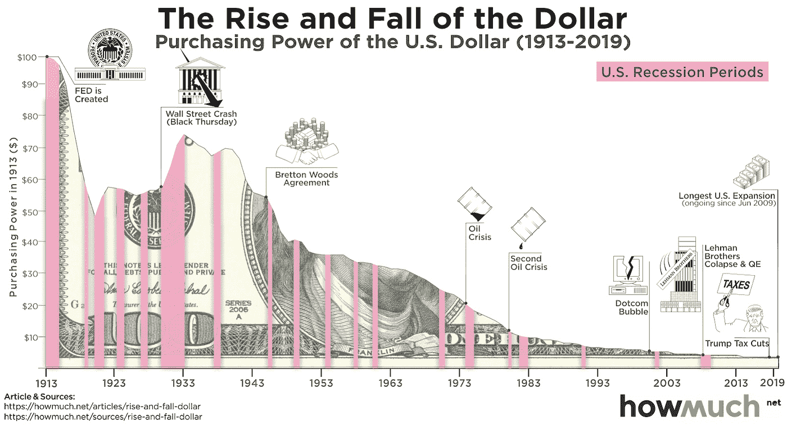

# 为什么比特币不仅仅是你所知道的钱

> 原文：<https://medium.com/coinmonks/why-bitcoin-is-more-than-the-money-you-know-c02d2e8ce5b8?source=collection_archive---------26----------------------->

想象一下，你努力工作了 30 年，为退休存钱，想着有一天你会真正实现你的财务目标，有时间和你爱的人在一起，去你喜欢的地方旅行。甚至可能买地盖房子——你终于成功了。但是等等，生活就那么简单吗？辛辛苦苦工作 30 年，牺牲所有的时间去做一天下来对你来说甚至都不重要的工作？不管你喜不喜欢，这就是大多数人的生活。因为运行世界的系统就是这样设计的。

现在，再想象一下，在成功地为你的退休储蓄了 30 年的所有钱之后，它突然消失了或者技术上失去了所有的价值。这正是上个世纪以来发生的事情。自 1913 年以来，美元的购买力大幅下降了 96.13%。这意味着，如果你的祖父在 1913 年为你存了 100 美元，你今天的价值只有 3.87 美元。当然，100 美元的纸币会是一样的，但是它的价值不再一样了。请看下面美元涨跌的直观表示。

为什么会这样？我们的货币价值或购买力是如何随着时间的推移而下降的？嗯，这只是因为政府或中央银行正在凭空印钱。当然，他们不会告诉你他们在印钞票，他们只是说‘量化宽松’或‘流动性注入’。换句话说，他们正在增加系统或市场的货币供应量。这影响到我们所有人，因为金钱不等于财富。价值产生了，财富也就创造了。现在，我不想用钱的定义来烦你，因为你已经知道什么是钱了。如果你不知道，你可以谷歌一下“钱是什么？”得到更好的答案。我想说的是，你为挣纸币付出的努力并不值得你所想的那样。这个系统就是这样设计的，只有少数控制它的人知道这一点。令人震惊的是，直到最近还没有人敢挑战这个系统。

14 年前，当我在印度东北部的一个遥远的村庄上 4 年级时，一种新的金钱观念建立了。当时我不知道银行是如何运作的，也不知道钱是什么。我很确定我所在州超过一半的人当时没有银行账户。(请在统计数字上纠正我)

在 2008 年经济衰退的余波中，在美国最大的银行之一雷曼兄弟倒闭整整 45 天后，一位名为中本聪的匿名人士发表了一份长达 9 页的白皮书《比特币:点对点电子现金系统》。这份 3219 字的白皮书解决了我们这个时代最大的问题之一，并成为 21 世纪最具创新性的技术。

我们今天所知道的比特币本身并不是货币，而是一种深深植根于文明本身的原则和哲学中的货币概念。我个人无法给你比特币的定义，因为我不知道，也没有必要知道。与此同时，需要在跨学科领域理解比特币的概念，从数学到经济学，从社会科学到地缘政治，从计算机科学到金融，从历史到现代文明等等。但是它的原理和哲学是什么，为什么比我们知道的钱多？

阅读中本聪的白皮书总是让我惊讶，在这个世界上，一项技术、一种哲学和一个故事是如何被如此美丽地发明和书写的。我每天都感谢上帝赐予我比特币，因为它实在是太美了，太神奇了。同样，我不会在这里解释中本聪白皮书中提出的比特币的技术逻辑，以免让你厌烦。如果您想阅读原始白皮书，您可以在互联网上找到它。

# 比特币给出的四个原则

# 一个分散的和真正的民主系统-

在一个国家的民主概念中，人民选举他们的领导人，领导人代表他们以他们的名义作出决定。在商业世界中，所有者或股东决定企业应该如何经营和运作。本质上，总有一个人或一群人控制着系统做出决策。就比特币而言，没人能改变源代码换句话说，没人能控制比特币的功能。没有政府，没有公司可以控制比特币。比特币没有总裁，也没有 CEO。它无法改变，也无法控制。要想影响比特币区块链，你必须成为一名矿工，并在网络上运行一个比特币节点。尽管如此，你不能随意作出任何改变，你只能提出建议，但这又要服从网络上运行节点的多数票。

网络的安全性也是如此，没有人能够攻击比特币，除非他们运行了大多数比特币节点，即网络上超过 50%的节点。从技术上讲，运行比特币网络上的大多数节点几乎是不可能的。为了简化运行比特币节点的矿工的工作，他们负责验证和确认比特币网络上发生的每一笔交易。

# 每个人都有平等的机会-

比特币作为一种技术和货币概念，不会基于国籍、种族、经济地位或任何东西歧视任何人。它为任何人和每个人提供了机会。没有人能阻止你使用它，因此它是未经许可的。换句话说，任何拥有智能手机或能上网的电脑的人都可以使用比特币。无论你是在非洲或印度的偏远村庄，还是生活在伦敦、纽约或香港的大都市，你都可以使用并拥有比特币，没人能阻止你。比特币是一种任何人都可以访问的分布式技术。这使得比特币成为一种自由技术，因为每个比特币用户都可以发送、接收和持有它。

# 一个开放且可验证的系统-

因为比特币是一种分布式技术，也是一个开放的、可验证的系统。任何想知道的人都可以看到比特币代码。比特币的源代码是公开的，公众可以获得。不仅源代码是公开的、公开的，它的交易账本也是公开的。换句话说，你可以追踪自创世纪区块以来比特币网络上的所有交易。您可以运行比特币节点来查看这一点，或者分析网络的链上活动。

比特币网络上的交易也可以验证。如果任何人试图通过发送他们不拥有的钱来腐蚀网络，或者操纵网络，系统不会接受。系统会在完成之前验证所有活动。

# 一个不可信的系统-

与需要信任才能运营的银行和政府机构不同，比特币不需要任何信任。比特币是一段存在于开源中的代码，它在预定义的条件下运行，任何人都可以知道，也没有人可以改变。因此，使用比特币不需要信任，因为没有人控制它。为了验证交易，不需要第三方来做这项工作，相反，比特币基于一种叫做工作证明的东西，在网络上运行节点的矿工使用时间戳网络来验证和确认交易。由于其不可信的本质，比特币提倡“不要相信，要验证”。

# 结论

因此，比特币不仅仅是一项技术，它是一种哲学和概念，无论你如何努力，甚至是政府，都无法阻止。世界现在能做的最好的事情就是拥抱这场技术革命，解决我们今天的大部分问题。忘记比特币可以带来的经济价值，专注于它的理念和原则，因为比特币不仅仅关乎金钱。世界现在比以往任何时候都更需要这项技术。

*嗨，如果我们是第一次见面，我是研究分析师阿库佐，你可以在推特上关注我* [*这里*](https://twitter.com/Kuzotelohe) *。也可以关注我的 Twitter 页面 PlanB Invest* [*这里*](https://twitter.com/story_bitcoin) *我在这里分享每日、每周对比特币和加密市场的分析，帮助你做出明智的决定。*

*注意:投资加密包含风险。提交人对资产损失没有责任。这只是为了教育和信息的目的，因此，它不应该被视为财务建议。请在投资前做好自己的研究。*

> 加入 Coinmonks [电报频道](https://t.me/coincodecap)和 [Youtube 频道](https://www.youtube.com/c/coinmonks/videos)了解加密交易和投资

# 另外，阅读

*   [AscendEx 保证金交易](https://coincodecap.com/ascendex-margin-trading) | [Bitfinex 赌注](https://coincodecap.com/bitfinex-staking) | [bitFlyer 点评](https://coincodecap.com/bitflyer-review)
*   [Bitget 回顾](https://coincodecap.com/bitget-review)|[Gemini vs block fi](https://coincodecap.com/gemini-vs-blockfi)cmd |[OKEx 期货交易](https://coincodecap.com/okex-futures-trading)
*   [AscendEx Staking](https://coincodecap.com/ascendex-staking)|[Bot Ocean Review](https://coincodecap.com/bot-ocean-review)|[最佳比特币钱包](https://coincodecap.com/bitcoin-wallets-india)
*   [霍比评论](https://coincodecap.com/huobi-review) | [OKEx 保证金交易](https://coincodecap.com/okex-margin-trading) | [期货交易](https://coincodecap.com/futures-trading)
*   [电网交易机器人](https://coincodecap.com/grid-trading) | [Cryptohopper 审核](/coinmonks/cryptohopper-review-a388ff5bae88) | [Bexplus 审核](https://coincodecap.com/bexplus-review)