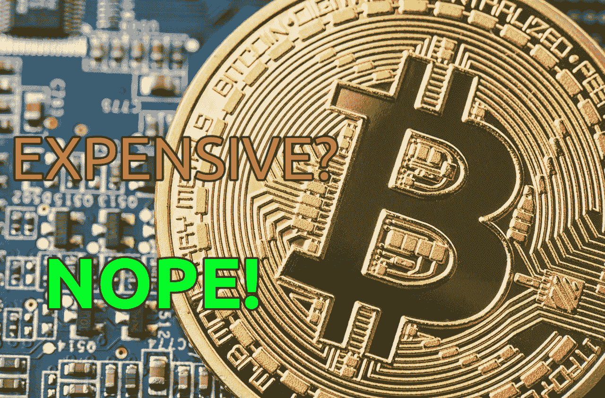
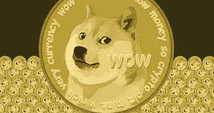
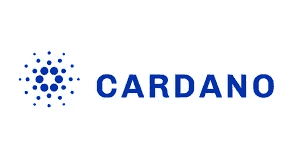
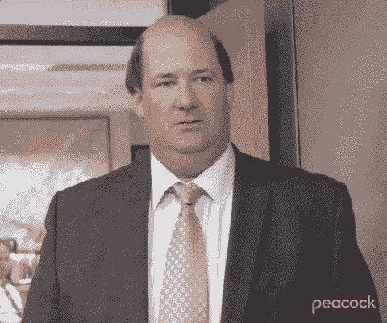

# 为什么比特币不贵

> 原文：<https://medium.com/coinmonks/why-bitcoin-is-not-expensive-b3ad13c185d0?source=collection_archive---------9----------------------->

有很多人想进入比特币(BTC)，但他们认为“我买不起比特币。太贵了”。然而，那些人没有意识到，阻碍他们的不是比特币的昂贵，而是他们所遭受的单位偏见。在撰写本文时，他们看着比特币每枚 44200 美元的价格，感到气馁和沮丧。然后，他们看看其他的垃圾，发现它们只值几美元甚至几美分。这种单位偏见让他们盲目地认为比特币很贵，而垃圾币很便宜。

但是，显然，他们不是从单位/供应成本的角度比较苹果，更不是从网络效果、网络安全等角度比较苹果。他们正在比较的加密货币。

在这篇文章中，我们将从单位偏差的角度来看如何更好地比较比特币和看起来便宜的加密货币。

**带出 Dogecoin**

遭受单位偏差的人最喜欢的硬币之一是 Dogecoin (DOGE)，在撰写本文时，它的价格是每枚 0.13 美元。与 Dogecoin 相比，比特币听起来贵得离谱，原因显而易见。但是，大多数人衡量货币的方式是错误的，因为他们只判断价格，而没有考虑货币的供应。

例如，在本文写作之时，有 18，994，155 比特币和 132，670，764，300 多格币在流通。

比特币的供应量上限为 2100 万，而 Dogecoin 的供应量是无限的，每年都会增加 50 亿 Dogecoin 的供应量。

这已经是一个很大的区别了。

因此，为了更接近地比较比特币和 Dogecoin 的价格，我们必须根据对方的供应量来衡量它们。

为什么？因为，现在，人们看到的是每只 BTC 44，200 美元和每只 DOGE 0.13 美元之间的巨大差价——或者说 BTC 与“插入看起来廉价的 cRaPtO 的名称”——这使得 BTC 看起来比 DOGE 贵 340，000 倍。

为了更好地了解 BTC 比多格贵多少，我们需要进行以下计算:

18，994，155(BTC 供应量)X 44，200 美元(每 BTC 价格)= $839，541，651，000 比特币市值

132，670，764，300(多吉供应量)X 0.13 美元(每多吉价格)= $17，247，199，359 多吉比特币市值

$839，541

基于这些计算，我们可以看到，当通过总督的供应来衡量 BTC 的价格时，BTC 的价格从每 BTC 44，200 美元下降到 908.02 美元，这表示 97.95%的下降。

同样，当用比特币的供应量来衡量 DOGE 的价格时，DOGE 的价格从每 DOGE 0.13 美元上涨到 6.33 美元，涨幅为 4769.23%。哇！

而且，现在我们可以看到，BTC 实际上比多格贵 143.44 倍，而不是 34 万倍。

仍然更贵，但有很好的理由，我将在接下来的文章中介绍，所以，请确保您跟踪我，以了解它何时出现。

因此，很明显，当衡量这两种加密货币的相互供应量时，比特币便宜得多，而 Dogecoin 贵得多。

但是你会说“是啊，但是 Dogecoin 只是一个迷因币，是作为一个笑话被创造出来的！拿一个正经的加密货币来比比特币有多贵！”。

是的，这是真的，我同意你的观点，但这是一个很好的起点，考虑到许多人购买 Dogecoin 是因为它看起来“便宜”，因为它的每枚硬币的价格，而没有意识到当与比特币进行适当的比较时，它实际上更贵。

下一个上场的是卡尔达诺

让我们再举一个例子，这一次，使用 Cardano (ADA)，这是一种[股权证明](/@marius.c.ciubotariu/why-proof-of-work-pow-matters-af00b73f1be1)加密货币，据我所知，它背后有很多炒作，因为人们希望它有很多效用，而且它看起来也比比特币“便宜”。

下面，我们将进行与之前相同的计算，但这一次，是针对 BTC 对艾达的计算。

在撰写本文时，ADA 的价格是每枚硬币 1.13 美元，供应量是 450 亿的最大供应量中的 33，726，239，240。

33，726，239，240(ADA 的供应量)X 每个 ADA 1.13 美元= 38，110，650，341.2 卡达诺

市值 839，541，651.00 美元(比特币市值)÷ 33，726，239，240(ADA 的供应量)= 2.49 美元每个 ADA

38，110，650，38

基于上述计算，我们可以看到，当用 ADA 的供应量来衡量 BTC 的价格时，每 BTC 的价格从 44，200 美元下降到 2，006.44 美元，这表示下降了 95.46%。

同样，当以 BTC 的供应量来衡量 ADA 的价格时，每份 ADA 的价格从 1.13 美元上涨到 2.49 美元，涨幅为 120.35%。又来了。哇！

同样，乍一看，根据每个 BTC 44 200 美元和每个美国反倾销协定 1.13 美元的价格，BTC 似乎比美国反倾销协定贵 3 115.04 倍。

但是，从上面的计算中我们可以看到，实际上，BTC 比 ADA 贵 805.80 倍，而不是 3115.04 倍。

与比特币相比，你可以用所有看起来“便宜”的垃圾来做这个练习。

事实是，它们看起来很便宜，因为单位偏差，这意味着人们更喜欢购买一件东西的整个单位，而不是它的一部分。

更清楚地说，这意味着遭受单位偏见的人更倾向于:

-购买 1000 多吉，而不是购买 0.00294117 BTC(294117 萨特)，按照 BTC 和多吉的当前价格，将花费 130 美元。

-或者购买 100 个 ADA，而不是购买 0.00255656 个 0.00255656 个 sat)，按照 BTC 和 ADA 的当前价格，这将花费 113 美元。

我认为，这种单位偏好也受到了法定货币心态的影响，在这种心态下，人们将银行账户中拥有更多货币单位与拥有更大购买力混为一谈。

这是真的，但在一定程度上，因为，通常，他们忽略了货币的大规模贬值，首先。

举例来说，假设你每年挣 10 万美元，你刚刚获得了 5%的加薪。耶！干得好！

现在，你每年挣 105，000 美元，你感觉更富有了，因为你的银行账户里会有更多的货币单位。

但是，现在，报告的通货膨胀率是 7.9%，尽管你加薪 5%，但由于通货膨胀、货币贬值或货币购买力下降，你的 10.5 万美元将使你购买的产品、服务和资产减少 2.9%。

现在，这仅仅是基于报道的通货膨胀率，当你去支付产品，服务和资产时，这与你将经历的真实通货膨胀率相差甚远。

套用迈克尔·塞勒的话来说，通货膨胀是一个向量，这意味着你会经历与其他人不同的通货膨胀率，因为你想买的东西不同。

如果你住在父母家的地下室，玩电子游戏，看网飞，吃达美乐披萨，抽大麻，你所经历的通货膨胀率与一个三口之家的人有很大的不同，他们支付房屋租金，支付食品和公用事业费用，支付儿童保育费用，支付人寿保险，开车去上班，并计划买房子。

另一方将受到房租、食品和能源、儿童保育、医疗保健、燃料和房地产价格上涨的冲击。

根据最新的数据，这个人预计通货膨胀率至少为 25%，这意味着他们可能比去年增加 20%，但由于通货膨胀，他们仍然能够支付更少的费用。

所以，专注于拥有更多的菲亚特并不意味着你的购买力会增加，因为整个事情比“哦！我加薪了！我现在赚的钱更多了。”

这一切都很好，很酷，但是，如果你的购买力下降的百分比比你得到的增长的百分比多，那么这不是你认为的胜利。

是的，在这样一个通货膨胀的环境下，加薪总比不加薪好，这绝对是真的，但我的意思是，你需要看到更大的画面。

所以，总结一下，我希望你现在能更好地理解，当你把一个 cRaPtO 和比特币比较时，你如何衡量它有多“便宜”。

当然，还有更多的内容，但我会在后面的文章中介绍，所以，请确保您关注我，在它发布时得到通知，因为我相信您也会从中获得价值。

如果你喜欢这本书，并从中获得了价值，那么在比较比特币和垃圾币时，一定要与可能也会遭受单位偏见的朋友和家人分享。

此外，请在下面给我留下您的反馈和任何反驳意见。

接受建设性的批评是很好的，因为它会让我成为一个更好的作家，为你提供更好的内容。

感谢你阅读🧡

> 加入 Coinmonks [电报频道](https://t.me/coincodecap)和 [Youtube 频道](https://www.youtube.com/c/coinmonks/videos)了解加密交易和投资

# 另外，阅读

*   [红狗赌场评论](https://coincodecap.com/red-dog-casino-review) | [Swyftx 评论](https://coincodecap.com/swyftx-review) | [CoinGate 评论](https://coincodecap.com/coingate-review)
*   [Bookmap 评论](https://coincodecap.com/bookmap-review-2021-best-trading-software) | [美国 5 大最佳加密交易所](https://coincodecap.com/crypto-exchange-usa)
*   [如何在 FTX 交易所交易期货](https://coincodecap.com/ftx-futures-trading) | [OKEx vs 币安](https://coincodecap.com/okex-vs-binance)
*   [CoinLoan 评论](https://coincodecap.com/coinloan-review) | [YouHodler 评论](/coinmonks/youhodler-4-easy-ways-to-make-money-98969b9689f2) | [BlockFi 评论](https://coincodecap.com/blockfi-review)
*   [XT.COM 评论](https://coincodecap.com/profittradingapp-for-binance)币安评论 |
*   [SmithBot 评论](https://coincodecap.com/smithbot-review) | [4 款最佳免费开源交易机器人](https://coincodecap.com/free-open-source-trading-bots)