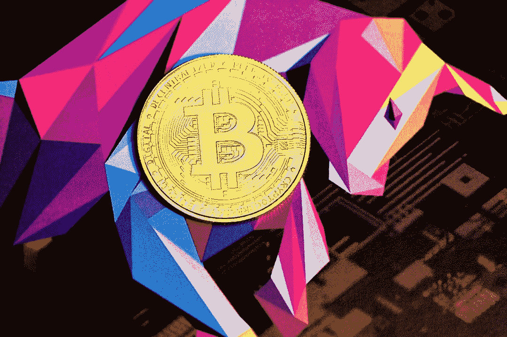
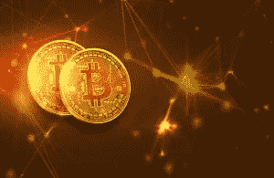
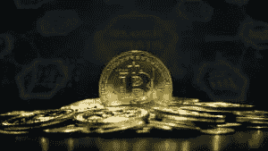
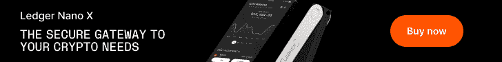

# 为什么比特币是正确的加密货币？

> 原文：<https://medium.com/coinmonks/why-bitcoin-is-the-right-cryptocurrency-37ee14a642c4?source=collection_archive---------75----------------------->

很多人从来不相信比特币会发展成现在这样的畸形。大多数机构买家批评它是一种抽象资产，不会产生任何重大价值。其他人甚至发誓在任何情况下都不参与 crypto。短短十年后，比特币成为全球政府、行业领袖、企业和零售商最认可的虚拟资产。除了比特币面临来自不同加密货币和权威机构的越来越大的压力，它可能仍然是最主要的加密技术。它超越了所有资产类别，连同贵金属，成为可能是最有益的资产。

## **那么，为什么比特币在加密业务中变得越来越强大？**

这里让我们讨论一下为什么[比特币](https://cryptonewsmart.com/category/bitcoin/)是合适的加密货币的主要原因。

期权现金的概念早在比特币之前就存在了。然而，创新者没有合适的基础设施来将这些想法变成现实。比特币带来了区块链的专有技术，这使它能够被称为一种去中心化的数字货币。这变成了一个里程碑式的周年纪念，之前没有人完成过，使比特币成为加密行业的先驱。然而，其他加密货币花了一点时间来标记这项业务。这给了比特币足够的空间来占领巨大的市场份额，远远领先于其竞争对手。比特币的区块链一直在实现其创始人的愿景:无缝、轻松、价格合理的交易。这一声誉在推动比特币在全球范围内被政府、机构投资者、机构和个人广泛采用方面发挥了重要作用。由于贸易的先锋派，一些加密货币已经适应了比特币的平台来开放和运行他们的操作。许多加密货币是比特币的克隆品，有望成为更轻便、更高效的类型。

**比特币的进步**

尽管事实上，他们观察比特币的进步，严重依赖于它的成功。这就是为什么每当比特币的成本成功获胜时，它们还会定期下跌。比特币的地位[作为加密产业](https://cryptonewsmart.com/)的先锋派使得它在短时间内迅速传播开来。它的成功甚至说服了土著批评家立即加入进来，聚集了大量的比特币资产。当个人意识到比特币还可以充当外币交易时，比特币的价格飙升。一些团体和小团体将比特币纳入他们的价格计划，接受它作为商品和服务的支付。

**比特币激发了强大的企业机会。**

加密交易所像这个应用程序，使美国人能够在国际上交换加密货币和技术资金。比特币激发了一个世界[的加密货币产业](https://cryptonewsmart.com/)，现在价值超过三万亿，占整个加密市场的近一半。这些储备的很大一部分以平均的方式由世界各地的婴儿群体和个人持有。无论如何，[比特币](https://cryptonewsmart.com/)在国际市场上拥有巨大的交易量。这些属性使得比特币比其他加密货币更容易被大众接受。美国人已经适应比特币十多年了，有足够的时间在全球范围内吸引、捕捉和保留比特币。它已经在核心部门发展了一个强大且不断增长的忠诚追随者群体，包括账户、技术、电子商务、班车、健身和零售。比特币的过高价值和促进轻松、快速、廉价的可怕边界事务接受的能力使其成为最成功的加密货币。买家同意比特币，因为苹果公司的资产外汇加密是他们研究市场的依据。无论利率如何波动，比特币自诞生以来一直保持着加密交易的领先地位。尽管比特币面临着其他加密货币的激烈竞争，但它具有更强的攻击性，可能会在几年内让其竞争对手退缩，直至垮台。

最终想法

你可能只是想买一些加密货币，存起来以备将来潜在的增长。或者你可能想成为一个更积极的投资者，更经常地购买或出售密码，以最大限度地提高利润和收入。不管怎样，你必须有一个计划和策略。你喜欢这篇文章吗？请分享谢谢…

精选自:[https://techbullion . com/why-bit coin-the-right-crypto currency/](https://techbullion.com/why-bitcoin-is-the-right-cryptocurrency/)

由弗朗切斯科·拉罗卡为 [Cryptonewsmart](http://www.cryptonewsmart.com) 团队

**我不是财务顾问* *

* *此贴包含的附属链接将帮助我创建新内容，无需为您支付额外费用* *

> 加入 Coinmonks [电报频道](https://t.me/coincodecap)和 [Youtube 频道](https://www.youtube.com/c/coinmonks/videos)了解加密交易和投资

# 另外，阅读

*   [OKEx vs KuCoin](https://coincodecap.com/okex-kucoin) | [摄氏替代度](https://coincodecap.com/celsius-alternatives) | [如何购买 VeChain](https://coincodecap.com/buy-vechain)
*   [币安期货交易](https://coincodecap.com/binance-futures-trading)|[3 commas vs Mudrex vs eToro](https://coincodecap.com/mudrex-3commas-etoro)
*   [如何购买 Monero](https://coincodecap.com/buy-monero) | [IDEX 评论](https://coincodecap.com/idex-review) | [BitKan 交易机器人](https://coincodecap.com/bitkan-trading-bot)
*   [CoinDCX 评论](/coinmonks/coindcx-review-8444db3621a2) | [加密保证金交易交易所](https://coincodecap.com/crypto-margin-trading-exchanges)
*   [红狗赌场评论](https://coincodecap.com/red-dog-casino-review) | [Swyftx 评论](https://coincodecap.com/swyftx-review) | [CoinGate 评论](https://coincodecap.com/coingate-review)