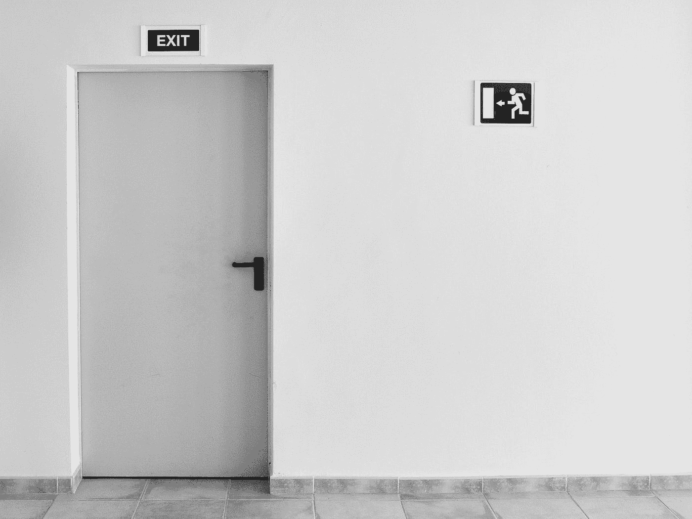
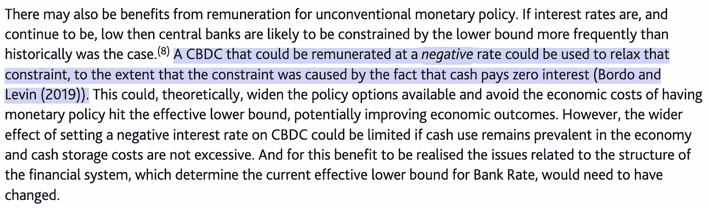
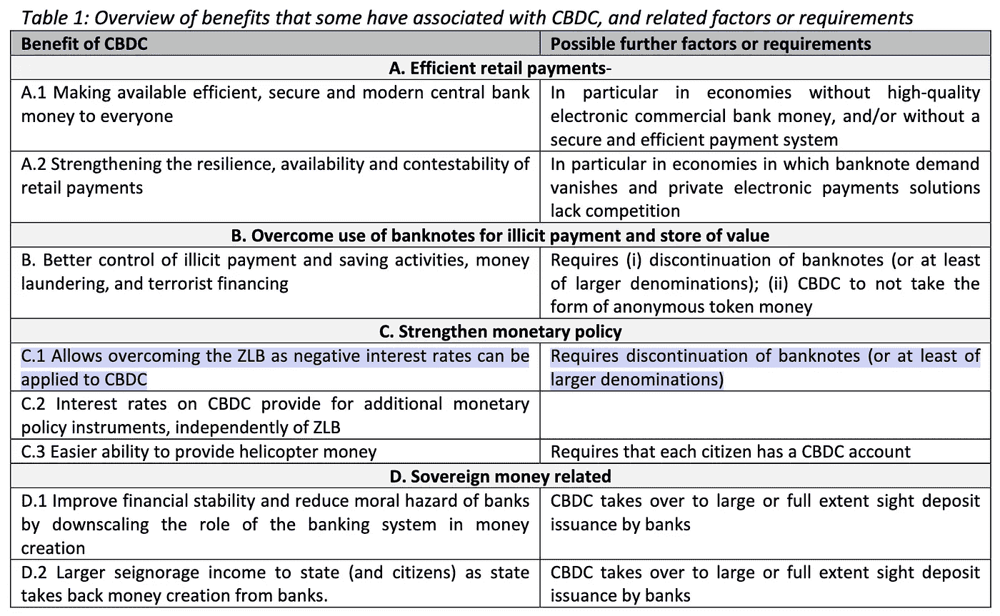
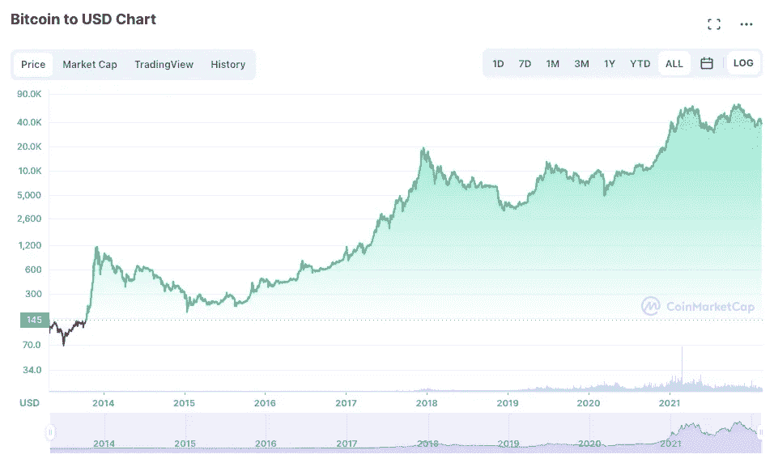

# 为什么比特币很重要

> 原文：<https://medium.com/coinmonks/why-bitcoin-matters-f7dbeb70b725?source=collection_archive---------8----------------------->

## 经济学、政府和比特币入门指南

Photo by [Michael Jasmund](https://unsplash.com/@jasmund?utm_source=medium&utm_medium=referral) on [Unsplash](https://unsplash.com?utm_source=medium&utm_medium=referral)

经济学很无聊。它充满了复杂的术语，晦涩的参考资料和似乎生活在不同现实中的人。然而，经济学是我们社会的核心——它定义了人类协作的规则。这是一件大事。

比特币很讨厌。它充满了复杂的术语，晦涩的参考文献和激光眼的人互相喊叫。然而，许多人说这是金钱的未来——它能解决一切问题。这是一种大胆的说法。

我们为什么要关心这些？难道没有更紧迫的问题吗，比如，我不知道。气候变化？反正比特币消耗的能源不是和阿根廷一样多吗？还是挪威？不管怎样，那都不是好事。

通常情况下，事情没那么简单。比特币很可能有机会修复许多东西，但要决定是否如此，我们首先需要了解是什么坏了。要做到这一点，除了研究当前的经济运行，别无他法。哦亲爱的。

这篇文章尽可能简单明了地阐述了经济、政府和比特币之间的动态关系。我们将涉及中央银行、通货膨胀、货币供应、数字货币等话题，并将其与比特币联系起来。到最后，你会更好地理解很多比特币是怎么回事。我向你保证,*真的很重要。*

# 放弃

我不是经济学家，以下是我多年来个人研究的结果。然而，我将从头到尾提供资料，并从本质上把它们串在一起以支持我的结论。你是否同意他们取决于你。

那我为什么要这么做呢？

*   提高对我关心的话题的认识；
*   给比特币带来不同的启示；
*   来构建我自己的思想。

最后，这不是财务建议。我不是在告诉你买比特币——我只是在解释为什么它的存在如此重要。请在投资前做好尽职调查。

# 所以，中央银行

根据 [Investopedia](https://www.investopedia.com/terms/c/centralbank.asp) 的说法，中央银行是:

> 金融机构，负责监督一个国家或国家集团的货币体系和政策，调节其货币供应，并制定利率

Photo by [Camila Quintero Franco](https://unsplash.com/@quinterocamilaa?utm_source=medium&utm_medium=referral) on [Unsplash](https://unsplash.com?utm_source=medium&utm_medium=referral)

我知道。请原谅我。

中央银行的例子有欧洲中央银行(ECB)和美国美联储(美联储)。另一种描述他们所做的事情的方式是，他们在适度通胀(通常在 2%左右)的情况下保持价格稳定。

什么是[通货膨胀](https://www.investopedia.com/terms/i/inflation.asp)？这是一种机制，你的钱的购买力会随着时间的推移而下降。换句话说，就是当同样的钱让你明天买的东西比昨天少，因为价格上涨了。

> 通货膨胀意味着政府债务的实际价值会随着时间的推移而下降。

政府喜欢通货膨胀有几个原因。一个是它鼓励消费和投资——如果你知道你的钱正在随着时间的推移而贬值，今天花掉它比明天更好，或者让它发挥作用以便产生一些回报。

在这种情况下，通胀有助于确保货币在经济中持续流通，提振消费需求，推动经济增长。

政府喜欢通货膨胀的另一个原因是，大多数政府严重依赖债务来支持各种政策和计划，如基础设施项目(学校、道路、医院等)。).税收不能涵盖一切，所以政府[借钱](https://www.britannica.com/topic/government-budget/Government-borrowing)来增加他们的预算。

通货膨胀意味着政府债务的实际价值会随着时间的推移而下降。当他们不得不偿还时，他们所欠的钱比他们一开始花掉时更不值钱，这使得偿还更容易(这通常是通过更多的债务来完成的)。

中央银行主要通过调节 T4 货币供应量来控制通货膨胀。基本逻辑是，经济中流通的货币越多，通胀率就越有可能上升。相反，流通的货币越少，通货膨胀就越有可能降低。

例如，美联储通过改变美国经济中流通的美元数量来控制货币供应。怎么会？通过设定利率和存款准备金率，以及印钞票。

Photo by [Alexey Ruban](https://unsplash.com/@intelligenciya?utm_source=medium&utm_medium=referral) on [Unsplash](https://unsplash.com?utm_source=medium&utm_medium=referral)

准备金要求是商业银行(如你的银行)必须在金库中持有的存款百分比。在欧盟，这个值目前是 1%——如果你今天在一家法国银行存 1000€，它必须在金库里存 10€，并能借出其余的。

如果央行想减少货币供应量，它可以提高存款准备金率，这意味着商业银行放贷的资金减少。相反，降低存款准备金率会让银行放贷更多，从而增加货币供应量。

另一种控制货币供应的方法是设定利率，即你的银行可以从中央银行借钱的利率。反过来，这影响了你的银行可以提供给你从 T2 借钱的利率。

当利率较低时，人们和公司会受到激励去更多地借贷和消费，因为这样做实际上更便宜。当利率高的时候，他们会借更少的钱。

基本上:

*   低利率=更多的货币流通
*   高利率=流通货币减少

中央银行控制货币供应的第三种方式是通过购买或出售[政府证券](https://www.investopedia.com/terms/g/governmentsecurity.asp)——本质上是政府发行的债务，用于资助我们之前提到的事情(例如基础设施项目)。

如果美联储想增加货币供应量，它可以从商业银行购买证券，这样商业银行就有更多的美元可以放贷。当它想减少货币供应量时，它会卖出这些证券。

当中央银行想要增加货币供应量时，他们需要钱来购买这些证券。直到 2010 年，它们大多是利用自己的外汇储备来这么做，但 2008 年的金融危机改变了一切。

# 输入货币印刷

当危机来袭时，美联储首先使用其传统工具试图修复经济。但是到了 2008 年 12 月，情况并没有改善——利率已经接近于零，不能再降了(我将回到这个话题),需要其他的解决方案。

快速增加货币供应的一个方法是用印刷的货币购买证券(政府债券)——这个过程也被称为量化宽松，或 QE。央行本质上是通过凭空创造货币来购买证券，而不是动用储备。

他们可以这样做，因为今天的货币没有任何支撑。直到 1971 年，许多货币都与美元挂钩，而美元又由黄金支撑。这是美国最终终止的 1944 年布雷顿森林协定的结果。

> 多年的低利率和 QE 并非没有后果。

就这样，世界从金本位制转变为 T2 的“法定”标准，即货币不是由像黄金这样的商品支持，而是由中央银行发行并由政府支持(货币由 T4 法令支持，本质上是“法定”的同义词)。

央行可以很容易地创造货币，因为大部分货币已经数字化，增加或减少资产负债表(列出资产的文件)基本上是通过改变数据库中的数字来完成的。

Photo by [Carrie Allen](https://unsplash.com/@carrieallenllc?utm_source=medium&utm_medium=referral) on [Unsplash](https://unsplash.com?utm_source=medium&utm_medium=referral)

由于 2008 年危机的性质，美联储不得不这样做——商业银行互不信任，因为有毒资产无处不在，所以它不得不注入资金并购买这些资产来维持运营，直到信心恢复。

QE 在当时并不是一个新事物(日本银行在 2001 年就已经这么做了)，但是中央银行不愿意使用它，因为它非常规的性质，不可预测的结果和它造成的高通胀风险。

但现在大多数主要央行已经开始这么做了，[他们似乎无法停止](https://en.wikipedia.org/wiki/Quantitative_easing#History)。2008 年危机后，美联储一直使用 QE 直到 2014 年，并在 2020 年 3 月因疫情而恢复该计划。自 2009 年以来，欧洲央行从未真正停下脚步。

从 2009 年到 2012 年，英国银行(BoE，英国中央银行)运行了一个 [QE 计划](https://www.theguardian.com/business/2020/jun/18/bank-of-england-continues-money-printing-path-financial-crash-2009-qe)，2016 年又运行了一个(因为英国退出欧盟)，2020 年又运行了一个(因为疫情)。在所有这些地方，利率多年来一直接近于零，甚至是微负。

好了，在我们继续之前，是时候快速回顾一下了:

*   通货膨胀是货币随着时间的推移而贬值。
*   政府喜欢通货膨胀，因为它鼓励消费，促进经济增长，并使他们的债务更可持续。
*   中央银行通过调节货币供应来控制通货膨胀。

中央银行调节货币供应的主要方式有:

*   通过设定准备金要求；
*   通过设定利率；和
*   通过买卖政府证券，主要是通过印钞(QE)。

更多的钱会加剧通货膨胀，而更少的钱通常会降低通货膨胀。

设定利率和 QE 是目前控制货币供应和通货膨胀的主要手段。在许多国家，利率已经非常低了，所以中央银行严重依赖 QE 来扩大货币供应。

但多年的低利率和 QE 并非没有后果。低利率意味着人们不能通过持有现金来储蓄(想想你的银行目前提供给你的利率，并将其与通货膨胀进行比较)，所以他们寻找替代品。

这里明显的“赢家”是股票、大宗商品(原材料)和房地产等实物资产，它们的价格已经飙升。例如，在英国，现在一套房子的价格是平均年薪的 8 倍，而在 20 世纪 90 年代是 4 倍。

这种环境主要[有利于高收入家庭](https://www.lynalden.com/qe-and-inequality/)(他们已经获得或拥有这些资产)，同时有助于提高低收入家庭的准入门槛。

低利率和 QE 也鼓励借债，因为前者使借债成本降低，而后者为放贷提供资金。为了使这些高水平的债务可持续，利率必须保持在更低的水平，这将鼓励更多的债务，形成恶性循环。

在这种背景下，加息或暂停 QE 计划可能会导致支付违约，并通过连锁效应引发金融危机——这是美联储在 2018 年开始加息时发现自己处于的情况。它打算在 2019 年再次这样做，但最终被迫[取消](https://www.marketwatch.com/story/investors-are-grappling-with-how-limited-the-next-set-of-fed-interest-rate-increases-may-be-11638914667)。

Photo by [Leio McLaren](https://unsplash.com/@leio?utm_source=medium&utm_medium=referral) on [Unsplash](https://unsplash.com?utm_source=medium&utm_medium=referral)

QE 的另一个潜在副作用是造成严重通货膨胀的风险。

扩大货币供应意味着更多的钱追逐同样数量的商品，或者在供应链中断的情况下追逐更少的商品，就像我们目前所经历的那样。

当流通货币的数量增长快于可用商品的数量时，价格就会机械地上涨——这就是通货膨胀。虽然温和的通货膨胀被认为对经济有益，但强烈的通货膨胀会损害经济。今天，许多发达国家都经历了后者。

中央银行如何对抗通货膨胀？他们减少了货币供应量。怎么会？主要是通过提高利率和减少资产购买计划(QE)。然而，正如我们刚刚看到的，他们很难做到不引发经济衰退。

> 央行陷入了自己给自己设下的陷阱。

尽管当前的经济气候，英格兰银行还是在 2022 年 2 月第一个提高利率来对抗英国严重的通货膨胀。此举后不久，美联储也紧随其后，宣布了类似的措施，导致市场暴跌。在接下来的几个月里，我们计划数次加息——我们将拭目以待。

总体而言，各国央行陷入了自己设下的陷阱。经过几个月的争论，通货膨胀是短暂的，现在人们基本上承认它将会存在一段时间。刺激经济和抗击通货膨胀的工具似乎都已经用完了。

目前，焦点集中在高通胀上，看起来大多数国家将不得不让它运行一段时间，因为缺乏追索权。然而，总体经济前景仍不乐观，未来很可能需要更多的经济刺激。

央行会怎么做？债务水平处于历史高位，QE 债务增加只会让情况更糟。利率已经很低了，所以央行似乎不能再使用这个杠杆了。

但到底是什么阻止了央行设定深度负利率呢？

原因是负利率意味着储蓄账户开始让储户花钱，而不是挣钱。换句话说，把钱存在银行比留在家里用现金要贵得多。

虽然这样做会产生存储和保险成本，但风险在于，与向银行支付负利息相比，大多数人仍然更愿意把现金放在家里，利率基本为零。这就是为什么央行目前不能设定非常负的利率。

有什么东西可以让他们这样做吗？

# 进入 CBDCs

CBDC 代表中央银行数字货币。早在 2019 年，当脸书在 2020 年发布天秤座(更名为“T4”Diem“T5 ”,在他们于 2022 年放弃“T7”项目之前)时，我们就已经听说了很多。作为回应，许多央行宣布他们将在自己的 CBDC 开展工作。

> 当现金流失时会发生什么？利率下限也是如此。

虽然各国的实施情况各不相同，但央行的目标是利用新的货币工具。

例如，你可能听说过美国政府发给一些公民的刺激支票，以增加他们的购买力。这些支票有时被称为[直升机撒钱](https://www.investopedia.com/terms/h/helicopter-drop.asp)，是一种比通过降低利率来激励人们从商业银行贷款更直接地将现金送到人们手中的方式，降低利率是一个缓慢的过程，不能保证钱会到达家庭手中。

直升机撒钱的想法是让个人直接花掉，从而更快地刺激经济。但是尽管它确实允许更快的货币反应，它仍然是一个相当[繁琐的过程。](https://www.thedenverchannel.com/news/national-politics/where-does-the-money-for-stimulus-checks-come-from)

CBDC 实质上允许每个公民在中央银行拥有一个账户。然后，这些账户可以直接计入一些刺激资金，进一步减少经济下滑时货币政策的反应时间。

但是 CBD 有潜力获得更多——尤其是在一个没有现金的世界。

取决于你住在哪里，你可能已经很少依赖现金，特别是自从新冠肺炎疫情。如今，支付大部分是电子化的，非接触式技术、电话和各种应用程序简化了支付。

现金没了会怎么样？利率下限也是如此。

还记得各国央行不能设定负利率的原因吗？这是因为人们宁愿把钱取出来存在家里(以现金形式)，而不是付钱给银行保管。

在一个没有现金的世界里，没有东西可以提取，剩下的唯一选择就是向银行支付利息，让银行替你保管你的钱，或者花掉或投资。毫无疑问，这将是刺激经济的一种非常有效的方式。

听起来很奇怪？国际货币基金组织，这个促进全球经济增长和金融稳定的国际组织，早在 2019 年 2 月就已经在它的[博客](https://blogs.imf.org/2019/02/05/cashing-in-how-to-make-negative-interest-rates-work/)上谈论它了。

> 理由将是易于使用、价格稳定以及打击恐怖主义和洗钱。

关于 CBDCs 的各种央行讨论文件中也提到了负利率:

Excerpt from a [2020 Bank of England discussion paper](https://bankofengland.co.uk/-/media/boe/files/paper/2020/central-bank-digital-currency-opportunities-challenges-and-design.pdf)

Excerpt from a [2020 European Central Bank working paper](https://www.ecb.europa.eu/pub/pdf/scpwps/ecb.wp2351~c8c18bbd60.en.pdf)

请注意，这并不证明它将被实现。这只是表明这是谈话的一部分。

但这并不止于此。中国目前正在几个城市为其 CBDC 运行一个名为“DCEP”的试点项目，正在试验一些功能，如资金的到期日和交易跟踪和封锁。

从那里，很容易想象他们如何能够(并将)将它与其他系统整合，如他们的[社会信用评分](https://www.businessinsider.com/china-social-credit-system-punishments-and-rewards-explained-2018-4)，以对人口施加更大的控制。

不仅仅是独裁政权——即使在西方民主国家，诉诸这种手段的诱惑也已经难以抗拒。2022 年 2 月，加拿大政府首次援引其[紧急法案](https://en.wikipedia.org/wiki/Emergencies_Act)来回应“自由车队”，这是一场针对疫苗授权的抗议。这导致了一些参与者的银行账户被冻结，不管你对这些人怎么看，这创造了一个令人担忧的先例。

这些都是 CBD 使之成为可能或提供便利的事情。当然，他们将被部署到世界各地的不同程度。有些人甚至认为中央银行在走这条路之前会三思，因为潜在的麻烦。

但是正如我们所看到的，他们现在已经走投无路了。目前，他们希望表现得令人放心，承诺逐步取消现金和深度负利率是不可能的。但就在不久前，QE 和略负的利率也是不可想象的。

这也不会一蹴而就。CBDCs 将逐步部署，首先作为现金的补充。理由将是易于使用、价格稳定以及打击恐怖主义和洗钱。它将以方便的名义，被许多人视为进步而欢迎。

关键是没有选择，一切皆有可能。

即使现在也没有太多的选择来保护一个人的财富免受通货膨胀的影响，假设首先有财富需要保护——许多人被困在很少的储蓄中，而这些储蓄的价值正在被膨胀。黄金曾经被认为是一种安全的避风港，但在实践中，它非常不方便持有，历史表明，当压力来临时，[它的功效是有限的](https://en.wikipedia.org/wiki/Executive_Order_6102)。

银行存款也不能免于被查封。2013 年 3 月，随着希腊金融危机的爆发，塞浦路斯银行[的客户痛苦地发现了这一点。](https://www.theguardian.com/world/2013/mar/25/cyprus-bailout-deal-eu-closes-bank)

那我们该怎么办？

理想情况下，应该有一项资产不在政府监管范围内，远离央行的影响。这将是一种价值储存手段，既容易获得，又易于管理，而且政府很难没收。这种资产可以促进交易，不受地点和数量的限制。

# 输入比特币

比特币是一种去中心化的加密货币。

分散化意味着[没有单一实体控制它](https://www.investopedia.com/terms/d/distributed-ledgers.asp)。取而代之的是，它由遍布全球的数千个节点运行，每个节点都记录着曾经发生过的所有交易。

*Crypto* 指的是每个账户(或钱包)都带有一个[公钥和一个](https://www.gemini.com/cryptopedia/public-private-keys-encryption-faqs)私钥。只要你把自己的私钥保密，没人能拿走你的比特币。人们通常把它存放在一个安全的地方或者记住它。

> 比特币的货币政策是由数学控制的，而不是人。

比特币有固定的供应量和可预测的发行利率。比特币永远不会超过 2100 万，供应率每四年减半。新的比特币将会发行，直到达到这个上限，估计是 2140 年的某个时间[。](https://www.investopedia.com/tech/what-happens-bitcoin-after-21-million-mined/)

新的比特币作为奖励发放给矿工，矿工是[特殊节点](https://braiins.com/blog/bitcoin-nodes-vs-miners-demystified)通过创建新的区块来记录比特币交易，每个区块都引用前一个区块，从而形成一个链条(区块链)。

他们通过解决数学问题来做到这一点，这些问题的难度会根据网络上运营的矿工数量定期调整。这一过程被称为“工作验证”,是对网络安全至关重要的昂贵操作。

Photo by [Bermix Studio](https://unsplash.com/@bermixstudio?utm_source=medium&utm_medium=referral) on [Unsplash](https://unsplash.com?utm_source=medium&utm_medium=referral)

没有哪个国家可以完全禁止比特币——它只能禁止自己进入比特币网络。中国在 2021 年做到了这一点，鉴于该国的 CBDC 议程，[不应对此感到意外。](https://www.wired.co.uk/article/china-ban-bitcoin-cryptocurrencies)

在此之前，中国是大量矿工的家园，这次突然的打击引起了比特币网络的担忧。所发生的是[散列率](https://bitcoin.org/en/vocabulary#hash-rate)(可用计算能力的数量)下降了 50%，挖掘难度也相应地自动降低了。

采矿设备将他们的业务转移到了国外，六个月后杂凑率已经完全恢复，甚至达到了历史新高。网络的安全性从未受到威胁。

简而言之，比特币是一种便携式价值储存手段，具有以下特点:

*   非主权(不受国家控制)；
*   抗审查(交易不能被阻止)；
*   无边界(可以从地球上任何地方发送和接收)；
*   无许可(没有审查过程)；
*   弹性(无单点故障)。

你的比特币的价值不能被中央权力机构夸大。该网络的货币政策是由数学控制的，而不是人，不能被篡改。这是一个任何人都可以使用的中性价值储存库——你所需要的只是一个互联网连接。

比特币的价值在短期内不稳定，但长期来看[往往会上涨](https://coinmarketcap.com/currencies/bitcoin/)。原因是参与者数量的增长快于新比特币的发行，给价格带来了上行压力。

[CoinMarketCap](https://coinmarketcap.com/currencies/bitcoin/)

虽然大多数人最初是作为投机者加入的，但一旦他们更好地理解了比特币的属性，许多人就会留下来，成为长期持有者。这不断提高了比特币的价格下限，在这个价格之下，信念坚定的持有者不会出售。

他们意识到，比特币是保护他们的财富免受通胀和货币政策不确定性影响的一种方式。

尽管央行的缺点在发达经济体中通常不那么明显，但许多央行开始看到了漏洞，并因此寻求金融保护。

在其他地方，人们已经理解了分权的重要性。在世界许多地方(巴勒斯坦、委内瑞拉、古巴、黎巴嫩、阿根廷……)，人们正在将比特币作为反对管理不善的货币和暴虐政权的工具。人权基金会的首席安全官亚历克斯·格拉德斯坦(Alex Gladstein)是比特币的坚定支持者，他就这个话题撰写了大量文章。我邀请你阅读他在《比特币》杂志上的[出版物](https://bitcoinmagazine.com/authors/alexgladstein)，了解世界各地的详细使用案例。

# 比特币与社会

虽然在世界上更有特权的角落，情况并不那么可怕，但人们也必须考虑通胀驱动的经济对我们社会的影响。

> 在一个资源有限的世界里，强制性的永恒增长是如何运作的？

在经济学中，[时间偏好](https://www.investopedia.com/terms/t/time-preference-theory-of-interest.asp)指的是延迟支出以换取回报。一个时间偏好低的人更可能为了赚取一些利息而储蓄，而不是立即花掉她的钱。在心理学上，这也被称为[延迟满足](https://en.wikipedia.org/wiki/Delayed_gratification)。

通货膨胀是一种今天而不是明天消费的激励——它增加了人们的时间偏好。换句话说，它让今天比明天更有价值。这对我们个人的行为有多大影响？这对长期规划有什么影响？

更大规模的后果呢？我们已经看到，除了推动经济增长，通货膨胀现在是维持高水平债务的一个必要条件。如果音乐停止，系统就会崩溃。在一个资源有限的世界里，强制性的永恒增长是如何运作的？

政治也受短周期的影响。为了再次当选或连任，政客和官僚们往往更喜欢眼前的结果，而不是长远的考虑。当整个社会都倾向于短期主义时，我们怎么能设想一个可持续的未来呢？

例如，我不知道基于债务的经济在多大程度上影响了我们应对气候变化的明显失败。我不知道健全的货币原则能在我们的社会中灌输多少长期主义。但是我确实觉得这个想法很有说服力。

比特币引发了更多的问题，这篇文章只是对话的一小部分。虽然我主要是把它作为一种价值储存手段，但还有更多潜力。

> 金钱会成为一种由所有人负责保护的共享资源吗？

萨尔瓦多在 2021 年使其成为法定货币，成为交易媒介。网络有限的交易吞吐量和高昂的费用使这种用例多年来不切实际，但像[闪电网络](https://www.investopedia.com/terms/l/lightning-network.asp)这样的第二层解决方案现在已经使它成为现实，使波动性成为最后的障碍。

顺便说一句，这就是为什么将比特币与 Visa 这样的网络进行比较没有什么意义——比特币是提供最终结算的基础层，而 Visa 位于其他几层之上。 [Nic Carter](https://twitter.com/nic__carter) 在一篇[文章](https://www.coindesk.com/markets/2021/02/08/what-bloomberg-gets-wrong-about-bitcoins-climate-footprint/)中提供了关于这个主题的更多细节，如果你感兴趣的话。

还有很多值得探讨的话题。举几个例子:

*   比特币可以成为储备资产，在全球债务违约的情况下充当后盾吗？
*   它应该取代法定货币，还是与法定货币共存？
*   通货膨胀真的是经济的全部吗？

我希望这场辩论的另一个方面得到更多报道，那就是在美国不再是唯一主导力量的世界里，比特币的地位。随着各国越来越多地想方设法绕过美国的制裁，随着美元作为全球储备资产的份额不断减少，什么会取代它呢？

它会不会是另一个国家的货币，就像中国的数字人民币一样，受到数字丝绸之路的支撑？还是像国际货币基金组织的特别提款权一样，是一篮子货币？

或者，世界会接受比特币作为一个中立的货币网络，没有哪个国家可以单独控制，但所有人都可以通过开发采矿业务参与其中？通过比特币，金钱会成为公地(commons)的一部分吗？

另一方面，一些地区已经有了一些答案。例如，如果你仍然在能源辩论中挣扎，或者认为任何人都可以复制比特币，[林恩奥尔登](https://twitter.com/LynAldenContact)的[关于这个主题的文章](https://www.lynalden.com/bitcoin-energy/)即使不能说服你，至少也会提供一个不同的视角。

她解释了工作证明和利益证明(另一种不依赖于解决数学问题的区块链共识机制)之间的区别，以及为什么比特币不应该从前者转移到后者，这也值得一读。

# 当你有了出口，你就有了声音

央行行长们已经没有管理经济的选择了。当前的货币体系是不可持续的，但他们没有努力改变它，而是做出了相同的反应，这从长远来看加剧了问题。

QE 和低利率助长了债务螺旋，并导致高通胀，进一步加剧了财富集中。CBDCs 将允许央行进一步推动这些货币工具，同时开启一条通往反乌托邦未来的道路。

全球菲亚特标准史无前例，只有 50 年历史。没有路线图可循——央行行长们正在一边走一边制定。在这种背景下，比特币是一种替代性的价值储存手段，是一种针对对抗性货币政策后果的保险政策。

比特币并不完美。但仅仅是它存在的事实，它突然出现并发展成为一个不可阻挡的网络，任何政府都无法控制，这是一个不可思议的壮举，却被大大低估了。完美是好的敌人，而比特币是非常好的。

比特币是一种反力量，是对非选举官员的一种制衡，这些官员极大地控制了我们的生活。比特币是一种选择，一种退出，一种出口阀。正如巴拉吉·斯里尼瓦桑(Balaji Srinivasan)经常提醒我们的那样，在提到[艾伯特·o·赫希曼(Albert o . Hirsch man](https://www.goodreads.com/en/book/show/149033.Exit_Voice_and_Loyalty)——当你有了退路，你就有了发言权。

*本帖最初发布为* [*Twitter 帖子*](https://twitter.com/osteel/status/1480188517544304643) *。*

> *加入 Coinmonks* [*电报频道*](https://t.me/coincodecap) *和* [*Youtube 频道*](https://www.youtube.com/c/coinmonks/videos) *了解加密交易和投资*

# 另外，阅读

*   [3 商业评论](/coinmonks/3commas-review-an-excellent-crypto-trading-bot-2020-1313a58bec92) | [Pionex 评论](https://coincodecap.com/pionex-review-exchange-with-crypto-trading-bot) | [Coinrule 评论](/coinmonks/coinrule-review-2021-a-beginner-friendly-crypto-trading-bot-daf0504848ba)
*   [莱杰 vs n rave](/coinmonks/ledger-vs-ngrave-zero-7e40f0c1d694)|[莱杰 nano s vs x](/coinmonks/ledger-nano-s-vs-x-battery-hardware-price-storage-59a6663fe3b0) | [币安评论](/coinmonks/binance-review-ee10d3bf3b6e)
*   [Bybit Exchange 评论](/coinmonks/bybit-exchange-review-dbd570019b71) | [Bityard 评论](https://coincodecap.com/bityard-reivew) | [Jet-Bot 评论](https://coincodecap.com/jet-bot-review)
*   [3 commas vs crypto hopper](/coinmonks/3commas-vs-pionex-vs-cryptohopper-best-crypto-bot-6a98d2baa203)|[赚取加密利息](/coinmonks/earn-crypto-interest-b10b810fdda3)
*   最好的比特币[硬件钱包](/coinmonks/hardware-wallets-dfa1211730c6) | [BitBox02 回顾](/coinmonks/bitbox02-review-your-swiss-bitcoin-hardware-wallet-c36c88fff29)
*   [BlockFi vs Celsius](/coinmonks/blockfi-vs-celsius-vs-hodlnaut-8a1cc8c26630)|[Hodlnaut 点评](/coinmonks/hodlnaut-review-best-way-to-hodl-is-to-earn-interest-on-your-bitcoin-6658a8c19edf) | [KuCoin 点评](https://coincodecap.com/kucoin-review)
*   [Bitsgap 审查](/coinmonks/bitsgap-review-a-crypto-trading-bot-that-makes-easy-money-a5d88a336df2) | [Quadency 审查](/coinmonks/quadency-review-a-crypto-trading-automation-platform-3068eaa374e1) | [Bitbns 审查](/coinmonks/bitbns-review-38256a07e161)