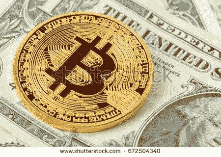

# 比特币价格暴跌的原因

> 原文：<https://medium.com/coinmonks/why-bitcoin-price-has-been-crashing-4670742a640d?source=collection_archive---------75----------------------->

最初发表于 2018 年 12 月 11 日，作者 [Jeje Yansola](https://www.linkedin.com/in/oluwayansola/)

Bitcoin

时光倒流到 2009 年，当时比特币是由一个化名为“中本聪”的个人或团体推出的。这是第一种抓住公众想象力的加密货币。

截至 2018 年 5 月，流通中的比特币超过 1700 万个，总市值为 1400 亿美元。根据 CoinMarketcap.com 的数据，如今全球比特币的总价值为 1100 亿美元。似乎是‘突然’的，比特币和加密货币开始下跌。

9 月 5 日上午，比特币价格陷入自由落体式下跌。根据 CoinDesk 的数据，比特币下跌了 500 美元或 5%，从而将比特币价格淹没在 7000 美元的心理关口之下。昨天，比特币的价值跌至 3338.99 美元(约合 120 万元人民币)，加剧了人们对加密货币市场正在慢慢崩溃的担忧。

根据 CoinMarketCap 的数据，目前所有加密货币的总价值已从 2018 年 1 月的 8300 亿美元降至约 2000 亿美元。比特币的市值现已从两周前的逾 1100 亿美元降至 820 亿美元。然后，人们开始想知道为什么“未来的货币”加密货币正在下跌。更重要的是为什么是现在？

全球顶级加密货币的市值在不到两个月的时间里从 6200 亿美元左右降至 3793 亿美元。这主要归功于市场领导者比特币。换句话说，比特币可能会大幅下跌，因为对这种加密货币作为一种可用支付形式的需求正在下滑，如果不是崩溃的话。

超过四家公司已经放弃使用比特币进行交易。面向游戏技术的软件开发商 Steam 于 2016 年 12 月停止接受比特币，理由是交易成本。微软和 Stripe 也是如此，它们于 4 月 23 日终止了比特币交易。

此外，还有交易速度的问题。据区块链电子商务公司 Storiqa 的首席执行官鲁斯兰·图古舍夫称，该公司拥有自己的代币 STQ

*“由于套利(在亚洲比特币交易者中)和交易比特币的热潮，网络目前超载。当比特币也用于支付目的而不是作为数字商品时，区块链变得像煎锅一样热。我认为更快的交易速度将要求(比特币)矿工获得更高的佣金"*

比特币每秒处理不到 10 笔交易。相比之下，亚马逊每秒使用信用卡处理数百笔交易。据 Business Insider 1 月 10 日报道，由于交易费用和支付处理缓慢，北美比特币大会停止接受比特币支付门票。

根据中国分散式预测市场平台菩提的创始人林的说法，从可靠性和成本的角度来看，比特币的问题在于它如何作为一种支付方式。本质上，期货市场在给比特币定价方面遇到了困难。

基本上，期货市场是一个拍卖市场，参与者买卖商品和期货合同，在未来某一特定日期交割。这意味着期货市场的正常状态是现货溢价。与此相反的是期货溢价，意思是附近的期货价格高于现货价格。期货溢价通常出现在稀缺市场，由于比特币是有限的，对其作为交易货币的需求正在下降。

底线是，当一种货币变得不那么有用时，它自然会走软。比特币有其缺陷，尤其是交易速度和费用。Stripe 表示，该公司仍然*【看好加密货币】*，并进一步表示:

*“我们认为有很多努力是有希望的，我们当然可以想象在未来获得支持。从本质上来说，比特币可能在未来再次成为可行的支付手段”*

布雷顿森林研究的创始人弗拉基米尔·西尼奥雷利认为，作为交换媒介的效用(比特币)面临着比预期更大的挑战。比特币面临的巨大阻力。每当比特币宇宙缩小，你就会看到价格下跌。对此几乎有一种恐慌。他进一步补充说*“中国的法规和禁令无法阻止比特币，但也许市场会将其作为一种支付形式拒之门外”。*

今年，大多数加密货币的命运都取决于比特币的市值。当比特币开始下跌时，以太坊、ripple 和 EOS 也艰难下跌了至少 10%。然而，有趣的是这些问题的新解决方案将如何改善加密货币市场。目前，对许多人来说，比特币(还)不是货币。

> 加入 Coinmonks [电报频道](https://t.me/coincodecap)和 [Youtube 频道](https://www.youtube.com/c/coinmonks/videos)了解加密交易和投资

# 另外，阅读

*   [分散交易所](https://coincodecap.com/what-are-decentralized-exchanges) | [比特 FIP](https://coincodecap.com/bitbns-fip) | [Pionex 审查](https://coincodecap.com/pionex-review-exchange-with-crypto-trading-bot)
*   [用信用卡购买密码的 10 个最佳地点](https://coincodecap.com/buy-crypto-with-credit-card)
*   [最好的卡达诺钱包](https://coincodecap.com/best-cardano-wallets) | [Bingbon 副本交易](https://coincodecap.com/bingbon-copy-trading)
*   [印度最佳 P2P 加密交易所](https://coincodecap.com/p2p-crypto-exchanges-in-india) | [柴犬钱包](https://coincodecap.com/baby-shiba-inu-wallets)
*   [8 大加密附属计划](https://coincodecap.com/crypto-affiliate-programs) | [eToro vs 比特币基地](https://coincodecap.com/etoro-vs-coinbase)
*   [最佳以太坊钱包](https://coincodecap.com/best-ethereum-wallets) | [电报上的加密货币机器人](https://coincodecap.com/telegram-crypto-bots)