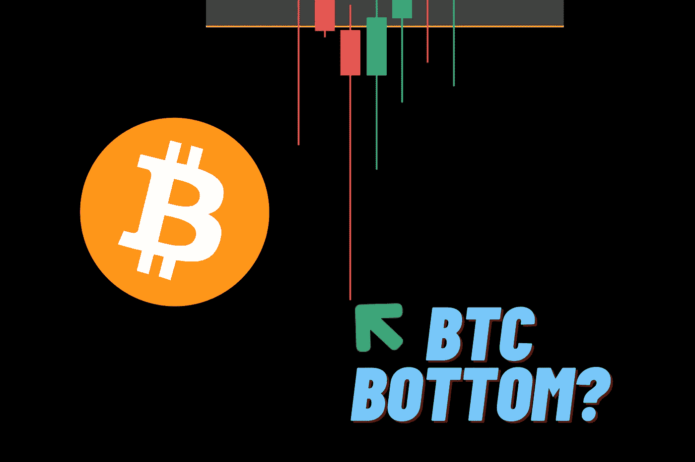

# 为什么比特币可能还没有见底

> 原文：<https://medium.com/coinmonks/why-bitcoin-probably-hasnt-bottomed-8de4ad2de9c9?source=collection_archive---------54----------------------->

在我看来，比特币还没有见底，原因如下。通货膨胀和美联储加息仍然是市场的问题。这些是股市下跌的主要原因。CPI 数据(消费者价格指数)每个月都在上涨。下一次 5 月份 CPI 数据将于 6 月 10 日发布。

消费者支出也必须出来。我们还没有看到消费者支出数据的显著下降。人们的收入跟不上通货膨胀。根据美国消费者新闻与商业频道的说法，“尽管工资在上涨，靠薪水生活的美国人的数量却在上升”。我认为，如果消费者支出确实下降，那么这将是对市场的一个警钟，因为它将表明通货膨胀确实正在严重影响中产阶级。

我认为，如果这种情况真的发生，人们会严肃地谈论经济衰退，股市会因此下跌，然后比特币也会跟着下跌。我肯定会错吗？但我认为可以肯定地说，比特币还没有找到底部，但如果 5 月份的 CPI 数据是积极的，这种情况可能会改变。感谢您的阅读，并关注这样的内容。

> 加入 Coinmonks [电报频道](https://t.me/coincodecap)和 [Youtube 频道](https://www.youtube.com/c/coinmonks/videos)了解加密交易和投资

# 另外，阅读

*   [Bookmap 评论](https://coincodecap.com/bookmap-review-2021-best-trading-software) | [美国 5 大最佳加密交易所](https://coincodecap.com/crypto-exchange-usa)
*   最佳加密[硬件钱包](/coinmonks/hardware-wallets-dfa1211730c6) | [Bitbns 评论](/coinmonks/bitbns-review-38256a07e161)
*   [新加坡十大最佳加密交易所](https://coincodecap.com/crypto-exchange-in-singapore) | [购买 AXS](https://coincodecap.com/buy-axs-token)
*   [红狗赌场评论](https://coincodecap.com/red-dog-casino-review) | [Swyftx 评论](https://coincodecap.com/swyftx-review) | [CoinGate 评论](https://coincodecap.com/coingate-review)
*   [投资印度的最佳密码](https://coincodecap.com/best-crypto-to-invest-in-india-in-2021)|[WazirX P2P](https://coincodecap.com/wazirx-p2p)|[Hi Dollar Review](https://coincodecap.com/hi-dollar-review)