# 为什么比特币会继续涨价

> 原文：<https://medium.com/coinmonks/why-bitcoin-will-continue-to-rise-in-price-3979f8353b67?source=collection_archive---------4----------------------->

这里有一个简单的原因，为什么我预计比特币的价格，以法定价格计算，将继续上涨。

尽管我不关心 BTC 的法定价格，但就我个人而言，在与关心价格的人交谈时，解释为什么 BTC 的购买力会持续增长是很有用的。

美国国债高达 30.33 万亿美元，与任何一位总统都没有关系。

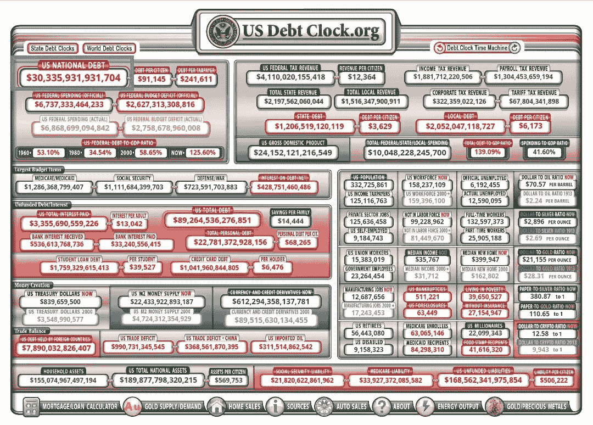

多年来，尽管税收收入几乎每年都在增长，但美国政府的支出一直超过收入。

将国债规模归咎于任何一位总统都是愚蠢的。

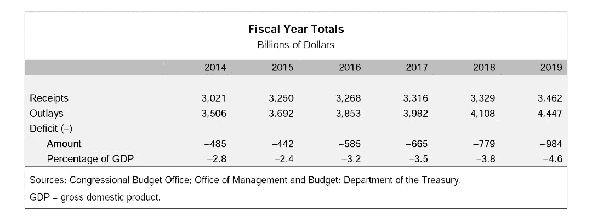

2020 年，在 Covid 的帮助下，美国政府的支出突破了屋顶，达到 6.6 万亿美元，尽管收入与 2019 年几乎相同，这给他们带来了 3.1 万亿美元的新赤字。

这离他们的年收入只有 3000 亿美元。呀！😬

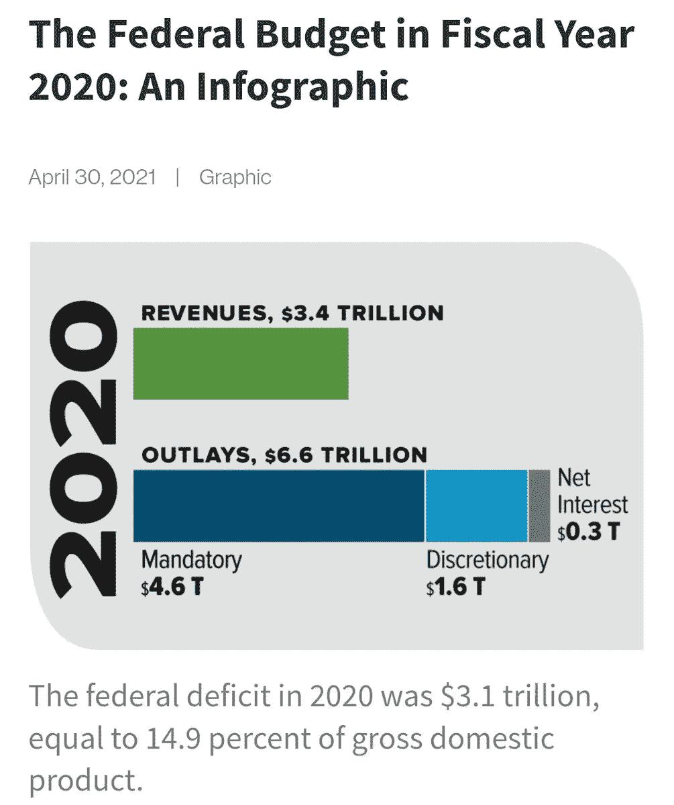

2021 年对美国政府来说也不是更好，因为他们再次坚持似乎是一个传统，他们的收入增加到 4.05 万亿美元，但支出为 6.82 万亿美元

这一次，他们又一次出现了 2.77 亿美元的赤字，与去年相比，这是一个“轻微”的改善。

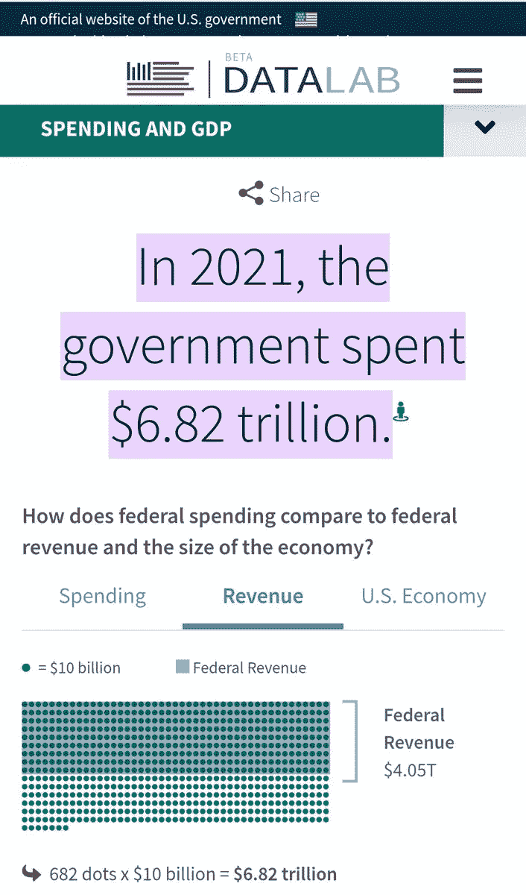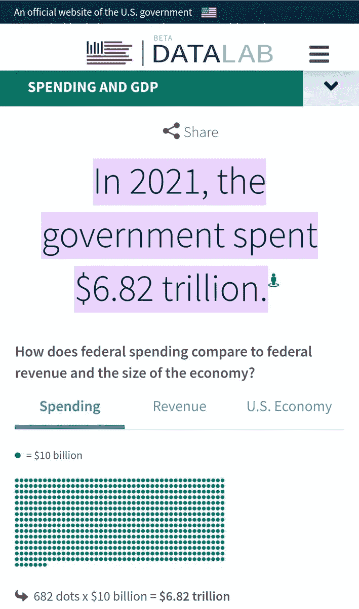

我们可以预期这种“入不敷出”的“传统”会继续下去，正如我们从表 1 中看到的。

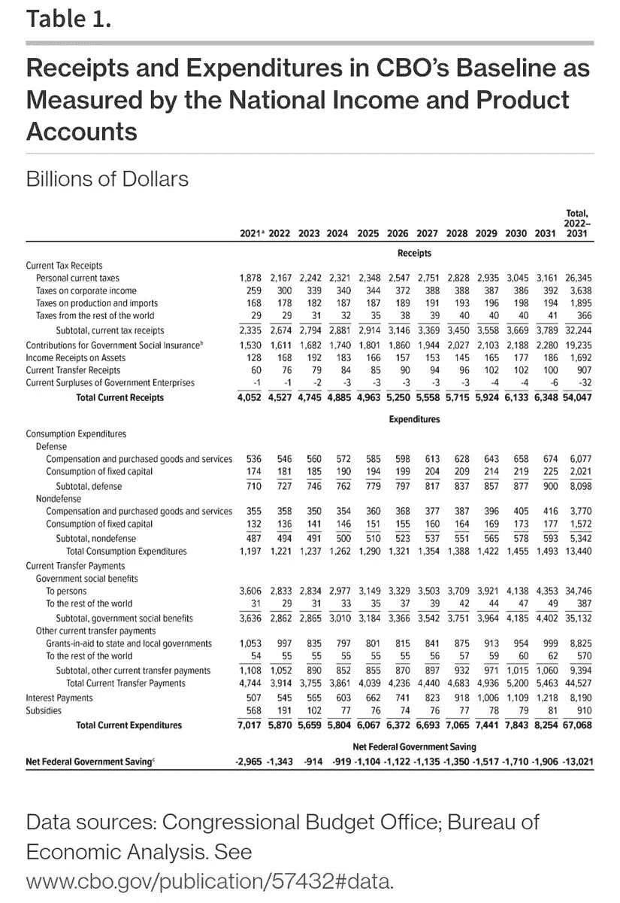

依我拙见，这张表中预测的赤字是可笑的&非常乐观。

美国政府将面临更大的赤字。为什么？让我们看一看👇

几十年来，美国国债一直在增长。

人们倾向于将矛头指向前任总统(即特朗普、奥巴马等。)，但他们不一定对此负责。

主要原因更有可能是什么？

我们自 1971 年以来一直使用的破碎的法定货币体系。

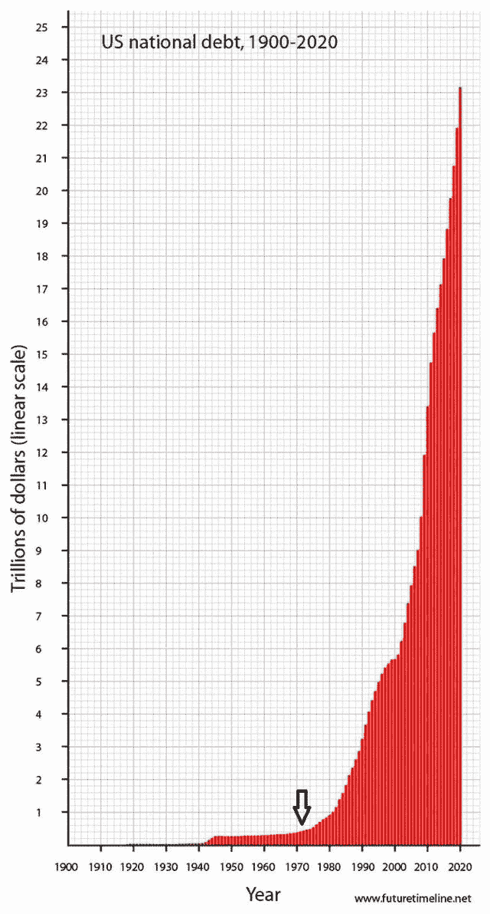

请注意，自 1971 年以来，债务规模经历了近乎指数级的增长模式，当时，由于美国决定结束美元与黄金的挂钩，整个世界进入了纯粹的法定货币体系。

这原本是一项“临时措施”。

当然🤡

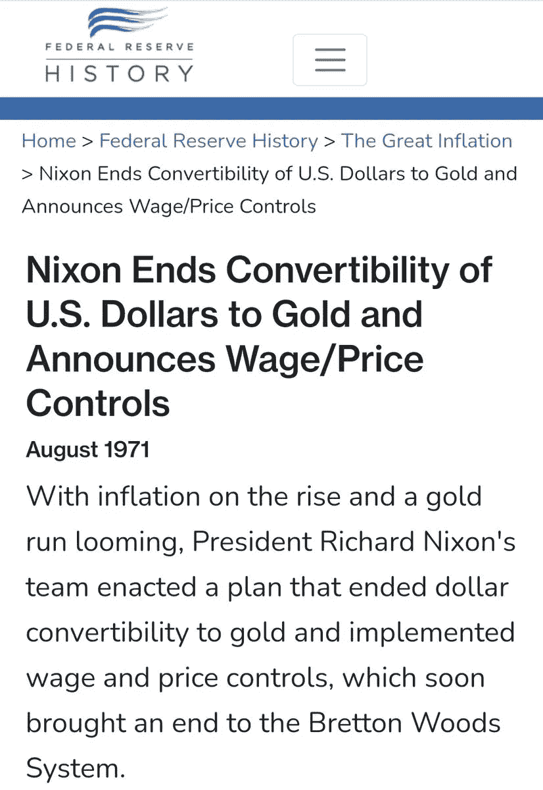

还有什么能让我们相信美国债务将继续以近乎指数级的速度增长？

还记得 30.33 万亿美元的当期国债吗？

你会惊讶地发现，美国还有 168.56 万亿美元(相当于当前国债的 5.55 倍)的无准备金负债。

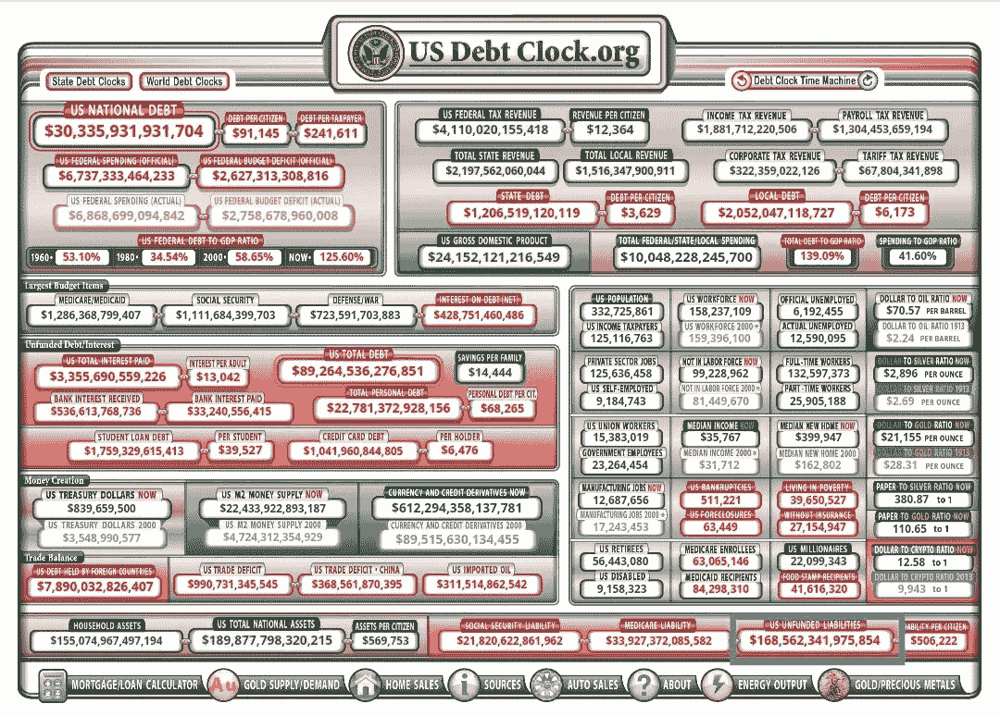

对于一个长期以来一直在净亏损、也就是赤字支出的政府来说，你认为他们将从哪里找到资金来满足这些巨大的财政承诺/债务？

你认为他们会从税收中得到它吗？祝你好运！😂

也许他们可以没收所有那些讨厌的亿万富翁的财富，并按市值清算他们的资产，而不会有任何损失——就像可能发生的那样，哈哈——这样，我们就可以还清国债&没有资金支持的负债🤯

让我们来做一次思维实验。

美国 745 名亿万富翁的财富总计约 5 万亿美元。

> 在疫情执政期间，美国亿万富翁的财富激增了 70%，即 2.1 万亿美元。政策研究所

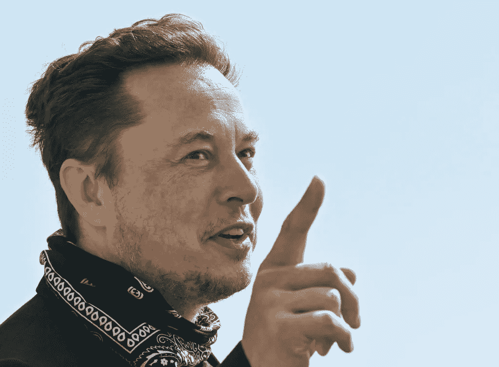

如果他们所有的财富都被没收，并按市场价值清算，那只能为美国政府提供..

*鼓声*

8.8 个月！

那只是为了资助政府的日常运作。

我们甚至没有谈论用这些钱来偿还一些债务，甚至没有试图覆盖巨额无准备金的负债。

这里有几个有趣的观想给你。

美国亿万富翁的财富等于:

*   当前国债(30.3 万亿美元)的 16.5%
*   无准备金负债的 2.9%(168 万亿美元)

美国的 GDP 是 24 万亿美元，或者说:

*   当前国债的 79.1%
*   14.2%的无准备金负债

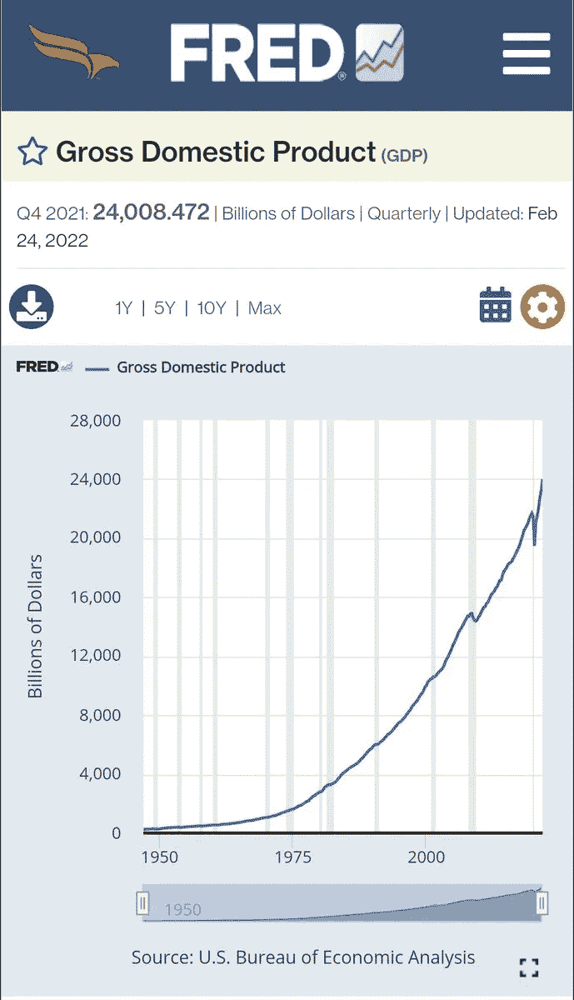

因此，我们再次问，美国政府将从哪里获得资金来履行其财政义务？

答案很简单:他们会凭空打印出来。

那是什么意思？这意味着他们会发行更多的债券，把旧的卷进新的，然后让美联储购买。

但是为什么呢？

因为美国政府将会耗尽愿意借钱给他们的人和机构。

以前也发生过。

在这种情况下，美联储出于“法律原因”介入购买债务，但不是直接购买。

[@LynAldenContact](https://twitter.com/@LynAldenContact) 很好地深入解释了这一点。谢谢林。🧡

> [“印钞”如何运作，如何发现通货膨胀](https://www.lynalden.com/money-printing/)

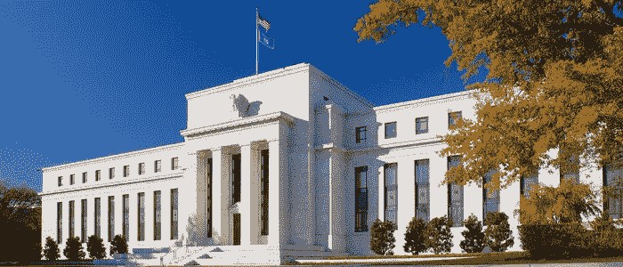

这基本上是印钞为政府支出融资。

但是，底线是，美元将继续贬值，因为将会有更多的美元被印刷出来，以支付美国政府的金融债务。

由于 BTC 将永远不会超过 2100 万(210 万亿 sat)，而且由于当前的世界事件(如卡车司机)，对无状态、不受限制、不受许可的货币的需求正在增长，我们可以合理地预计比特币的价格将🚀🌕

这不是一个保证。

我要补充的是，除了法定货币继续以加速的速度贬值，没有什么是 100%有保证的。感谢[@ fosgregfoss](https://twitter.com/@FossGregfoss)的真知灼见🧡

所以，做你想做的，但要知道它会到来。

感谢你阅读🧡

> 加入 Coinmonks [电报频道](https://t.me/coincodecap)和 [Youtube 频道](https://www.youtube.com/c/coinmonks/videos)了解加密交易和投资

# 另外，阅读

*   [瓦济里克斯 NFT 评论](https://coincodecap.com/wazirx-nft-review) | [比茨盖普 vs 皮奥克斯](https://coincodecap.com/bitsgap-vs-pionex) | [坦吉姆评论](https://coincodecap.com/tangem-wallet-review)
*   [如何使用 Solidity 在以太坊上创建 DApp？](https://coincodecap.com/create-a-dapp-on-ethereum-using-solidity)
*   [币安 vs FTX](https://coincodecap.com/binance-vs-ftx) | [最佳(SOL)索拉纳钱包](https://coincodecap.com/solana-wallets)
*   [如何在 Uniswap 上交换加密？](https://coincodecap.com/swap-crypto-on-uniswap) | [A-Ads 审查](https://coincodecap.com/a-ads-review)
*   [加密货币储蓄账户](/coinmonks/cryptocurrency-savings-accounts-be3bc0feffbf) | [YoBit 审核](/coinmonks/yobit-review-175464162c62)
*   [Botsfolio vs nap bots vs Mudrex](/coinmonks/botsfolio-vs-napbots-vs-mudrex-c81344970c02)|[gate . io 交流回顾](/coinmonks/gate-io-exchange-review-61bf87b7078f)