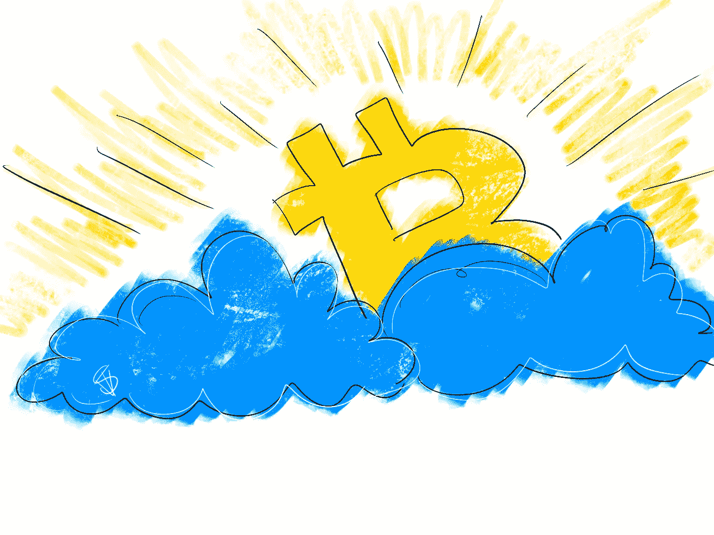
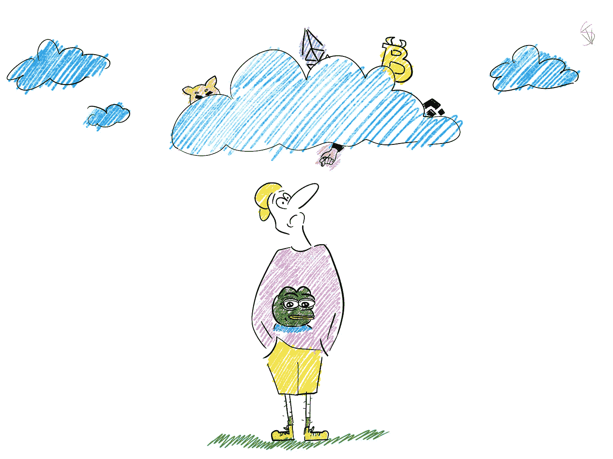
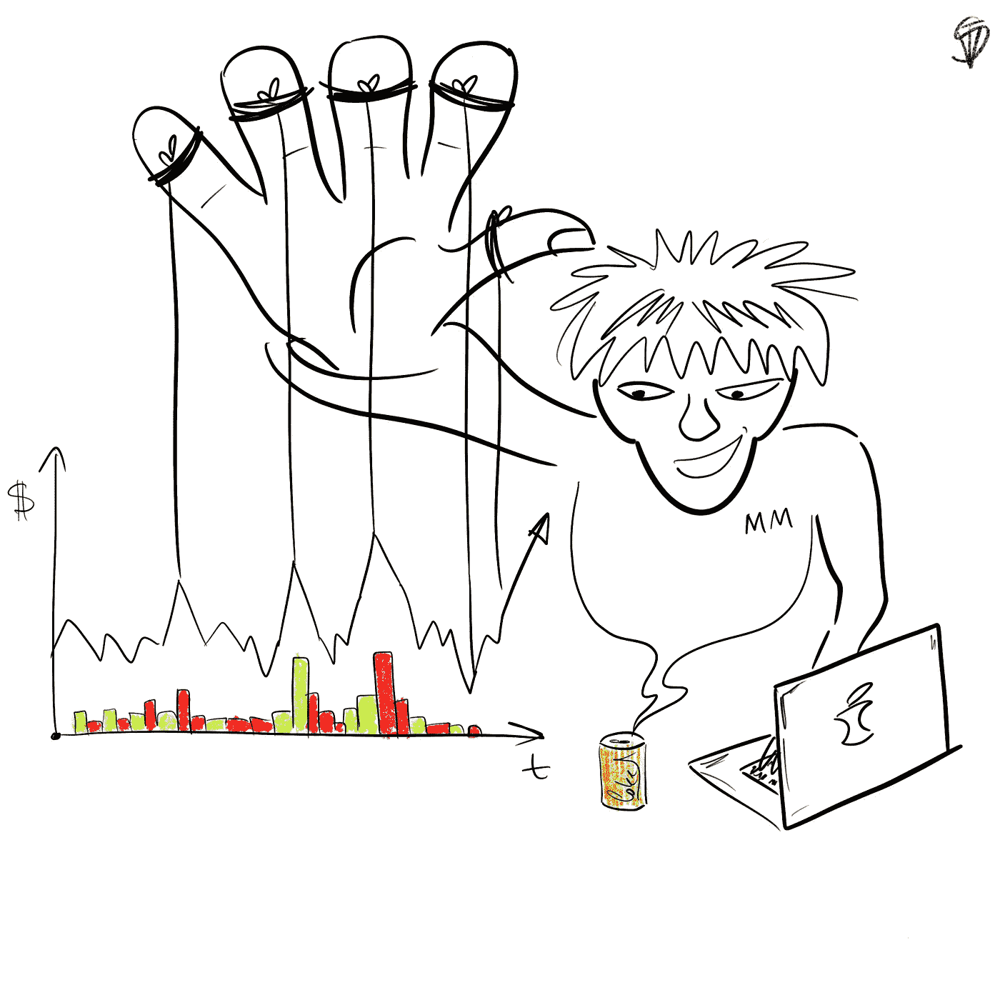
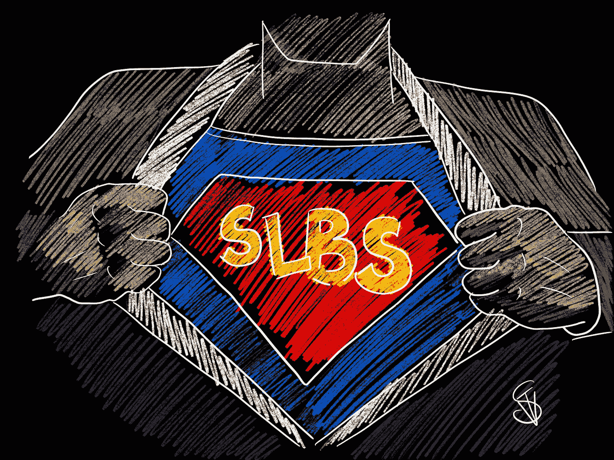

# 为什么区块链不是一个公平的游戏，玩这个游戏你需要知道什么？

> 原文：<https://medium.com/coinmonks/why-blockchain-is-not-a-fair-game-and-what-do-you-need-to-know-to-play-it-2c3a82ff5565?source=collection_archive---------14----------------------->

# 所以！

为了了解我们的金融游戏是什么样的，它们有什么特别之处，我们决定详细分解我们正在开发的东西的本质，我们将从我们在现代区块链看到的普遍问题开始。

> 一开始，有中本聪的比特币，也不错。

但是接下来呢？不受监管，没有任何实际的可用性，除了一个复杂的和经常不工作的真实金融系统的模拟；替代硬币(altcoins)——这是在我们的加密货币世界诞生之初创造的。是的，提供他们存在的基础设施是新的和不寻常的。在许多方面，它的新颖性使这个独特的随行人员和越来越多的群众加入的愿望。但是最初的天赋一过，问题就来了，*区块链还有什么能力*？

维塔利科·布特林用他的**以太坊**回答了这个问题。加密货币和契约关系的全新视角——这是新区块链带给世界的，这类似于离开伊甸园后创造一种宗教。

以太坊给了这个世界一个新的实体——智能合约，本质上并不新，但在执行上完全独特。这里的事情变得很疯狂…

一个新的时代开始了。

人们可以说比特币的产生是它的开始，但它更像是以太坊功能中实现的预言。智能合约已成为人类及其金融体系历史上的一个新里程碑。我希望这种变化也能影响到世界秩序的契约和法律部分，正如计划所要求的那样，但事实证明，经济部分仍然足够了。

智能合约改变了区块链。他们很好。

但是，事实上，他们给了社区什么呢？穷人越来越富，富人越来越矜持了吗？世界各国是否统一在不可改变的网络合同的管辖之下，其条款不受腐败、威胁或陪审团贿赂的影响？或者，也许世界已经认识到，世界市场经济就像价格形成和通货膨胀一样，只不过是一个受政治控制的泡沫，其主要作用只是控制大众？唉，智能合约只是给了这个世界一个稍微优雅一点的金融流动监管，以及一种形成市场供应的新方式，仅此而已。目前为止。

智能合约具有巨大的功能，其潜力只有在未来才能展现出来。但是，要让区块链和加密货币牢固地融入地球上普通居民的日常生活，唉，还需要很多年。是的，几家公司已经在尝试与加密货币建立集成，试图生产一些独特的东西，但他们的产品通常有很高的准入门槛，公众往往无法接触到。

那么，此时的区块链是什么样的呢？它由什么组成，2022 年初智能合约形成什么？

总而言之，从技术角度来看，智能合约目前只不过是一条管道，在网络内提供有条件货币单位的高效运输。为什么有条件？仅仅因为在区块链任何东西都不值钱。不是 NFT，不是你所知的任何代币，甚至不是 ***陛下的比特币*** 。所有这一切都不会花费什么，除非你用某个国家的黄金储备来支付。原来加密货币也有黄金支持？哈哈，当然不是。代币不是货币。代币是一种商品。

在普通世界里，一件产品的价格受无数因素的影响，从收获季节的天气状况开始，到商店员工在价格标签上粘贴折扣标签的心情结束。在区块链，任何代币的价格都取决于拥有最多代币的人。

认识到这一点很重要。

没有什么比其最大的所有者购买更大游艇的情境愿望更能影响加密货币的价格了。只要你愿意，你可以把你的信念寄托在区块链活生生的市场经济的理念上。但是如果你知道创造代币流动性的机制，那么根据它的图表来猜测代币的价格对你来说就像是从巨蟒剧团演出的小品。

智能合约创建了管理网络内令牌的规则。它们不形成它的价值，也不产生任何新的东西。这些只是用代码行编写的一组规则，允许用户参与有限的循环。所有这些都是必要的，只是为了在某个时候，有人可以兑现这些代币，并从差价中赚钱。

仅此而已。

区块链目前没有给世界带来任何创新，除了一个赚钱机会的新市场。而且通常情况下，*玩不公平的人赚得最多*。但是这种说法实际上有多正确呢？

对区块链来说,“公平”这个词意味着什么？

区块链不产生任何钱。区块链不创造任何东西。所有进入网络的资金都来自外部，来自我们的现实世界。当你向区块链存入 1 美元并从中取出 100 美元时，你必须明白一个简单的事实:**有人丢失了 99 美元**。

加密货币的黄金储备是真金白银。加密货币相对于美元被估价，相对于美元被买卖，并且提供条件加密单元的价值的美元被某人输入区块链。这意味着当你在区块链“赚”的时候，事实上，你是从普通的存钱罐里拿了别人的钱。就这么简单。事情就是这样的。

那么，在区块链，什么是“公平”呢？加密货币诚信的条件是什么？

这很简单。

诚实就是一切都是透明的，可以理解的。任何代币的流动性都是代币持有者存入其中的资金储备。通过购买代币，你把钱放进了存钱罐。通过出售代币——你把钱取出来。

一个简单的例子:如果十个人往国库里扔 10 美元，那么为了让九个人每人赚 1.1 美元，其中一个人必须失去一切。流动性就是这么运作的。这里没有公平或不公平；**这只是事实**。

这意味着，区块链项目的问题不在于霍德勒之间资金分配的“诚实”，而在于透明的条件、使用项目令牌的功能性，以及最重要的是，上述所有内容的持续时间。

如果这个项目并不有趣，并且打着“ ***改变游戏规则*** ”突破的鲜明标签，有简单的赌注，或者更糟糕的是，NFT 市场，它的流动性将很快被耗尽，所有营销史诗将被遗忘。因此，除了透明性和功能性之外，还需要一些东西来允许所有这些在区块链框架内尽可能长久地存在和发展。

这是我们进入市场的地方。

我们创建我们的项目不是为了收集更多的钱和立即致富；我们正在创建一个平台，让每个市场参与者都能在一个窗口内从区块链整体上获得他们想要的东西。

普通用户将获得参与条件绝对透明、胜算最高的简单游戏的机会。小项目的所有者将创造额外的代币周转率，防止代币过早“变质”。大型项目和 metaverses 将获得对其生态系统的额外服务，并具有以下所有好处。

我们不谈突破，也不喊什么会改变世界的技术。我们正在做一个项目，在这个阶段只解决几个问题，让社区在我们的生态系统中实现他们的目标，而不会分散，也没有不必要的风险。

我们将如何做？和我们在一起，我们会告诉你一切。

> 加入 Coinmonks [电报频道](https://t.me/coincodecap)和 [Youtube 频道](https://www.youtube.com/c/coinmonks/videos)了解加密交易和投资

# 另外，阅读

*   [麻雀交换评论](https://coincodecap.com/sparrow-exchange-review) | [纳什交换评论](https://coincodecap.com/nash-exchange-review)
*   [支持卡审核](https://coincodecap.com/uphold-card-review) | [信任钱包 vs 元掩码](https://coincodecap.com/trust-wallet-vs-metamask)
*   [Exness 回顾](https://coincodecap.com/exness-review)|[moon xbt Vs bit get Vs Bingbon](https://coincodecap.com/bingbon-vs-bitget-vs-moonxbt)
*   [如何开始通过加密贷款赚取被动收入](https://coincodecap.com/passive-income-crypto-lending)
*   [加密货币储蓄账户](/coinmonks/cryptocurrency-savings-accounts-be3bc0feffbf) | [加密交易机器人](https://coincodecap.com/best-crypto-trading-bots)
*   [BigONE 交易所评论](/coinmonks/bigone-exchange-review-64705d85a1d4) | [CEX。IO 审查](https://coincodecap.com/cex-io-review) | [交换区审查](/coinmonks/swapzone-review-crypto-exchange-data-aggregator-e0ad78e55ed7)
*   [最佳比特币保证金交易](/coinmonks/bitcoin-margin-trading-exchange-bcbfcbf7b8e3) | [比特币保证金交易](https://coincodecap.com/bityard-margin-trading)
*   [加密保证金交易交易所](/coinmonks/crypto-margin-trading-exchanges-428b1f7ad108) | [赚取比特币](/coinmonks/earn-bitcoin-6e8bd3c592d9)