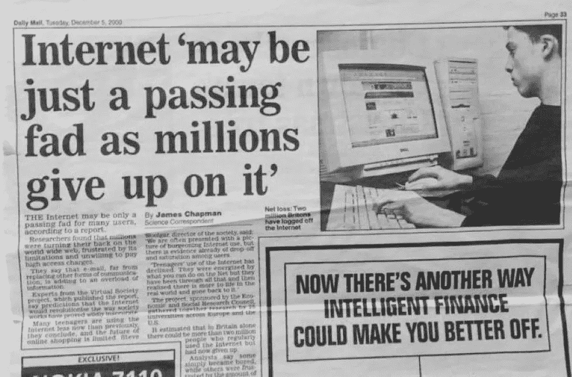

# 为什么区块链技术不会改变世界但你还是应该关心它。

> 原文：<https://medium.com/coinmonks/why-blockchain-technology-wont-change-the-world-but-you-should-still-care-about-it-1501f538cfb7?source=collection_archive---------65----------------------->

首先是个人电脑，然后是互联网，然后是智能手机，然后是加密货币，接着是 NFT，现在是 Metaverses。如果我们继续沿着这条轨迹走下去，我们可能会走上全球可访问的高速互联网和便携式量子计算机的道路(让我们暂时不要走那么远进入太空殖民地)。一些爱好者可能会将区块链技术视为解决我们今天许多问题的答案，但我是许多认为它只是一项技术的人之一。无论它是未来几年将被严重依赖的技术，还是为了更大更好而绕过它的技术。在这篇文章中，我们都将后退一步，重新审视自己，去理解是什么让你走到了这一步。

# 害怕错过。

早在 2008 年，当假名账户“中本聪”设计了最初的比特币协议并于 2009 年推出时，没人在意。全世界都认为这是贩毒资金的另一种渠道，这只是一时的流行。但 13 年后，我们看到了流动性和用户的显著增长，这与 2000 年互联网的发展轨迹相同。因此，通过比较这两者，你可能有 FOMO，你想乘这一波，因为你错过了前一波。有些人会因为你有这个而嘲笑你，有些人甚至会发表一篇可信的文章。给你举个例子:

Daily Mail, December 5, 2000 (Source: a friendly discord netizen)

你可能遇到过一些嘲笑加密货币和整个 NFT 空间的唱反调者。就像其他几个不相信互联网的人一样。记住，比尔·盖茨当年在大卫·莱特曼的节目中也曾被取笑过。所以坦白地说，你唯一能做的事情就是坚持自己的感觉和决定，因为不管他们有一天是对的还是错的，反对者都会坚持自己的感觉和决定，他们会在网上告诉你你们的道路是否会再次相遇。

做你自己的主人，不要害怕尝试新事物！

# 钱。

啊，是的，每个人都害怕承认是什么让他们来到这里。你可能听说过或看到过一些幸运的有选择的人，他们获得了财务自由，并希望也能这样做。我先在这里做个令人沮丧的演讲:

> 给你一个建议，不要赌掉你一生的积蓄，甚至不要想着借钱去买 NFT。如果你仅仅因为看了几个 YouTube 视频或者在网上和几个人结成了乐队，就认为自己突然成了 Web 3.0 的预言家，那么我希望你仍然能够牢牢把握住支付租金和逐步储蓄的方法。

如果你愿意承担全部风险，看涨投资策略通常会奏效。500 美元的 5%收益和 50 万美元的 5%收益是不同的。看过网飞的《社会困境》吗？网络把我们所有人都拉近了，因为这种团结，我们在网上发生了美好积极的事情，比如浪漫和 T2 友谊。但是一些美丽的友谊也碰巧席卷了美国国会大厦。你猜怎么着？可能有一些朋友正在考虑洗劫你的钱包。关于 Web 3.0，我们都应该明白的一点是，你自己需要更加小心、更加自觉、更加可靠。如果你想对你在商店购买的一些商品退款，那是你的一个选择。但是有了这个新的空间，你就只能用这个 JPEG/PNG(和它相关的 IPFS 代码)了，直到有人想从你这里得到它。

Thank you, internet.

像每天一样做出正确的判断。

# 友谊。

不管你是谁，你都可以在网上和网上交朋友。大多数时候是暂时的，有时是永久的。每一种社交媒体技术的力量都让我们彼此更加接近。NFTs(不可替代的代币)，一半是社交技术，一半是金融技术。两者结合本身就是矛盾，因为有钱买不到朋友。所以唯一能存在的方式只有‘我们是一起赚钱的朋友’。错了，这是当前的空间希望你认为，有一堆项目在那里试图掠夺你的钱包，当前的空间闻起来像金钱和金融花花公子。但是未来呢？会一直这样吗？也许是，也许不是。请记住，我们随着技术的发展而成长，随着新的更新而变化。你可能会选择继续使用 Window XP 和 Atari，或者像我们一样因为怀旧而重新访问它们。但我在这里并不是要声称社会将严重依赖加密货币、非功能性金融工具和元经文。但它将简单地共存，就像现在一样。有一天，当我们停止印刷现金和硬币时，我相信法定货币也会以数字形式存在。如果你是为了赚钱，那么不要让任何事情阻止你。但是，如果你进入这个领域是因为你想要社交联系，那么也不要让赚钱方面阻碍你，你会发现一些团体希望他们的平台更少的钱，更多的联系。

意识到你为什么在这里，并坚持下去。

thank yo, google.

既然我们已经重新定位了自己，下面是我想强调的关于区块链的一些要点，这些要点你可能还没有解开:

# 这不会改变我们的行为。

经过几个世纪的失败和实践，事情如何为我们工作的方式已经被完善和固定下来，区块链技术就是这种情况的产物。如果你认为这项技术将会拯救人类，我会让你失望的，真诚的。我的意思是，它最终可能会取代第三世界国家的纸币和硬币，但这已经在没有区块链技术的情况下实现了。然而，它可以为我们服务，这是奖励数字创作或从专业税前服务中获得服务的另一种方式。

作为人类，有一件事我们似乎永远无法摆脱，那就是错误。但是，从错误中，我们会得到教训，这也是我们快速前进的原因。所以，是的，在我们和我们的创作中有很多错误，但是我们会改进吗？是的。

> 如果有人说区块链技术的发明是一个错误，那么这是一个我们都应该学习的错误。学东西最快的方法就是全身心地投入进去。不要回避错误，欢迎错误。

# 它没有更绿。

是的，目前的信用卡系统消耗了大量的电力，是的，即使有了区块链技术的支持，我们仍然在每笔交易中消耗更多的电力。让我明确一点，任何建筑环境，无论如何，都将永远与自然为敌，反之亦然。如果你想去种更多的树，你可以在自由意志的基础上这样做，但是如果你想为了你自己的位置来和别人拉屎，那么你最好像你喜欢教育别人一样教育自己。我不知道一些硬币是如何宣传自己比其他硬币更环保的，但让他们这么做吧。

> 你可以考虑做的一件事是，建立一个智能合同，这将有助于不为利润永远产生版税收入(只要项目存在)，以及一个 DAO(去中心化自治组织)将继续这样做。但是你需要对你的 NFT 的立场以及你的社区中的人有相当的了解。

# 它不能解决贫困。

我们生活的社会要么建立在资本主义的基础上，要么通过对外贸易与资本主义紧密合作。你可以讨厌它，但你无法回避它。只要有社会阶级存在，贫穷就永远存在。因为有很多其他因素会使事情变得更糟(入侵、国际贸易关税、污染等)。)，如果你认为区块链技术是所有这一切的根源，那么你就和那些认为它可以触及下层阶级的人处于相同的位置。我之所以这么说，是因为目前在没有初始资本的情况下，要赚取加密货币实在是太难了。对于一个天生一无所有的人来说。首先，他们需要连接到互联网上，而这在第二、第三世界国家已经是一个付费墙了。其次，他们需要在目前的工作之外抽出时间，免费学习能给他们带来回报的技能，这一点在 Blender 和 YouTube 上是可以做到的。然而，语言也可能是一个障碍，因为大多数教程是英文的，我们经常被认为是最常用的。如果你已经在努力支付日常工作的费用，那么从现在开始，尝试进入这个领域对你来说会很困难。

> 区块链是一种简单存在的技术。它没有发明任何新的问题，也没有解决我们当前的任何问题。然而，这并不意味着它在未来不会很容易被访问。随着我们搭载越来越多的用户，并建立更好的链，那么那些有需要的人就越容易从这项技术中受益。

# 结论

和互联网一样，我对区块链技术的感情一直是以中心为中心的。它既不是好的，也不是坏的，只是你想如何使用它。区块链技术会改善我们的生活吗？不会。加密货币会完全取代法定货币吗？不一定。但是区块链技术会一直存在吗？绝对的。

乐意在我们的纳米不和谐社区讨论更多:
[https://discord.gg/NANOffice](https://discord.gg/6EFfsm9YpA)

> 加入 Coinmonks [电报频道](https://t.me/coincodecap)和 [Youtube 频道](https://www.youtube.com/c/coinmonks/videos)了解加密交易和投资

# 另外，阅读

*   [CoinFLEX 评论](https://coincodecap.com/coinflex-review) | [AEX 交易所评论](https://coincodecap.com/aex-exchange-review) | [UPbit 评论](https://coincodecap.com/upbit-review)
*   [AscendEx 保证金交易](https://coincodecap.com/ascendex-margin-trading) | [Bitfinex 赌注](https://coincodecap.com/bitfinex-staking) | [bitFlyer 点评](https://coincodecap.com/bitflyer-review)
*   [麻雀交换评论](https://coincodecap.com/sparrow-exchange-review) | [纳什交换评论](https://coincodecap.com/nash-exchange-review)
*   [支持卡审核](https://coincodecap.com/uphold-card-review) | [信任钱包 vs 元掩码](https://coincodecap.com/trust-wallet-vs-metamask)
*   [Exness 回顾](https://coincodecap.com/exness-review)|[moon xbt Vs bit get Vs Bingbon](https://coincodecap.com/bingbon-vs-bitget-vs-moonxbt)