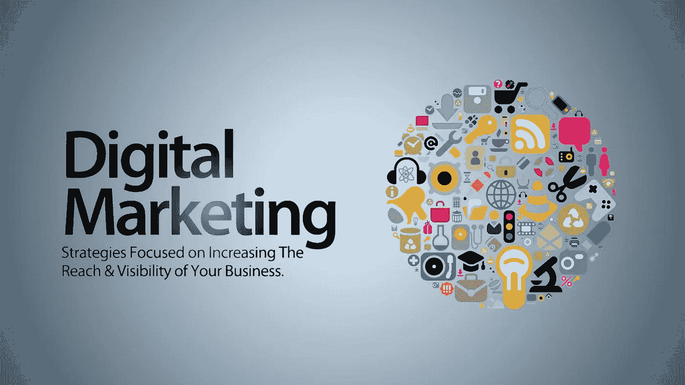
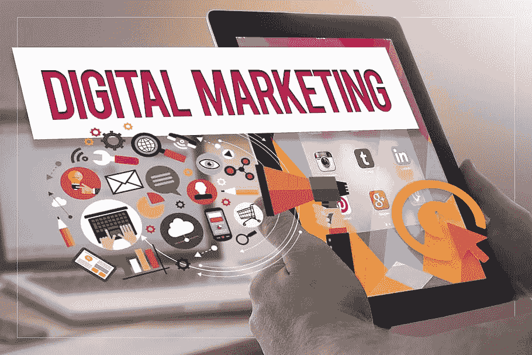

# 为什么品牌应该投资数字营销

> 原文：<https://medium.com/coinmonks/why-brands-should-invest-in-digital-marketing-f3024492d6a9?source=collection_archive---------46----------------------->

**Digital Marketing**

有没有考虑过 [**自己创业**](https://bit.ly/youtube-earning) ？或者你已经有一个了，正在想办法获得更多的顾客。

嗯，一个企业要成功，需要一个**伟大的营销战略**。

一些企业不愿承认世界已经数字化。然而，他们**没有意识到**通过采用这种方法，他们正在失去很大一部分潜在客户，因为他们**没有在目标受众花费大部分时间的媒体平台上**宣传他们的业务:数字媒体平台**。**

**这听起来可能很戏剧化，但是传统营销已经被网络营销完全超越了。**

**如果你有自己的网站、电子商务平台或打算建立一个，参与数字营销是至关重要的。为什么？因为现在的想法是，如果你在网上不存在，**你就不存在**。就这么简单…**

**以下是你应该投资数字营销的几个理由。**

## **1.互联网是未来**

****

****Internet Is The Future****

**典型的个人每天花在网上的时间超过 8 小时，而且这个数字预计还会上升。互联网已经演变成传播信息的工具。**

**现在，它的数量超过了所有其他形式的媒体，而且预计它将继续以指数速度增长。传统营销产生曝光率和影响力，但互联网更有效地做到了这一点。**

**更有说服力，也更有效。它允许客户完全控制他们的体验。客户可能会评估一个产品，仔细查看细节，并听取其他人的意见。**

**有一点是肯定的:如果有人想了解更多关于你的产品或服务，互联网是最好的去处。**

## **2.目标受众**

****

****Targeted Audience****

**顾客对传统营销的反应有限。这是因为传统营销人员无法像数字营销人员一样对客户进行细分。**

**有许多方法可以确定谁是你的目标受众，这样你就可以把你的精力集中在他们身上并获得好的结果。**

**这些工具检查各种**特征**，如人口统计、兴趣和地理位置，以帮助你**识别适合你的业务的受众**。**

## **3.无限延伸**

****

****Unlimited Reach****

**说到广告，曾经有一段时间，受众规模和距离被视为**主要问题**。最大的障碍之一是**的地理位置**，很难接触到非本国或本地的观众。**

**然而，因为互联网现在在每个国家都可以使用，所以**没有必要担心**你在使用数字营销时的影响力。毫不奇怪，数字营销正成为商业广告中最受欢迎的形式。**

****“虚拟化”**是让你的品牌脱颖而出的最有效方式。**

**要达到那个水平，大量的努力工作是必须的。**

**你必须定期**更新你的材料**，提供相关的有价值的信息，并确保用户体验是值得的。**

**如果你能抓住你的客户的注意力，并让他或她宣传你的工作，你很有可能扩大你的影响范围，并在短时间内影响更多的潜在客户。**

## **4.测量结果更加简单**

****

****Measuring Results Is Much Simpler****

**跟踪你的数字营销或广告工作非常简单。多亏了今天的数字营销技术，这才成为可能。**

**这些数字工具使用**数字营销分析**来帮助你确定你的方法有多有效，以及你是否正在实现你的**投资回报目标**。**

## **5.无与伦比的速度**

****

****Unbeatable Speed****

**数字媒体在速度上是无与伦比的。覆盖范围没有限制，而且立竿见影。因为数字营销策略允许与合作伙伴和客户进行快速和直接的接触，你将能够立即见证结果。**

**一切都发生在**单一平台**上。你的品牌，你做广告的媒介，你的顾客都在网上。您可以同时检查**完整程序**。**

## **6.与客户的互动**

****

****Engagement With Customers****

**使用**数字营销服务**，了解您的客户变得简单。由于互联网的参与性，企业已经能够获得对目标消费者的有价值的洞察力，从而生产更好的产品和服务。**

**通过合理利用社交媒体网站，你可以和你的客户建立稳固的关系。**

**你将能够**找出**他们在寻找什么。客户可以通过一个他们可以和你交流的地方来表达他们的观点、喜好和厌恶。**

**你的客户是最客观的批评家，你可以在他们的帮助下纠正任何错误。**

**不要错过这个**机会**。你应该认真对待顾客的意见。**

**拥有一个与客户在线互动的**媒介**，例如一个论坛、平台或即时通讯系统，可以让你立即解决问题并回答客户提出的问题。这反过来会让你的业务**更容易接近**。**

****感兴趣？**学习如何 [***在不制作任何单个视频的情况下，在 youtube 上赚钱***](https://bit.ly/youtube-earning) **。****

****快点！**免费培训等着你。**

> **加入 Coinmonks [电报频道](https://t.me/coincodecap)和 [Youtube 频道](https://www.youtube.com/c/coinmonks/videos)了解加密交易和投资**

# **另外，阅读**

*   **[如何在 Uniswap 上交换加密？](https://coincodecap.com/swap-crypto-on-uniswap) | [A-Ads 评论](https://coincodecap.com/a-ads-review)**
*   **[WazirX vs CoinDCX vs bit bns](/coinmonks/wazirx-vs-coindcx-vs-bitbns-149f4f19a2f1)|[block fi vs coin loan vs Nexo](/coinmonks/blockfi-vs-coinloan-vs-nexo-cb624635230d)**
*   **[本地比特币审核](/coinmonks/localbitcoins-review-6cc001c6ed56) | [加密货币储蓄账户](https://coincodecap.com/cryptocurrency-savings-accounts)**
*   **什么是融资融券交易**
*   **[维护卡审核](https://coincodecap.com/uphold-card-review) | [信任钱包 vs MetaMask](https://coincodecap.com/trust-wallet-vs-metamask)**