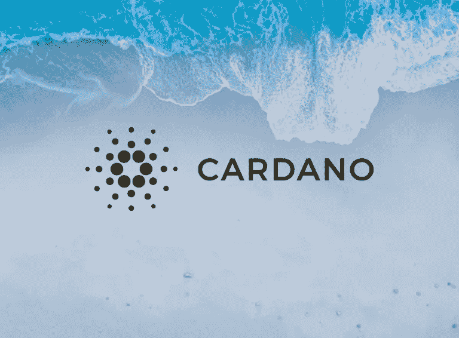

# 为什么是卡尔达诺

> 原文：<https://medium.com/coinmonks/why-cardano-8542127504e5?source=collection_archive---------8----------------------->

2022 年 6 月，我被邀请在布拉格的 UTXO 加密货币会议上谈论 Cardano。我想了想我会告诉人们什么，选择了这个项目的历史和它的使命。这篇文章的灵感来自于我的 PowerPoint 演示。请随意使用该材料并推广 Cardano。

# 项目的起源

2014 年，查尔斯·霍金森离开以太坊，与…