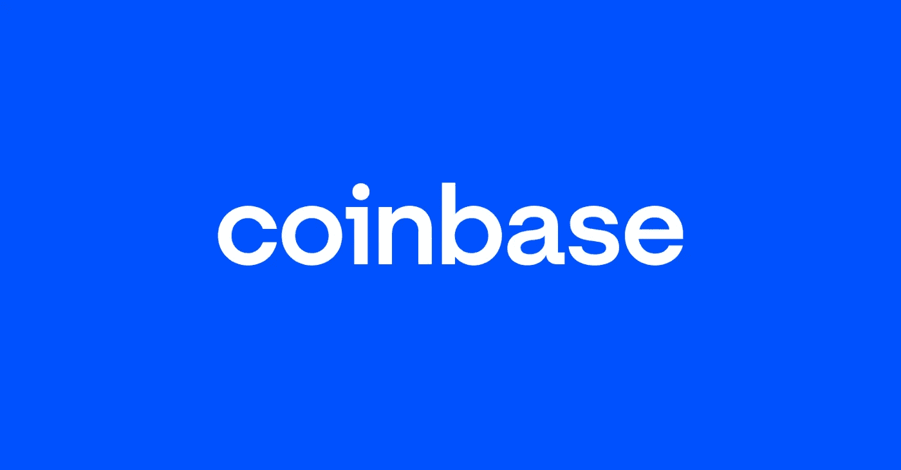

# 为什么卡达诺在赢得和击败市场！

> 原文：<https://medium.com/coinmonks/why-cardano-is-winning-and-beating-the-market-38bfe8d5a8d1?source=collection_archive---------4----------------------->

# 当前市场状况:

总的来说，所有的 crypto 都很艰难，因为它正在经历“冬天”。然而，虽然以太坊和比特币正在经历一个下降趋势，我们可以看到，卡尔达诺是坚持自己的，是唯一一个向上移动的方向。

# CoinBase 裁员:

今天早些时候，比特币基地首席执行官 Brian Armstrong 发布了一封信，称他们将裁员 18%。

## 有什么变化？

在过去的一个月里，他与他的高管团队和公司董事会进行了多次交谈，讨论最近的市场事件以及我们的业务状况。在这些讨论中，他清楚地认识到几个事实:

*   经济形势正在迅速变化:在经历了 10 多年的经济繁荣之后，我们似乎正在步入衰退。衰退可能会导致另一个隐秘的冬天，并可能持续很长一段时间。在过去的加密冬天，交易收入(我们最大的收入来源)大幅下降。虽然很难预测经济或市场，但他们总是做最坏的打算，所以我们可以在任何环境下经营业务。
*   **在低迷的市场中，管理他们的成本至关重要:**比特币基地度过了四个主要的加密冬天，他们通过在每个低迷时期仔细管理我们的支出，创造了长期的成功。低迷的市场很难驾驭，需要不同的心态。
*   **他们发展太快**:2021 年初，他们有 1250 名员工。当时，他们正处于牛市的早期，加密产品的采用呈爆炸式增长。几乎每周都有由 crypto 支持的新用例受到关注。他们看到了机会，但我们需要大规模扩展我们的团队，以便在广泛的赌注中竞争。鉴于我们的增长规模(自 2021 年初以来，年同比增长约 200%)，以恰到好处的速度增长很有挑战性。虽然他们尽了最大努力，但在这种情况下，他现在很清楚，他们过度雇用了。

# 为什么卡尔达诺会赢？

关于卡达诺你需要知道的总结！！

**拿走钥匙:**

—第三代加密技术。
—同行评审。
—可扩展性、互操作性和可持续性是 Cardano 解决的问题。
— Cardano 处于扩展阶段，下一个 [#Vasil](https://twitter.com/hashtag/Vasil?src=hashtag_click) HF 将加快速度并降低 txn 费用。

# 结论:

我们开始看到卡尔达诺生态系统的积极影响。自阵亡将士纪念日以来，Cardano 上涨了近 0.5%，而以太坊下跌了 35%，比特币下跌了 22%。由于 Cardano 以技术为核心，是第三代加密技术，它是未来的证明。

SCEZ-Smart Contract Easy-[SCEZ](https://smartcontractsez.com)是一款创建智能合约、NFT、本地代币和卡尔达诺区块链交易的友好工具。一个完整的 REST api 解决方案，面向加密开发者、爱好者和企业家。查看[特区商店](https://www.jpg.store/SmartContractsEZ?tab=assets)。

> 加入 Coinmonks [电报频道](https://t.me/coincodecap)和 [Youtube 频道](https://www.youtube.com/c/coinmonks/videos)了解加密交易和投资

# 另外，阅读

*   [如何匿名购买比特币](https://coincodecap.com/buy-bitcoin-anonymously) | [比特币现金钱包](https://coincodecap.com/bitcoin-cash-wallets)
*   [币安 vs FTX](https://coincodecap.com/binance-vs-ftx) | [最佳(SOL)索拉纳钱包](https://coincodecap.com/solana-wallets)
*   [比诺莫评论](https://coincodecap.com/binomo-review) | [斯多葛派 vs 3Commas vs TradeSanta](https://coincodecap.com/stoic-vs-3commas-vs-tradesanta)
*   [Capital.com 评论](https://coincodecap.com/capital-com-review) | [香港的加密借贷平台](https://coincodecap.com/crypto-lending-hong-kong)
*   [如何在 Uniswap 上交换加密？](https://coincodecap.com/swap-crypto-on-uniswap) | [A-Ads 评论](https://coincodecap.com/a-ads-review)