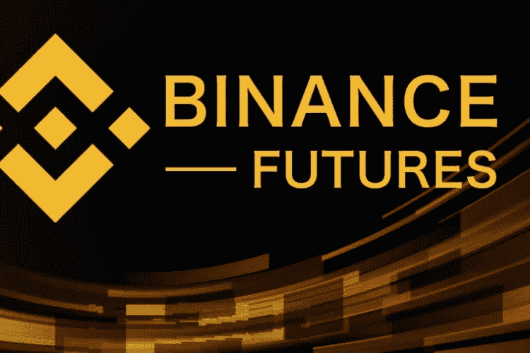

# 为什么密码持有者应该考虑在币安期货交易期货

> 原文：<https://medium.com/coinmonks/why-crypto-holders-should-consider-trading-futures-on-binance-futures-aaaee5fa69bd?source=collection_archive---------22----------------------->

[https://www.binance.com/en/futures](https://www.binance.com/en/futures)

当我问密码持有者他们在币安交易所进行什么类型的交易时，大多数人很快回答说他们只进行现货交易。我进一步问他们为什么不交易期货或保证金，我得到了不同的答案和借口。虽然单独进行现货交易不是一个坏主意，但币安期货为交易者交易期货提供了很多优势。事实上，每个月都有数万亿美元的交易，交易范围也在不断扩大，因为越来越多的交易者不断寻找快速获利的机会，而不管市场的走向如何。

## 现货和期货的区别

> 大多数通常混淆现货交易和期货交易。因此，这是为了澄清现货和期货之间的差异；

*   **杠杆:**有了杠杆，期货交易非常节省资金。在期货交易中，你可以以市价的一小部分建立 1 BTC 的期货头寸，而现货交易则完全不用杠杆。
*   **流动性:**加密期货市场提供深度流动性，月交易量高达数万亿美元。这远远超过了现货市场的交易量。
*   **价格:**买家和卖家通过需求和供给的基本经济学定律来决定加密货币的价格。期货价格是基于现行现货价格加上期货溢价，这种期货溢价可能是积极的或消极的。同时，现货价格是现货市场上所有交易的主导价格。

## **市场中性交易策略**

市场交易策略是一种由密码交易者承担的投资策略，希望从一个或多个市场的价格上涨和下跌中获利，同时试图完全避免某种形式的市场风险。

**期货作为对冲:**当加密交易员使用期货合约作为其对冲策略的一部分时，他们的目标是降低他们因基础资产(通常是证券或其他金融工具)的市场价值发生不利变化而遭受损失的可能性。

## 为什么你应该考虑在币安期货交易期货

让我们在币安期货上发现一些**交易期货的好处；**

1.  **丰富的加密货币选择**:币安期货拥有超过 530 个加密对加密交易对，允许用户交易任何他们想要的东西，从大牌(BTC、ETH…)到 DeFi tokens(戴、UNI…)到 memecoins (Dogecoin、柴犬)。这还不是全部，新币还在不断上市，为交易者提供最好的交易体验。是不是很牛逼？
2.  品牌(声誉):大多数时候，当人们带来新项目或空投物资时，我的第一个问题是——’*它在币安上市了吗？*’。多年来，币安已经证明是非常可靠的，因此建立了这样的声誉。币安超过 2800 万活跃用户一致认为，如果一种加密货币在币安上市，它就是合法的。
3.  **降低交易费用:**你可能认为像币安期货这样的服务需要巨额的期货交易费用，对吗？不对！币安期货的费用结构非常低。在币安期货上，做市商/接受者费用可以低至 0.000%/0.017%。所有这些数学意味着你可以保留你辛苦赚来的利润。交易员可以通过持有 BUSD 或 BNB 股票来进一步削减这些费用。
4.  价格波动不成问题:在币安期货交易所交易期货的另一个好处是，不管市场走向如何，都能获利。有了币安期货，交易者可以高卖低买或低买高卖，从任何价格波动中获利，同时实施不同的策略，如[网格交易](https://www.binance.com/en/support/faq/f4c453bab89648beb722aa26634120c3)和 [TWAP](https://www.binance.com/en/support/faq/80655cc54d8a4b2bb8ea097001844fd1) 。
5.  **Secured Security:** 想知道为什么我必须在 Security 之前添加 Secured 吗？那是因为币安的安全措施比迈克·泰森的拳头还严密。多种安全功能(如 KYC、2FA 和反网络钓鱼代码)已经到位，以帮助交易者保护自己免受恶意行为者的攻击。此外，交易者得到保证，他们的资金是币安的 SAFU，因为该交易所持有 3 亿美元的保险基金，以保护破产交易者免受不利损失，同时确保获胜交易者的利润全额支付。
6.  **多语言支持:**考虑到庞大的用户群和随之而来的多样性，币安提供了令人难以置信的客户服务，支持 17 种不同的语言以及极其简单易用的用户界面。这意味着，无论你来自世界的哪个角落，币安都会覆盖你，你可以参与到加密革命中来。如果你问我，那太棒了。

总之，在币安期货交易所进行期货交易将会对你大有裨益。如果你有任何问题或意见，请告诉我。今天就做出明智的选择！[**https://www.binance.com/en/futures**](https://www.binance.com/en/futures)

**今天就创建一个免费的币安帐户【https://www.binance.com/en/buy-sell-crypto?ref=ZCF73TU7 **

****快乐交易:)****

> **加入 Coinmonks [电报频道](https://t.me/coincodecap)和 [Youtube 频道](https://www.youtube.com/c/coinmonks/videos)了解加密交易和投资**

# **另外，阅读**

*   **[什么是融资融券交易](https://coincodecap.com/margin-trading) | [成本平均法](https://coincodecap.com/dca)**
*   **[支持卡审核](https://coincodecap.com/uphold-card-review) | [信任钱包 vs 元掩码](https://coincodecap.com/trust-wallet-vs-metamask)**
*   **[Exness 点评](https://coincodecap.com/exness-review)|[moon xbt Vs bit get Vs Bingbon](https://coincodecap.com/bingbon-vs-bitget-vs-moonxbt)**
*   **[如何开始通过加密贷款赚取被动收入](https://coincodecap.com/passive-income-crypto-lending)**
*   **[BigONE 交易所评论](/coinmonks/bigone-exchange-review-64705d85a1d4) | [电网交易 Bot](https://coincodecap.com/grid-trading)**