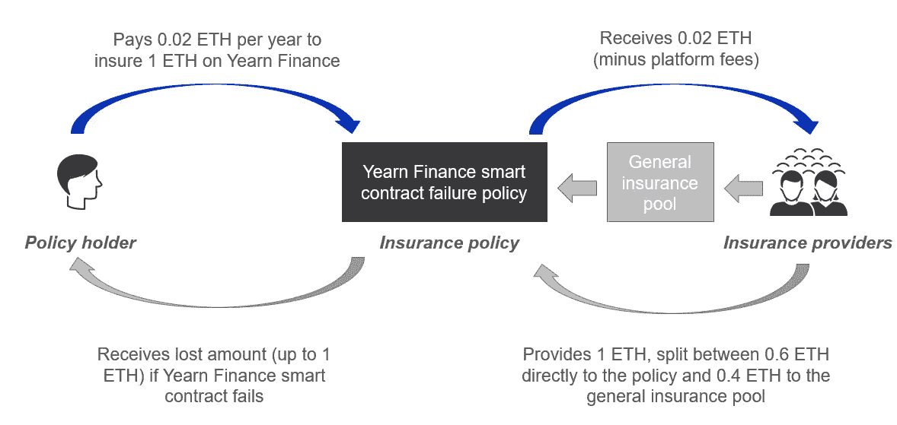

# 为什么加密保险将在 2022 年及以后蓬勃发展

> 原文：<https://medium.com/coinmonks/why-crypto-insurance-is-set-to-boom-416cb30424ba?source=collection_archive---------4----------------------->

## 基于加密的保险概述以及为什么它会破坏交易

[Image credit](https://unsplash.com/photos/mCqi3MljC4E)

保险。虽然不是“最性感”的行业，但不可否认，这是一个巨大的市场——2021 年价值超过 5 万亿美元。与 TradFi 类似，传统保险(TradIn)也受到效率低下和激励失调的困扰，这将被基于加密的保险市场所破坏。

基于加密的保险还处于起步阶段，在撰写本文时，硬币市场的总市值为[~ 12 亿美元](https://www.coingecko.com/en/categories/insurance)。然而，该市场将在未来几年快速增长，可能会从仅提供加密相关风险的保险扩展到更传统的保险类型(尽管需要跨越一些法律和监管障碍)。

但在我们了解为什么加密保险市场将在 2022 年及以后从 TradIn 手中夺取市场份额之前，我们必须首先了解以下几点:

*   什么是加密保险？
*   加密保险的主要类型有哪些？
*   谁是市场的主要参与者？

# 什么是加密保险？

加密保险的功能类似于交易，涉及保单持有人支付一笔金额(保险费)以在某一事件发生时获得损失赔偿。然而，加密保险不同于 TradIn，它允许个人既作为保单持有人又作为保险提供商参与，为分散的保险市场铺平了道路。

让我们通过一个例子来说明。

Crypto insurance example for a Yearn Finance smart contract failure policy

**从投保人角度看保险**

假设个人 A(在上图中被指定为“保单持有人”)拥有价值 1 ETH 的资产，目前押在了渴望金融上。

人 A 担心，在渴望金融的智能合同中可能存在缺陷，这些缺陷可能被利用，导致他们的部分或全部投资损失。

为了覆盖这种风险，人 A 进入加密保险平台(例如，Nexus Mutual 或 Unslashed Finance ),并购买了渴望金融智能合同失败保险。他们获得了全部人寿保险。为了获得这种保险，他们支付 0.02 ETH(注意，这一数额将根据保险的风险状况而有所不同)作为保险费。如果渴望金融公司的智能合同失败，保单将赔偿 A 个人的损失(最多 1 ETH)。

**从保险提供商的角度看保险**

个人也可以通过成为保险提供商来参与加密保险。通常，保险平台允许个人以两种方式出资(本例中为 ETH ):

1.  直接到特定的保险单(例如，渴望金融智能合同失败)
2.  普通保险基金

上图中，保险提供方在向往金融智能合约失效保单中直接锁定 0.6 ETH，0.4 ETH 锁定一般保险池。

保险提供商将收到保单持有人支付的保费(0.02 ETH 减去平台费用)，还将收到锁定 ETH 的一部分投资回报。

如果 Yearn Finance 的智能合约失败，并且保单持有人失去所有 ETH，将首先使用直接保单资本。在某种程度上，有任何剩余的资金没有支付的政策，一般保险池，然后使用。在本例中，假设直接投资理财保单中只有 0.6 个 ETH，普通保险池中剩余的 0.4 个 ETH 将用于弥补保单持有人的损失。

**索赔评估**

由此产生的一个关键问题是，谁真正负责评估损失的保险索赔，并决定是否应该支付保单？

在贸易中，这一功能是通过一个集中的提供者来完成的——该提供者通常有拒绝索赔的动机(因为保险索赔支出会对他们的底线产生负面影响)。在加密保险中，索赔通常由平台令牌的持有者评估，他们投票接受或拒绝索赔。典型的情况是，有内在的激励结构来激励持有人仅仅根据债权的价值来投票。

# 加密保险的主要类型有哪些？

通常，有三种主要类型的加密保险单可用:

1.  **智能合约失败**

涵盖由协议智能合约失败导致的损失。虽然个人保险范围不同，但失败通常包括以下内容:

*   黑客利用智能合同的代码
*   智能合同实施中的错误
*   oracle 功能的失败
*   治理渎职
*   经济设计失败

这种类型的保险覆盖了 2016 年臭名昭著的 DAO hack 的损失，导致在以太坊实施硬分叉之前，[损失了 1.5 亿美元](https://www.gemini.com/cryptopedia/the-dao-hack-makerdao)。

2.**稳定货币脱钩**

涵盖与稳定的硬币失去与特定资产/货币挂钩相关的损失。

例如，如果 USDT 在一段时间内(通常为 2 周)交易低于其盯住汇率(即 1 USDT = 1 美元)，该保单将赔付任何损失。

**3。托管人/汇兑损失**

涵盖托管人/交易所持有的资产损失。这通常涵盖以下原因造成的损失:

*   托管人/交易所持有的资产遭到黑客攻击/盗窃
*   由于特定事件(如政治或监管干预)而在一段时间内(通常为 30-90 天)停止从交易所退市

这种类型的保险覆盖了 2019 年币安黑客攻击造成的任何损失，那次攻击导致 7000 BTC 被盗。

此外，还有其他类型的保险政策可用(虽然不那么普遍)，如项目价值的急剧贬值和 ETH 2.0 验证器削减罚款。随着该行业的发展，更多的保险政策可能会出现。

# 谁是加密保险的主要参与者？

[Nexus Mutual](https://nexusmutual.io/) ($NXM)和 [Insure DeFi](https://insuretoken.net/) ($SURE)合起来约占加密保险总市值的 80%。两者的基础保险模式相对相似，主要区别在于:

*   Nexus Mutual 在加密市场上有一个独特的结构，因为通过持有$NXM 令牌，你就成为该公司的合法成员(这需要你做一个了解你的客户检查)
*   Insure DeFi 要求您通过购买$SURE 代币并启用覆盖范围来获得保险，损失以$SURE 支付。这与你损失的基础资产(上例中的 ETH)的偿还形成对比

市场上也有一些较小的参与者，如 [Unslashed Finance](https://unslashed.finance/) ($USF)、 [Armor。Fi](https://armor.fi/) ($ARMOR)和 [InsurAce](https://www.insurace.io/) ($INSUR)。

un spassed Finance($ term)对索赔评估的态度与上述略有不同，它将索赔评估外包给分散的第三方。这规避了任何来自代币持有者投票反对合法保险索赔的激励问题。

# 加密保险将在 2022 年及以后快速增长的 3 个原因

与交易相比，基于加密的保险市场提供了一种创新的保险方式，并有可能因以下原因而迅速扩大:

**1。对防范持有加密资产固有风险的需求增加**

让我们面对现实吧。加密货币很复杂。即使你精通加密协议，理解智能合约和代码也是非常耗时和技术性的。即使使用智能合同审计，代码中也可能存在最终被利用的错误。此外，还有悬而未决的监管和法律风险，这些风险可能会影响任何水平的研究都无法防范的投资。

随着加密货币的采用不断扩大，越来越多的个人参与到市场中，个人对获得针对难以(或不可能)减轻的加密特定风险的保护的需求也将增加。

**2。加密保险被视为投资类别**

通常情况下，由于保险公司的特殊法律和监管地位，保险一直是投资类别的禁区。尽管保险是一种强大的多样化工具，与更广泛的市场不相关(例如，标准普尔 500 与自然灾害事件不直接相关)，这使其成为一种有吸引力的投资类别。

随着加密保险的持续增长，越来越多的个人可能会作为保险提供商投资他们的资本，以赚取回报。例如，有人可能认为 USDT 与美元脱钩的风险极低，并可能决定为与美元脱钩的保单提供资本，让它们从该保单中获得持续的回报。

**3。扩展到非加密保险**

目前，加密保险市场仅提供针对特定加密风险的保险。然而，随着市场的增长，加密保险模式可能会扩展到贸易领域(注意，需要克服一些监管和法律障碍)。基于加密的保险有可能从 TradIn 那里夺取市场份额，这是因为该模式固有的三个关键优势:

*   **更低的成本:**与覆盖相关的成本应该更低，因为没有集中的中介，并且很大一部分后台职能能够通过智能合同实现自动化
*   更有效的保单定价:基于密码的保险应该会导致更有效的保单定价，从而形成一个更好的市场。这是因为定价是(来自保单持有人和保险提供商的)供求动态的函数，它决定了要支付的保险费。保单的风险越高，资本提供者就越不愿意参与，而保单持有人就越想获得保险。这将允许溢价金额调整，以创造一个有效的均衡价格
*   **消除不正当的激励:**在贸易中，集中的一方既是索赔的评估者，也是索赔的支付者。因此，存在拒绝保险索赔的动机。基于加密的保险则不是这种情况，这些功能是分开的，保险提供商被鼓励根据他们的优点批准索赔

> 加入 Coinmonks [电报频道](https://t.me/coincodecap)和 [Youtube 频道](https://www.youtube.com/c/coinmonks/videos)了解加密交易和投资

## 另外，阅读

*   [Bookmap 评论](https://blog.coincodecap.com/bookmap-review-2021-best-trading-software) | [美国 5 大最佳加密交易所](https://blog.coincodecap.com/crypto-exchange-usa)
*   [最佳加密交易信号电报](/coinmonks/best-crypto-signals-telegram-5785cdbc4b2b) | [MoonXBT 评论](/coinmonks/moonxbt-review-6e4ab26d037)
*   [OKEx 评论](/coinmonks/okex-review-6b369304110f) | [Coinswitch 俱吠罗评论](/coinmonks/coinswitch-kuber-review-1a8dc5c7a739) | [比特币基地收费](/coinmonks/coinbase-fees-831e77d4f2c5)
*   [AscendEX 审查](/coinmonks/ascendex-review-53e829cf75fa) | [OKEx 交易机器人](/coinmonks/okex-trading-bots-234920f61e60) | [OKEx 交易机器人](/coinmonks/okex-trading-bots-234920f61e60)
*   [火币交易机器人](https://blog.coincodecap.com/huobi-trading-bot) | [如何购买 ADA](https://blog.coincodecap.com/buy-ada-cardano) | [Geco？一次审查](https://blog.coincodecap.com/geco-one-review)
*   [币安 vs 比特邮票](https://blog.coincodecap.com/binance-vs-bitstamp) | [比特熊猫 vs 比特币基地 vs Coinsbit](https://blog.coincodecap.com/bitpanda-coinbase-coinsbit)
*   [如何购买 Ripple (XRP)](https://blog.coincodecap.com/buy-ripple-india) | [非洲最好的加密交易所](https://blog.coincodecap.com/crypto-exchange-africa)
*   [非洲最佳加密交易所](https://blog.coincodecap.com/crypto-exchange-africa) | [胡交易所评论](https://blog.coincodecap.com/hoo-exchange-review)
*   [eToro vs 罗宾汉](https://blog.coincodecap.com/etoro-robinhood)|[MoonXBT vs Bybit vs Bityard](https://blog.coincodecap.com/bybit-bityard-moonxbt)
*   [Stormgain 评论](https://blog.coincodecap.com/stormgain-review) | [Probit 评论](https://blog.coincodecap.com/probit-review) | [北海巨妖评论](/coinmonks/kraken-review-6165fc1056ac)
*   [如何在势不可挡的域名上购买域名？](https://blog.coincodecap.com/buy-domain-on-unstoppable-domains)
*   [印度的秘密税](https://blog.coincodecap.com/crypto-tax-india) | [altFINS 审查](https://blog.coincodecap.com/altfins-review) | [Prokey 审查](/coinmonks/prokey-review-26611173c13c)