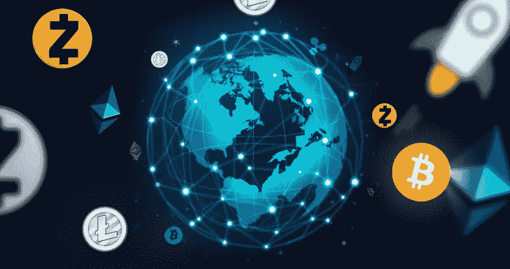
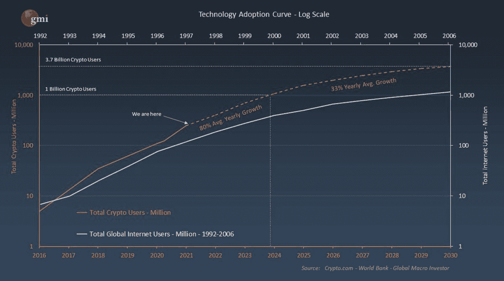

# 为什么今天的加密波动看起来像几年前的科技股

> 原文：<https://medium.com/coinmonks/why-crypto-volatility-today-looks-like-tech-stocks-did-years-ago-552d9d44adfa?source=collection_archive---------64----------------------->

许多人认为 crypto 非常投机，通常称之为赌博。然而，事实是，区块链/加密货币领域与 20 世纪 90 年代的科技股有许多相似之处。

# 回顾一下科技股和网络股

上世纪 90 年代，科技股经历了一个史无前例的时代，股价暴涨，然后暴跌。90 年代末，当纳斯达克指数从 1，000 点上升到 5，000 点时，基于互联网的公司开始大肆宣传并呈指数增长。这些公司在这些年里波动性很大，交易量也很大。

在接下来的十年里，情况发生了变化，这些股票经历了熊市，许多被认为是该领域最佳选择的公司破产了。这一事件使得一类投资者不愿投资新技术。那些在过去遭受巨大损失的人看待加密的眼光和看待网络公司一样。

# 为什么 crypto 的情况类似于网络科技公司？

加密货币很不稳定，因为它们仍处于起步阶段。这项技术仍然是新的，就像 90 年代的网络热潮一样，它的未来充满不确定性。此外，新兴趋势和低市值行业通常在到期前会有波动。

其波动性的另一个原因是任何中央当局都不监管它们。没有实体来控制它们的价值，导致大幅波动。

# 向他们学习什么，为什么我们还在起步阶段？

我们可以从互联网股票崩盘中学到，首先，意识到市场泡沫并避免在任何一个行业投资过多是很重要的。此外，分散投资组合也很重要，这样你就不会过于暴露于任何特定的资产。最后，通过充分跟踪行业趋势和市场演变，可以安全地管理和调整投资组合。

如果你看一下下面的图表，你会发现 90 年代的全球互联网用户采用率和 2016 年以来的加密用户之间有很高的相关性。我们大约有 3 亿用户，预计 2024 年市场将达到 10 亿用户。相比之下，互联网今天有 49.5 亿用户。

我们仍处于一个看涨的新兴行业，所有迹象都表明未来主流会采用这一行业。正如沃伦·巴菲特所说，“永远要长期投资。”当这个网络成熟时，那些已经在这个领域投资的人将会看到巨大的回报。

市场强烈认为，区块链技术将在未来十年发挥重要作用，在 30 多个不同领域得到应用，就像互联网科技公司在 90 年代在 T2 一样。例如，许多曾经看空比特币的银行现在开始投资代币和这个领域。监管开始激增，金融正在被重塑。

总的来说，区块链、web 3.0 和加密技术消除了摩擦，建立了信任，并释放了各行各业的新价值。几个例子是:

*   **银行业:**安全性高、费用低的 P2P 交易将重新定义银行和金融机构的运作方式；
*   **网络安全:**交易可被记录，无需信息泄露，为私密数据带来更多安全保障；
*   **医疗保健**:大数据区块链合同使安全传输敏感医疗信息成为可能，提供了对医疗文件的私人和方便的访问；
*   **房地产**:分散的产权登记系统，使产权签发瞬间完成，提高了转让过程的速度。此外，可以使用加密货币购买房产。

# 结论

如今的加密波动看起来很像多年前的网络科技股。该行业仍处于早期阶段。该技术在不同领域有很大的发展空间和用途。

波动是自然的，在接下来的几年里，许多项目会失败(就像在任何其他领域一样)，而一些项目会成功并有巨大的回报。在前进的道路上会有一些坎坷，但是 crypto 的长期前景是非常光明的。有了理性的宏观方法和平衡的投资组合，你就有信心投资该领域。

*如果您是合格投资者，并想了解更多关于我们产品的信息，请* [*联系我们。*](https://robertventures.com/)

[*乔罗伯特*](https://joerobert.com/) *现任罗伯特风险投资公司首席执行官，拥有超过 20 年的资产管理经验。自从乔创业以来，他已经为投资者创造了可预见的两位数回报。Joe 已经投资了股权和代币的种子轮，以及比特币、以太坊和其他顶级加密货币的投资组合。*

如果您是合格投资者，并想了解更多关于我们产品的信息，请 [*联系我们。*](https://robertventures.com/)

> 加入 Coinmonks [电报频道](https://t.me/coincodecap)和 [Youtube 频道](https://www.youtube.com/c/coinmonks/videos)了解加密交易和投资

# 另外，阅读

*   [Bookmap 点评](https://coincodecap.com/bookmap-review-2021-best-trading-software) | [美国 5 大最佳加密交易所](https://coincodecap.com/crypto-exchange-usa)
*   最佳加密[硬件钱包](/coinmonks/hardware-wallets-dfa1211730c6) | [Bitbns 评论](/coinmonks/bitbns-review-38256a07e161)
*   [新加坡十大最佳加密交易所](https://coincodecap.com/crypto-exchange-in-singapore) | [购买 AXS](https://coincodecap.com/buy-axs-token)
*   [红狗赌场评论](https://coincodecap.com/red-dog-casino-review) | [Swyftx 评论](https://coincodecap.com/swyftx-review) | [CoinGate 评论](https://coincodecap.com/coingate-review)
*   [投资印度的最佳密码](https://coincodecap.com/best-crypto-to-invest-in-india-in-2021)|[WazirX P2P](https://coincodecap.com/wazirx-p2p)|[Hi Dollar Review](https://coincodecap.com/hi-dollar-review)