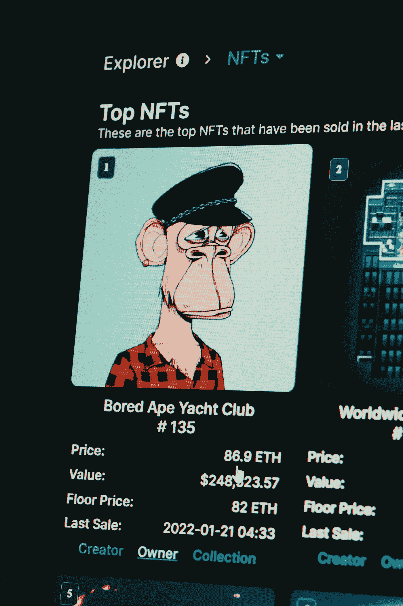

# 为什么加密货币会存在

> 原文：<https://medium.com/coinmonks/why-cryptocurrencies-are-here-to-stay-30f8cdfa40d7?source=collection_archive---------37----------------------->

## 以及你应该投资什么。

Photo by [Niranjan _ Photographs](https://unsplash.com/@niranjan_photographs?utm_source=unsplash&utm_medium=referral&utm_content=creditCopyText) on [Unsplash](https://unsplash.com/s/photos/blockchain?utm_source=unsplash&utm_medium=referral&utm_content=creditCopyText)

在过去的几年里，区块链行业随着大量的投资和项目而蓬勃发展。虽然有些比其他的更好，但在某种程度上，如果所有这些新项目和硬币实际上都是合法的，或者只是一个大规模的抽水和倾倒计划，那就真的成了问题。