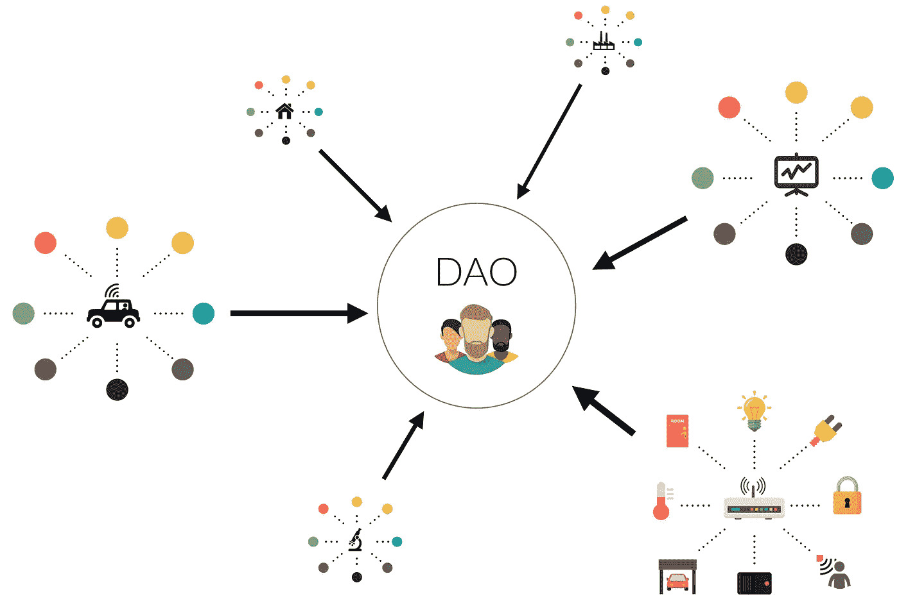

# 为什么是分散自治组织(Dao)？

> 原文：<https://medium.com/coinmonks/why-decentralized-autonomous-organizations-dao-ebc86ce54abd?source=collection_archive---------43----------------------->

## DAOs 可以完全改变商业游戏！但是怎么做呢？

Source : [Blockchaihub](https://blockchainhub.net/)

AOs 在加密领域是一项非常有用的技术。它将**彻底改变组织的未来。**

Dao 是运行在区块链技术上的组织。它由智能合约算法控制。

[去中心化](https://link.medium.com/jFZfj4dkPpb)自治组织可以消除传统集权的董事会成员和公司 CEO。它也可以在没有人类干预的情况下运行。

任何地方的任何人都可以在没有首席执行官的情况下在 DAOs 上经营自己的企业。此外，他们还可以实现自动化。

与传统组织不同，他们致力于投票权。每个股东都可以投票通过或取消一项提案。或者甚至为未来的发展提出新的建议。

在集权组织中，首席执行官可以操纵规则。但是在 DAO 中，一旦规则在以太坊智能合约上存活，单个权威机构就不能改变预定义的规则，除了投票权。

## 好吧——但是 DAOs 如何革新商业的未来呢？

你知道吗？像苹果、特斯拉、亚马逊和网飞这样的大公司都有一个由一些知名股东组成的董事会。而董事会决定公司的未来或者提交一个新的提案来改变或者增加一些东西。然后，首席执行官检查提案，看它是否符合公司规定。难道不是一个偷懒的过程吗？

**那么我们可以用技术来代替这个问题吗？**当然，所有这些都可以用 DAOs 来消除，并且可以自动化这个过程。

[Dao](https://ethereum.org/en/dao/)是自我可持续和自我验证的，因为它们在区块链智能合约上工作。

开源代码使得 DAOs 比传统系统更加可靠。任何人都可以看到源代码，发现 bug，并通过投票提交改进建议。

## 刀的缺点是-

运行 DAO 的两个主要缺点是-

1.  易受攻击:任何人都可以查看代码，因为它是开源的。这意味着黑客也可以读取代码。他们可以对代码进行逆向工程。或者甚至在部署之前测试它，以检查它是否工作。如果他们的逆向工程成功，他们就可以窃取锁定的资金。
2.  **没有商业秘密:**大公司总是做超前的研究，不看即时利润，因为他们希望有一天会有回报，他们会利用快速移动的优势。因为他们有独特的想法。但是在一个道上，你不能保守商业秘密。任何人都可以在你之前阅读代码并利用研究优势。

## 道的好处-

运行 DAO 的四个主要好处是

1.  不信任:你不需要相信任何 CEO 或经理的决策能力。本组织将继续其进程。不管主要开发商或资金是否消失。而这些都是跑刀的好处。
2.  **去中心化:**没有一个权力机构或个人可以完全控制一个道。这就是 Dao 没有单点故障的原因。它的分散性增加了安全性。这就是为什么它消除了不确定性。
3.  **透明:**没有隐藏的机制存在。开源和开放市场保证了风险企业的可持续融资模式。任何人都可以看到幕后发生的事情。
4.  自动化:多亏了智能契约，一旦预定义的 DAO 规则生效，决策就会自动执行，无需人工干预。

Follow me on [Instagram](https://www.instagram.com/diltoshi), [LinkedIn](https://www.linkedin.com/in/dilwarchoudhury1) & [Twitter](https://twitter.com/Diltoshi) to get daily updates in 1 min

> 加入 Coinmonks [电报频道](https://t.me/coincodecap)和 [Youtube 频道](https://www.youtube.com/c/coinmonks/videos)了解加密交易和投资

# 另外，阅读

*   [Bookmap 评论](https://coincodecap.com/bookmap-review-2021-best-trading-software) | [美国 5 大最佳加密交易所](https://coincodecap.com/crypto-exchange-usa)
*   最佳加密[硬件钱包](/coinmonks/hardware-wallets-dfa1211730c6) | [Bitbns 评论](/coinmonks/bitbns-review-38256a07e161)
*   [新加坡十大最佳加密交易所](https://coincodecap.com/crypto-exchange-in-singapore) | [购买 AXS](https://coincodecap.com/buy-axs-token)
*   [红狗赌场评论](https://coincodecap.com/red-dog-casino-review) | [Swyftx 评论](https://coincodecap.com/swyftx-review) | [CoinGate 评论](https://coincodecap.com/coingate-review)
*   [投资印度的最佳密码](https://coincodecap.com/best-crypto-to-invest-in-india-in-2021)|[WazirX P2P](https://coincodecap.com/wazirx-p2p)|[Hi Dollar Review](https://coincodecap.com/hi-dollar-review)