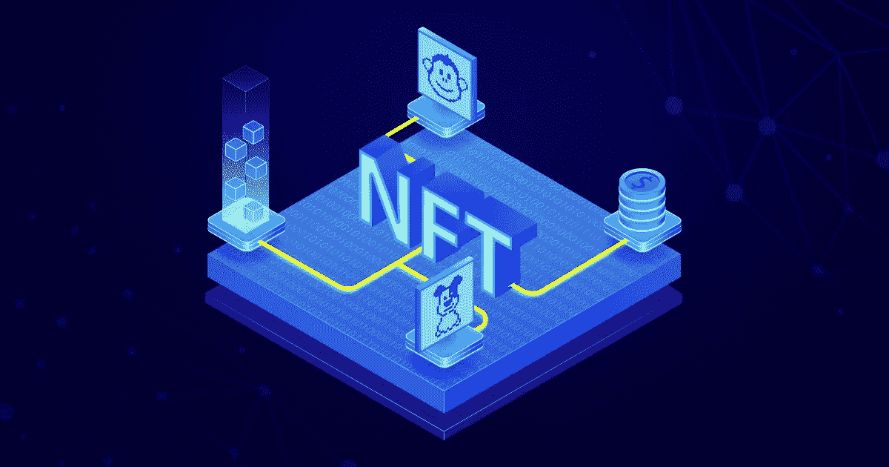
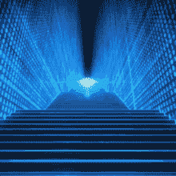

# 为什么不可替代的令牌开发服务会带来更好的未来？

> 原文：<https://medium.com/coinmonks/why-do-non-fungible-token-development-services-pose-a-better-future-9b795e6150a1?source=collection_archive---------45----------------------->

> NFT 这个词现在得到了最多的关注，对 NFTs 的狂热是真实的。您知道 2021 年 NFTs 的销售额约为 410 亿美元，比上一年的 3.4 亿美元增长了 100 倍吗？仅在 2021 年最后一个季度，销售额就贡献了约 110 亿英镑。这标志着 NFT 热的开始。随着元宇宙的崛起，不可替代的令牌开发正在成为一个永久的地方。

现在，FTs 给收藏品下了一个新的定义，它不仅仅适用于对独特的数字资产和艺术家感兴趣的人。就像区块链一样，NFT 无处不在。它们被有效地应用于许多奢侈时尚品牌、音乐家、作家、体育明星等等。您知道现在人们以 NFTs 的形式购买博彩门票吗？这是一篇关于 NFT 发展的短文。

## 💡**为什么 NFT 会被炒作？**

你一定知道 [**不可替代代币开发**](https://www.appdupe.com/non-fungible-token-development?utm_source=google&utm_medium=blog&utm_campaign=monika) 在区块链提供数字或任何不可转让资产的独家所有权。因为每个 NFT 都是独一无二的，具有各种不同的属性，所以即使是相同标准的，也不能与另一个 NFT 互换。人们总是对独一无二的物品有独特的眼光，这些物品是不可复制的，并且是同类中的一种。NFT 就是区块链上的一件这样的物品，使它成为现代收藏品。人们过去常常追求稀有艺术品、手工艺品和资产的时代早已过去。由于区块链提供由智能合约支持的不可修改和不可变更的所有权，这些天人们更喜欢 NFT。

你知道吗，人们甚至用区块链来标记他们的不动产。NFTs 像野火一样增长，现在地球上的每个角落都在了解 NFTs。

## 💡**NFTs 的未来预测**

尽管一些 NFT 收藏品、艺术品和其他 NFT 游戏得到了公众的热烈响应，但 NFTs 的功能并不仅限于此。有许多奢侈品牌采用 NFT 来描绘他们新的独特风格。许多总部设在英国和欧洲的品牌，如耐克、古驰、Lv 和其他品牌，已经采用了区块链，并铸造了他们独特的风格作为非传统服装。元宇宙是一种未来技术，它将 NFTs 作为其支柱。虽然这项技术仍在发展中，但人们的反应非常热烈。这将把 NFTs 带到未来的范围

## 💡 **NFTs 和元宇宙**

马克·扎克伯格在将脸书改为 Meta 后，引用元宇宙将在未来 6 到 10 年内达到数十亿用户。元宇宙由包括区块链网络在内的多项强大技术提供支持。

元宇宙是一个数字世界，在这里人们可以与他人互动，在虚拟空间中度过他们的时间，就像在现实世界中一样。它就像一个多元宇宙，你生活在现实世界中，可以通过混合现实耳机进入虚拟世界。你出现在你的 3D 虚拟形象中，你也可以通过元宇宙做你所有的日常活动。

你在现实世界中拥有大量资产。但是在元宇宙你是怎么做到的呢？这就是 NFT 的切入点。元宇宙以法典的形式提供了对区块链不可修改和不可取消的所有权。在 NFTs 的帮助下，人们可以拥有土地和建筑、配件、头像等等。因此，非关税壁垒就像元宇宙的货币或债券。

> 变化是不可避免的，这符合现实。元宇宙是自然进化的。变化使圣人成为罪人，反之亦然。同样，尘埃变成人，人变成神，神变成尘埃。

## 💡**到处都是 NFTs】**

除了数字资产和元宇宙，还有许多地方的企业家正在有效地使用不可替代的令牌开发。这里给出了其中一些

🏷️NFTs 被积极地用作游戏和电影的数字门票、会员卡、唯一身份以及其他唯一且不能被篡改的唯一优惠券。

🏷️NFTs 积极申请各个领域的知识产权专利。在区块链上蚀刻一个专利将提供一个无法破解的安全保护

🏷️Logistics 是另一个可以积极利用非功能性营销来提及独特奢侈品的领域。NFTs 和区块链为物流和供应链提供了难以想象的透明度。

🏷提供各种银行功能的️Decentralized 融资是当今的趋势。一些 defi 贷款可能需要资产作为抵押。NFT 充当独特的抵押品。通过这种方式，他们提高了 defi 的流动性，从而在区块链世界形成了有价值的资产。

## 💡**结果**

[**不可替代令牌开发服务**](https://www.appdupe.com/non-fungible-token-development?utm_source=google&utm_medium=blog&utm_campaign=monika) 是现在区块链最想要的服务。这不仅仅是针对企业家、艺术家、企业、体育明星、音乐家、时尚产业、内容创作者等。非技术产业正在迅猛发展，它们将帮助每一个行业。如今，有许多基于 NFT 的平台、游戏、市场和发射台出现，以满足日益增长的观众的需求。非功能性技术不会像其他来来去去的技术一样消亡。它将永远存在，因为每样东西在某种程度上都是独一无二的。

> 加入 Coinmonks [电报频道](https://t.me/coincodecap)和 [Youtube 频道](https://www.youtube.com/c/coinmonks/videos)了解加密交易和投资

# 另外，阅读

*   [加密复制交易平台](/coinmonks/top-10-crypto-copy-trading-platforms-for-beginners-d0c37c7d698c) | [Coinmama 审核](/coinmonks/coinmama-review-ace5641bde6e)
*   [印度的加密交易所](/coinmonks/bitcoin-exchange-in-india-7f1fe79715c9) | [比特币储蓄账户](/coinmonks/bitcoin-savings-account-e65b13f92451)
*   [OKEx vs KuCoin](https://coincodecap.com/okex-kucoin) | [摄氏替代品](https://coincodecap.com/celsius-alternatives) | [如何购买 VeChain](https://coincodecap.com/buy-vechain)
*   [币安期货交易](https://coincodecap.com/binance-futures-trading)|[3 commas vs Mudrex vs eToro](https://coincodecap.com/mudrex-3commas-etoro)
*   [如何购买 Monero](https://coincodecap.com/buy-monero) | [IDEX 评论](https://coincodecap.com/idex-review) | [BitKan 交易机器人](https://coincodecap.com/bitkan-trading-bot)