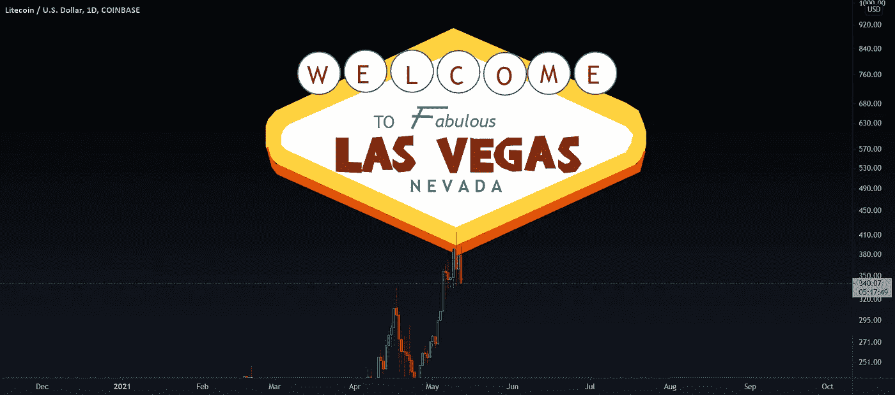
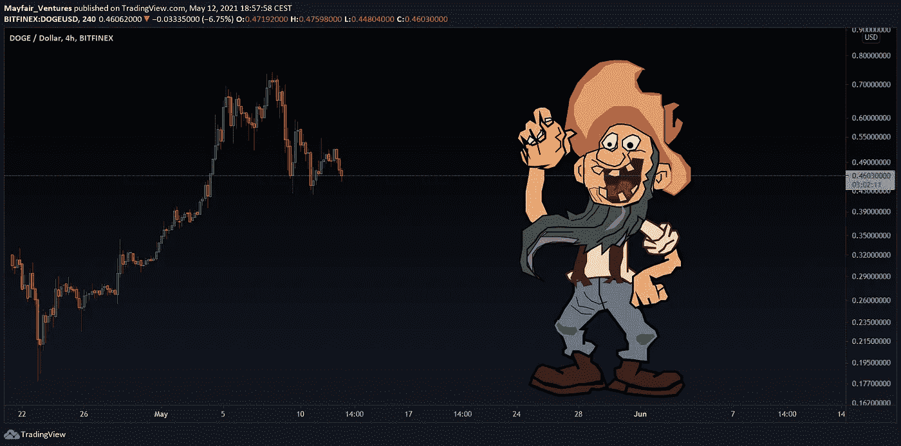

# 人们为什么投资加密？

> 原文：<https://medium.com/coinmonks/why-do-people-invest-in-crypto-3de3b66371ed?source=collection_archive---------16----------------------->

这里有一些关于投资的原因和目前投资加密的人的类型的信息。

全球金融危机爆发后，加密技术于 2009 年首次推出，作为人们控制自己资金的一种方式，而不是银行和政府。所以，这是第一个感知，人类想要控制的感觉，他们渴望拥有。拥有一部分金融市场就是我们的大脑计算拥有密码的方式。不管是有意识的还是无意识的，我们都一样。

起初，许多人对是否投资 crypto 持怀疑态度。整个部门被认为高度不稳定，面临着价格的大幅波动。然而，直到今天仍然如此，澳大利亚和瑞士等一些国家通过引入法律法规，使日常使用加密支付更加容易，从而为加密货币的投资铺平了道路。

问题是其他一些人一直在积极试图禁止和拖延他们。中国、印度和沙特阿拉伯是禁止加密货币交易或不能使用加密货币进行支付的国家中的佼佼者。这将减缓整体市场增长，因为加密需要大规模采用才能蓬勃发展，而大规模采用需要全球用例。

就一个用例而言——比特币的用户群已经从 2013 年的 12 万用户增加到了截至 2020 年的 4500 万用户。所以，我们可以清楚地看到兴趣。大多数人仍然认为加密是一种欺诈——它对市场活动没有任何帮助，骗子在真正的项目中活动，正如他们所说，你只需要一个美中不足的地方。

好的，使用、交易或投资加密技术的人的类型是:

1)忠实者——该技术的早期采用者和信徒，与那些想拯救地球、为家庭购买太阳能电池板或电动汽车的人没什么不同。

2)害怕经济、政府和银行的人是邪恶的。拥有我们自己的一块馅饼是有意义的。(你有没有想过，为什么[国安局](https://www.tradingview.com/symbols/NYSE-NSA/)不能破解它的来源是多么奇怪？为了使争论更有趣，我们正在讨论一种不可变的基于分类帐的技术。)

3)发展中国家——在这些国家，对政府缺乏信任让人无话可说，像尼日尼亚和哥伦比亚这样的国家是比特币交易量最高的国家。

4)酷孩子——拥有密码是件新鲜事。问问帕丽斯[希尔顿](https://www.tradingview.com/symbols/NSE-HILTON/)或者[埃隆马斯克](https://www.tradingview.com/symbols/NASDAQ-TSLA/)。

5)大盘股投资者；这个对我来说很有趣。现在，大多数委托基金经理进行投资决策的高净值个人都希望接触加密技术。问题是，这些都是老掉牙的钱(大部分是老掉牙的钱),而基金经理的平均水平仍然落后 30 年。所以对这些人来说，要么时髦，要么去 BTC，因为那看起来风险更小。

6)快速致富**的人**——因为邮递员告诉他们，他认识一个通过交易密码致富的人，跳进来买——通常是用疯狂的杠杆，而且经常是在市场高峰期。如果这是一个金字塔骗局，这些就是你在底部找到的人。经常在聚会上失败或迟到，在超越朝九晚五工作的同时，兑现致富的承诺。

隐秘的[波动性](https://www.tradingview.com/ideas/volatility/)对大多数人都有吸引力，寻求刺激感很有吸引力。人们把投资密码市场的感觉比作在拉斯维加斯。
[https://s3.tradingview.com/snapshots/h/h...](https://s3.tradingview.com/snapshots/h/hwnYC5hd.png)

拉斯维加斯于 1905 年建立，并于 1911 年正式合并。在 20 世纪末，它是该世纪建立的人口最多的美国城市(芝加哥在 19 世纪也获得了类似的荣誉)。自 20 世纪 60 年代以来，人口增长加速，1990 年至 2000 年间，人口增长了 85.2%，几乎翻了一番。根据美国人口普查局的估计，快速增长持续到 21 世纪。在拉斯维加斯，总有事情发生，不像股票市场。

然后，年轻人，特别是那些喜欢玩视频游戏的人，在玩最新的 COD 游戏(使命召唤，对那些不喜欢游戏的人来说)时，会在 crypto 中找到同样的肾上腺素激增。他们被高风险投资所吸引是完全合理的。可能是因为这也是一种虚拟的感觉？？？

回到拉斯维加斯——在 20 世纪 60 年代，企业和商业大亨如霍华德·休斯正在建造和购买酒店赌场。赌博被称为“游戏”，这使它过渡到一个合法的业务。就像加密成为主流一样。

问自己几个问题，谁控制着拉斯维加斯？谁经常在拉斯维加斯发财？谁在赌桌上经常输？

许多新的“交易者”希望赚大钱，就像拉斯维加斯的赌桌一样。这些人将他们从其他来源获得的所有储蓄都投资到了 crypto &他们希望 crypto 的价值最终会上升，并且他们过度杠杆化的头寸不会被追加保证金。

这些人受到其他普通人通过投资 Crypto 而致富的故事的影响&他们渴望加入这个俱乐部。

就像任何职业或行业一样，如果你想成为专家。你需要奉献时间，做功课，学习诀窍。如果你一夜暴富，这并不意味着你是一个优秀的交易者，这意味着你很幸运。像埃隆·马斯克(Elon Musk)这样的人可以承受账面损失(亏损)，晚上仍然可以睡觉，当你的账户杠杆过高，你不知道下一步该怎么走时，这将导致许多希望在 T2 淘金的人彻夜难眠。

对于大多数新投资者、交易者、投机者来说，这就是赌博的意义所在——赌博是希望赚大钱的刺激。

放轻松，投资应该是长期的——问问任何专业交易者，财富可以在一天之内创造和失去。诀窍是留在游戏中…

加入我们的纷争:【https://discord.gg/5t3w47raHe】T4

在交易视图中跟随我[https://www.tradingview.com/u/Mayfair_Ventures/](https://www.tradingview.com/u/Mayfair_Ventures/)

**免责声明**
此观点不构成财务建议。这只是为了教育的目的，我们的主要交易者在股票、ETF 和外汇方面有超过 20 年的经验。因此，每个交易设置可能有不同的持有时间，进入或退出条件，并会有所不同。你可以利用这篇文章中的信息为讨论的工具制定你自己的交易计划。交易带有风险；很大一部分散户亏钱。进入任何行业时，请记住这一点。注意安全。

> 加入 Coinmonks [电报频道](https://t.me/coincodecap)和 [Youtube 频道](https://www.youtube.com/c/coinmonks/videos)了解加密交易和投资

# 另外，阅读

*   [Godex.io 审核](/coinmonks/godex-io-review-7366086519fb) | [邀请审核](/coinmonks/invity-review-70f3030c0502) | [BitForex 审核](https://coincodecap.com/bitforex-review)
*   [10 本关于加密的最佳书籍](https://coincodecap.com/best-crypto-books) | [英国 5 个最佳加密机器人](https://coincodecap.com/uk-trading-bots)
*   [Koinly 回顾](https://coincodecap.com/koinly-review) | [Binaryx 回顾](https://coincodecap.com/binaryx-review) | [Hodlnaut vs CakeDefi](https://coincodecap.com/hodlnaut-vs-cakedefi-vs-celsius)
*   [MoonXBT vs Bybit vs 币安](https://coincodecap.com/bybit-binance-moonxbt) | [硬件钱包](/coinmonks/hardware-wallets-dfa1211730c6)
*   [火币交易机器人](https://coincodecap.com/huobi-trading-bot) | [如何购买 ADA](https://coincodecap.com/buy-ada-cardano) | [Geco。一次审查](https://coincodecap.com/geco-one-review)