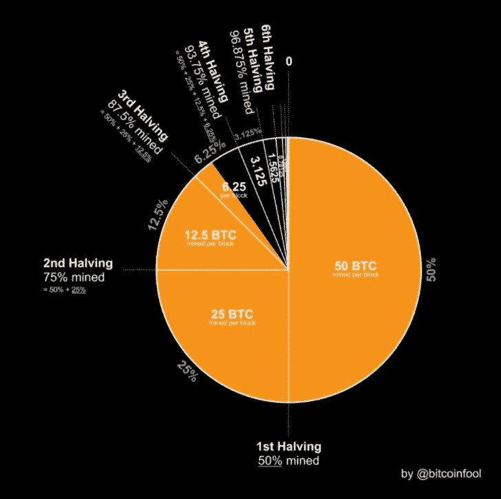

# 人们为什么喜欢比特币？

> 原文：<https://medium.com/coinmonks/why-do-people-like-bitcoin-18c17e70e500?source=collection_archive---------35----------------------->

比特币是由一个用户名为中本聪的匿名人士创造的。它旨在解决一个简单的问题。防止重复交易。因为有了这个系统，聪创造的交易中的失败可以减少。他/她一点也不知道它会变得如此巨大。
可以把题目的答案分成 2 部分？

1.  技术的
2.  经济的

我将在这篇文章/博客中讨论技术部分。交易比特币不需要知道所有这些，也不需要知道为什么比特币对经济有益。这篇文章/博客将只涉及比特币如何工作，即比特币的技术方面。

# 比特币是如何运作的？为什么这么安全？

为了了解比特币的工作原理，让我们举个例子。
想象你和你的朋友决定做一个账本(一个可以记下谁欠谁钱的地方)。
**甲**给**乙** 20 美元。然后你得在总账上写 **B** 欠 **A** 20 美元。但这里的问题是，人们可以写任何东西。就像在**中，A** 可以写一千次“ **B** 欠 **A** 100 美元”，没有人会知道是谁写的。

因此，人们可以做的是，在他们写下自己的名字后，必须使用数字签名。这个数字签名是如何工作的？我们现在开始学一些数学，所以开动脑筋吧。
数字签名不仅仅是由 1 和 0 组成的图片。有点特别。首先，您需要一个公钥和一个私钥，这样数字签名才能工作。这种数字签名在每封邮件中都会发生变化。即使您稍微更改了邮件，数字签名也会发生很大变化。用数学解释它

***签名(消息，秘密 _ 密钥)=签名*
*验证(消息，签名，公开 _ 密钥)=真/假***

因此，我们可以理解，只有您可以生成签名(由于密钥)，没有人可以复制您的签名并将其粘贴到另一个消息中，因为该消息也参与生成签名。验证功能只输出真或假，即它验证签名。产生的签名有 256 个数字，都是 1 或 0。所以有 2 个⁵⁶签名的不同可能组合。这个数字是巨大的。

***2⁵⁶= 11579209000000000000000000000000000000000000000000***

这个数字有多大。因此，您可以非常确定，如果有人使用了数字签名，他将只使用相应的密钥。但是，还是有一个问题。一个人可以在分类帐中任意多次复制和粘贴相同的消息。因此，我们可以做的是，每封邮件应该以不同的索引号开始，这样所有的邮件都是不同的，没有人能够伪造数字签名。

**所以到目前为止，我们的分类帐协议看起来像这样**

1.  **任何人都可以向分类账添加行**
2.  **每月用真钱结算**
3.  **只有已签名的交易才有效**

但是，如果有人在月底没有出现支付这笔钱呢？例如，分类帐看起来像这样

1.  甲支付乙 69 美元(乙的数字签名)
2.  甲支付给丁 420 美元(丁的数字签名)
3.  甲付给丙 100 美元(丙的数字签名)

结果是，A 在月底再也没有来还钱。对此有一个简单的解决方案。在月初，每个人都必须在账上存一定数量的钱，一个人只能借他/她账上剩下的钱。
例如，甲在分类账中放入 500 美元。所以他只能向任何人借 500 美元

1.  甲支付给丁 420 美元(丁的数字签名)
2.  甲支付乙 69 美元(乙的数字签名)
3.  甲付给丙 100 美元(丙的数字签名)

在这个例子中，第三个报表不会被接受，因为 A 只在分类账中放了 500 美元，他超支了。现在我们可以看到，我们已经达到了一个点，我们可以将我们的真实货币转换为分类帐货币，并只在朋友之间使用分类帐货币。

但是这个系统仍然需要一点信任。比如谁控制着往账本里添加东西的规则。谁主持了《纪事报》的网站？因此，为了消除这一点信任，我们可以做的是给每个人一份分类账的副本，并广播每个新交易的信号，然后每个人都可以在他们的分类账中记录交易。但是，一个人如何知道哪个交易是正确的还是错误的呢？为此，需要更多的数学知识。所以让我们深入研究一下

有一个名为 SHA256 的函数，它接受任何类型的文本并输出一个散列。例如，如果您输入 **Viram Mehta** ，它将输出**24 a10 E1 d 386 FDE 074 BD 96537 eab 727367214 b 0 c 98 ca 64 a 173 C1 edd 6539 ef7d 9**。如果你输入**Viram methaa**它会输出**17 b 6 D2 FCA 7 Fe 444 EC 15 b 849 cf bec 13682 a 36d 153195 b 55 fed 876 BF 51400411 E5**。只要多加一个 a，输出就完全变了。它看起来是随机的，但事实并非如此。这些散列是 256 位散列。SHA256 是一个不可逆的哈希函数。因此，如果你有输出，你就不能得到输入。最好的办法是一个一个人工检查。

回到我们如何阻止虚假交易。使用比特币时发生的情况是，每 2400 笔交易被放在同一个文件中，在文件的底部，人们必须找到以特定数量的 0 开头的哈希。最先找到这个哈希的节点会获得一定的奖励。节点只是比特币网络中的一台计算机，其工作是查找哈希。散列的文本是文件中的事务。让我们称这个文件为块。被验证的块然后被广播给每个人，并且他们可以在他们各自的分类账中记录所有这些交易。下一个块必须包含前一个块的散列，并且它也有一个必须找到的散列。由于这个原因，很难改变块的顺序，因为它们需要前一个块的散列。

假设一个节点接收 2 个不同的块，那么该节点将产生 2 个不同的链，并且将变长的链将被该节点接受。这使得任何人都很难入侵网络，因为黑客将不得不继续做越来越多的计算工作来保持他/她的链更长。为此，黑客必须控制网络中 51%的计算能力。

挖掘者，即找到每个块的散列的节点，如果他们找到一个散列，就会得到奖励。开始时是 50 比特币，随着越来越多的比特币被开采，价格减半。因此，我觉得黑客攻击网络的动机更少，因为黑客可能也持有一些比特币(因为黑客必须是网络的一部分，也要挖掘比特币才能成功交易)，一旦消息传出，人们将失去希望，所有比特币都将变得一文不值。再加上控制 51%计算能力的成本也非常高。就好像你在和全世界作对。

所以现在让我们一起来看看它的作用。
**甲**支付**乙** 20 美元。该消息首先被验证，然后被放入一个块中。然后，矿工们开始比赛寻找区块的哈希，找到它的人会得到奖励。然后广播该块，所有节点记录这些事务。如果有人广播一个错误的块，所有的节点仍然会注意到事务，并跟踪两个链。会变长的链会被保留，另一个会被擦除。

这就是为什么自比特币网络诞生以来，没有一次交易失败。你听到/读到的所有欺诈案例都只是因为人们误操作了比特币钱包的密码。

谢谢你读到这里。我希望这能消除你对比特币安全性的一些疑虑。如果你发现除了控制比特币网络 51%的计算能力之外，还有其他方法可以入侵比特币网络，请在评论区随意输入。我将在下一篇博文中讨论比特币的经济方面。

谢谢你。