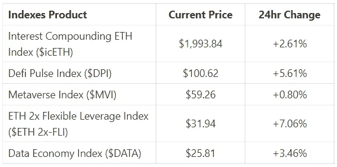
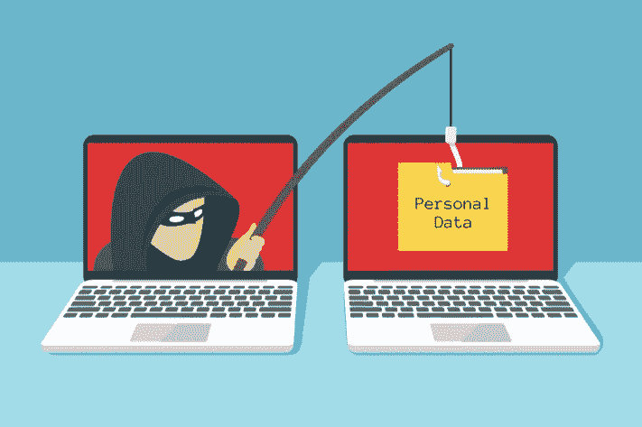

# 为什么这些密码骗局会起作用？

> 原文：<https://medium.com/coinmonks/why-do-these-crypto-scams-work-20bc71af8989?source=collection_archive---------53----------------------->

欢迎来到最新一期的 CapitalRollup Digest！今天的文摘是 5 月 17 日的，所以你大概需要 5 分钟。我们马上开始。

*   今天的市场看起来怎么样？(前 5/10 大热门指数)

Index Price Market Update

# 为什么这些密码骗局会起作用？

我们都同意骗子会去有钱的地方，而现在，密码就是有钱的地方。

根据区块链数据公司 Chainalysis 的数据，2021 年，欺诈者窃取了 140 亿美元的密码。随着加密技术的发展，骗子总是试图欺骗你。

虽然有很多资源教人们如何避免诈骗，但许多加密投资者仍然会被骗，在这个过程中失去他们的金钱和财富。

今天，我们将看看一些你应该避免的加密骗局，以及如何识别它们。

*   **假冒网站**

crypto 中最常见的骗局是假冒网站。骗子创建假冒但非常相似的流行和最常用的 DApps、工具和官方网站的版本，欺骗人们用他们的钱包与他们互动。

这些网站通常看起来与合法网站非常相似，很难区分。每当你使用这些网站或试图用你的加密钱包对它们做任何操作时，它们就会耗尽里面的所有内容。

*   **泵和倾卸方案**

泵送和倾卸方案非常流行，可以在几分钟甚至几天内完成。它们通常涉及创建一个令牌并招募有影响力的人来持续宣传它。

投资者看到这种闪亮的标志和不断上涨的价格，他们想购买它，这使得骗子很快向他们倾销，在大多数情况下赚取数百万美元。

这种类型的骗局通常发生在牛市期间，可能需要几分钟甚至几天才能结束。

**底线**

永远记住这条投资警告:“如果好得不像真的，那它很可能就是真的。”

*   **欺诈性初始硬币发行(ico)**

另一个常见的骗局是通过 ICOs。

在这里，骗子伪装成密码公司，制造有用的产品。他们要求人们投资，在早期阶段向他们发送比特币和以太坊等高价值的加密货币，以获得代币的折扣。

在筹集到足够多的资金后，这些骗子关闭了他们声称正在建设的项目的一切，并带着他们筹集的资金逃离。

*   **假冒/诈骗 NFT 薄荷糖**

NFT 空间中常见的一种加密骗局形式是假薄荷糖。随着 NFTs 的不断崛起，许多骗子也抓住这个机会从投资者那里窃取并运走数百万的加密资产。

为此，他们将建立合法的项目，并在项目路线图中提供许多东西来吸引许多感兴趣的人。他们通常在造币日实施他们的骗局，要么使用可以榨干人们钱包的链接，要么在从投资者那里筹集了巨额资金后停止项目。

# 那么如何才能让自己远离这些骗局呢？

*   加密安全的第一条规则是，当点击链接或与不熟悉的网站互动时，总是使用“一次性钱包”。

一次性钱包通常是指你很少或没有贵重资产的钱包。

一次性钱包可以更轻松地与诈骗链接、网站和分散应用程序(DApps)进行交互，几乎没有风险。

*   **总是 DYOR** 。

除了寻找宝石和投资加密资产，做自己的研究也同样重要，以避免诈骗。在点击任何链接或参与任何项目之前，请继续查找有关此链接的更多信息

如果你想使用一个去中心化的产品，去他们的社交媒体资料上看看他们的原始链接，如果有人和你分享一个链接，在点击之前先问问题。

关于 crypto 中的骗局，有一点是，在你输钱之前，它们很少以骗局的形式出现。

*   **只投资你懂的东西:**

如果你不清楚某个特定的加密货币或 NFT 项目是如何运作的，即使在你做了研究之后，也不要投资它。追逐一切会导致失去一切。

随着加密技术的采用和投资持续增长，骗局和骗子也会越来越多。保护你自己和你的资产。

# 琐事🤔

**哪一种是常见的加密骗局？**

A.对等网络

B.采矿

C.铸造

D.网络钓鱼

在下一期的 CapitalRollup Digest 中找到答案😉

**昨天琐事的答案是 c .)一套私钥**

# 每日一词！

💡

**拉高抛售方案**

的意思是:试图通过基于虚假、误导或极度夸大的陈述的建议来推高股票价格的方案。

这个术语用在一个句子中:-
— *随着其他投资者买入，他卖出，在一个经典的***的抽水和倾倒方案中，美国证券交易委员会官员说。**

***社区更新📢***

*我们将很快与 5 个行业领导者组织一个 Twitter 空间会议，在那里我们将讨论加密市场和 web3 上的一切。你可以期待它😎*

# *我们今天在读什么📰*

*加密货币骗局:避免成为受害者的提示。 [***阅读更多***](https://www.315aw.afrc.af.mil/News/Article-Display/Article/3026017/cryptocurrency-scams-tips-to-avoid-being-a-victim/)*

***加密诈骗的数量急剧增加。** [***阅读更多***](https://www.thecoinrepublic.com/2022/05/15/number-of-crypto-scams-increasing-drastically/)*

*与朋友一起学习和投资加密技术💰*

*当您邀请您的朋友开始使用 CapitalRollup 进行有利可图的投资时，您将获得独特的奖励。*

*💬对 CapitalRollup Digest 有什么反馈吗？ [**告诉我们！**](mailto:hi@capitalrollup.com)*

> *加入 Coinmonks [电报频道](https://t.me/coincodecap)和 [Youtube 频道](https://www.youtube.com/c/coinmonks/videos)了解加密交易和投资*

# *另外，阅读*

*   *[加密货币储蓄账户](/coinmonks/cryptocurrency-savings-accounts-be3bc0feffbf) | [YoBit 审核](/coinmonks/yobit-review-175464162c62)*
*   *[Botsfolio vs nap bots vs Mudrex](/coinmonks/botsfolio-vs-napbots-vs-mudrex-c81344970c02)|[gate . io 交流回顾](/coinmonks/gate-io-exchange-review-61bf87b7078f)*
*   *[CoinFLEX 评论](https://coincodecap.com/coinflex-review) | [AEX 交易所评论](https://coincodecap.com/aex-exchange-review) | [UPbit 评论](https://coincodecap.com/upbit-review)*
*   *[AscendEx 保证金交易](https://coincodecap.com/ascendex-margin-trading) | [Bitfinex 赌注](https://coincodecap.com/bitfinex-staking) | [bitFlyer 审核](https://coincodecap.com/bitflyer-review)*
*   *[Bitget 回顾](https://coincodecap.com/bitget-review)|[Gemini vs block fi](https://coincodecap.com/gemini-vs-blockfi)cmd |[OKEx 期货交易](https://coincodecap.com/okex-futures-trading)*
*   *[AscendEx Staking](https://coincodecap.com/ascendex-staking)|[Bot Ocean Review](https://coincodecap.com/bot-ocean-review)|[最佳比特币钱包](https://coincodecap.com/bitcoin-wallets-india)*