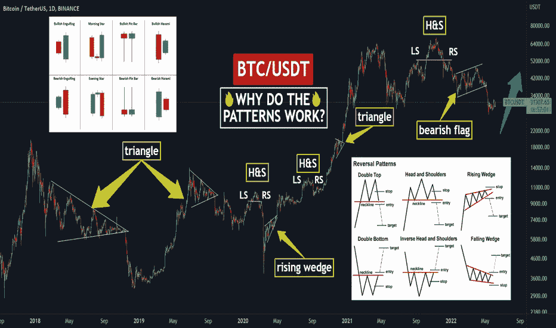

# 📊为什么交易模式有效？

> 原文：<https://medium.com/coinmonks/why-do-trading-patterns-work-2ab423cc42d4?source=collection_archive---------43----------------------->

# 嗨，朋友们！

# 可能所有的交易者都是通过学习交易模式开始他们的职业生涯的。

# 交易模式是一定范围内的价格运动模式。一般有 2 种图案:[烛台](https://www.tradingview.com/ideas/candlestick/) ( [流星](https://www.tradingview.com/ideas/shootingstar/)、[锤子](https://www.tradingview.com/ideas/hammer/)、[看涨](https://www.tradingview.com/ideas/bullish/)或[看跌吞没](https://www.tradingview.com/ideas/bearishengulfing/))和人物(三角形、通道、旗帜、[头、肩](https://www.tradingview.com/ideas/headandshoulders/)等。).随着市场的变化，它们的数量在不断增加，但主要的模式多达 50 种。

**📊那么为什么交易模式会起作用呢？答案很简单——因为许多交易者在交易中使用它们。想象一个红灯的交通灯🔴根据规则，所有有相同信号的司机都站在这里等待一个绿色的 light✅，它亮了，让所有的车朝正确的方向行驶。这是一个明确的规则，不仅在你的国家，而且在世界上所有的国家。交易模式也是如此。**

让我们想象一下，图表是一条路，模式是一盏灯。价格上涨或下跌，形成一个模式。你已经确定是[看涨形态](https://www.tradingview.com/ideas/bullish/)，比如[看涨楔形](https://www.tradingview.com/ideas/fallingwedge/)。当然，你在等待楔形块移动到上限并打破它，这将是开始交易的信号(move✅).的绿色信号)与此同时，所有的司机(理解为“交易者”)开始和你一起购买，并把价格推得越来越高。

为什么交易者要这么做？正如我在开始所说的，模式就像道路规则一样，所有的交易者都学习，不管国籍，这是一般的规则，这就是为什么这些模式有效。

**📊在什么情况下它们不起作用？** 你知道，市场上的大多数人不可能是对的。按照惯例，如果每个人都开了一个多头并以 5 万美元的价格购买了[比特币](https://www.tradingview.com/symbols/BTCUSD/)，而价格涨到了 10 万美元，那么应该有人以 100%的价格从你这里购买了那些[比特币](https://www.tradingview.com/symbols/BTCUSD/)。如果每个人都持有多头，最终就没有人卖出，也没有人获利。这就是为什么交易总是有两方:买方和卖方。

随着模式越来越受欢迎，大多数交易者，尤其是第一次学习模式的新手，开始根据这些规则开仓交易，并开始运用这些规则。吃了亏。加密货币市场的模式尤其糟糕，这表明这个市场是多么年轻。但是为什么呢？都是因为大多数交易模式都不正确，否则没人会赚钱。

**📊如果我只交易模式，我该怎么办？我建议在你的交易策略中加入更多的规则。这些可以是不同的交易工具和过滤器，帮助你去除“假”信号，提高你的胜率。例如，交易，不是[三角形形态](https://www.tradingview.com/ideas/triangle/)，而是它的假突破使用了[成交量](https://www.tradingview.com/ideas/volume/)指标:**

1️⃣A 假突破在大多数情况下表明，价格不会沿着突破的方向走，因为有太多的人愿意沿着价格运动的方向开仓交易。

2️⃣The [成交量](https://www.tradingview.com/ideas/volume/)指示器会显示实际的买卖单数量。如果[三角形下边界的假击穿处的成交量](https://www.tradingview.com/ideas/volume/)增加了，这告诉我们价格更有可能不会下跌，因为那里有重要的支撑。

*这是最简单的例子。还可以使用指标，附加* [*趋势线*](https://www.tradingview.com/ideas/trendline/)*[*烛台*](https://www.tradingview.com/ideas/candlestick/)*[*基本面分析*](https://www.tradingview.com/ideas/fundamental/) *。***

**💻朋友们，按下“喜欢”👍按钮，写评论，分享给你的朋友——这将是最好的感谢。**

> **加入 Coinmonks [电报频道](https://t.me/coincodecap)和 [Youtube 频道](https://www.youtube.com/c/coinmonks/videos)了解加密交易和投资**

# **另外，阅读**

*   **[Bitsgap 审核](/coinmonks/bitsgap-review-a-crypto-trading-bot-that-makes-easy-money-a5d88a336df2) | [Quadency 审核](/coinmonks/quadency-review-a-crypto-trading-automation-platform-3068eaa374e1) | [Bitbns 审核](/coinmonks/bitbns-review-38256a07e161)**
*   **[加密复制交易平台](/coinmonks/top-10-crypto-copy-trading-platforms-for-beginners-d0c37c7d698c) | [Coinmama 审核](/coinmonks/coinmama-review-ace5641bde6e)**
*   **[印度的加密交易所](/coinmonks/bitcoin-exchange-in-india-7f1fe79715c9) | [比特币储蓄账户](/coinmonks/bitcoin-savings-account-e65b13f92451)**
*   **[OKEx vs KuCoin](https://coincodecap.com/okex-kucoin) | [摄氏替代品](https://coincodecap.com/celsius-alternatives) | [如何购买 VeChain](https://coincodecap.com/buy-vechain)**
*   **[币安期货交易](https://coincodecap.com/binance-futures-trading)|[3 commas vs Mudrex vs eToro](https://coincodecap.com/mudrex-3commas-etoro)**