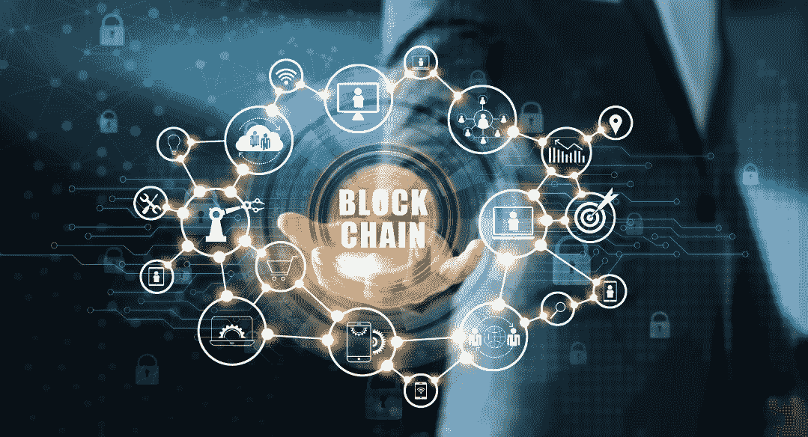

# 我们为什么需要区块链？

> 原文：<https://medium.com/coinmonks/why-do-we-need-blockchain-63b706b542b5?source=collection_archive---------18----------------------->

区块链已经发展成为一项改变游戏规则的技术，将改变人们与互联网的互动方式。

以下是需要区块链技术的一些最重要的原因:

*   **效率:**区块链可以在金融行业发挥重要作用，实现更快的交易结算，因为它消除了对漫长的验证、结算和清算过程的需要，因为所有堆栈持有人都可以使用共享账本中一致同意的数据的单一版本。
*   **可靠性:**区块链验证和认证相关方的身份。这消除了重复记录，降低了费率，加快了交易速度。
*   **不可改变的交易:**区块链通过按时间顺序登记交易来确保所有操作的不变性，这意味着一旦一个新的区块被添加到总账的链中，它就不能被移除或修改。
*   **欺诈防范:**共享信息和共识的概念有助于避免因欺诈或盗用造成的潜在损失。
*   **安全性:**在区块链技术的帮助下，每一方都持有一份原始链的副本，确保即使大量其他节点出现故障，系统也能保持运行。
*   **透明度:**每个人都可以看到对公共区块链所做的更改。这增加了透明度，并且所有交易都是不可逆的。
*   **协作:**允许各方在不使用第三方中介的情况下直接进行交易。
*   **分散式:**有规则管理每个节点如何交换区块链数据。此方法验证所有事务，并一次添加一个有效的事务。
*   **可追溯性**:在复杂的供应链中，很难追溯产品的来源。然而，有了区块链，所有的货物交换都被记录下来，给你一个审计线索来了解特定资产的来源。您还可以了解产品在其旅程中的每一站，这种级别的产品可追溯性有助于验证真实性和防止欺诈。
*   **可审计性**:由于每笔交易在其整个生命周期内都会在区块链进行记录，因此已经有了一个审计线索来查看和检查您资产的真实性。
*   降低成本:因为区块链消除了对第三方中介的需求，企业节省了大量资金。花费在文档和修订上的成本和精力也减少了，因为每个人都可以访问单一的、不变的分类帐版本。
*   **弹性:**在系统受到重大攻击的情况下，大部分节点继续运行链。

> 加入 Coinmonks [电报频道](https://t.me/coincodecap)和 [Youtube 频道](https://www.youtube.com/c/coinmonks/videos)了解加密交易和投资

# 另外，阅读

*   [加密货币储蓄账户](/coinmonks/cryptocurrency-savings-accounts-be3bc0feffbf) | [加密交易机器人](https://coincodecap.com/best-crypto-trading-bots)
*   [BigONE 交易所评论](/coinmonks/bigone-exchange-review-64705d85a1d4) | [CEX。IO 审查](https://coincodecap.com/cex-io-review) | [交换区审查](/coinmonks/swapzone-review-crypto-exchange-data-aggregator-e0ad78e55ed7)
*   [最佳比特币保证金交易](/coinmonks/bitcoin-margin-trading-exchange-bcbfcbf7b8e3) | [比特币保证金交易](https://coincodecap.com/bityard-margin-trading)
*   [加密保证金交易交易所](/coinmonks/crypto-margin-trading-exchanges-428b1f7ad108) | [赚取比特币](/coinmonks/earn-bitcoin-6e8bd3c592d9)
*   [WazirX vs CoinDCX vs bit bns](/coinmonks/wazirx-vs-coindcx-vs-bitbns-149f4f19a2f1)|[block fi vs coin loan vs Nexo](/coinmonks/blockfi-vs-coinloan-vs-nexo-cb624635230d)